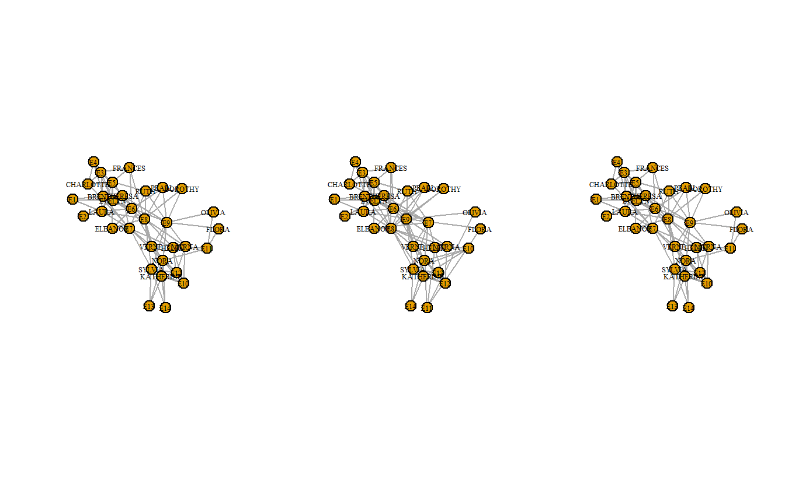
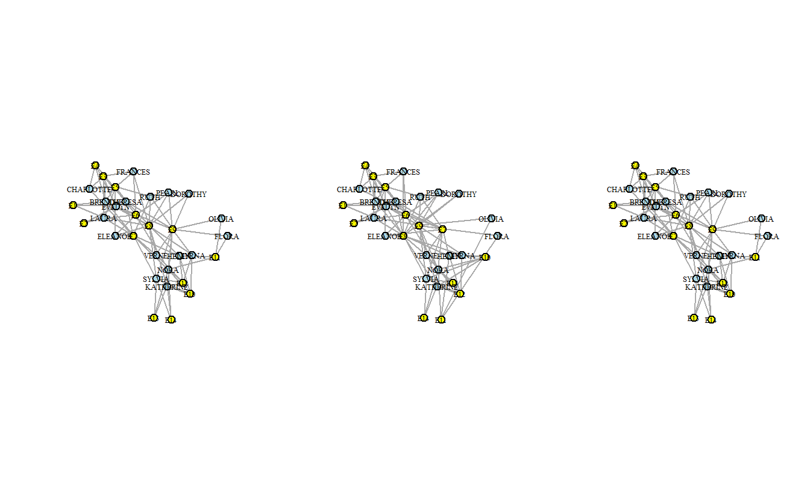
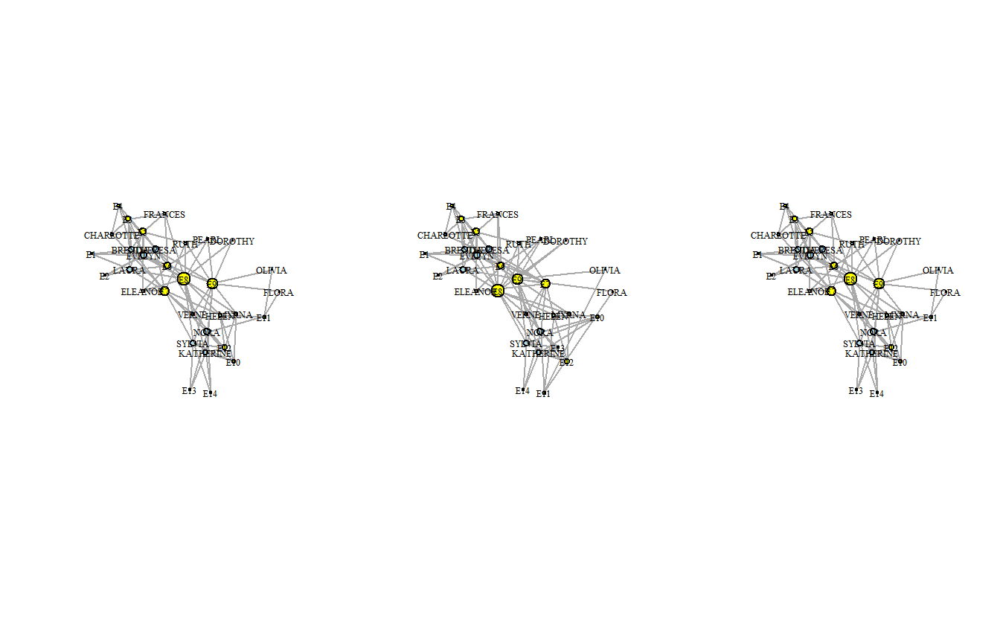

# (PART) Lab 1 {-}

# Importing and Visualizing One- and Two-Mode Social Network Data in **igraph**

In this lab we'll explore a variety of methods for importing social network data into R, manipulating one- and two-mode network data, and visualizing social networks. We'll be using a variety of social networks, some of which you'll recognize from other classes. We'll also illustrate a variety of ways to import network data, something that should be easy to do but often turns out to be challenging because a number of resources jump over this important step.

::: {.infobox data-latex=""}
**Note**: This lab has gone through many iterations and reflects the influence from a variety of individuals, including Phil Murphy, and Brendan Knapp.
:::

## Setup

Find and open your RStudio Project associated with this class. Begin by opening a new script. It's generally a good idea to place a header at the top of your scripts that tell you what the script does, its name, etc. 


```r
#######################################################################
# What: Importing and Visualizing One- and Two-Mode Social Network Data
# File: lab1_igraph.R
# Created: 02.28.14
# Revised: 01.06.22
#######################################################################
```

If you have not set up your RStudio Project to clear the workspace on exit, your environment contain the objects and functions from your prior session. To clear these before beginning use the following command.


```r
rm(list = ls())
```

Proceed to place the data required for this lab (`davis.csv`, `davis.net`, `davisedge.csv`, `Koschade Bali (Edge).csv`, `Koschade Bali (Matrix).csv`, and `Koschade Bali.net`) also inside your R Project folder. We have placed it in a sub-folder titled `data` for organizational purposes; however, this is not necessary.

## Load Libraries

We need to load the libraries we plan to use. Here we will use **igraph**. Because **igraph** and **statnet** conflict with one another sometimes, we do not want to have them loaded at the same time, so you may want to detach it. Alternatively, you may choose to namespace functions using the `::` operator as needed (e.g., `igraph::betweenness()` vs. `sna::betweenness()`). Of course, this applies only if you had the `statnet` package loaded already. The **intergraph** package allows users to transform network data back and forth between **igraph** and **statnet**.


```r
# If you haven't done so, install the required packages:
# install.packages("igraph")
# install.packages("intergraph")

# Now load them:
library(igraph)
library(intergraph)
```

::: {.infobox data-latex=""}
**Note**: **igraph** imports the `%>%` (piping) operator on load (`library(igraph)`). This lab leverages the operator because we find it very useful in chaining functions, although in doing so we will sometimes illustrate how to carry out the same operations using base R. 
:::

## One-mode Social Network Data in **igraph**: Koschade Network

Here, we will use data collected by Stuart Koschade of the 17 individuals who participated in the first Bali bombing. Koschade (2006) recorded both the ties between the individuals, as well as the strength of the tie between them.

### Importing One-Mode Social Network Data

#### Option 1: Importing One-Mode Network Data in Matrix Format

One way is to read network in from a matrix saved as a csv file.


```r
# First, read the csv file using the required arguments
koschade_dat <- read.csv(file = "data/Koschade Bali (Matrix).csv",
                         header = TRUE,
                         row.names = 1,
                         check.names = FALSE)
# Now, coerce the data.frame to a matrix
koschade_mat <- as.matrix(koschade_dat)
```

The two-step operation above could be combined with and without piping. First, without:


```r
koschade_mat <- as.matrix(read.csv(file = "data/Koschade Bali (Matrix).csv",
                                   header = TRUE,
                                   row.names = 1,
                                   check.names = FALSE))
```

And now with: 


```r
koschade_mat <- read.csv(file = "data/Koschade Bali (Matrix).csv",
                         header = TRUE,
                         row.names = 1,
                         check.names = FALSE) %>%
  as.matrix()
```

Turn the `matrix` into an `igraph` object using the `graph_from_adjacency_matrix()` function from the **igraph** library:


```r
koschade1_ig  <- graph_from_adjacency_matrix(adjmatrix = koschade_mat,
                                             mode = "undirected",
                                             weighted = TRUE)
```


Now that the matrix has been imported, let's examine the object. First, take a look at it's class:


```r
class(koschade1_ig)
```

```
[1] "igraph"
```

What is it? If you ran the code above the printout on your console should read `igraph`. Many R objects have a class, which describes a type of object, the properties it possesses, how it behaves, and how it relates to other objects and functions [@Wickham2019]. An `igraph` class denotes that this object is an **igraph** graph and that it will work with the functions from this library.

One key characteristic of **igraph** graphs is that they are printed to the screen in a special format:


```r
koschade1_ig
```

```
IGRAPH 67d9671 UNW- 17 63 -- 
+ attr: name (v/c), weight (e/n)
+ edges from 67d9671 (vertex names):
 [1] Muklas --Amrozi   Muklas --Imron    Muklas --Samudra  Muklas --Dulmatin
 [5] Muklas --Idris    Muklas --Azahari  Muklas --Ghoni    Muklas --Patek   
 [9] Muklas --Sarijo   Amrozi --Samudra  Amrozi --Idris    Amrozi --Mubarok 
[13] Imron  --Samudra  Imron  --Dulmatin Imron  --Idris    Imron  --Azahari 
[17] Imron  --Ghoni    Imron  --Patek    Imron  --Feri     Imron  --Sarijo  
[21] Samudra--Dulmatin Samudra--Idris    Samudra--Mubarok  Samudra--Azahari 
[25] Samudra--Ghoni    Samudra--Arnasan  Samudra--Rauf     Samudra--Octavia 
[29] Samudra--Hidayat  Samudra--Junaedi  Samudra--Patek    Samudra--Sarijo  
+ ... omitted several edges
```

This printout provides important information about the object. The first line starts with `IGRAPH`, which denotes that this is an **igraph** graph. The following seven character code is the unique id for the graph. The following four letters distinguish whether:
  
  - The graph is directed (`D`) or undirected (`U`)
  - The graph is named (e.g., vertex names are set) (`N`)
  - The graph is weighted (`W`)
  - The graph is bipartite (`B`)
  
The second line (prefixed with `+attr:`) includes the attributes of the graph (`g`), the vertices (`v`), and edges (`e`). For instance, in this example, the `name` attribute is a vertex attribute, while `weight` is an edge attribute. The remainder of the printout (prefixed with `+ edges`) includes a sample of the relationships in the graph.

One advantage of storing data as an `igraph` object is that the library has functions to transform relational records into a variety of formats. For example, from `igraph` to an edge list. To do such, pass the `koschade1_ig` object to the `get.data.frame()` function.


```r
get.data.frame(koschade1_ig) %>%
  head(5)
```

```
    from       to weight
1 Muklas   Amrozi      2
2 Muklas    Imron      2
3 Muklas  Samudra      1
4 Muklas Dulmatin      1
5 Muklas    Idris      5
```

Similarly, edge and node attributes can be fetched back from the `igraph` object. For example, extract a vector of edge weights, which we can use later vary edge width in our visualizations.


```r
edge_weight_1 <- get.edge.attribute(koschade1_ig,
                                    name = "weight") # Attribute name
```

#### Option 2: Importing One-Mode Network Data as an Edge List

Here is how we can import an edge list, and then check the first few rows with the `head()` command.


```r
koschade2_el <- read.csv(file = "data/Koschade Bali (Edge).csv",
                         header = TRUE)

head(koschade2_el)
```

```
  Source   Target Weight
1 Muklas   Amrozi      2
2 Muklas    Imron      2
3 Muklas  Samudra      1
4 Muklas Dulmatin      1
5 Muklas    Idris      5
6 Muklas  Azahari      1
```

Convert the edge list to an `igraph` object and check for basic information.


```r
koschade2_ig <- graph_from_data_frame(d = koschade2_el, 
                                      directed = FALSE)
# Look at the printout
koschade2_ig
IGRAPH 6807482 UN-- 17 63 -- 
+ attr: name (v/c), Weight (e/n)
+ edges from 6807482 (vertex names):
 [1] Muklas --Amrozi   Muklas --Imron    Muklas --Samudra  Muklas --Dulmatin
 [5] Muklas --Idris    Muklas --Azahari  Muklas --Ghoni    Muklas --Patek   
 [9] Muklas --Sarijo   Amrozi --Samudra  Amrozi --Idris    Amrozi --Mubarok 
[13] Imron  --Samudra  Imron  --Dulmatin Imron  --Idris    Imron  --Azahari 
[17] Imron  --Ghoni    Imron  --Patek    Imron  --Feri     Imron  --Sarijo  
[21] Samudra--Dulmatin Samudra--Idris    Samudra--Mubarok  Samudra--Azahari 
[25] Samudra--Ghoni    Samudra--Arnasan  Samudra--Rauf     Samudra--Octavia 
[29] Samudra--Hidayat  Samudra--Junaedi  Samudra--Patek    Samudra--Sarijo  
+ ... omitted several edges
```

Here's how to do all that using piping:


```r
koschade2_ig <- read.csv(file = "data/Koschade Bali (Edge).csv",
                         header = TRUE) %>%
 graph_from_data_frame(directed = FALSE)
```

Look at the printout

```r
koschade2_ig
```

```
IGRAPH 6811d82 UN-- 17 63 -- 
+ attr: name (v/c), Weight (e/n)
+ edges from 6811d82 (vertex names):
 [1] Muklas --Amrozi   Muklas --Imron    Muklas --Samudra  Muklas --Dulmatin
 [5] Muklas --Idris    Muklas --Azahari  Muklas --Ghoni    Muklas --Patek   
 [9] Muklas --Sarijo   Amrozi --Samudra  Amrozi --Idris    Amrozi --Mubarok 
[13] Imron  --Samudra  Imron  --Dulmatin Imron  --Idris    Imron  --Azahari 
[17] Imron  --Ghoni    Imron  --Patek    Imron  --Feri     Imron  --Sarijo  
[21] Samudra--Dulmatin Samudra--Idris    Samudra--Mubarok  Samudra--Azahari 
[25] Samudra--Ghoni    Samudra--Arnasan  Samudra--Rauf     Samudra--Octavia 
[29] Samudra--Hidayat  Samudra--Junaedi  Samudra--Patek    Samudra--Sarijo  
+ ... omitted several edges
```

#### Option 3: Importing One-Mode Network Data in Pajek Format

Another way to bring the data into **igraph** is to import the data from the Pajek file (*.net). The `read_graph()` function is able to read graphs from multiple foreign formats. 


```r
koschade3_ig <- read.graph(file = "data/Koschade Bali.net",
                           format = "pajek")
# Look at the printout
koschade3_ig
```

```
IGRAPH 692d7c4 UNW- 17 63 -- 
+ attr: id (v/c), name (v/c), x (v/n), y (v/n), z (v/n), weight (e/n)
+ edges from 692d7c4 (vertex names):
 [1] Muklas --Amrozi   Muklas --Imron    Muklas --Samudra  Muklas --Dulmatin
 [5] Muklas --Idris    Muklas --Azahari  Muklas --Ghoni    Muklas --Patek   
 [9] Muklas --Sarijo   Amrozi --Samudra  Amrozi --Idris    Amrozi --Mubarok 
[13] Imron  --Samudra  Imron  --Dulmatin Imron  --Idris    Imron  --Azahari 
[17] Imron  --Ghoni    Imron  --Patek    Imron  --Feri     Imron  --Sarijo  
[21] Samudra--Dulmatin Samudra--Idris    Samudra--Mubarok  Samudra--Azahari 
[25] Samudra--Ghoni    Samudra--Arnasan  Samudra--Rauf     Samudra--Octavia 
[29] Samudra--Hidayat  Samudra--Junaedi  Samudra--Patek    Samudra--Sarijo  
+ ... omitted several edges
```

Transform the graph object to a `data.frame` and view it (`View()`).


```r
koschade3_ig %>%
  get.data.frame(what = "edges") %>%
  head()
```

```
    from       to weight
1 Muklas   Amrozi      2
2 Muklas    Imron      2
3 Muklas  Samudra      1
4 Muklas Dulmatin      1
5 Muklas    Idris      5
6 Muklas  Azahari      1
```

#### Option 4: Importing One-Mode Network Data into **statnet** Format using **intergraph**

If you first worked with the data in **statnet**, you can use **intergraph** to convert a **statnet** network object to an **igraph** object. The **intergraph** library let's you jump pretty smoothly between the data classes required by each library.

**To be clear**: this command only works if you already have a statnet network object


```r
koschade_ig <- asIgraph(koschade_net)
```

Of course, you may begin working with data in **igraph** and have to convert it to **statnet**. Here we will take an `igraph` object and convert it to a `network` class object required by the **statnet** suite. Then, we will return that object from `network` to `igraph` class.


```r
# Transform an igraph object to network class
koschade_network <- asNetwork(koschade1_ig)
# Print it
koschade_network
```

```
 Network attributes:
  vertices = 17 
  directed = FALSE 
  hyper = FALSE 
  loops = FALSE 
  multiple = FALSE 
  bipartite = FALSE 
  total edges= 63 
    missing edges= 0 
    non-missing edges= 63 

 Vertex attribute names: 
    vertex.names 

 Edge attribute names: 
    weight 
```

Note the different printout. Also, you can verify the class change using the `class()` function.


```r
class(koschade_network)
```

```
[1] "network"
```

Now, return the `network` object back into `igraph` and view the data as an edge list.


```r
koschade_ig <- asIgraph(koschade_network)

koschade_ig %>%
  get.data.frame(what = "edges") %>%
  head()
```

```
  from to    na weight
1    1  2 FALSE      2
2    1  3 FALSE      2
3    1  4 FALSE      1
4    1  5 FALSE      1
5    1  6 FALSE      5
6    1  8 FALSE      1
```

What changed? Note that some variables and entries may have changed in the transition.


### Plotting (Visualizing) the Koschade Network 

Here's a simple plot using **igraph**.


```r
plot(koschade1_ig)
# Note that you can also plot the other two graph:
# plot(koschade2_ig)
# plot(koschade3_ig)
```


Let's try making some more sophisticated plots. Before we do that, however, let's save the coordinates so that the remaining plots will have the same layout. Here, we will use the Fruchterman Reingold layout algorithm (`layout_with_kk()`).


```r
coords <- layout_with_fr(koschade1_ig)
```

Now, visualize the network with some additional parameters, such as changing the node color (i.e., `vertex.color`), the label size (i.e., `vertex.label.cex`), and the node label color (i.e., `vertex.label.color`). From here on out, we'll just use the `koschade1_ig` network.


```r
plot(koschade1_ig,
     layout = coords,
     vertex.color = "Skyblue2",
     vertex.label.cex = .6,
     vertex.label.color = "black")
```


Now, let's size the edges by tie strength and plot again.


```r
plot(koschade1_ig,
     layout = coords,
     vertex.color = "Skyblue2",
     vertex.label.cex = .6,
     vertex.label.color = "black",
     # Recall the edge weight vector previously created
     edge.width = edge_weight_1)
```


Note that the layout above is the same as the previous layout. This is helpful when presenting successive graphs in your papers and theses. It makes it easier for readers to compare the network graphs.

We can also change the edges to curved edges.


```r
plot(koschade1_ig,
     layout = coords,
     vertex.color = "Skyblue2",
     vertex.label.cex = .6,
     vertex.label.color = "black",
     edge.width = edge_weight_1,
     edge.curved = TRUE)
```


### Saving Network Plots (e.g., pdf, jpeg, png, tiff)

Save final plot in various formats. 

Begin by saving the output in PDF format. To do such, use the `pdf()` function, which starts the graphics driver for producing PDFs. 


```r
# Start the graphic driver, name output file, and set size
pdf(file = "koschade1.pdf",
    width = 4, height = 4)
# Plot the output into the file
plot(koschade1_ig,
     layout = coords,
     vertex.color = "Skyblue2",
     vertex.label.cex = .6,
     vertex.label.color = "black",
     edge.width = edge_weight_1)
# Turn off the graphics driver
dev.off()
```

To store the image as a JPEG, use the `jpeg()` function. The `bg = "transparent` option saves the graphs with a transparent background (rather than white), which can be helpful when placing in slides or on non-white backgrounds.


```r
jpeg(file = "koschade1.jpg",
     width = 4, height = 4,
     units = 'in',
     res = 600,
     bg = "transparent")

plot(koschade1_ig,
     layout = coords,
     vertex.color = "Skyblue2",
     vertex.label.cex = .6,
     vertex.label.color = "black",
     edge.width = edge_weight_1)

dev.off()
```

To store the image as a PNG, use the `png()` function.


```r
png(file = "koschade1.png",
    width = 4, height = 4,
    units = 'in',
    res = 300,
    bg = "transparent")

plot(koschade1_ig,
     layout = coords,
     vertex.color = "Skyblue2",
     vertex.label.cex = .6,
     vertex.label.color = "black",
     edge.width = edge_weight_1)

dev.off()
```

To store the image as a TIFF, use the `tiff()` function.


```r
tiff(file = "koschade3.tif",
     width = 4, height = 4,
     units = 'in',
     res = 300,
     bg = "transparent")

plot(koschade1_ig,
     layout = coords,
     vertex.color = "Skyblue2",
     vertex.label.cex = .6,
     vertex.label.color = "black",
     edge.width = edge_weight_1)

dev.off()
```

### Saving Network Data

Finally, it doesn't hurt to save the data that you've imported and created. Perhaps not all (e.g., coordinates) but it is helpful to save those that you may want to use in another setting.


```r
save(koschade_dat, 
     koschade_mat,
     koschade1_ig, 
     koschade2_ig, 
     koschade3_ig, 
     file = "koschade_igraph.RData")
```

## Two-mode Social Network Data in **igraph**: Davis Southern Women

We will now switch to another data set to import, manipulate, and visualize two-mode network data in **igraph**. The data that we will use here is what is known as Davis' Southern Club Women. Davis and her colleagues recorded the observed attendance of 18 Southern women at 14 different social events.

### Importing Two-Mode Social Network Data into **igraph**

#### Option 1: Importing Two-Mode Social Network Data in Matrix Format

Once again, begin by reading the data from a CSV using `read.csv()`. This then transformed into a matrix, which, in turn, is turned into a bipartite (two-mode) network using the `graph_from_incidence_matrix()` **igraph** function. As before, we demonstrate how to do this with and without piping.

First, without piping:


```r
davis1_dat <- read.csv(file = "data/davis.csv",
                        header = TRUE,
                        row.names = 1,
                        check.names = FALSE)

davis1_mat <- as.matrix(davis1_dat)

davis1_ig <- graph_from_incidence_matrix(davis1_mat,
                                         directed = FALSE,
                                         weighted = NULL)
```

Now, with piping:


```r
davis1_ig <- read.csv(file = "data/davis.csv",
                      header = TRUE,
                      row.names = 1,
                      check.names = FALSE) %>%
  as.matrix() %>%
  graph_from_incidence_matrix(directed = FALSE,
                              weighted = NULL)
```

Now look at the graph printout:


```r
davis1_ig
```

```
IGRAPH 6a8ebc3 UN-B 32 89 -- 
+ attr: type (v/l), name (v/c)
+ edges from 6a8ebc3 (vertex names):
 [1] EVELYN   --E1 EVELYN   --E2 EVELYN   --E3 EVELYN   --E4 EVELYN   --E5
 [6] EVELYN   --E6 EVELYN   --E8 EVELYN   --E9 LAURA    --E1 LAURA    --E2
[11] LAURA    --E3 LAURA    --E5 LAURA    --E6 LAURA    --E7 LAURA    --E8
[16] THERESA  --E2 THERESA  --E3 THERESA  --E4 THERESA  --E5 THERESA  --E6
[21] THERESA  --E7 THERESA  --E8 THERESA  --E9 BRENDA   --E1 BRENDA   --E3
[26] BRENDA   --E4 BRENDA   --E5 BRENDA   --E6 BRENDA   --E7 BRENDA   --E8
[31] CHARLOTTE--E3 CHARLOTTE--E4 CHARLOTTE--E5 CHARLOTTE--E7 FRANCES  --E3
[36] FRANCES  --E5 FRANCES  --E6 FRANCES  --E8 ELEANOR  --E5 ELEANOR  --E6
+ ... omitted several edges
```

Note the `B` letter in the four letter code string that describes the network qualities. Since the network was created using a function designed to create bipartite graphs, this feature is automatically added.

#### Option 2: Importing Two-Mode Social Network Data as an Edge List

::: {.infobox data-latex=""}
**Note**: This section is adapted from code written by Phil Murphy and Brendan Knapp.
:::

You may also begin creating your analysis of two-mode networks from an edge list. To do so, leverage the `read.csv()` function to ingest data. Then, pass the edge list to **igraph**'s `graph_from_data_frame()` function. Again, first without piping and then with piping.

Without: 


```r
davis2_el <- read.csv(file = "data/davisedge.csv",
                      header = TRUE)

davis2_ig <- graph_from_data_frame(davis2_el,
                                   directed = FALSE)
```

With:


```r
davis2_ig <- read.csv(file = "data/davisedge.csv",
                      header = TRUE) %>%
  graph_from_data_frame(directed = FALSE)
```

Now look at the graph printout:


```r
davis2_ig
```

```
IGRAPH 6aa61fb UN-- 32 89 -- 
+ attr: name (v/c), Weight (e/n)
+ edges from 6aa61fb (vertex names):
 [1] EVELYN   --E1 EVELYN   --E2 EVELYN   --E3 EVELYN   --E4 EVELYN   --E5
 [6] EVELYN   --E6 EVELYN   --E8 EVELYN   --E9 LAURA    --E1 LAURA    --E2
[11] LAURA    --E3 LAURA    --E5 LAURA    --E6 LAURA    --E7 LAURA    --E8
[16] THERESA  --E2 THERESA  --E3 THERESA  --E4 THERESA  --E5 THERESA  --E6
[21] THERESA  --E7 THERESA  --E8 THERESA  --E9 BRENDA   --E1 BRENDA   --E3
[26] BRENDA   --E4 BRENDA   --E5 BRENDA   --E6 BRENDA   --E7 BRENDA   --E8
[31] CHARLOTTE--E3 CHARLOTTE--E4 CHARLOTTE--E5 CHARLOTTE--E7 FRANCES  --E3
[36] FRANCES  --E5 FRANCES  --E6 FRANCES  --E8 ELEANOR  --E5 ELEANOR  --E6
+ ... omitted several edges
```

This time, the `B` letter in the four letter code is not present. If you need further evidence that `davis2_ig` is not a bipartite graph, use the `is_bipartite()` function, which checks whether the graph is two-mode or not by checking if the nodes in the graph have an attribute called `type`.


```r
is_bipartite(davis2_ig)
```

```
[1] FALSE
```

At this point, the network is not a two-mode (bipartite) network. To tell **igraph** that it is, we can begin by using the `bipartite.mapping()` function, which can tell us whether the network meets the criteria of a two-mode network. Those criteria are that there are (1) two sets of nodes in the network, and (2) there are only ties between node sets and not within them. If the network meets the criteria, **igraph** will identify which nodes belong in each mode.


```r
bipartite_mapping(davis2_ig)
```

```
$res
[1] TRUE

$type
 [1] FALSE FALSE FALSE FALSE FALSE FALSE FALSE FALSE FALSE FALSE FALSE FALSE
[13] FALSE FALSE FALSE FALSE FALSE FALSE  TRUE  TRUE  TRUE  TRUE  TRUE  TRUE
[25]  TRUE  TRUE  TRUE  TRUE  TRUE  TRUE  TRUE  TRUE
```


The function returns two responses. The first, denotes whether the network meets the criteria of a two-mode network (`$res`). The second, (`$type`) returns a logical vector denoting the mode to which each node belongs to. Thus, we can assign the `type` vector to the node attributes in the `davis2_ig`.


```r
V(davis2_ig)$type <- bipartite_mapping(davis2_ig)[["type"]]
```

Once again, take a look at the printout:


```r
davis2_ig
```

```
IGRAPH 6aa61fb UN-B 32 89 -- 
+ attr: name (v/c), type (v/l), Weight (e/n)
+ edges from 6aa61fb (vertex names):
 [1] EVELYN   --E1 EVELYN   --E2 EVELYN   --E3 EVELYN   --E4 EVELYN   --E5
 [6] EVELYN   --E6 EVELYN   --E8 EVELYN   --E9 LAURA    --E1 LAURA    --E2
[11] LAURA    --E3 LAURA    --E5 LAURA    --E6 LAURA    --E7 LAURA    --E8
[16] THERESA  --E2 THERESA  --E3 THERESA  --E4 THERESA  --E5 THERESA  --E6
[21] THERESA  --E7 THERESA  --E8 THERESA  --E9 BRENDA   --E1 BRENDA   --E3
[26] BRENDA   --E4 BRENDA   --E5 BRENDA   --E6 BRENDA   --E7 BRENDA   --E8
[31] CHARLOTTE--E3 CHARLOTTE--E4 CHARLOTTE--E5 CHARLOTTE--E7 FRANCES  --E3
[36] FRANCES  --E5 FRANCES  --E6 FRANCES  --E8 ELEANOR  --E5 ELEANOR  --E6
+ ... omitted several edges
```

Notice the `B` in the first line of the output. This tells us that **igraph** now recognizes the network as a bipartite/two-mode network. We can check it using a function again.


```r
is_bipartite(davis2_ig)
```

```
[1] TRUE
```

#### Option 3: Importing Two-Mode Social Network Data in Pajek Format

Read in the Pajek file using **igraph**'s `read.graph()` function.


```r
davis3_ig <- read.graph("data/davis.net", format = "pajek")
```

Once again, ensure that the network was read in correctly as two-mode (bipartite). 


```r
is_bipartite(davis3_ig)
```

```
[1] TRUE
```

### Plotting Two-Mode Social Network Data in **igraph**

Like with one-mode data, two-mode data can be plotted using **igraph**. Once again, we can use the `plot()` function to graph `igraph` objects. 


```r
plot(davis1_ig)
```


Once again, we can store the coordinates as a separate object and use it to compare networks. Here we will plot networks side-by-side using the `par()` function. Additionally, we can make some aesthetic improvements through adding arguments (e.g., `vertex.label.cex`, etc.).


```r
# Set graph parameters to 1 row and 3 columns
par(mfrow = c(1, 3))
# Store node coordinates
coordfr <- layout_with_fr(davis1_ig)
# Plot graphs
plot(davis1_ig,
     layout = coordfr,
     vertex.label.cex = 0.6,
     vertex.label.color = "black")

plot(davis2_ig,
     layout = coordfr,
     vertex.label.cex  = 0.6,
     vertex.label.color = "black")

plot(davis3_ig,
     layout = coordfr,
     vertex.label.cex  = 0.6,
     vertex.label.color = "black")
```



Now, let’s make a few adjustments to the graph; for instance, we can change the node colors to “light blue” and “yellow” to reflect node types. First, we need to determine what nodes belong to which mode.


```r
davis1_ig %>%
  # Pull node list, which should include a 'type' node attribute
  get.data.frame("vertices") %>%
  # Cross tabulate the 'name' and 'type' variables
  table()
```

```
       name
type    BRENDA CHARLOTTE DOROTHY E1 E10 E11 E12 E13 E14 E2 E3 E4 E5 E6 E7 E8 E9
  FALSE      1         1       1  0   0   0   0   0   0  0  0  0  0  0  0  0  0
  TRUE       0         0       0  1   1   1   1   1   1  1  1  1  1  1  1  1  1
       name
type    ELEANOR EVELYN FLORA FRANCES HELEN KATHERINE LAURA MYRNA NORA OLIVIA
  FALSE       1      1     1       1     1         1     1     1    1      1
  TRUE        0      0     0       0     0         0     0     0    0      0
       name
type    PEARL RUTH SYLVIA THERESA VERNE
  FALSE     1    1      1       1     1
  TRUE      0    0      0       0     0
```

The output indicates that the women are assigned to the `FALSE` category, while the events fall under `TRUE`. Thus, we can assign colors using a conditional statement (e.g., `ifelse()`).


```r
plot(davis1_ig,
     layout = coordfr,
     # Get the vertex attribute vector, if the attribute is TRUE assign 'yellow'
     # as the vertex color. Otherwise, assign 'lightblue'.
     vertex.color = ifelse(get.vertex.attribute(davis1_ig, name = "type"),
                           "yellow", "lightblue"),
     vertex.label.cex  = 0.6,
     vertex.label.color = "black")
```


Now, re-plot the networks with the new colors and saved the coordinate while we're at it.


```r
# Set graph parameters to 1 row and 3 columns
par(mfrow = c(1, 3))
# Plot graphs
plot(davis1_ig,
     layout = coordfr,
     vertex.color = ifelse(get.vertex.attribute(davis1_ig, name = "type"),
                           "yellow", "lightblue"),
     vertex.label.cex = 0.6,
     vertex.label.color = "black",
     vertex.size = 10)

plot(davis2_ig,
     layout = coordfr,
     vertex.color = ifelse(get.vertex.attribute(davis2_ig, name = "type"),
                           "yellow", "lightblue"),
     vertex.label.cex = 0.6,
     vertex.label.color = "black",
     vertex.size = 10)

plot(davis3_ig,
     layout = coordfr,
     vertex.color = ifelse(get.vertex.attribute(davis3_ig, name = "type"),
                           "yellow", "lightblue"),
     vertex.label.cex = 0.6,
     vertex.label.color = "black",
     vertex.size = 10)
```



We may want to rescale nodes to reflect those with more adjacent nodes. To do so, we can use the `degree()` function to calculate a node's degree centrality. If this measure is not familiar to you yet, don't worry, we will expand on this topic later in the class.


```r
degree(davis1_ig)
```

```
   EVELYN     LAURA   THERESA    BRENDA CHARLOTTE   FRANCES   ELEANOR     PEARL 
        8         7         8         7         4         4         4         3 
     RUTH     VERNE     MYRNA KATHERINE    SYLVIA      NORA     HELEN   DOROTHY 
        4         4         4         6         7         8         5         2 
   OLIVIA     FLORA        E1        E2        E3        E4        E5        E6 
        2         2         3         3         6         4         8         8 
       E7        E8        E9       E10       E11       E12       E13       E14 
       10        14        12         5         4         6         3         3 
```

As you can see, the output of the `degree()` function is a named vector with a score for the number of edges a given node has. Now, let's calculate degree centrality and then plot the graphs again but adjust the node size to reflect degree which we've rescaled in order to make the nodes more visible.


```r
# Set graph parameters to 1 row and 3 columns
par(mfrow = c(1, 3))
# Plot graphs
plot(davis1_ig,
     layout = coordfr,
     vertex.color = ifelse(get.vertex.attribute(davis1_ig, name = "type"),
                           "yellow", "lightblue"),
     vertex.label.cex = 0.6,
     vertex.label.color = "black",
     vertex.size = degree(davis1_ig))

plot(davis2_ig,
     layout = coordfr,
     vertex.color = ifelse(get.vertex.attribute(davis2_ig, name = "type"),
                           "yellow", "lightblue"),
     vertex.label.cex = 0.6,
     vertex.label.color = "black",
     vertex.size = degree(davis2_ig))

plot(davis3_ig,
     layout = coordfr,
     vertex.color = ifelse(get.vertex.attribute(davis3_ig, name = "type"),
                           "yellow", "lightblue"),
     vertex.label.cex = 0.6,
     vertex.label.color = "black",
     vertex.size = degree(davis3_ig))
```



### Projecting (Folding) Two-Mode Networks into One-Mode Networks in **igraph**

For this section, we will just work with the `davis1_ig` network object. 

#### Multiplying Matrices

To transform the network into two one-mode networks, we first convert the two-mode `igraph` object to a `matrix`. The key function here is `get.incidence()`. Note the first command makes sure that the matrix has labels once it is transformed. 


```r
davis1_mat <- davis1_ig %>%
  # Set vertex attribute 'id' using the 'name' attribute
  set_vertex_attr(name = "id",
                  value = V(.)$name) %>% # The . represents davis1_ig
  get.incidence()
```

View the matrix:


```r
davis1_mat
```

Next, multiply the matrices by their transpose. To do so, we use the `%*%` operator to multiply networks and the `t()` function to transpose one matrix during the multiplication.

First, let's create a one-mode matrix of women-to-women based on shared events.


```r
davis_women_mat <- davis1_mat %*% t(davis1_mat)
```

Repeat the process, this time switch the order of the transposed matrix to generate an events-to-events matrix.


```r
davis_events_mat <- t(davis1_mat) %*% davis1_mat
```

Take a look at one or both of the matrices:


```r
# Woman-to-woman matrix
davis_women_mat
# Event-to-event matrix
davis_events_mat
```

With the matrices projected, you can now convert both to `igraph` objects using the `graph.adjacency()` function.


```r
davis_women_ig <- graph.adjacency(davis_women_mat, 
                                 mode = "undirected",
                                 weighted = TRUE)
```

The next step is to remove loops and multiple edges; that is acomplished using the `simplify()` function.


```r
davis_women_ig  <- simplify(davis_women_ig,
                           remove.multiple = TRUE,
                           remove.loops    = TRUE, 
                           edge.attr.comb  = sum)

davis_women_ig
```

```
IGRAPH 6dce618 UNW- 18 139 -- 
+ attr: name (v/c), weight (e/n)
+ edges from 6dce618 (vertex names):
 [1] EVELYN --LAURA     EVELYN --THERESA   EVELYN --BRENDA    EVELYN --CHARLOTTE
 [5] EVELYN --FRANCES   EVELYN --ELEANOR   EVELYN --PEARL     EVELYN --RUTH     
 [9] EVELYN --VERNE     EVELYN --MYRNA     EVELYN --KATHERINE EVELYN --SYLVIA   
[13] EVELYN --NORA      EVELYN --HELEN     EVELYN --DOROTHY   EVELYN --OLIVIA   
[17] EVELYN --FLORA     LAURA  --THERESA   LAURA  --BRENDA    LAURA  --CHARLOTTE
[21] LAURA  --FRANCES   LAURA  --ELEANOR   LAURA  --PEARL     LAURA  --RUTH     
[25] LAURA  --VERNE     LAURA  --MYRNA     LAURA  --KATHERINE LAURA  --SYLVIA   
[29] LAURA  --NORA      LAURA  --HELEN     LAURA  --DOROTHY   THERESA--BRENDA   
+ ... omitted several edges
```

Keep in mind that many steps can be put into a pipeline to reduce the lines of code.


```r
davis_events_ig <- graph.adjacency(davis_events_mat, 
                                 mode = "undirected",
                                 weighted = TRUE) %>%
  simplify(remove.multiple = TRUE, remove.loops = TRUE,
           edge.attr.comb = sum)

davis_events_ig
```

```
IGRAPH 6dd737a UNW- 14 66 -- 
+ attr: name (v/c), weight (e/n)
+ edges from 6dd737a (vertex names):
 [1] E1 --E2  E1 --E3  E1 --E4  E1 --E5  E1 --E6  E1 --E7  E1 --E8  E1 --E9 
 [9] E2 --E3  E2 --E4  E2 --E5  E2 --E6  E2 --E7  E2 --E8  E2 --E9  E3 --E4 
[17] E3 --E5  E3 --E6  E3 --E7  E3 --E8  E3 --E9  E4 --E5  E4 --E6  E4 --E7 
[25] E4 --E8  E4 --E9  E5 --E6  E5 --E7  E5 --E8  E5 --E9  E6 --E7  E6 --E8 
[33] E6 --E9  E6 --E10 E6 --E11 E6 --E12 E6 --E13 E6 --E14 E7 --E8  E7 --E9 
[41] E7 --E10 E7 --E11 E7 --E12 E7 --E13 E7 --E14 E8 --E9  E8 --E10 E8 --E11
[49] E8 --E12 E8 --E13 E8 --E14 E9 --E10 E9 --E11 E9 --E12 E9 --E13 E9 --E14
[57] E10--E11 E10--E12 E10--E13 E10--E14 E11--E12 E11--E13 E11--E14 E12--E13
+ ... omitted several edges
```

#### Projecting Two-Mode **igraph** Graphs

Beyond multiplying matrices, the process of transforming two-mode data to one-mode can be fully accomplished using functions from the **igraph** library.

Remember that two-mode graph objects in **igraph** have a `type` vertex attribute, which can be called using the `get.vertex.attribute()` and can be used (under the hood) to determine if a graph is two-mode using the `is_biparite()`.


```r
# Pull 'type' vertex attribute
get.vertex.attribute(davis1_ig, name = "type")
# Test if it is two-mode
is_bipartite(davis1_ig)
```

If a graph is in fact two mode, we can transform it to one-mode using the `bipartite_projection()` function. 

The events are assigned to the `TRUE` mode. As such, we can specify which mode will be extracted from the two-mode network setting the `which` argument to `true`


```r
davis_events_ig <- bipartite_projection(davis1_ig, which = "true")

davis_events_ig
```

```
IGRAPH 6de89c0 UNW- 14 66 -- 
+ attr: name (v/c), weight (e/n)
+ edges from 6de89c0 (vertex names):
 [1] E1 --E2  E1 --E3  E1 --E4  E1 --E5  E1 --E6  E1 --E8  E1 --E9  E1 --E7 
 [9] E2 --E3  E2 --E4  E2 --E5  E2 --E6  E2 --E8  E2 --E9  E2 --E7  E3 --E4 
[17] E3 --E5  E3 --E6  E3 --E8  E3 --E9  E3 --E7  E4 --E5  E4 --E6  E4 --E8 
[25] E4 --E9  E4 --E7  E5 --E6  E5 --E8  E5 --E9  E5 --E7  E6 --E8  E6 --E9 
[33] E6 --E7  E6 --E10 E6 --E11 E6 --E12 E6 --E13 E6 --E14 E7 --E8  E7 --E9 
[41] E7 --E12 E7 --E10 E7 --E13 E7 --E14 E7 --E11 E8 --E9  E8 --E12 E8 --E10
[49] E8 --E13 E8 --E14 E8 --E11 E9 --E12 E9 --E10 E9 --E13 E9 --E14 E9 --E11
[57] E10--E12 E10--E13 E10--E14 E10--E11 E11--E12 E11--E13 E11--E14 E12--E13
+ ... omitted several edges
```

Now extract the women one-mode network setting the `which` argument to `false` in the `bipartite_projection()` function.


```r
davis_women_ig <- bipartite_projection(davis1_ig, which = "false")

davis_women_ig
```

```
IGRAPH 6df300c UNW- 18 139 -- 
+ attr: name (v/c), weight (e/n)
+ edges from 6df300c (vertex names):
 [1] EVELYN --LAURA     EVELYN --BRENDA    EVELYN --THERESA   EVELYN --CHARLOTTE
 [5] EVELYN --FRANCES   EVELYN --ELEANOR   EVELYN --RUTH      EVELYN --PEARL    
 [9] EVELYN --NORA      EVELYN --VERNE     EVELYN --MYRNA     EVELYN --KATHERINE
[13] EVELYN --SYLVIA    EVELYN --HELEN     EVELYN --DOROTHY   EVELYN --OLIVIA   
[17] EVELYN --FLORA     LAURA  --BRENDA    LAURA  --THERESA   LAURA  --CHARLOTTE
[21] LAURA  --FRANCES   LAURA  --ELEANOR   LAURA  --RUTH      LAURA  --PEARL    
[25] LAURA  --NORA      LAURA  --VERNE     LAURA  --SYLVIA    LAURA  --HELEN    
[29] LAURA  --MYRNA     LAURA  --KATHERINE LAURA  --DOROTHY   THERESA--BRENDA   
+ ... omitted several edges
```

### Plotting Projected One-Mode Networks

Now that we have extracted the one-mode networks, plot the two new graphs using `plot()` and the additional arguments used previously.


```r
# Set graph parameters to 1 row and 2 columns
par(mfrow = c(1, 2))
# Store node coordinates
coords_women <- layout_with_fr(davis_women_ig)
coords_events <- layout_with_fr(davis_events_ig)
# Plot graphs
plot(davis_women_ig,
     layout = coords_women,
     vertex.color = "light blue",
     vertex.label.cex = 0.6,
     vertex.label.color = "black",
     vertex.size = degree(davis_women_ig))

plot(davis_events_ig,
     layout = coords_events,
     vertex.color = "yellow",
     vertex.label.cex = 0.6,
     vertex.label.color = "black",
     vertex.size = degree(davis_events_ig))
```


### Saving Network Plots

Now, save plots of the two-mode network and the two one-mode networks produced.


```r
png(file = "davis1.png",width = 4,height = 4,units = 'in', res = 300,
     bg = "transparent")
plot(davis1_ig,
     layout             = coordfr,
     vertex.color       = ifelse(get.vertex.attribute(davis1_ig, name = "type"),
                           "yellow", "lightblue"),
     vertex.label.cex   = 0.6,
     vertex.label.color = "black",
     vertex.size        = degree(davis1_ig))
dev.off()

png(file = "daviswomen.png",width = 4,height = 4,units = 'in',res = 300,
     bg = "transparent")
plot(davis_women_ig,
     layout = coords_women,
     vertex.color = "light blue",
     vertex.label.cex = 0.6,
     vertex.label.color = "black",
     vertex.size = degree(davis_women_ig))
dev.off()

png(file = "davisevents.png",width = 4,height = 4,units = 'in',res = 300,
     bg = "transparent")
plot(davis_events_ig,
     layout = coords_events,
     vertex.color = "yellow",
     vertex.label.cex = 0.6,
     vertex.label.color = "black",
     vertex.size = degree(davis_events_ig))
dev.off()
```

### Saving Network Data

Once again, it doesn't hurt to save the data that you've imported and created.


```r
save(davis_mat,
     davis1_mat,
     davis1_ig, 
     davis2_ig, 
     davis3_ig, 
     davis_events_ig,
     davis_events_mat,
     davis_women_ig,
     davis_women_mat,
     file = "data/davis_igraph.RData")
```

That's all for **igraph** for now.
