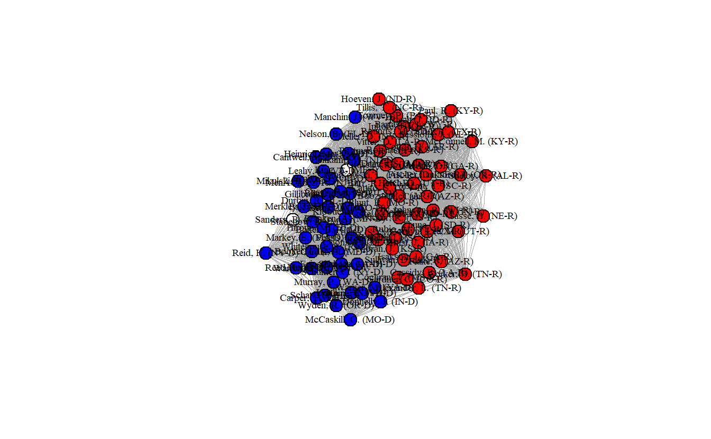
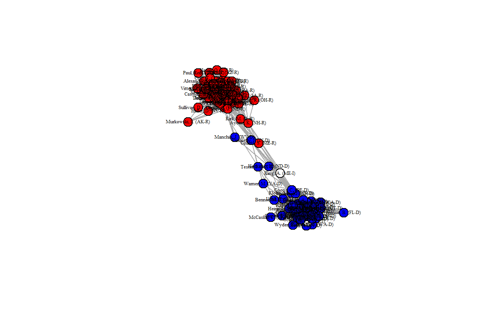
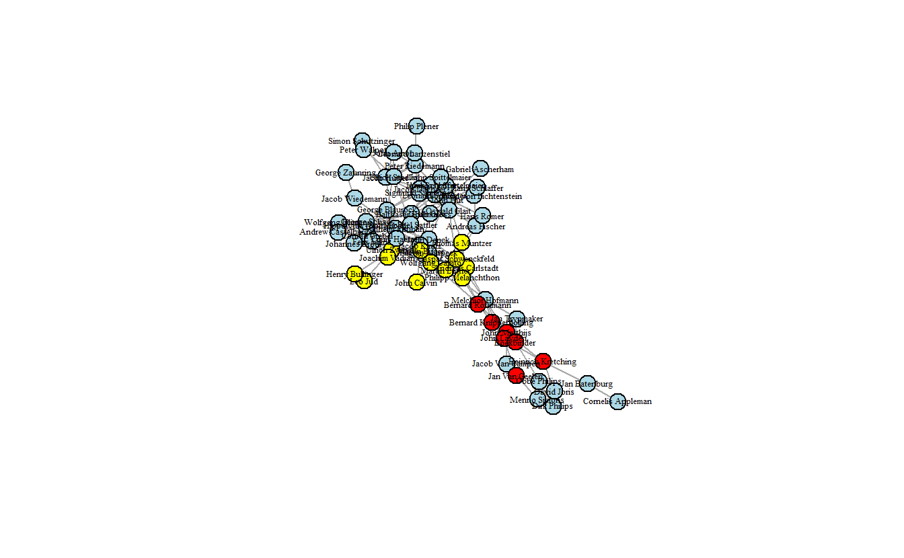
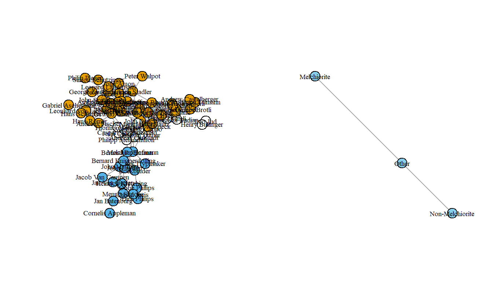
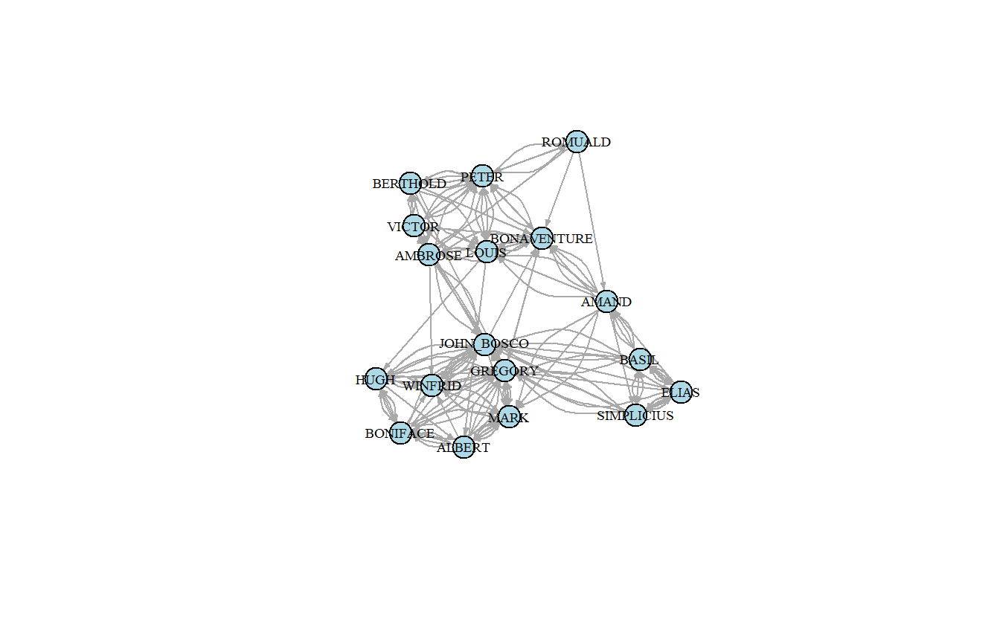
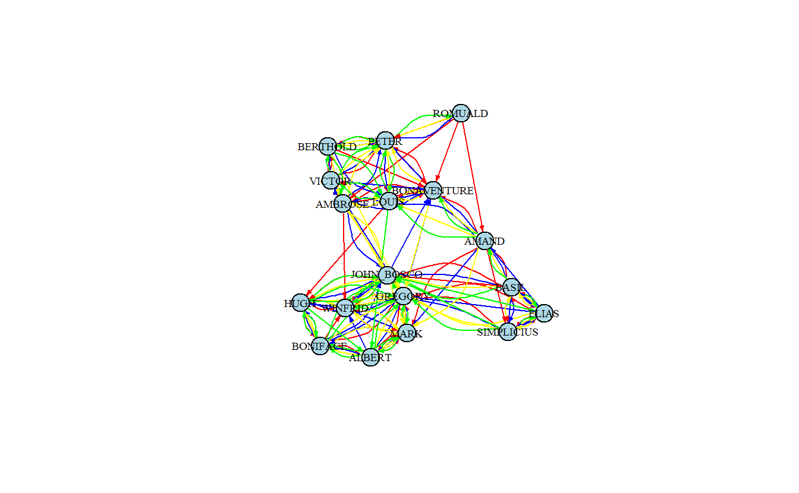

# (PART) Lab 2 {-}

# Manipulating and Simplifying Social Network Data in **igraph**

In this lab we'll explore a variety of methods for manipulating and simplifying social network data. As with the previous lab, we'll use a variety of social networks, some of which you'll recognize from other classes.

## Setup

Find and open your RStudio Project associated with this class. Begin by opening a new script. It's generally a good idea to place a header at the top of your scripts that tell you what the script does, its name, etc. 


```r
#######################################################################
# What: Manipulating and Simplifying Social Network Data
# File: lab2_igraph.R
# Created: 02.28.14
# Revised: 12.23.21
#######################################################################
```

If you have not set up your RStudio Project to clear the workspace on exit, your environment contain the objects and functions from your prior session. To clear these before beginning use the following command.


```r
rm(list = ls())
```

Proceed to place the data required for this lab (`Anabaptists.csv`, `Anabaptists.net`, `High esteem.csv`, `Liking3.csv`, `Positive Influence.csv`, `Praise.csv`, `S114 attributes.csv`, and `S114.csv`) also inside your R Project folder. We have placed it in a sub folder titled `data` for organizational purposes; however, this is not necessary.

## Load Libraries

We need to load the libraries we plan to use. Here we will use **igraph**. Because **igraph** and **sna** conflict with one another sometimes, we do not want to have them loaded at the same time, so you'll want to detach it. Alternatively, you may choose to namespace functions using the `::` operator as needed (e.g., `igraph::betweenness()` vs. `sna::betweenness()`). Of course, this applies only if you had the **statnet** suite loaded already.


```r
library(igraph)
Warning: package 'igraph' was built under R version 4.1.2
```

::: {.infobox data-latex=""}
**Note**: **igraph** imports the `%>%` operator on load (`library(igraph)`). This series of exercises leverages the operator because we find it very useful in chaining functions. 
:::

In addition to **igraph**, we will be introducing and using **backbone**. Since this may be the first time you are using this tool, please ensure you install it prior to loading it.


```r
# If you haven't done so, install backbone
# install.packages("backbone")

library(backbone)
```


## Extracting the "Backbones" of Two-Mode Network Projections

In this section, we illustrate how to extract the backbone of a projected two-mode network, a concept that we discussed in class and will not discuss in too much detail here. The basic idea is to use statistical tests to compare an edge’s observed weight in the two-mode projection to the distribution of its expected weight under a null model, controlling for different factors. An edge’s observed weight is considered to be statistically significant (and thus an actual tie) if it is in the upper or lower tail of the distribution of possible edge weights. Positive edges (ties) are found in the upper tail, while negative edges are found in the lower tail. For this, we will use the **backbone** package [@Domagalski2021].

Because we need a much larger network to stochastically (statistically) project the backbone, here we will use bill co-sponsorship in the 114th US Senate (`S114.csv`) to illustrate this process.

::: {.infobox data-latex=""}
The code found in this section is adapted from code written by Zachary Neal, Rachel Domagalski, and Bruce Sagan for the "Backbone Workshop" delivered on 13 July 2020, which can be viewed at https://youtu.be/qLrUMZp93D0. For complete workshop materials and more details about **backbone**, visit http://www.zacharyneal.com/backbone or contact Zachary Neal at zpneal@msu.edu.
:::

Specify the seeds before starting the analysis.


```r
set.seed(19)
```


### Load Data

Load and examine the network data. We will begin working with matrix data. As you can see, there are 100 Senators who sponsored a total of 3,549 bills.


```r
senate_mat <- as.matrix(
  read.csv("data/S114.csv",
           row.names = 1,
           header = TRUE,
           check.names = FALSE)
  )

# Retrieve the dimension of a matrix.
dim(senate_mat)
```

```
[1]  100 3589
```

```r
# Print out the first five rows and columns.
senate_mat[1:5, 1:5]
```

```
                     sj9 sj8 sj7 sj6 sj5
Alexander, L. (TN-R)   0   1   0   1   0
Boxer, B. (CA-D)       0   0   0   0   1
Cantwell, M. (WA-D)    0   0   0   0   1
Carper, T. (DE-D)      0   0   0   0   1
Cochran, T. (MS-R)     0   1   0   1   0
```

Now, load the attribute (party) data.


```r
S114attributes_mat <- as.matrix(
  read.csv("data/S114 attributes.csv",
           header = TRUE,
           row.names = 1,
           check.names = FALSE)
  )
```

Take a quick look.


```r
# Get first five rows.
S114attributes_mat[1:5, ]
```

```
Alexander, L. (TN-R)     Boxer, B. (CA-D)  Cantwell, M. (WA-D) 
                   1                    2                    2 
   Carper, T. (DE-D)   Cochran, T. (MS-R) 
                   2                    1 
```

### Non-Statistical Projections of the Co-Sponsorhip Data

#### Standard Projection

Project the one-mode network the by multiplying the matrix times its transpose.


```r
senators_mat <- senate_mat %*% t(senate_mat)
```

As the result from the `dim()` function indicates, the one-mode network is a 100 x 100 network (100 senators x 100 senators).


```r
dim(senators_mat)
```

```
[1] 100 100
```

Turn the matrix into an `igraph` object and then simplify it. Simplifying the network removes loops and multiple lines (summing them together to create weighted edges). This is almost always necessary before computing some metrics, such as centralization.


```r
senators_ig <- graph.adjacency(senators_mat, 
                               mode = "undirected",
                               weighted = TRUE)

senators_ig <- simplify(senators_ig,
                        remove.multiple = TRUE,
                        remove.loops = TRUE, 
                        edge.attr.comb = sum)
```

Here's how to pipe the above commands:


```r
senators_ig <- graph.adjacency(senators_mat, mode = "undirected", 
                                weighted = TRUE) %>%
   simplify(remove.multiple = TRUE, remove.loops = TRUE,
            edge.attr.comb = sum)
```

Now, plot the network, but first set the colors to blue (Democrats), red (Republicans), and white (Independents). Bernie Sanders is the white node off to the left.


```r
# Create recoding named vector
recode <- c(`1` = "red", `2` = "blue", `3` = "white")
# Recode and assign strings to vertex attribute
V(senators_ig)$color <- recode[as.character(S114attributes_mat[, 1])]
# Plot
plot(senators_ig,
     layout = layout_with_fr,
     vertex.color = V(senators_ig)$color,
     vertex.label.cex = 0.6,
     vertex.label.color = "black",
     vertex.size = 12,
     edge.width = 0.1)
```



How densely interconnected are actors?


```r
edge_density(senators_ig)
```

```
[1] 0.999798
```

As you can see the senators are clearly separated into two groups, but the network's density is almost 100% (0.999798), indicating that essentially every senator has a tie to every other senator, which probably isn't realistic.

#### Universal Threshold Projection

A common approach to reducing the number of ties in a projected one-mode network is to choose a threshold where cells greater than the threshold are set to "1" while all others are set to "0." Here, we will use mean and median edge weights as thresholds. First, we need to get the mean and median edge weight.


```r
mean(E(senators_ig)$weight)
```

```
[1] 44.17054
```

```r
median(E(senators_ig)$weight)
```

```
[1] 38
```

Create a projection using mean edge weight as a threshold value. To do so, use the `global()` function from the **backbone** library, which will handle the projection of a weighted network.


```r
threshold_mean_bb <- global(senate_mat,
                            # Set upper threshold value
                            upper = mean(E(senators_ig)$weight))
# Take a look at the matrix:
threshold_mean_bb[1:5, 1:5]
```

```
                     Alexander, L. (TN-R) Boxer, B. (CA-D) Cantwell, M. (WA-D)
Alexander, L. (TN-R)                    0                0                   0
Boxer, B. (CA-D)                        0                0                   1
Cantwell, M. (WA-D)                     0                1                   0
Carper, T. (DE-D)                       0                1                   0
Cochran, T. (MS-R)                      0                0                   0
                     Carper, T. (DE-D) Cochran, T. (MS-R)
Alexander, L. (TN-R)                 0                  0
Boxer, B. (CA-D)                     1                  0
Cantwell, M. (WA-D)                  0                  0
Carper, T. (DE-D)                    0                  0
Cochran, T. (MS-R)                   0                  0
```

Now create an `igraph` object from this matrix.


```r
threshold_mean_ig <- graph.adjacency(threshold_mean_bb, 
                                     mode = "undirected",
                                     weighted = TRUE)
```

Create a projection using median edge weight.


```r
threshold_med_bb <- global(senate_mat,
                            # Set upper threshold value
                           upper = median(E(senators_ig)$weight))
# Create an igraph graph with this object
threshold_med_ig <- graph.adjacency(threshold_med_bb, 
                                    mode = "undirected",
                                    weighted = TRUE)
```

Now, visualize the two projected networks.


```r
# Set graph parameters to 1 row and 2 columns
par(mfrow = c(1, 2))

# Recode and assign strings to vertex attribute
V(threshold_mean_ig)$color <- recode[as.character(S114attributes_mat[, 1])]
V(threshold_med_ig)$color <- recode[as.character(S114attributes_mat[, 1])]

# Save coordinates
coords <- layout_with_fr(threshold_mean_ig)

plot(threshold_mean_ig,
     layout = coords,
     vertex.label.cex = 0.2,
     vertex.label.color = "black",
     vertex.size = 12)

plot(threshold_med_ig,
     layout = coords,
     vertex.label.cex = 0.2,
     vertex.label.color = "black",
     vertex.size = 12)
```


Once again, take a look at each graph's edge density.


```r
edge_density(threshold_mean_ig)
```

```
[1] 0.4226263
```

```r
edge_density(threshold_med_ig)
```

```
[1] 0.4987879
```

These are definitely less dense (0.423 and 0.499) than the standard projection and Democrats and Republicans are clearly sorted into separate clusters. Still, these projections aren't statistically derived although at least the thresholds aren't entirely arbitrary. The next section demonstrates three statistical methods for extracting backbones.

### Extracting Backbones

As noted above, the **backbone** package uses statistical tests to compare an edge’s observed weight in the bipartite (two-mode) projection to the distribution of its weights expected under a null model. And an edge’s observed weight is statistically significant if it is in the upper or lower tail of the distribution. We will only focus on positive ties, so we'll only extract backbones based on the upper tail of the distribution.

With the co-sponsorship data, edge weights depend on how many bills each senator sponsors (row sums), and how many sponsors each bill has (column sums). (**Note**: If the rows were terrorists and the columns represented groups with which they were affiliated, then the edge weights would depend on how many groups to which the terrorists belonged and how many terrorists each group has.)

#### Hypergeometric Backbone

The Hypergeometric Model (formerly `hyperg()`, currently `fixedrow()`) controls exactly for row sums and is the fastest of the three **backbone** functions. First, we need to compute the probabilities and extract the backbone, saving it as an `igraph` object.

You'll notice that there are numerous arguments for the `fixedrow()` function: 
  
  - The `signed` option returns a signed network if set to `TRUE` (default is `FALSE`); 
  - The `alpha` option sets the significance test, the `fwer` indicates whether to apply at familywise error rate correction (default is "none");
  - The `class` indicates what type of object to return (it can return both `igraph` and `network\statnet` objects).


```r
# Compute the probabilities and create a backbone object
hyperg_probs <- fixedrow(senate_mat)
```

```
This matrix object is being treated as an unweighted bipartite network of 100 agents and 3589 artifacts.
```

```r
# Extract a backbone network from a backbone object
hyperg_ig <- backbone.extract(hyperg_probs, 
                              signed = FALSE,
                              alpha = .01, 
                              fwer = "none",
                              class = "igraph")
```

Now, plot the projected network. Once again the network is clustered into two distinct groups, and the density (0.704) is much lower than the standard projection.


```r
V(hyperg_ig)$color <- recode[as.character(S114attributes_mat[, 1])]

plot(hyperg_ig,
     layout = layout_with_fr,
     vertex.label.cex = 0.4,
     vertex.label.color = "black",
     vertex.size = 12)

edge_density(hyperg_ig)
```

```
[1] 0.7038384
```


#### Stochastic Degree Sequence Model (SDSM) Backbone

The Stochastic Degree Sequence Model (`sdsm()`) approximately controls for both row and column sums and is slower than the Hypergeometric Model (but probably more accurate).


```r
# Compute the probabilities
sdsm_probs <- sdsm(senate_mat,
                   # If TRUE the suggested text and citation will be
                   # displayed, which you can use for your write up.
                   narrative = TRUE) 
```

```
This matrix object is being treated as an unweighted bipartite network of 100 agents and 3589 artifacts.
```

```r
# Extract a backbone network from a backbone object
sdsm_ig <- backbone.extract(sdsm_probs, 
                            signed = FALSE,
                            alpha = .01, 
                            fwer = "none",
                            class = "igraph")
```

Once again, plot the network and take a look at the edge density.


```r
V(sdsm_ig)$color <- recode[as.character(S114attributes_mat[, 1])]

plot(sdsm_ig,
     layout = layout_with_fr,
     vertex.label.cex = 0.4,
     vertex.label.color = "black",
     vertex.size = 12)

edge_density(sdsm_ig)
```

```
[1] 0.3084848
```



This network plot clearly differs from what we've seen so far. The density is much lower (0.3085) and now the two parties are more distinct. Moreover, we can see that there are a handful of senators that appear to lie in between the two clusters.

#### Fixed Degree Sequence Model (FDSM) Backbone

The Fixed Degree Sequence Model (`fdsm()`) exactly controls for both row and column sums and is the slowest of the three models (but probably the most accurate). We extract the FDSM backbone like we did the previous two.


```r
# Compute the probabilities
fdsm_probs <- fdsm(senate_mat,
                   narrative = TRUE) 
# Extract a backbone network from a backbone object
fdsm_ig <- backbone.extract(fdsm_probs, 
                            signed = FALSE,
                            alpha = .01, 
                            fwer = "none",
                            class = "igraph")
```

Now, let's plot this backbone and calculate the edge density.


```r
V(fdsm_ig)$color <- recode[as.character(S114attributes_mat[, 1])]

plot(fdsm_ig,
     layout = layout_with_fr,
     vertex.label.cex = 0.4,
     vertex.label.color = "black",
     vertex.size = 12)

edge_density(fdsm_ig)
```

```
[1] 0.3612121
```


This network is a bit denser (0.3606) than the previous network, but it looks quite similar to it. That said, in this network map more senators appear as brokers between the Republicans and Democrats.

## Simplifying Networks in **igraph**: Anabaptist Leadership Network

For this section, we will use the Anabaptist Leadership network and its related attribute data in order to see how to shrink (collapse) a network in **igraph**. The data set includes 67 actors, 55 who were sixteenth century Anabaptist leaders and 12 who were prominent Protestant Reformation leaders (e.g., Martin Luther, John Calvin, Ulrich Zwingli, Martin Bucer, and Philip Melanchthon) who had contact with and influenced some of the Anabaptist leaders included in this dataset. These data build on a smaller data set [@Matthew2013] that did not include some leading Anabaptist leaders, such as Menno Simons, who is generally seen as the "founder" of the Amish and Mennonites.

### Importing Network and Attribute Data

Import the leadership network from a Pajek file and indicate that it is undirected.


```r
anabaptist_ig <- read.graph("data/Anabaptist Leaders.net",
                            format = "pajek") %>%
  # Coerce the network to undirected
  as.undirected() %>%
  # Simplify the graph 
  simplify(remove.multiple = TRUE,
           remove.loops = TRUE,
           edge.attr.comb = sum)

# If you are not comfortable using pipes (%>%) you can use the following code:
# anabaptist_ig <- read.graph("data/Anabaptist Leaders.net",
#                             format = "pajek")
# anabaptist_ig <- as.undirected(anabaptist_ig)
# anabaptist_ig <- simplify(anabaptist_ig,
#                           remove.multiple = TRUE,
#                           remove.loops = TRUE,
#                           edge.attr.comb = sum)

# Now inspect the object
anabaptist_ig
```

```
IGRAPH 5c37b8e UNW- 67 183 -- 
+ attr: id (v/c), name (v/c), x (v/n), y (v/n), z (v/n), weight (e/n)
+ edges from 5c37b8e (vertex names):
 [1] Martin Luther --Ulrich Zwingli      Martin Luther --Thomas Muntzer     
 [3] Martin Luther --Andreas Carlstadt   Martin Luther --Caspar Schwenckfeld
 [5] Martin Luther --Melchior Hofmann    Martin Luther --Philipp Melanchthon
 [7] Martin Luther --Martin Bucer        John Calvin   --Wolfgang Capito    
 [9] John Calvin   --Martin Bucer        Ulrich Zwingli--Joachim Vadian     
[11] Ulrich Zwingli--Conrad Grebel       Ulrich Zwingli--Felix Manz         
[13] Ulrich Zwingli--George Blaurock     Ulrich Zwingli--Wilhelm Reublin    
[15] Ulrich Zwingli--Johannes Brotli     Ulrich Zwingli--Louis Haetzer      
+ ... omitted several edges
```

Let's check to see if the ids (`id`) and names (`name`) are the same. Here we will test this using the `setdiff()` function, which calculates the set difference between two vectors. An output stating `character(0)` indicates no difference between the values in the first vector and the second. 


```r
setdiff(V(anabaptist_ig)$id, V(anabaptist_ig)$name)
```

```
character(0)
```

Now, let's bring in the `Anabaptist Attributes.csv` data, which includes the node attributes. The first six identify whether someone (1) embraced believer's baptism, (2) supported violence, (3) participated in the Münster Rebellion, (4) held apocalyptic beliefs, (5) was an Anabaptist, and/or (6) was a follower of Melchior Hoffman (i.e., a Melchiorite).

The last two combine other vectors in order to create a new set of attributes. The first creates vector that distinguishes between Anabaptists who didn't participate in the Münster Rebellion, Anabaptists who did, and non-Anabaptists (e.g, Martin Luther, John Calvin). The values of the resulting vector equal "0" for non-Anabaptists, "1" for Anabaptists who didn't participate in the rebellion, and "2" for those who did.

The second creates a vector that distinguishes between Melchiorite Anabaptists, Non-Melchiorite Anabaptists, and non-Anabaptists. The values of the resulting vector equal "0" for non-Anabaptists, "1" for non-Melchiorite Anabaptists, and "2" for Melchiorite Anabaptists.


```r
attributes <- read.csv("data/Anabaptist Attributes.csv",
                       header = TRUE)
```

Before moving forward to the next step, let's briefly inspect the imported attribute variables in `attributes`. Begining with looking at the column names.


```r
colnames(attributes)
```

```
 [1] "ï..Names"          "Believers.Baptism" "Violence"         
 [4] "Munster.Rebellion" "Apocalyptic"       "Anabaptist"       
 [7] "Melchiorite"       "Swiss.Brethren"    "Denck"            
[10] "Hut"               "Hutterite"         "Other.Anabaptist" 
[13] "Lutheran"          "Reformed"          "Other.Protestant" 
[16] "Tradition"         "Origin.."          "Operate.."        
```

Each column in the data frame represents a vector of values that correspond with the nodes in our graph. We can subset each or multiple columns using the `[` operator. If you are unfamiliar with this form of subsetting, keep in mind that you may provide two sets of values separated by a comma to access either rows or columns. The former will subset rows (e.g., `attributes[1:3, ]`), the latter will return columns (e.g., `attributes[, 12]`). However, since we have named columns, we can also supply the name of the column in order to subset (e.g., `attributes[, "Violence"]`). For instance, we can select the first five rows of the `Anabaptist` column.


```r
attributes[1:5, "Anabaptist"]
```

```
[1] 0 0 0 0 1
```

What this tells us is that of the first five actors listed in the data, only Conrad Grebel was an Anabaptist. We can also get the same information this way.


```r
attributes[1:5, # Rows 1 through 5
           c(1, 6)] # Columns 1 and 6
```

```
        ï..Names Anabaptist
1  Martin Luther          0
2    John Calvin          0
3 Ulrich Zwingli          0
4 Joachim Vadian          0
5  Conrad Grebel          1
```

The following commands create and add a series of vectors to the attributes `data.frame` that we can later use with our network.


```r
attributes[["anabmunst"]] <- attributes[, "Munster.Rebellion"] +
  attributes[, "Anabaptist"]
attributes[["anabmelch"]] <- attributes[, "Melchiorite"] +
  attributes[, "Anabaptist"]
```

### Plotting the Anabaptist Network

Plot the network where color indicates whether the actor is an Anabaptist who didn't participate in the Munster Rebellion, an Anabaptist who did, or a non-Anabaptist (`anabmunst` variable).


```r
# Save coordinates
layout_fr <- layout_with_fr(anabaptist_ig)
# Plot graph
plot(anabaptist_ig,
     layout = layout_fr,
     vertex.label.cex = 0.4,
     vertex.label.color = "black",
     vertex.size = 12,
     vertex.color = attributes[["anabmunst"]])
```


Blue nodes are those who participated in Munster Rebellion, orange nodes are Anabaptists who didn't, and white nodes are non-Anabaptists. Now, let's give the network a bit more color.


```r
# Declare which values correspond to which color
recode <- c(`0` = "yellow", `1` = "lightblue", `2` = "red")
# Add a new variable to our attributes data.frame for color
attributes[["color"]] <- recode[as.character(attributes[["anabmunst"]])]
# Plot
plot(anabaptist_ig,
     layout = layout_fr,
     vertex.label.cex = 0.4,
     vertex.label.color = "black",
     vertex.size = 12,
     vertex.color = attributes[["color"]])
```



### Shrinking (Collapsing, Contracting) Networks

Shrink (collapse) the Anabaptist Leadership network by "Melchiorite," "Non-Melchiorite," and Non-Anabaptist ("Other"). First, we need to  change the numbering scheme of `anabmelch.vec` from "0, 1, 2" to "1, 2, 3" (**igraph** doesn't like ids with "0's"). 


```r
# First, take a look at the values you will be recoding
table(attributes[, "anabmelch"])
```

```

 0  1  2 
12 39 16 
```

A `0` represents "Other", `1` "Non-Melchiorite", and `2` "Melchiorite". With these categories, let's contract all vertices from a given category into a single vertex. To do so, we will use the `contract()` function, which creates a new graph by merging nodes. Note that we will need to provide a numeric vector that specifies the group of each vertex. Note that the vector must be numeric and **igraph** does not like zeros. As such, we can add a 1 to the values, changing the numbering scheme of `anabmelch` from `0`, `1`, `2` to `1`, `2`, `3`.


```r
# Contract
anagroup_ig <- contract(anabaptist_ig,
                        attributes[["anabmelch"]] + 1)
# Look at output
anagroup_ig
```

```
IGRAPH 5ca9b4c UNW- 3 183 -- 
+ attr: name (v/x), weight (e/n)
+ edges from 5ca9b4c (vertex names):
[1] Martin Luther      , John Calvin        , Ulrich Zwingli     , Joachim Vadian     , Leo Jud            , Henry Bullinger    , Thomas Muntzer     , Andreas Carlstadt  , Caspar Schwenckfeld, Philipp Melanchthon, Wolfgang Capito    , Martin Bucer       --Martin Luther      , John Calvin        , Ulrich Zwingli     , Joachim Vadian     , Leo Jud            , Henry Bullinger    , Thomas Muntzer     , Andreas Carlstadt  , Caspar Schwenckfeld, Philipp Melanchthon, Wolfgang Capito    , Martin Bucer       
+ ... omitted several edges
```

After shrinking, we can relabel the categories from `1`, `2` and `3` to the string names.


```r
anagroup_ig <- set.vertex.attribute(anagroup_ig, 
                                    name = "label",
                                    value = c("Other", "Non-Melchiorite", "Melchiorite"))
```

Now plot resulting graph. Note that here we first estimate and then store the layout coordinates as an attribute of the graph, rather than as separate coordinates.


```r
par(mfrow = c(1, 2))
# Set coordinates
anabaptist_ig <- set.graph.attribute(anabaptist_ig, name = "layout",
                                     value = layout_with_fr(anabaptist_ig))
anagroup_ig <- set.graph.attribute(anagroup_ig, name = "layout",
                                   value = layout_with_fr(anagroup_ig))
# Now plot
plot(anabaptist_ig,
     vertex.color = attributes[["anabmelch"]],
     vertex.label.cex = 0.6,
     vertex.label.color = "black")

plot(anagroup_ig,
     vertex.color = "lightblue",
     vertex.label.cex = 0.6,
     vertex.label.color = "black",
     edge.arrow.mode = 0)
```


Note that there are multiple edges; let's get rid of those using `simplify()` and then replot.


```r
par(mfrow = c(1, 2))

anagroup_ig <- simplify(anagroup_ig)

plot(anabaptist_ig,
    vertex.color = attributes[["anabmelch"]],
     vertex.label.cex = 0.6,
     vertex.label.color = "black")

plot(anagroup_ig,
     vertex.color="Sky Blue",
     vertex.label.cex=.6,
     vertex.label.color="black",
     edge.arrow.mode=0)
```



The graph isn't too exciting although it does highlight how the Melchiorites (at least at the leadership level) were only connected to other Anabaptists through non-Anabaptists like Martin Luther. Now, let's collapse it by religious tradition and then assign labels to the collapsed groups.


```r
anatrad_ig <- contract(anabaptist_ig,
                       attributes[["Tradition"]])

anatrad_ig <- set.vertex.attribute(anatrad_ig, "label",
                                   value  = c("Melchiorite", "Swiss Brethren",
                                             "Denck", "Hut", "Hutterite",
                                             "Other Anabaptist", "Lutheran",
                                             "Reformed", "Other Protestant"))
```

Simplify the network, this time weighting edges by sum of the multiple lines.


```r
anatrad_ig <- simplify(anatrad_ig, 
                       edge.attr.comb = sum)
```

Now plot the Anabaptist graph colored by `Tradition` side-by-side with the collapsed graph. 


```r
par(mfrow = c(1, 2))

anatrad_ig <- set.graph.attribute(anatrad_ig, name = "layout",
                                  layout.kamada.kawai(anatrad_ig))

plot(anabaptist_ig,
     vertex.color = attributes[["Tradition"]],
     vertex.label.cex = 0.6,
     vertex.label.color = "black")

plot(anatrad_ig,
     vertex.color = "skyblue",
     vertex.label.cex = 0.6,
     vertex.label.color = "black",
     edge.arrow.mode = 0,
     edge.width = E(anatrad_ig)$weight/5)
```


### Extracting Subnetworks

To extract subnetworks in **igraph**, we use the `induced_subgraph()` command. Here, we extract just the Anabaptists and plot the resulting network. First, though, we need to assign the Anabaptist attribute to the network. Using the `table()` command, we can see that there are 55 Anabaptists, which means that the extracted subnetwork should have 55 actors. That is what we end up with.


```r
table(attributes[["Anabaptist"]])
```

```

 0  1 
12 55 
```

Now assign this vector to a vertex attribute using the `V()` function.


```r
V(anabaptist_ig)$anabaptist <- attributes[["Anabaptist"]]
```

Now extract the subgraph by indicating which vertices should be included. To do so, use the `induced_subgraph()` function, specifying the vertices with a value of `1` for the attribute `anabaptist`. 


```r
anabaptist2_ig <- induced_subgraph(anabaptist_ig,
                                   vids = which(V(anabaptist_ig)$anabaptist == 1))
anabaptist2_ig
```

```
IGRAPH 5d5f226 UNW- 55 131 -- 
+ attr: layout (g/n), id (v/c), name (v/c), x (v/n), y (v/n), z (v/n),
| anabaptist (v/n), weight (e/n)
+ edges from 5d5f226 (vertex names):
 [1] Conrad Grebel--Felix Manz              
 [2] Conrad Grebel--George Blaurock         
 [3] Conrad Grebel--Wilhelm Reublin         
 [4] Conrad Grebel--Johannes Brotli         
 [5] Conrad Grebel--Louis Haetzer           
 [6] Conrad Grebel--Wolfgang Ulimann        
 [7] Conrad Grebel--Andrew Castelberger     
+ ... omitted several edges
```


Now, let's plot the subnetwork. Note that it is disconnected, something which we saw above when we collapsed the network by "Melchiorite," "Non-Melchiorite," and Non-Anabaptist ("Other"). In other words, it is held together by non-Anabaptists.


```r
par(mfrow = c(1, 2))

plot(anabaptist_ig,
     vertex.color = attributes[["Anabaptist"]],
     vertex.label.cex = 0.6,
     vertex.label.color = "black")

plot(anabaptist2_ig,
     layout = layout_with_kk,
     vertex.color = "light blue",
     vertex.label.cex = 0.6,
     vertex.label.color = "black",
     vertex.size = 12)
```


## Multiple (Stacked) Networks in **igraph**: Sampson Monastery

The data we will use in this exercise are the Sampson Monastery network data collected by Samuel Sampson. Sampson observed and recorded the social interactions among a group of novices (men who were preparing to join a monastic order). He recorded four types of "ties": esteem (SAMPES) and disesteem (SAMPDES); liking (SAMPLK - three different time periods recorded) and disliking (SAMPDLK - one-time period recorded); positive influence (SAMPIN) and negative influence (SAMPNIN); praise (SAMPPR) and blame (SAMPNPR). Each novice only ranked his top three choices for each type of tie where a 3 indicates their first choice, a 2 their second, and a 1 their third (some subjects offered tied ranks for their top four choices).

During Sampson's period of observation, a "crisis in the cloister" occurred in response to some of the changes proposed by the Second Vatican Council (Vatican II). This led to the expulsion of four novices and the voluntary departure of several others. Based on his observations, Sampson partitioned (i.e., sorted, divided) the novices into four groups: (1) the young turks, (2) the loyal opposition, (3) the outcasts, and (4) the neutrals. The young turks arrived later and questioned some of the monastery's practices, which the loyal opposition defended. The outcasts were novices that were not accepted by the larger group, and the neutrals were those who did not take sides in the debate. Most of the loyal opposition had attended a seminary, "Cloisterville," prior to their arrival at the monastery.

For **igraph**, we will read in the data as edge lists and store them as data frames. Typically, edge lists do not contain zeros; they only include edges (ties) that actually exist (i.e., of tie strength "1" or higher). However, when "stacking" edge lists, we need to include edges of strength "0" so that all possible pairs of actors are included. Otherwise, it's impossible to merge them together.

### Importing Edge List Network Data

We'll bring in the four positive tie edge If you are interested in what the edge lists look like, inspect them after importing. 


```r
liking3 <- read.csv("data/Liking 3.csv",
                    header = TRUE)
esteem <- read.csv("data/High esteem.csv",
                   header = TRUE)
influence <- read.csv("data/Positive Influence.csv", 
                      header = TRUE)
praise <- read.csv("data/Praise.csv", 
                      header = TRUE)
```

You can and should inspect all imported objects. Do they share column names?


```r
head(liking3)
head(esteem)
head(influence)
head(praise)
```


Since each `data.frame` shares the same column headers, we can go ahead and row bind them together using the `rbind()` function.


```r
samp_pos <- rbind(liking3, esteem, influence, praise)
# Look at the data
str(samp_pos)
```

```
'data.frame':	202 obs. of  4 variables:
 $ ï..Source: chr  "ROMUALD" "ROMUALD" "ROMUALD" "ROMUALD" ...
 $ Target   : chr  "BONAVENTURE" "AMBROSE" "PETER" "AMAND" ...
 $ Weight   : int  1 1 3 2 1 3 2 1 3 2 ...
 $ Relation : chr  "Liking 3" "Liking 3" "Liking 3" "Liking 3" ...
```

Now, convert the data frame to an `igraph` object.


```r
samp_pos_ig <- graph_from_data_frame(d = samp_pos,
                                    directed = TRUE)
samp_pos_ig
```

```
IGRAPH 5dafb39 DN-- 18 202 -- 
+ attr: name (v/c), Weight (e/n), Relation (e/c)
+ edges from 5dafb39 (vertex names):
 [1] ROMUALD    ->BONAVENTURE ROMUALD    ->AMBROSE     ROMUALD    ->PETER      
 [4] ROMUALD    ->AMAND       BONAVENTURE->AMBROSE     BONAVENTURE->PETER      
 [7] BONAVENTURE->LOUIS       AMBROSE    ->BONAVENTURE AMBROSE    ->VICTOR     
[10] AMBROSE    ->WINFRID     BERTHOLD   ->BONAVENTURE BERTHOLD   ->AMBROSE    
[13] BERTHOLD   ->PETER       PETER      ->BONAVENTURE PETER      ->BERTHOLD   
[16] PETER      ->LOUIS       LOUIS      ->BONAVENTURE LOUIS      ->VICTOR     
[19] LOUIS      ->HUGH        VICTOR     ->AMBROSE     VICTOR     ->BERTHOLD   
[22] VICTOR     ->PETER       WINFRID    ->JOHN_BOSCO  WINFRID    ->GREGORY    
+ ... omitted several edges
```

### Plotting Stacked Networks

Let's plot the graph, saving the coordinates into an object so that we can use them later.


```r
samp_pos_layout <- layout_with_fr(samp_pos_ig)

plot(samp_pos_ig,
     layout = samp_pos_layout,
     vertex.color = "lightblue",
     vertex.label.cex = 0.6,
     vertex.label.color = "black",
     edge.arrow.size = 0.25)
```



Let's set the color of the edges so that they'll be different for each type of tie. We'll set the colors to red, blue, yellow, and green.


```r
# Create a named vector used for recoding
recode <- c("Liking 3" = "red", "High Esteem" = "blue",
            "Positive Influence" = "yellow", "Praise" = "green")
# We will create a color edge attribute by recoding based on the Relation
# edge attribute that we imported into the graph from the edge list
E(samp_pos_ig)$color <- recode[E(samp_pos_ig)$Relation]

plot(samp_pos_ig,
     layout = samp_pos_layout,
     vertex.color = "lightblue",
     vertex.label.cex = 0.6,
     vertex.label.color = "black",
     edge.arrow.size = 0.25)
```



### Extracting and Plotting Individual Networks

Here's how to extract the `Liking 3` network from the larger stacked network and then plot it.


```r
samp_liking3_ig <- subgraph.edges(samp_pos_ig,
                                 eids = which(
                                   E(samp_pos_ig)$Relation == "Liking 3"),
                                 delete.vertices = FALSE)
```

Here's a network plot based solely on the ties of the `Liking 3` network.


```r
plot(samp_liking3_ig,
     layout = samp_pos_layout,
     vertex.color = "lightblue",
     vertex.label.cex = 0.6,
     vertex.label.color = "black",
     edge.arrow.size = 0.5,
     edge.color = "darkgrey",
     edge.curved = 0.5)
```


That's all for **igraph** for now.
