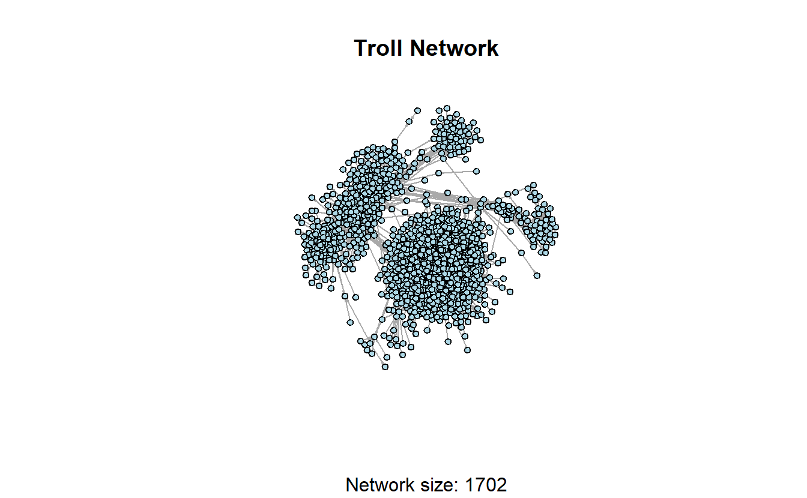
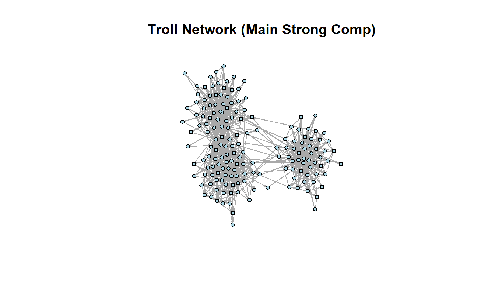
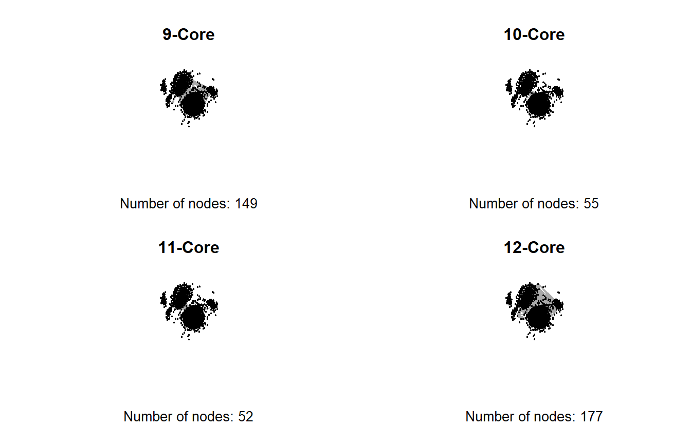
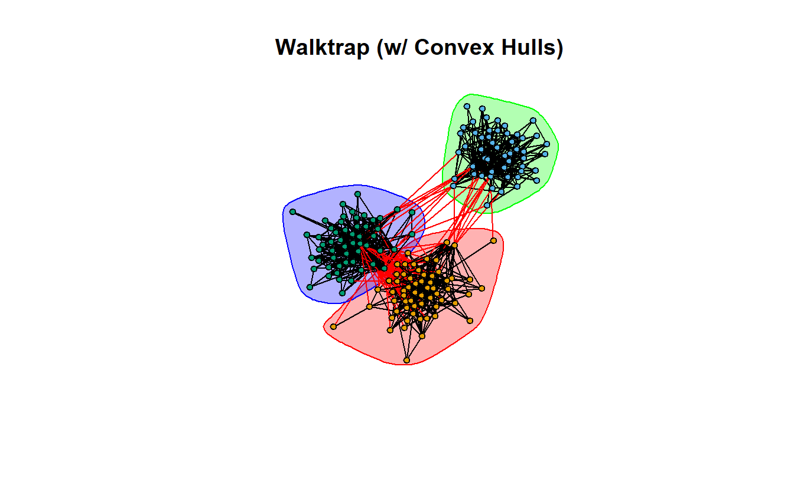

# (PART) Lab 4 {-}

# Detecting Subgroups in **igraph**

## Setup

Find and open your RStudio Project associated with this class. Begin by opening a new script. It's generally a good idea to place a header at the top of your scripts that tell you what the script does, its name, etc. 


```r
#################################################
# What: Detecting Subgroups in R with igraph
# Created: 02.28.14
# Revised: 01.24.22
#################################################
```

If you have not set up your RStudio Project to clear the workspace on exit, your environment may contain the objects and functions from your prior session. To clear these before beginning use the following command.


```r
rm(list = ls())
```

Proceed to place the data required for this lab (`Troll_EL.csv`) also inside your R Project folder. We have placed it in a sub folder titled `data` for organizational purposes; however, this is not necessary.

Social scientists generally assume that “social interaction is the basis for solidarity, shared norms, identity, and collective behavior, so people who interact intensively are likely to consider themselves a social group.”  Thus, a major focus of social network analysis is to identify dense clusters of actors “among whom there are relatively strong, direct, intense, and/or positive ties.”  These are typically referred to as “cohesive subgroups,” “subnetworks,” or “sub-clusters.” One way to cluster actors is based on shared attributes (e.g., race, gender, etc.). Another is to use the pattern of ties among actors. That is what this lab demonstrates. In an ideal world, there would be a single algorithm for identifying cohesive subgroups, but this is not an ideal world, so social network analysts have developed a variety of algorithms for identifying subnetworks.

For this exercise, we'll use a portion of the Twitter Russian Troll network that FiveThirtyEight released in mid-2018.[^1]  This subset is comprised of retweet ties among approximately 1,700 Twitter handles connected to the Internet Research Agency (a Russian "troll factory") that were active from at least May 2015 and up through the 2016 election. From the original data set, we've created an edge list for this subset that contains directed ties among the accounts.

## Load Library

Load the **igraph** library.


```r
library(igraph)
```

::: {.infobox data-latex=""}
**Note**: **igraph** imports the `%>%` operator on load (`library(igraph)`). This series of exercises leverages the operator because we find it very useful in chaining functions. 
:::

## Import and Plot Network

Let's read the data using the `read.csv`() function.


```r
read.csv("data/Troll_EL.csv", header = TRUE) %>%
  head()
```

```
      Source          Target     Type     Rel
1 1d_nicole_      ina_malone Directed Retweet
2 1d_nicole_     willie_bign Directed Retweet
3  4ever1937        bydrbre_ Directed Retweet
4  4ever1937   novostidamask Directed Retweet
5  4ever1937       novostinn Directed Retweet
6   4mysquad crystal1johnson Directed Retweet
```

Next, convert the file to an `igraph` object using the `graph_from_data_frame()`function. The `directed = TRUE` argument is a bit redundant here but it won't hurt to ensure our ties are read as directed.


```r
troll_g <- read.csv("data/Troll_EL.csv", header = TRUE) %>%
  graph_from_data_frame(directed = TRUE) 
```

You can use the `is.directed()` function to double-check if you have a directed network or not (the answer is `TRUE` in this case).


```r
is.directed(troll_g)
```

```
[1] TRUE
```

Knowing the size of the network will be useful as we start looking at the distribution of nodes across various subgroups we detect throughout this lab.


```r
vcount(troll_g) 
```

```
[1] 1704
```

Let's plot the network to see what it looks like. **Since this is a larger network, it will take a little longer to plot it. Our recommendation is to be patient and avoid clicking on anything until the plot appears.**


```r
plot(troll_g,
     layout = layout_with_graphopt,
     main = "Troll Network",
     sub = paste0("Network size: ", vcount(troll_g)),
     vertex.color = "lightblue", 
     vertex.label = NA,
     vertex.size = 5, 
     edge.arrow.size = 0.1)
```


## Components in **igraph**

Identifying weakly and strongly connected components in **igraph** is relatively simple, but we will use different functions for each of these, which is not ideal. For weakly connected components, we'll use `decompose()` function, which as its name implies, decomposes the network into a list of subnetworks that represent a network's components. It is not an intuitive approach for identifying strongly connected components, however. For strong components, we'll use the `clusters` function. Note you can use the `clusters` function to identify weakly connected components but this approach is a bit more tedious for extracting and manipulating your data later.


```r
w_comp <- decompose(troll_g, mode = "weak")
```

You can see that we have two weak components here.


```r
length(w_comp)
```

```
[1] 2
```

```r
w_comp
```

```
[[1]]
IGRAPH c67b600 DN-- 1702 9824 -- 
+ attr: name (v/c), Type (e/c), Rel (e/c)
+ edges from c67b600 (vertex names):
 [1] 1d_nicole_     ->ina_malone      1d_nicole_     ->willie_bign    
 [3] 4ever1937      ->bydrbre_        4ever1937      ->novostidamask  
 [5] 4ever1937      ->novostinn       4mysquad       ->crystal1johnson
 [7] jusslilstoner  ->4mysquad        acejinev       ->4mysquad       
 [9] adrgreerr      ->4mysquad        bigboyjasiah   ->4mysquad       
[11] blacknewsoutlet->4mysquad        camosaseko     ->4mysquad       
[13] cannonsher     ->4mysquad        cliftonhughes_ ->4mysquad       
[15] cornellburchet ->4mysquad        crystal1johnson->4mysquad       
+ ... omitted several edges

[[2]]
IGRAPH c67b600 DN-- 2 1 -- 
+ attr: name (v/c), Type (e/c), Rel (e/c)
+ edge from c67b600 (vertex names):
[1] sto_christi->ingrkoch_koch
```

We don't have any isolates in this example but if you don't want to consider isolates as components in other data sets, you can modify the command using the `min.vertices = 2` argument. 


```r
decompose(troll_g, 
          mode = "weak", 
          # The minimum number of nodes a component should contain
          min.vertices = 2)
```

```
[[1]]
IGRAPH c697bf4 DN-- 1702 9824 -- 
+ attr: name (v/c), Type (e/c), Rel (e/c)
+ edges from c697bf4 (vertex names):
 [1] 1d_nicole_     ->ina_malone      1d_nicole_     ->willie_bign    
 [3] 4ever1937      ->bydrbre_        4ever1937      ->novostidamask  
 [5] 4ever1937      ->novostinn       4mysquad       ->crystal1johnson
 [7] jusslilstoner  ->4mysquad        acejinev       ->4mysquad       
 [9] adrgreerr      ->4mysquad        bigboyjasiah   ->4mysquad       
[11] blacknewsoutlet->4mysquad        camosaseko     ->4mysquad       
[13] cannonsher     ->4mysquad        cliftonhughes_ ->4mysquad       
[15] cornellburchet ->4mysquad        crystal1johnson->4mysquad       
+ ... omitted several edges

[[2]]
IGRAPH c697bf4 DN-- 2 1 -- 
+ attr: name (v/c), Type (e/c), Rel (e/c)
+ edge from c697bf4 (vertex names):
[1] sto_christi->ingrkoch_koch
```

The `decompose()` function produces a list of subnetworks. We can see from the output that the largest weak component (the "main" component) is the first component listed. If we want to extract it, we can use the `[[` accessor and tell R we want to extract the first item on the list.


```r
w_comp[[1]]
```

```
IGRAPH c67b600 DN-- 1702 9824 -- 
+ attr: name (v/c), Type (e/c), Rel (e/c)
+ edges from c67b600 (vertex names):
 [1] 1d_nicole_     ->ina_malone      1d_nicole_     ->willie_bign    
 [3] 4ever1937      ->bydrbre_        4ever1937      ->novostidamask  
 [5] 4ever1937      ->novostinn       4mysquad       ->crystal1johnson
 [7] jusslilstoner  ->4mysquad        acejinev       ->4mysquad       
 [9] adrgreerr      ->4mysquad        bigboyjasiah   ->4mysquad       
[11] blacknewsoutlet->4mysquad        camosaseko     ->4mysquad       
[13] cannonsher     ->4mysquad        cliftonhughes_ ->4mysquad       
[15] cornellburchet ->4mysquad        crystal1johnson->4mysquad       
+ ... omitted several edges
```

You could proceed to run your analysis or plot the main component.


```r
plot(w_comp[[1]],
     layout = layout_with_graphopt,
     main = "Troll Network",
     sub = paste0("Network size: ", vcount(w_comp[[1]])),
     vertex.color = "lightblue", 
     vertex.label = NA,
     vertex.size = 5, 
     edge.arrow.size = 0.1)
```



As mentioned above, we will use the `clusters()` function to identify our strongly connected components.  


```r
s_comp <- clusters(troll_g, mode = "strong")
```

The `clusters()` function returns a named list with three components. Using the `names()` function, we can see the names of the components on the list.

  - `membership` is a numeric vector corresponding to the cluster id to which each vertex belongs
  - `csize` is a numeric vector denoting the size of each cluster
  - `no` is the number of clusters


```r
names(s_comp)
```

```
[1] "membership" "csize"      "no"        
```

Feel free to call each one (`s_comp$size`, `s_comp$membership`), but the code below only calls for the number of clusters (n=1314).


```r
s_comp$no
```

```
[1] 1314
```

Here, the largest strongly connected component is not listed first. To identify and extract the largest strongly connected component, we can use the following lines of code. Notice the largest component consists of 168 actors. 


```r
lg_s_comp <- induced_subgraph(troll_g,
                              vids = V(troll_g)[which(
                                s_comp$membership == which.max(s_comp$csize))]
                              )
lg_s_comp
```

```
IGRAPH d286c86 DN-- 168 974 -- 
+ attr: name (v/c), Type (e/c), Rel (e/c)
+ edges from d286c86 (vertex names):
 [1] 4mysquad       ->crystal1johnson acejinev       ->4mysquad       
 [3] acejinev       ->blacknewsoutlet acejinev       ->tessyelmore    
 [5] acejinev       ->wokefromday1    acejinev       ->blacktolive    
 [7] acejinev       ->trayneshacole   acejinev       ->randolphburrr  
 [9] acejinev       ->jenn_abrams     acejinev       ->ten_gop        
[11] blacknewsoutlet->4mysquad        blacknewsoutlet->crystal1johnson
[13] blacknewsoutlet->blacktolive     blacknewsoutlet->nj_blacknews   
[15] cornellburchet ->4mysquad        cornellburchet ->blacknewsoutlet
+ ... omitted several edges
```

Let's plot the largest, strongly connected component. 


```r
plot(lg_s_comp,
     layout = layout_with_graphopt, 
     main = "Troll Network (Main Strong Comp)",
     vertex.color = "lightblue",
     vertex.label = NA,
     vertex.size = 5, 
     edge.arrow.size = .1)
```



## Cliques in **igraph**

We can identify cliques in **igraph** with the following commands. First, we can ask for all cliques. The `cliques()` function returns a list containing all complete subgraphs in the input graph, which, is likely to be rather large on a network this size. Rather than print it to the console, store it into a new object and measure the length of the list to determine how many cliques are found in the graph. 


```r
# Extract the largest weak component
w_comp_main <- w_comp[[1]]
# Find all cliques
w_comp_main_cliques <- cliques(w_comp_main)
# Measure the output
length(w_comp_main_cliques)
```

```
[1] 29305
```

Typically, cliques contain 3 or more nodes, which we can achieve by adding an additional argument (`min = 3`).


```r
# Find all cliques
w_comp_main_cliques <- cliques(w_comp_main, min = 3)
# Measure the output
length(w_comp_main_cliques)
```

```
[1] 17955
```

In addition to the `clique()` function, **igraph** includes a function to find maximal cliques, which are those that cannot be extended to a larger clique [@Csardi2006]. The function to identify maximal cliques is `max_cliques()`; however, rather than identifying the cliques let's focus on counting how many are present in the input graph.


```r
count_max_cliques(w_comp_main)
```

```
[1] 7252
```

Like before, we can specify the lower limit on the size of the cliques to find.


```r
count_max_cliques(w_comp_main, min = 3)
```

```
[1] 5276
```

The `clique_num()` function tells us the size of the largest clique(s), which is 8 accounts.


```r
clique_num(w_comp_main)
```

```
[1] 8
```

Finally, identify how many cliques exist with 8 actors. How about 9?


```r
count_max_cliques(w_comp_main, min = 8) 
```

```
[1] 2
```


## K-Cores in **igraph**

In **igraph** we identify k-cores with the following code. We will examine the original network that we imported at the beginning of the lab (i.e., `troll_g`). The `coreness()` function calculates the maximal subgraph in which each vertex has at least degree *k*. The output is a numeric named vector giving the coreness of each vertex. However, there are 1,704 nodes in this graph, so the vector length would be 1,704. Rather than printing all values, let's return only the first five to examine the output.


```r
troll_kcore <- coreness(troll_g)
troll_kcore[1:5]
```

```
   1d_nicole_     4ever1937      4mysquad jusslilstoner      acejinev 
            2             3             8             1             8 
```

In case you're having trouble understanding the output, we can summarize the output by building a contingency table of the counts of each *k* level. The first line of the output below tells us the k-core and the second tells us how many actors make up that core (e.g., 156 accounts are members of the 1-core and 177 in the 12-core).


```r
table(troll_kcore)
```

```
troll_kcore
  1   2   3   4   5   6   7   8   9  10  11  12 
156 145 146 173 158 153 167 173 149  55  52 177 
```

Since the output of the k-core contains a value for each vertex, we could use this as a vertex level attribute and use it to subset the graph. First, let's assign the k-core values to the nodes.


```r
troll_g <- set.vertex.attribute(troll_g,
                                # Name the vertex attribute
                                name = "kcore",
                                # The values for all vertices
                                value = coreness(troll_g))
# Take a look at the graph with a new vertex attribute
troll_g
```

```
IGRAPH bab6499 DN-- 1704 9825 -- 
+ attr: name (v/c), kcore (v/n), Type (e/c), Rel (e/c)
+ edges from bab6499 (vertex names):
 [1] 1d_nicole_     ->ina_malone      1d_nicole_     ->willie_bign    
 [3] 4ever1937      ->bydrbre_        4ever1937      ->novostidamask  
 [5] 4ever1937      ->novostinn       4mysquad       ->crystal1johnson
 [7] jusslilstoner  ->4mysquad        acejinev       ->4mysquad       
 [9] adrgreerr      ->4mysquad        bigboyjasiah   ->4mysquad       
[11] blacknewsoutlet->4mysquad        camosaseko     ->4mysquad       
[13] cannonsher     ->4mysquad        cliftonhughes_ ->4mysquad       
[15] cornellburchet ->4mysquad        crystal1johnson->4mysquad       
+ ... omitted several edges
```

Let's plot the graph depicting some of the larger k-cores. This can be accomplished using the `induced_subgraph()` function and specifying which vertices to keep.


```r
# Extract 9-core
induced_subgraph(troll_g,
                 # Create a logical vector of which vertices to keep using the
                 # V() function and the $ accessor to set up a logical test
                 vids = V(troll_g)$kcore == 9)
```

```
IGRAPH d75df4c DN-- 149 412 -- 
+ attr: name (v/c), kcore (v/n), Type (e/c), Rel (e/c)
+ edges from d75df4c (vertex names):
 [1] _nickluna_   ->andyhashtagger _nickluna_   ->danageezus    
 [3] _nickluna_   ->xdwillie       _nickluna_   ->thefoundingson
 [5] _nickluna_   ->pamela_moore13 ameliebaldwin->_nickluna_    
 [7] ameliebaldwin->andyhashtagger ameliebaldwin->danageezus    
 [9] ameliebaldwin->pati_cooper    ameliebaldwin->tpartynews    
[11] ameliebaldwin->matevidence    ameliebaldwin->usa_gunslinger
[13] ameliebaldwin->pigeontoday    cassishere   ->_nickluna_    
[15] cassishere   ->andyhashtagger cassishere   ->evewebster373 
+ ... omitted several edges
```

Using this form, we can create 9, 10, 11 and 12 core subgraphs and plot them side-by-side.


```r
par(mfrow = c(2, 2))

# Save the coordinates
coords <- layout_with_graphopt(troll_g)

# Create a 9-core graph
induced_subgraph(troll_g,
                 vids = V(troll_g)$kcore == 9) %>%
  # 'and then' plot it
  plot(main = "9-Core",
       sub = paste0("Number of nodes: ", vcount(.)),
       layout = coords,
       vertex.label = NA,
       vertex.size = 5,
       vertex.color = "lightblue",
       edge.arrow.size = 0.1)

# Create a 10-core graph
induced_subgraph(troll_g,
                 vids = V(troll_g)$kcore == 10) %>%
  # 'and then' plot it
  plot(main = "10-Core",
       sub = paste0("Number of nodes: ", vcount(.)),
       layout = coords,
       vertex.label = NA,
       vertex.size = 5,
       vertex.color = "lightblue",
       edge.arrow.size = 0.1)

# Create a 11-core graph
induced_subgraph(troll_g,
                 vids = V(troll_g)$kcore == 11) %>%
  # 'and then' plot it
  plot(main = "11-Core",
       sub = paste0("Number of nodes: ", vcount(.)),
       layout = coords,
       vertex.label = NA,
       vertex.size = 5,
       vertex.color = "lightblue",
       edge.arrow.size = 0.1)

# Create a 12-core graph
induced_subgraph(troll_g,
                 vids = V(troll_g)$kcore == 12) %>%
  # 'and then' plot it
  plot(main = "12-Core",
       sub = paste0("Number of nodes: ", vcount(.)),
       layout = coords,
       vertex.label = NA,
       vertex.size = 5,
       vertex.color = "lightblue",
       edge.arrow.size = 0.1)

# Turn off the graphic devices
dev.off()
```

```
null device 
          1 
```



The previous graphs are a little misleading, however, because the 12-core is part of the 11-core, and the 12- and 11-cores are part of the 10-core, and so on. In other words, the 9-core  won't have isolates if the 10, 11, and 12 cores are included.


```r
induced_subgraph(troll_g, troll_kcore >= 9) %>%
  plot(main = "9-12 Core",
       sub = paste0("Number of nodes: ", vcount(.)),
       layout = coords,
       vertex.label = NA,
       vertex.size = 5,
       vertex.color = "lightblue",
       edge.arrow.size = 0.1)
```


One last thing, working with directed and/or valued data will provide different results than working with symmetric and dichotomous data. For instance, UCINET [-@ucinet] defines a k-core as:

> A k-core in an undirected graph is a connected maximal induced subgraph which has minimum degree greater than or equal to k. For a valued graph we require the sum of all the edges incident with a vertex is greater than k.
    
Please keep that in mind as you move forward.


## Community Detection in **igraph**

We'll use the largest, strongly connected component for this section but we will symmetrize it for demonstration purposes and because some of these algorithms (e.g., Girvan-Newman) work for undirected networks only.


```r
lg_s_comp_simp <- lg_s_comp %>%
  as.undirected()

lg_s_comp_simp
```

```
IGRAPH e341d1f UN-- 168 922 -- 
+ attr: name (v/c)
+ edges from e341d1f (vertex names):
 [1] 4mysquad       --acejinev        4mysquad       --blacknewsoutlet
 [3] acejinev       --blacknewsoutlet 4mysquad       --cornellburchet 
 [5] blacknewsoutlet--cornellburchet  4mysquad       --crystal1johnson
 [7] blacknewsoutlet--crystal1johnson 4mysquad       --errivvvvers    
 [9] blacknewsoutlet--errivvvvers     4mysquad       --jaedenmassey   
[11] 4mysquad       --kaydenmelton    crystal1johnson--kaydenmelton   
[13] 4mysquad       --ramonasnails    cornellburchet --ramonasnails   
[15] 4mysquad       --sadieeatonn     4mysquad       --sincerepruitt  
+ ... omitted several edges
```

### Girvan-Newman

Now, let's look at a few community detection algorithms. We'll begin with Girvan-Newman, which in **igraph** is called edge betweenness. To do so, use the `cluster_edge_betweenness()` function, which returns a `communities` object. In order to take a closer look at the `communities` object, we will store the output in a new object to further analyze it. 

::: {.infobox data-latex=""}
This first line of code will take a few minutes, so please be patient and save your work before running it.
:::


```r
gn <- cluster_edge_betweenness(lg_s_comp_simp)
# Take a look at the object
gn
```

```
IGRAPH clustering edge betweenness, groups: 5, mod: 0.54
+ groups:
  $`1`
   [1] "4mysquad"        "acejinev"        "blacknewsoutlet" "cornellburchet" 
   [5] "crystal1johnson" "errivvvvers"     "jaedenmassey"    "kaydenmelton"   
   [9] "ramonasnails"    "sadieeatonn"     "sincerepruitt"   "willisbonnerr"  
  [13] "bricegeller"     "lagonehoe"       "adamchapmanjr"   "imapharrelfake" 
  [17] "tessyelmore"     "youjustctrlc"    "baltimore0nline" "bleepthepolice" 
  [21] "nojonathonno"    "baobaeham"       "bigboysneed"     "missourinewsus" 
  [25] "blackmattersus"  "chadsloyer"      "drmichaelgarcia" "ilovesarahrich" 
  [29] "mrclydepratt"    "peytoncashout"   "gwennythot"      "jani_s_jac"     
  [33] "javonhidp"       "pamblmdaniels"   "robertebonyking" "siccerthanyou"  
  + ... omitted several groups/vertices
```

As in the previous section, the `names()` function tells us the various types of information that **igraph** calculated.


```r
names(gn)
```

```
[1] "removed.edges"    "edge.betweenness" "merges"           "bridges"         
[5] "modularity"       "membership"       "names"            "vcount"          
[9] "algorithm"       
```

We can access this information using **igraph** functions. For example, let's take a look at the modularity score and the number of groups the algorithm identified.  


```r
# Print modularity score
modularity(gn)
```

```
[1] 0.5350271
```

```r
# Print the number of identified communities
length(gn)
```

```
[1] 5
```

This information can help us to calculate normalized modularity as well. Why are we interested in normalized modularity? Because there is an upper limit to the modularity score, which is a function of how many communities (subgroups) the algorithm identifies.

With a large number of groups (communities), the normalized score differs little from the regular score. However, with a small number of groups, it can vary considerably. The following commands demonstrates how to calculate normalized modularity.


```r
# Calculate normalized modularity (qprime) by dividing the modularity by the 
# product of 1 minus the inverse of the number of communities. 
qprime_gn <- modularity(gn)/(1 - (1/length(gn)))
# Take a look
qprime_gn
```

```
[1] 0.6687839
```

The `communities` object generated by the `cluster_edge_betweenness()`  command also generates a vector that identifies which communities each actor belongs to. Like before, we can extract this vector with a function (here `membership()`), assign it as an attribute to the vertices of the graph, and use these to color the nodes. 


```r
# Add membership attribute to graph
lg_s_comp_simp <- set.vertex.attribute(lg_s_comp_simp,
                                       name = "gn_membership",
                                       value = membership(gn))

# Store coordinates to use later
coords <- layout_with_fr(lg_s_comp_simp)

# Plot
plot(lg_s_comp_simp,
     layout = coords,
     main = "Girvan-Newman Communities",
     vertex.label = NA,
     vertex.size = 5,
     vertex.color = get.vertex.attribute(lg_s_comp_simp, "gn_membership")
     )
```


We can place convex hulls around the various communities by placing the `gn` object at the beginning of the plot command.


```r
plot(gn,
     lg_s_comp_simp,
     layout = coords,
     main = "Girvan-Newman Communities (w/Convex Hulls)",
     vertex.label = NA,
     vertex.size = 5,
     vertex.color = get.vertex.attribute(lg_s_comp_simp, "gn_membership")
     )
```


We can do so with and without coloring the individual nodes. In fact, if you compare the two graphs, you'll see that they are almost identical, so telling **igraph** what color to color the nodes is unnecessary; **igraph** chooses its own colors based on the convex hulls.
 

```r
plot(gn,
     lg_s_comp_simp,
     layout = coords,
     main = "Girvan-Newman Communities (w/Convex Hulls) #2",
     vertex.label = NA,
     vertex.size = 5)
```


### Walktrap

There are numerous other community detection algorithms included in **igraph**, such as Walktrap, Spin Glass, and Louvain. We briefly compare and contrast them below.

Let's begin with Walktrap, which tries to identify subgraphs via random walks. The ideas is that short random walks tend to stay in the same community.


```r
wt <- cluster_walktrap(lg_s_comp_simp)
```

Calculate modularity, normalized modularity, and identify the number of communities.


```r
data.frame(
  "modularity" = modularity(wt),
  "normalized modularity" = modularity(wt)/(1 - (1/length(wt))),
  "communities" = length(wt)
)
```

```
  modularity normalized.modularity communities
1  0.5365493              0.804824           3
```

Now plot it.


```r
plot(wt,
     lg_s_comp_simp,
     layout = coords,
     main = "Walktrap (w/ Convex Hulls)",
     vertex.label = NA,
     vertex.size = 5)
```



### Spin-Glass

Now take a look at the spin-glass community detection algorithm. This function tries to identify communities via a spin-glass model and simulated annealing [@Csardi2006]. First, create the `communities` object.


```r
sg <- cluster_spinglass(lg_s_comp_simp)
```

Calculate modularity, normalized modularity, and identify the number of communities.


```r
data.frame(
  "modularity" = modularity(sg),
  "normalized modularity" = modularity(sg)/(1 - (1/length(sg))),
  "communities" = length(sg)
)
```

```
  modularity normalized.modularity communities
1   0.537671             0.6720887           5
```

Now plot it.


```r
plot(sg,
     lg_s_comp_simp,
     layout = coords,
     main = "Spin-Glass (w/ Convex Hulls)",
     vertex.label = NA,
     vertex.size = 5)
```


### Louvain

And finally, Louvain, which implements the multi-level modularity optimization algorithm.


```r
lo <- cluster_louvain(lg_s_comp_simp)
```

Calculate modularity, normalized modularity, and identify the number of communities.


```r
data.frame(
  "modularity" = modularity(lo),
  "normalized modularity" = modularity(lo)/(1 - (1/length(lo))),
  "communities" = length(lo)
)
```

```
  modularity normalized.modularity communities
1  0.5385144             0.8077716           3
```

Now plot it.


```r
plot(lo,
     lg_s_comp_simp,
     layout = coords,
     main = "Louvain (w/ Convex Hulls)",
     vertex.label = NA,
     vertex.size = 5)
```


### Table of Results

Let's compare community detection algorithms by putting them all in a table.


```r
# Create the data.frame
community <- data.frame("Algorithm" = c("Girvan-Newman", "Walktrap",
                                        "Spin Glass", "Louvain"),
                        "Number of Groups" = c(length(gn), length(wt),
                                               length(sg), length(lo)),
                        "Modularity" = c(modularity(gn), modularity(wt),
                                         modularity(sg), modularity(lo)),
                        "Normalized Modularity" = c(
                          modularity(gn)/(1 - (1/length(gn))),
                          modularity(wt)/(1 - (1/length(wt))),
                          modularity(sg)/(1 - (1/length(sg))),
                          modularity(lo)/(1 - (1/length(lo)))
                          ))

community
```

```
      Algorithm Number.of.Groups Modularity Normalized.Modularity
1 Girvan-Newman                5  0.5350271             0.6687839
2      Walktrap                3  0.5365493             0.8048240
3    Spin Glass                5  0.5376710             0.6720887
4       Louvain                3  0.5385144             0.8077716
```

If we were to base our analysis strictly on normalized modularity where a higher score is generally understood to indicate a better fit, then we'd go with the Louvain algorithm's community detection results (or Walktrap's).

That's all for **igraph** now.


[^1]: See FiveThirtyEight's website, https://fivethirtyeight.com/features/why-were-sharing-3-million-russian-troll-tweets/. You can locate the raw data on their GitHub site, https://github.com/fivethirtyeight/russian-troll-tweets.
