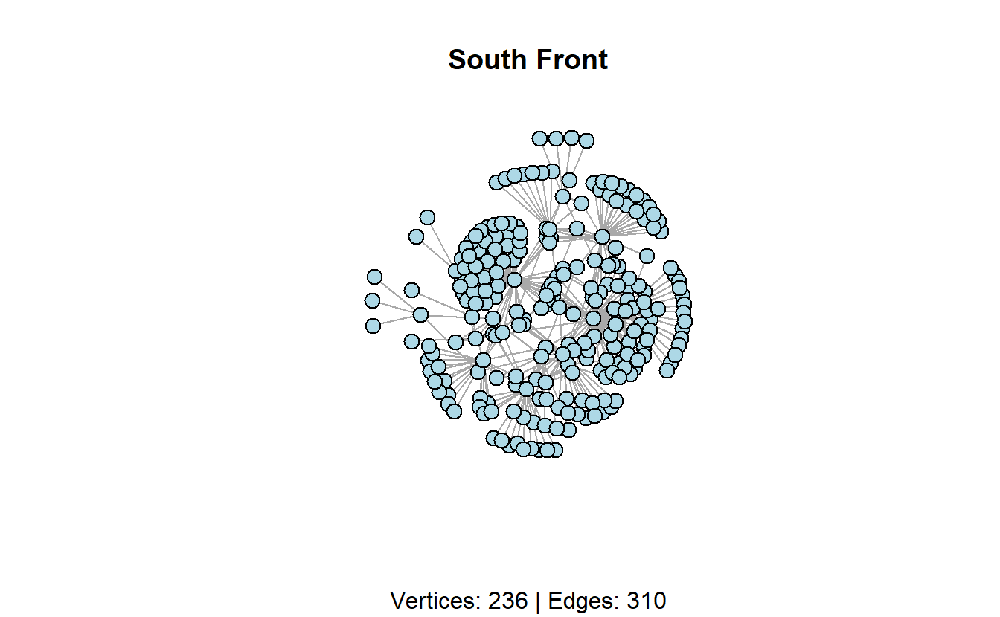
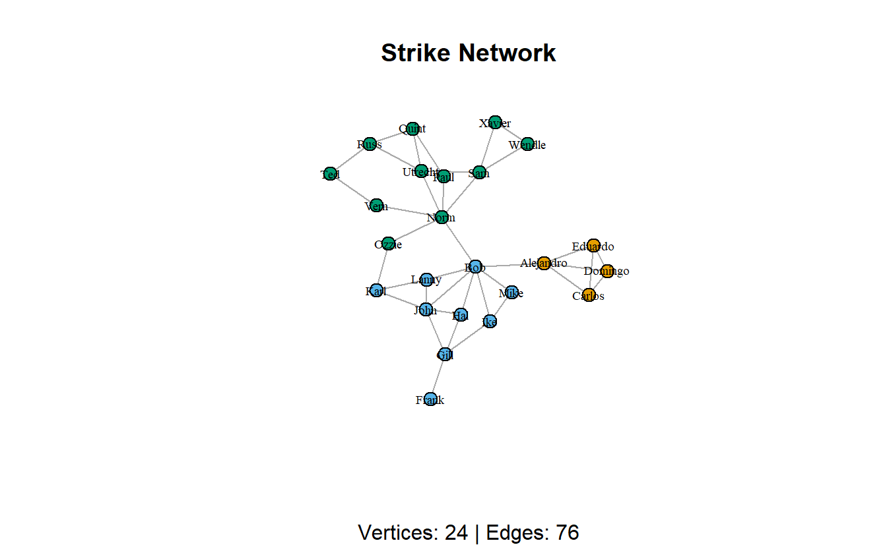
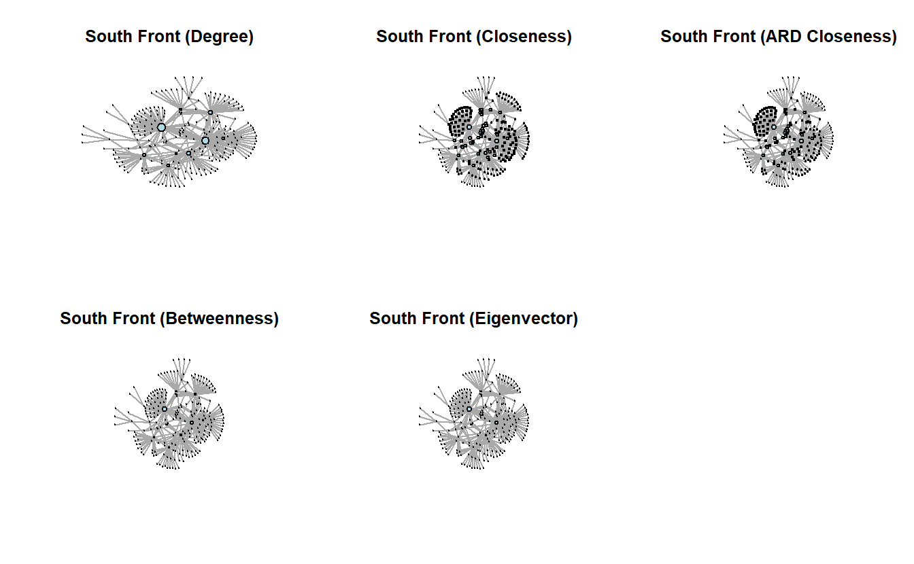
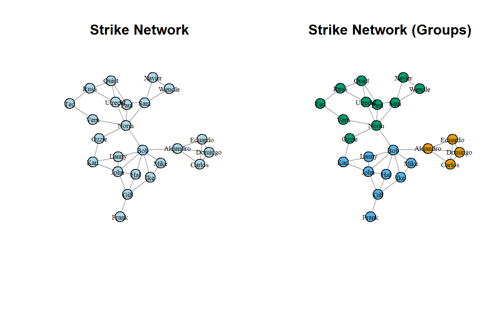
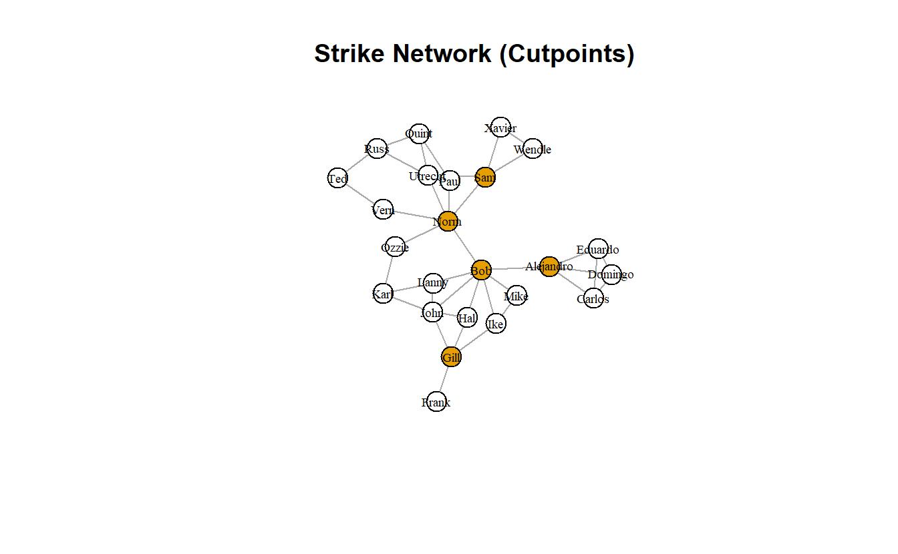
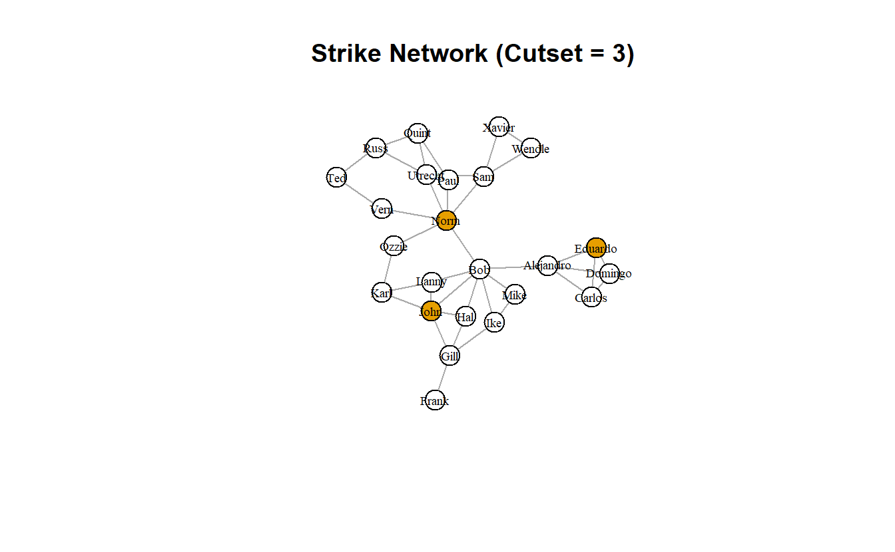
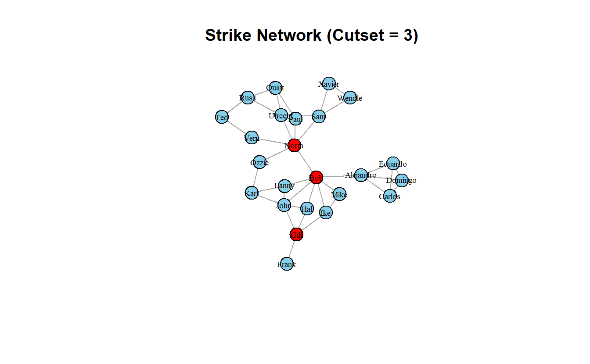
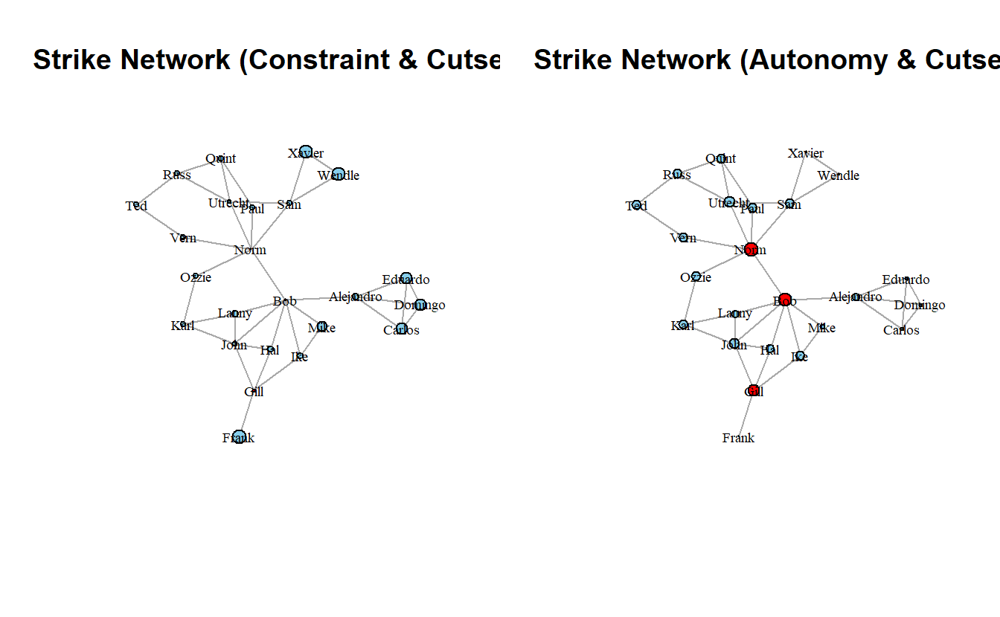
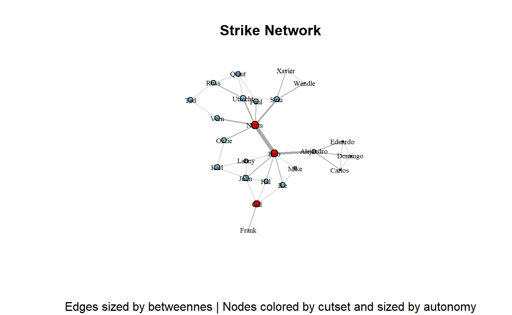

# (PART) Lab 5 {-} 

# Centrality and Brokerage in **igraph**


## Setup

Find and open your RStudio Project associated with this class. Begin by opening a new script. It's generally a good idea to place a header at the top of your scripts that tell you what the script does, its name, etc. 


```r
#################################################
# What: Centrality and Brokerage in igraph
# Created: 02.28.14
# Revised: 01.31.22
#################################################
```

If you have not set up your RStudio Project to clear the workspace on exit, your environment may contain the objects and functions from your prior session. To clear these before beginning use the following command.


```r
rm(list = ls())
```

Proceed to place the data required for this lab (`SouthFront_EL.csv`, `SouthFront_NL.csv`, `Strike.net`, and `Strikegroups.csv`) also inside your R Project folder. We have placed it in a sub folder titled `data` for organizational purposes; however, this is not necessary.

In this lab we will consider a handful of actor-level measures. Specifically, we will walk through the concepts of centrality and brokerage on two different networks.  

Centrality is one of SNA’s oldest concepts. When working with undirected data, a central actor can be someone who has numerous ties to other actors (degree), someone who is closer (in terms of path distance) to all other actors (closeness), someone who lies on the shortest path (geodesic) between any two actors (betweenness), or someone who has ties to other highly central actors (eigenvector). In some networks, the same actors will score high on all four measures. In others, they won’t. There are, of course, more than four measures of centrality.

For the centrality portion of this exercise, we'll look at a subset of South Front's YouTube network that we've collected using YouTube's open application programming interface. Specifically, we will examine subscription-based ties among accounts (note the names are a string of what appears to be random combinations of letters and numbers) within South Front's ego network (excluding South Front), which leaves us with a network of 310 subscriptions among 236 accounts. We will consider this network undirected for the "Centrality and Power" section, but directed for the "Centrality and Prestige" portion of this lab. 

Next, we will turn to measures that operationalize various aspects of brokerage. For that section, we will demonstrate the concept of brokerage by looking at a communication network of a wood-processing facility where workers rejected a new compensation package and eventually went on strike. Management then brought in an outside consultant to analyze the employee’s communication structure because it felt that information about the package was not being effectively communicated to all employees by the union negotiators. The outside consultant asked all employees to indicate, on a 5-point scale, the frequency that they discussed the strike with each of their colleagues, ranging from ‘almost never’ (less than once per week) to ‘very often’ (several times per day). The consultant used 3 as a cut-off value in order to identify a tie between two employees. If at least one of two persons indicated they discussed work with a frequency of three or more, a tie between them was included in the network. The data accompany the book, "Exploratory Social Network Analysis with Pajek," also published by Cambridge. Hence, we've shared the data with you as a Pajek file. 

## Load Libraries

Load the **igraph** library.


```r
library(igraph)
```

::: {.infobox data-latex="infobox"}
**Note**: **igraph** imports the `%>%` operator on load (`library(igraph)`). This series of exercises leverages the operator because we find it very useful in chaining functions. 
:::

We will also be using other libraries in this exercise such as **CINNA**, **DT**, **keyplayer**, **psych**, **scales**, and **influenceR**. This might be the first time you use these, so you may need to install them.


```r
to_install <- c("CINNA", "DT", "influenceR", "keyplayer", "psych", "scales")
install.packages(to_install)
```

If you have installed these, proceed to load **CINNA**, **keyplayer**, and **psych**. We will namespace functions from **influenceR**, **DT**, and **scales** libraries (e.g., `influcenceR::betweenness()`) as these have functions that mask others from **igraph**.


```r
library(CINNA)
library(keyplayer)
library(psych)
```

## Load Data

We've stored South Front's YouTube network as an edge list. Go ahead and import it with the `read.csv()` function to read the data. Then transform the `data.frame` to an `igraph` object using the `graph_from_data_frame()` function. For now we will import it as an undirected network by setting the `directed` argument to `FALSE`.  


```r
# Read data
sf_el <- read.csv("data/SouthFront_EL.csv",
                  header = TRUE)

# Create graph with edge list
sf_g <- graph_from_data_frame(d = sf_el,
                              directed = FALSE) 

# Take a look at it
sf_g
```

```
IGRAPH fad646b UN-- 236 310 -- 
+ attr: name (v/c), Type (e/c), Id (e/n), Label (e/l), timeset (e/l),
| Weight (e/n)
+ edges from fad646b (vertex names):
 [1] UCYE61Gy3RxiI2hSdCmAgP9w--UClvD6c1VI75QZWJjA_yiWhg
 [2] UCFpuO2wt_3WSrk-QG7VjUhQ--UC2C_jShtL725hvbm1arSV9w
 [3] UCqxZhJewxqhB4cNsxJFjIhg--UClvD6c1VI75QZWJjA_yiWhg
 [4] UCWNbidLi4FXBd83ixoB1v-A--UClvD6c1VI75QZWJjA_yiWhg
 [5] UCShSHheWVd42CdiVAYn-9xQ--UCLoNQH9RCndfUGOb2f7E1Ew
 [6] UCNMbegBD9OjH4Eza8vVjBMg--UCFWjEwhX6cSAKBQ28pufG3w
 [7] UC8zZkogm0hU7_zifdxSQa0Q--UCK09g6gYGMvU-0x1VCF1hgA
+ ... omitted several edges
```

You may want to plot it.


```r
plot(sf_g,
     main = "South Front",
     sub = paste0("Vertices: ",
                  vcount(sf_g), 
                  " | Edges: ",
                  ecount(sf_g)),
     layout = layout_with_kk,
     vertex.label = NA, 
     vertex.color = "lightblue",
     vertex.size = 10,
     edge.arrow.mode = 0)
```



Next, load the `Stike.net` file and `Strikegroups.csv`, convert the relational data to an `igraph` object and add the node attributes to this graph. 


```r
# Read graph
strike_g <- read_graph("data/Strike.net",
                       format =  "pajek")
# Read attributes
strike_attrs <- read.csv("data/Strikegroups.csv",
                         col.names = c("Name", "Group"))
# Add vertex attributes
strike_g <- set_vertex_attr(strike_g, 
                            name = "Group",
                            value = strike_attrs[["Group"]])
```

Lastly, plot the new network.


```r
plot(strike_g,
     layout = layout_with_kk,
     main = "Strike Network",
     sub = paste0("Vertices: ",
                  vcount(strike_g), 
                  " | Edges: ",
                  ecount(strike_g)),
     vertex.size = 10,
     vertex.label.cex = 0.6,
     vertex.label.color = "black",
     vertex.color = get.vertex.attribute(strike_g, "Group"), 
     edge.arrow.mode = 0)
```



## Centrality and Power (Undirected Networks)

### Degree, Closeness, Betweenness, and Eigenvector

We will begin by calculating the four primary measures of centrality for undirected networks. Note that the eigenvector function (i.e., `evcent()`) returns a named list with three components, so we have to extract the vector including the scores (`$vector`). Note the centrality scores correlate 100% with their **statnet** counterparts (as they should).

We can calculate ARD/Harmonic closeness using CINNA's `harmonic_centrality()` function. It generates raw scores, so if we want to normalize it, we need to divide by the number of nodes in the network less one.


```r
# Add centrality metrics as vertex attributes
sf_g <- sf_g %>%
  # igraph centrality measures
  set.vertex.attribute(name = "degree",
                       value = degree(sf_g)) %>%
  set.vertex.attribute(name = "closeness",
                       value = closeness(sf_g)) %>%
  set.vertex.attribute(name = "betweenness",
                       value = betweenness(sf_g)) %>%
  set.vertex.attribute(name = "eigenvector",
                       value = evcent(sf_g)$vector) %>%
  # CINNA ARD/Harmonic centrality
  set.vertex.attribute(name = "ard",
                       value = harmonic_centrality(sf_g)/(vcount(sf_g) - 1))

# If you are not familiar with the %>%, you do not have to use it.
# The base R equivalent is:
# sf_g <- set.vertex.attribute(sf_g, name = "degree", value = degree(sf_g))
# ...
```

We can get back the node attributes using the `get.data.frame()` function and setting the `what` argument to `"vertices"`. Take a look at the first five rows of executing this command.


```r
head(get.data.frame(sf_g, what = "vertices"), n = 5)
```

```
                                             name degree   closeness
UCYE61Gy3RxiI2hSdCmAgP9w UCYE61Gy3RxiI2hSdCmAgP9w      1 0.001256281
UCFpuO2wt_3WSrk-QG7VjUhQ UCFpuO2wt_3WSrk-QG7VjUhQ      1 0.001011122
UCqxZhJewxqhB4cNsxJFjIhg UCqxZhJewxqhB4cNsxJFjIhg      1 0.001256281
UCWNbidLi4FXBd83ixoB1v-A UCWNbidLi4FXBd83ixoB1v-A      1 0.001256281
UCShSHheWVd42CdiVAYn-9xQ UCShSHheWVd42CdiVAYn-9xQ      1 0.001070664
                         betweenness eigenvector       ard
UCYE61Gy3RxiI2hSdCmAgP9w           0 0.116170167 0.3251773
UCFpuO2wt_3WSrk-QG7VjUhQ           0 0.004754002 0.2522695
UCqxZhJewxqhB4cNsxJFjIhg           0 0.116170167 0.3251773
UCWNbidLi4FXBd83ixoB1v-A           0 0.116170167 0.3251773
UCShSHheWVd42CdiVAYn-9xQ           0 0.011670789 0.2702837
```

```r
# If you wanted to write this data.frame as a CSV, you could do so:
# write.csv(x = get.data.frame(sf_g, what = "vertices"),
#           row.names = FALSE)
```

Let's plot the network where we vary node size by the centrality measures; note that we've rescaled them so that the nodes don't get overwhelmingly big or way too small. We've turned off the labels, which are YouTube Channel IDs (i.e., really long), so you can see the results clearly.


```r
par(mfrow = c(2, 3))

# Save the coordinates
coords <- layout_with_kk(sf_g)

# Plot graph with rescaled nodes
plot(sf_g,
     asp = 0,
     main = "South Front (Degree)",
     layout = coords,
     vertex.size = scales::rescale(get.vertex.attribute(sf_g,
                                                        name = "degree"),
                                   to = c(1, 10)),
     vertex.label = NA, 
     vertex.color = "lightblue")

plot(sf_g,
     main = "South Front (Closeness)",
     layout = coords,
     vertex.size = scales::rescale(get.vertex.attribute(sf_g,
                                                        name = "closeness"),
                                   to = c(1, 10)),
     vertex.label = NA,
     vertex.color = "lightblue")

plot(sf_g,
     main = "South Front (ARD Closeness)",
     layout = coords,
     vertex.size = scales::rescale(get.vertex.attribute(sf_g,
                                                        name = "ard"),
                                   to = c(1, 10)),
     vertex.label = NA,
     vertex.color = "lightblue")

plot(sf_g,
     main = "South Front (Betweenness)",
     layout = coords,
     vertex.size = scales::rescale(get.vertex.attribute(sf_g,
                                                        name = "betweenness"),
                                   to = c(1, 10)),
     vertex.label = NA, 
     vertex.color = "lightblue")

plot(sf_g,
     main = "South Front (Eigenvector)",
     layout = coords,
     vertex.size = scales::rescale(get.vertex.attribute(sf_g,
                                                        name = "eigenvector"),
                                   to = c(1, 10)),
     vertex.label = NA, 
     vertex.color = "lightblue") 
```



### Correlations

To run a correlation between variables, use the `cor()` function.


```r
#Run correlations for columns containing centrality scores, which is all except
# the first column.
cor(get.data.frame(sf_g, what = "vertices")[, -1])
```

```
               degree closeness betweenness eigenvector       ard
degree      1.0000000 0.4957346   0.9861270   0.7559173 0.5838876
closeness   0.4957346 1.0000000   0.5346211   0.8023483 0.9908909
betweenness 0.9861270 0.5346211   1.0000000   0.7944660 0.6192361
eigenvector 0.7559173 0.8023483   0.7944660   1.0000000 0.8421519
ard         0.5838876 0.9908909   0.6192361   0.8421519 1.0000000
```

Note that, for the most part, the centrality measures correlate highly with degree, especially betweenness. 

Here's a really nice function for visualizing correlation (i.e., `pairs.panels()`) associated
with the **psych** package.


```r
pairs.panels(get.data.frame(sf_g, what = "vertices")[, -1])
```


### Interactive Table 

The R package **DT** provides an R interface to the JavaScript library **DataTables**. R data objects (matrices or data frames) can be displayed as HTML table widgets. The interactive widgets provide filtering, pagination, sorting, and many other features for the tables. 

We will namespace the `datatable()` function from library and provide it the node table for the `sf_g` graph.


```r
DT::datatable(get.data.frame(sf_g, what = "vertices"),
              rownames = FALSE)
```

```{=html}
<div id="htmlwidget-3527bb86b25b670b028f" style="width:100%;height:auto;" class="datatables html-widget"></div>
<script type="application/json" data-for="htmlwidget-3527bb86b25b670b028f">{"x":{"filter":"none","data":[["UCYE61Gy3RxiI2hSdCmAgP9w","UCFpuO2wt_3WSrk-QG7VjUhQ","UCqxZhJewxqhB4cNsxJFjIhg","UCWNbidLi4FXBd83ixoB1v-A","UCShSHheWVd42CdiVAYn-9xQ","UCNMbegBD9OjH4Eza8vVjBMg","UC8zZkogm0hU7_zifdxSQa0Q","UCm5GjhNnQUcMNgcO1lC0vTQ","UCRVDpYNhA8zvVmBee_ium3g","UC4W-mNkE0HgQhRBVusdCpfw","UCWGhvr5OE7HbSKcAhmSnYNw","UCelqGXobAzn0rfSp5hpDPfQ","UCdgJ8gL9IigpRh8xl6ZZ0_w","UCZDOedq4gQwSnLA6QXlbHdw","UCthNYjMhjFNXmu-HbLudtvA","UCMihusTAHd_vAKy0YRdTLXw","UC3BeH4UKQPzncObGXSgJL5w","UCv2_N-dyQiiKfiPNVvbtBJA","UC5EnUTa6Q2IWCABp2xNi5UA","UCBJUyJgNfSkY0TCvcURcZag","UCZsP1tn03b-Av8hjiJJf32w","UCOgMksNH7ztex_Xby9qXy4w","UC897G2LUhbx2oSF9h9qR7Sg","UCtVIzeZ7tLf5jvF6OxHXEDQ","UCfNKAwjD99kAPEdbWDM8kLA","UC0E44au0qveSHeUoOGwlREA","UCuDQ9a-jJVe2b5gg1NsP0jQ","UCfBsQ_id6HelLXpWjfI4gFA","UCCDiY6EjVTrNiutQslK_7lw","UCa5zQvJmCrVJQ7TfrDexflQ","UC04E6SnS3YeaOaCJSnNNSOg","UCmThYr8XvjXSqwx5X-E2wWw","UCY_mLaf2Adyu-rwFijUihBQ","UCPpZ50cvt3KK7dMzp4cFDng","UCCfxRqU6rUDHnCsxy9FMUnw","UCgqYUzvsBr8_tU62_zI45mA","UChqlS8Dkcv1HMUR1vL_NH0Q","UCnPfJ1MPsdCt-WRElEygC4Q","UCfk_OgQMBof-qng8JcrVKuw","UCGrPYdPCEF-Va2x3jaMB1Xw","UCPIS6r28G-7nI1sXqC7FNmw","UChG7qVia7efMjvXWZ55nmfw","UCNMUJJJmn89JHygdMd8zZTQ","UCqz55a-iS-t4wm-BCRFhIrg","UCn57ddYcpJ-G_rGjGBBdKjw","UCNVgvt4-Ne_cnn1kSNKGR4A","UCCR07Xby6w8AC795hXFa1Dg","UCrlxZ06LJ4Jkfkj1D_vO5EA","UCiSwAwgtZtPyyZCYSQoIBdA","UC49xYTS6r9bDAyJy9T0UEeg","UCqlIbZ93QfuWbyhIuNwLQPA","UCOZoYc_6JH89xXzrfPdd-1A","UC5PSRs7JJqFMdy81LFS6JBw","UCeRASiVXda05jz0I05xt1Tw","UCQkF3sOfwOzPs0M5yLc0x5Q","UCHNfxhCa28QImlfvd1igvig","UC2Jdm9UcHeX60OYHvXEer-w","UC5t7RGgV32hQgnr-DnV2zNg","UCmLqckDbQbNi8ytgtlUi9uQ","UCJ29vixKPSlgjdJLVZDg_mA","UCyt6ZazPQCr1w7uuevOQJ1w","UCVqVpmi5TBN3FOwZJVSnmyg","UCNhvBEeOjL36aJ3-EAP1nWg","UCb226CJ6zTSEYyY_c30zhFg","UCG3_FK6sqAG4DHWkLTADXkg","UCNOvflWYdU0MJBykCiDxGbw","UCRtjzoYKEpgO0Ur3MHowPdA","UCM1ZNcsj2YQxJKZdslgFScA","UCAYcH2EZRVBPGcJCiE4nztA","UCqec0kOaROB007cEpbaLTYg","UCGm2ERwu1QgXWRW5HvYuERg","UCmgz5S434m6grjihzlSToPQ","UCEyPYJY7iL73Jqc7BTgc1Dg","UCZLbvNyB3_NKI9cGJUhC8Pg","UCifwWXePTd1r8gqCHgrcGJw","UCbdkc6x2PwmBI4GiJ2-quXw","UCi6yEmkSAUEELaOiWcsj-mw","UCoTzlJ27FbJbYtzkn_cVp9A","UCcYX9pvnAUeFQSkdAy9zZJA","UCAzR6r31ES1_5p1VHfMpKTw","UC-OxiYeRaESUK3cjtf35N5A","UC9ugTvrBt43LQkM2OolvcHg","UCUZobs9QZaKGmES6zODvo8A","UCXPF5AYb9FyDgrg2MOoEsvQ","UCLX_EOZN70MfRqO0g9GFwjg","UCIOkTPW1LIbUj-hrCE81AjA","UCjG5DURCFdfdpuGK_oER2UQ","UCVdBvGnmfgmRJlU1SQLlDMw","UCd7m1Kjp1YAvggXse8is_hw","UCK6fYayqlLHU5OXaoPaQrug","UC0edtCnSIOXT_HuP07cdivg","UCywaJYYCNS1ujGwdCQMRrpQ","UCTiK7y8nz_bx4ho5Cw7cfkQ","UC8cRXCK2QEkwBEMsCLAE7XQ","UCsHdwUKr4yLOs_TjI9vVIyw","UCDjOWxepDsatTJYHVpxHnUg","UC2LYsa3UvQwOfE_UaeR97IQ","UCUQ2W76VPtaPfSnZ77T2kFg","UCMUVFCauiapAD6hm4Dgq1CA","UCozuThWWWV3ssHwEI1pleNA","UCUX2LLWHkFZrBQ9gA4WmbZw","UCp1uJOsfg3fq4hNGqYAtBWA","UCH8V61RkrF99YrbIbx9pBKQ","UCOKUBJ50Wkv98LQmfXBGjEA","UCUV4w40IOZb-JZLIZ3pT0Zg","UCFhQtxFueClVufRtsFVBIsQ","UCYftZQanGxCv8KM0BO_2uxw","UCILrsx8bdSD34FvSIC_qoCA","UCaJeoI6oepFnyQkP0h2ngHg","UCJksBWCD1c2mLrLS2TXj14w","UCoYlSBiJ6EPXHCrOUJ5HTYw","UCvmve6qe2qpnho989Qw-4lg","UCGDVgNdHINX7X3ZaiL1p1yw","UCWoZ2xMeLQf2UMZOA7mpD8A","UCDA0kTKxTPI9KzfmxMpoRFA","UClYmz-lY7nCeAdorU9roAHQ","UCGtBFfGBnYgLqiLhbYiK8_Q","UC-7gjx7fVJHgxyzhhpo36gg","UCcJvUOWmkU_pt68SOQ-q1tg","UCkrU5Xl15ezatdnnvgtjj6A","UCNXPoa1y7S3UOBDJeGbb8nA","UCEV-6jQhYIJpnYEYmiDCw3w","UCIBS40e4HtU6TSqneQGac3g","UCxTSG0rzzGTIzQWGqCiaJgg","UCQhCYMG_lUmZbMJ8e8KtojA","UCXoPri-Nom-U13rgHoDX58A","UCIaH6pLZyUsBUXuYg0yWc1g","UCnVNxOYlfkyvmdHeSif9xog","UCtqytBKHsXj4WSyUiSBdY7Q","UCIaVBIAmXOXZjsR6cW9Fl7Q","UChENffr08FIKf-9ZFf2R2nQ","UCEnwq4vwiWuq_15kkEWgxVw","UCU4GLwSst3ADUwF3yxU9KLw","UCXA0B7hF3w1RtWWngbfXhKw","UCCr-efraf1a6kJYSfk4hEJw","UCkzVLpb-q9PSGuGS_JseSuQ","UCVMZcF6EYilk4OeiBc3pFkA","UC9t7Z-Nj2ivn4CLjNlql_Zg","UCIhG-nBmr2cY56zx5eYza_Q","UCM4kqt2ysXriXBuVXEyM8kA","UCKN-Sj-WC20GC_J9C2AVbBw","UC6ZyJck124zdQSbBG6Jvmvg","UCKA8QwWgIBFBmlQANI3GUMg","UCH8TETd1IZw6IG5iBjAv8Nw","UCPRAUoP6BJfaqmmFAGMVglw","UCHdyRyUrVQks3Y6pnMUwckw","UC_3IK1GuMKm1erzMzH-a9yA","UCMgSpFZHf5L23bEldDYKK4A","UCmFuO4UJudznYS4MlS5wl1A","UC-Hy-4BEUIX7hDeVaODcIfg","UCn4UDdcn3Gmbsusa5AyGFMA","UCiHpnJOdAYnIQSUwYDa2E1w","UCHtO2Iq7C1bZ7sdWcB0U2yg","UCV95IGa1LpyXG5zS-mgKD0Q","UCTjNGGhgDagrkWO4SXa5F5A","UCHxJfblqf3iyxTTd3GXtRXA","UCQleiDKZyZfsPZrArWDmI0A","UCBvxTye7EGlu3o3S58vIQeg","UCq2q83rsDc91CTBPMusuKWQ","UCySNnaJEsLYBlg4gqCAq8uw","UCavyAKZP-Wr5SSc3zmqVenw","UCCgx0sNaSSJ-jjYDG6RqkPA","UCYCDXs0Nc0HtTGeXKuc6l4g","UCAx27vcos1TkPty-FF0zVfQ","UC6p8X60vwIAohxAEHtlxH9g","UCp8wAqgF6VlvvMIWVI6xegg","UCCdxizrxUZ55AHZUGhdzkGg","UC4Ex8sqdisdLF-jj4d_Od4Q","UCaMyORedtLcmQJC6g_2OZzg","UCVcAb1Kml9b5GRB0Vho86-w","UCuRDFWQap-eSoC3v8zlIrkw","UC4mhsWgiD0PZ9DZiZv7HdMw","UCX-qFmU6tkSU7WS5nr2HrCA","UCai3CeohSSHbJwiG8yyFSyg","UCcH2YymKTzXQ6SQhucvZmMw","UC_KpnE0P8hSzRS24QAHcrMA","UCmpwokS_qioWGXJ22qYBaZg","UCOl1O_9KFjfl2zgQFt2aODg","UCKjFMX4pQBbx_Vh7q-jQR-A","UCNdJmFsqZ2SmTaFiMbgOQ9w","UCiRzcqN27rfcmeFdFvAG0Jw","UC2vjyLgENRY_ZQ1sI91VyyQ","UCPJu-iu1TQDhS3Tw8urydOA","UCv-T1WeKQxQ8zsSzl-gHGSw","UCjMvLtSvkpk5m4u6T-ye1rw","UC7subBl2gbz5H36m-zbp8LA","UCuDGSixG6umA4o49wixLkjQ","UCGnb7vX5hLroe5Jl61Dt0FA","UCqDZ5oAFZomuaDRnsqh1Q9w","UCc4VkAp7fPg-3QPudsn5XZA","UC1r_FsYOsPrU-kO_JHRpfdw","UCA--dcq7LnlhvWtYhffBoow","UCUl5yJaPdlqJ--c1gZK7RGg","UC9UV-zZuV_r45n0Twtj4DOg","UCp_UQ3x8-vFmacoERpZDsdQ","UC8wmpNa5g9f45o19hBQcFTQ","UCjocz5zz_0RIfifUlNt4ziA","UCSUBEu3CwiXUD2YByfSEJOQ","UC9eaJnY3wFRWF1GSphv05ZQ","UC_8dI_PPRY2HbDfYtAbEKaw","UCIMm99MI5FLycLIL9PY97Mg","UCNAUR9pArgDCA-Mm0MFCO6g","UCnWzRN18nWMDM1YRCKGbr3A","UCXsiSnw37krBovN_gQ2cMkw","UCPamPqyE5ik_Al8ig3lw--g","UClS4wJdCusfUyp2qnZx40AQ","UCpkZ7xO1ceEFEk3Bs7x4WhQ","UCPJiczyFyMBET_WLishFmNw","UCxRpmvyUAsaN1w465S39QnQ","UCf3ckYZL0z22TYs5ra6YvDQ","UCl1vPakchzspeKGvMtty-DA","UCrnjUlwFWJgzs0-2fJy7GwA","UC-foLXdvsD24GK3eVPQRc4A","UC66t52SmEJOi2ewDYMsM2Rw","UCmX9MLxlU2htc1gZcEyGBBA","UCLjzLVqoVZ5Wvfdqfmp19dA","UCWpx-5KIHwpXE7Y0z2rA_Sw","UCt23v8eAFgT1ARfCOyGRHsw","UCz3QHIofjkRZx4yyWSdO6_w","UClgA2GsO7o-_xh4HgUXGX-g","UClvD6c1VI75QZWJjA_yiWhg","UC2C_jShtL725hvbm1arSV9w","UCLoNQH9RCndfUGOb2f7E1Ew","UCFWjEwhX6cSAKBQ28pufG3w","UCK09g6gYGMvU-0x1VCF1hgA","UCwnKziETDbHJtx78nIkfYug","UCbWJBeGBPPealdWVLzbVU7g","UCfa492nu0Ir7zEmqR9hQ18Q","UCAVFHtGR7-MJMKWX_genw_Q","UCRds47MZ1Ng7KCLseg2TkWA","UCQGqX5Ndpm4snE0NTjyOJnA","UCD8bmW4A7eYzHrW7sXwsqwQ","UCagTsJE66BwJkBfwU9izyaA","UC7w6MNvnZJ0DKU41wa7yA8w","UCeNbszrEiBC5Nv53Cr5UViw","UCklesbq7pc_XIaCvpZvG4QQ"],[1,1,1,1,1,1,1,2,4,2,3,2,3,1,1,2,2,1,1,1,1,1,2,1,1,1,1,5,3,3,1,2,1,1,4,3,1,1,1,1,1,1,1,2,4,1,1,1,2,1,1,1,1,1,1,1,1,1,2,1,1,1,1,1,2,1,1,1,2,2,1,1,2,3,1,1,1,1,2,1,1,1,1,1,1,1,1,1,3,1,1,2,1,1,1,1,2,2,1,1,1,1,1,1,1,1,1,2,2,1,1,1,1,1,1,1,1,1,1,3,1,1,1,1,1,1,2,2,2,1,2,1,2,2,3,1,1,2,2,2,2,1,1,1,1,1,2,1,1,4,1,1,1,3,2,3,1,1,1,1,3,1,2,1,1,1,1,1,2,1,1,1,1,1,3,4,2,1,2,1,2,1,1,1,1,1,1,1,1,1,1,2,1,1,2,2,1,1,1,3,1,1,1,1,1,1,1,1,1,1,2,2,2,1,1,1,2,2,1,2,63,13,23,32,33,56,1,6,1,24,23,16,2,5,8,1],[0.00125628140703518,0.00101112234580384,0.00125628140703518,0.00125628140703518,0.00107066381156317,0.00112107623318386,0.00107181136120043,0.0014265335235378,0.00126903553299492,0.00110132158590308,0.00122549019607843,0.00128369704749679,0.00134228187919463,0.001194743130227,0.00107181136120043,0.0011454753722795,0.00129533678756477,0.00105708245243129,0.00107066381156317,0.00107181136120043,0.00112107623318386,0.00125628140703518,0.00125470514429109,0.00101112234580384,0.00125628140703518,0.001194743130227,0.001194743130227,0.00133689839572193,0.00150602409638554,0.00133155792276964,0.00125628140703518,0.00116686114352392,0.00107066381156317,0.00101112234580384,0.00142857142857143,0.00129533678756477,0.00102880658436214,0.00125628140703518,0.00112107623318386,0.001194743130227,0.001194743130227,0.00102880658436214,0.00125628140703518,0.0013550135501355,0.00138888888888889,0.00112107623318386,0.00112107623318386,0.001194743130227,0.00129533678756477,0.001194743130227,0.00125628140703518,0.001194743130227,0.00125628140703518,0.00107181136120043,0.00107066381156317,0.00125628140703518,0.00107066381156317,0.00125628140703518,0.00110132158590308,0.00107181136120043,0.00105708245243129,0.001194743130227,0.00101729399796541,0.001194743130227,0.0014265335235378,0.00101729399796541,0.00105708245243129,0.00107066381156317,0.00132978723404255,0.00127064803049555,0.00102880658436214,0.00101112234580384,0.0014265335235378,0.00115874855156431,0.00107181136120043,0.00112107623318386,0.00125628140703518,0.00125628140703518,0.00117924528301887,0.000931098696461825,0.00125628140703518,0.00101112234580384,0.00125628140703518,0.00107181136120043,0.000827814569536424,0.000827814569536424,0.00125628140703518,0.00107181136120043,0.0013531799729364,0.00102880658436214,0.001194743130227,0.00116686114352392,0.00107066381156317,0.00102880658436214,0.00107066381156317,0.00112107623318386,0.00116550116550117,0.00129032258064516,0.000931098696461825,0.00125628140703518,0.000827814569536424,0.001194743130227,0.001194743130227,0.001194743130227,0.000823723228995058,0.001194743130227,0.00107066381156317,0.00110132158590308,0.00129533678756477,0.00107066381156317,0.00112107623318386,0.00125628140703518,0.00107066381156317,0.00107181136120043,0.00105708245243129,0.00107181136120043,0.001194743130227,0.00102880658436214,0.00101729399796541,0.00133511348464619,0.00102880658436214,0.001194743130227,0.001194743130227,0.001194743130227,0.00125628140703518,0.001194743130227,0.00121802679658953,0.00118203309692671,0.00106269925611052,0.001194743130227,0.00117924528301887,0.00107181136120043,0.00129032258064516,0.00135685210312076,0.0013531799729364,0.001194743130227,0.00125628140703518,0.00110132158590308,0.00110132158590308,0.00115740740740741,0.00132978723404255,0.00101729399796541,0.00101729399796541,0.00125628140703518,0.00102880658436214,0.00105708245243129,0.001230012300123,0.00125628140703518,0.00112107623318386,0.00147710487444609,0.00101729399796541,0.00107181136120043,0.00107181136120043,0.00132978723404255,0.00118764845605701,0.00138504155124654,0.00125628140703518,0.00125628140703518,0.001194743130227,0.00101112234580384,0.00143472022955524,0.00125628140703518,0.00117924528301887,0.00102880658436214,0.00101729399796541,0.00125628140703518,0.001194743130227,0.001194743130227,0.00121802679658953,0.000951474785918173,0.001194743130227,0.00107181136120043,0.00102880658436214,0.00125628140703518,0.00138504155124654,0.00138888888888889,0.0013550135501355,0.00125628140703518,0.00117924528301887,0.00112107623318386,0.0014265335235378,0.00102880658436214,0.00107181136120043,0.00107181136120043,0.00125628140703518,0.00101112234580384,0.00107066381156317,0.00125628140703518,0.001194743130227,0.00125628140703518,0.00125628140703518,0.00135685210312076,0.00125628140703518,0.001194743130227,0.00106609808102345,0.00117508813160987,0.00107181136120043,0.00105708245243129,0.00125628140703518,0.00138312586445367,0.00107181136120043,0.001194743130227,0.000931098696461825,0.00125628140703518,0.00112107623318386,0.00125628140703518,0.00107066381156317,0.000931098696461825,0.00107066381156317,0.00101729399796541,0.00125786163522013,0.0014265335235378,0.0013550135501355,0.001194743130227,0.00101729399796541,0.00112107623318386,0.0014265335235378,0.00135685210312076,0.00125628140703518,0.0013262599469496,0.00177935943060498,0.00132450331125828,0.00142857142857143,0.00151975683890578,0.00143061516452074,0.00165837479270315,0.000978473581213307,0.00122399020807834,0.000978473581213307,0.0013550135501355,0.00133511348464619,0.00140449438202247,0.00102040816326531,0.00102669404517454,0.00119047619047619,0.00101419878296146],[0,0,0,0,0,0,0,258.946787596057,508.097630856029,42.8243691276016,336.691434340287,657.680821821194,976.080976323753,0,0,254.044167091502,232.177851269856,0,0,0,0,0,202.417152927054,0,0,0,0,1843.03593011449,647.613454262723,448.660672637926,0,425.114918471593,0,0,328.28012092939,0,0,0,0,0,0,0,0,287.637571250545,795.802291412632,0,0,0,232.177851269856,0,0,0,0,0,0,0,0,0,42.8243691276016,0,0,0,0,0,258.946787596057,0,0,0,547.069599127819,290.645658189127,0,0,258.946787596057,325.121470571955,0,0,0,0,126.77535980135,0,0,0,0,0,0,0,0,0,562.196162124917,0,0,178.075736014696,0,0,0,0,286.040728217852,159.079841993336,0,0,0,0,0,0,0,0,0,42.8243691276016,232.177851269856,0,0,0,0,0,0,0,0,0,0,655.065520327074,0,0,0,0,0,0,197.781752671279,356.542463791432,62.4093549816107,0,128.020801659717,0,159.079841993336,398.622549284689,489.517796580107,0,0,42.8243691276016,42.8243691276016,162.002709210892,547.069599127819,0,0,0,0,0,413.870591858719,0,0,1893.90143415577,0,0,0,537.41925879639,167.091705411335,589.039445934471,0,0,0,0,448.132028572143,0,128.020801659717,0,0,0,0,0,197.781752671279,0,0,0,0,0,589.039445934471,795.802291412632,287.637571250545,0,126.77535980135,0,258.946787596057,0,0,0,0,0,0,0,0,0,0,398.622549284689,0,0,129.369410318924,330.873115898999,0,0,0,1015.89371447302,0,0,0,0,0,0,0,0,0,0,276.340960330231,258.946787596057,287.637571250545,0,0,0,258.946787596057,398.622549284689,0,305.518228568035,12058.5053204572,2039.88809245687,3747.00791280639,4969.13955032422,5087.36793029522,9303.79383081185,0,437.570076676723,0,3440.98253082117,3065.21727815334,2412.24733709047,234,731.601563477173,1071.67857662936,0],[0.11617016661016,0.00475400229750999,0.11617016661016,0.11617016661016,0.0116707886246371,0.0302159875678045,0.0265651381663113,0.204743715698022,0.130782621809744,0.0340513511151627,0.0642673386829671,0.105004527299817,0.117864710615708,0.0885735490878623,0.0265651381663113,0.0164247909221471,0.115138687254173,0.00957300867199083,0.0116707886246371,0.0265651381663113,0.0302159875678045,0.11617016661016,0.098146557759853,0.00475400229750998,0.11617016661016,0.0885735490878622,0.0885735490878623,0.140899785514931,0.211232758767265,0.0558580852433382,0.11617016661016,0.0382359267909484,0.0116707886246371,0.00475400229750999,0.23818038436693,0.143912458958219,0.0164309782119545,0.11617016661016,0.0302159875678045,0.0885735490878622,0.0885735490878622,0.0164309782119544,0.11617016661016,0.146386154177964,0.161304017189068,0.0302159875678045,0.0302159875678045,0.0885735490878622,0.115138687254173,0.0885735490878622,0.11617016661016,0.0885735490878622,0.11617016661016,0.0265651381663113,0.0116707886246371,0.11617016661016,0.0116707886246371,0.11617016661016,0.0340513511151627,0.0265651381663113,0.00957300867199083,0.0885735490878623,0.0176203729032082,0.0885735490878622,0.204743715698022,0.0176203729032082,0.00957300867199083,0.0116707886246371,0.127840955234797,0.100244337712499,0.0164309782119544,0.00475400229750998,0.204743715698022,0.0353643314836675,0.0265651381663113,0.0302159875678045,0.11617016661016,0.11617016661016,0.0478363604710127,0.00404519101984618,0.11617016661016,0.00475400229750999,0.11617016661016,0.0265651381663113,0.00214658368490506,0.00214658368490506,0.11617016661016,0.0265651381663113,0.136409909558875,0.0164309782119544,0.0885735490878623,0.0349699898653145,0.0116707886246371,0.0164309782119544,0.0116707886246371,0.0302159875678045,0.0260039868839453,0.118789536655667,0.00404519101984618,0.11617016661016,0.00214658368490506,0.0885735490878623,0.0885735490878622,0.0885735490878622,0.00192752708412964,0.0885735490878622,0.0116707886246371,0.0340513511151626,0.115138687254174,0.0116707886246371,0.0302159875678045,0.11617016661016,0.0116707886246371,0.0265651381663113,0.00957300867199084,0.0265651381663113,0.0885735490878623,0.0164309782119544,0.0176203729032082,0.10981734638449,0.0164309782119545,0.0885735490878622,0.0885735490878622,0.0885735490878622,0.11617016661016,0.0885735490878622,0.0567811257341158,0.0418867761924416,0.00879919331735616,0.0885735490878622,0.0397889962397954,0.0265651381663113,0.118789536655667,0.142735304776471,0.128362545327658,0.0885735490878622,0.11617016661016,0.0340513511151626,0.0340513511151626,0.021243797296628,0.127840955234797,0.0176203729032082,0.0176203729032081,0.11617016661016,0.0164309782119545,0.00957300867199083,0.0926187401077084,0.11617016661016,0.0302159875678045,0.167571134687429,0.0176203729032082,0.0265651381663113,0.0265651381663113,0.134415145440335,0.046646965779759,0.145354674821978,0.11617016661016,0.11617016661016,0.0885735490878622,0.00475400229750998,0.215826215161767,0.11617016661016,0.0397889962397953,0.0164309782119545,0.0176203729032082,0.11617016661016,0.0885735490878622,0.0885735490878622,0.0567811257341158,0.0110824994637452,0.0885735490878622,0.0265651381663113,0.0164309782119544,0.11617016661016,0.145354674821978,0.161304017189068,0.146386154177964,0.11617016661016,0.0478363604710127,0.0302159875678045,0.204743715698022,0.0164309782119544,0.0265651381663113,0.0265651381663113,0.11617016661016,0.00475400229750999,0.0116707886246371,0.11617016661016,0.0885735490878622,0.11617016661016,0.11617016661016,0.142735304776471,0.11617016661016,0.0885735490878623,0.0117195923568959,0.0361381468383021,0.0265651381663113,0.00957300867199083,0.11617016661016,0.146780495796317,0.0265651381663113,0.0885735490878622,0.00404519101984618,0.11617016661016,0.0302159875678045,0.11617016661016,0.0116707886246371,0.00404519101984618,0.0116707886246371,0.0176203729032082,0.10619392199107,0.204743715698022,0.146386154177964,0.0885735490878622,0.0176203729032082,0.0302159875678045,0.204743715698022,0.142735304776471,0.11617016661016,0.133790539513368,1,0.0409227466589018,0.100462872398226,0.260101095225269,0.228674357121805,0.762446604601116,0.0151930389653515,0.0953988428107839,0.0151930389653515,0.141438879631575,0.151677262909832,0.0824050524444511,0.0165922727011142,0.0184779255082633,0.0348212552145243,0.0156150298407326],[0.325177304964539,0.252269503546099,0.325177304964539,0.325177304964539,0.270283687943262,0.284326241134752,0.277730496453901,0.377659574468085,0.334751773049645,0.289148936170213,0.326595744680851,0.340992907801418,0.361347517730496,0.311276595744681,0.277730496453901,0.292695035460993,0.345390070921986,0.263617021276596,0.270283687943262,0.277730496453901,0.284326241134752,0.325177304964539,0.330496453900709,0.252269503546099,0.325177304964539,0.311276595744681,0.311276595744681,0.357801418439716,0.393617021276596,0.341347517730496,0.325177304964539,0.309503546099291,0.270283687943262,0.252269503546099,0.379787234042553,0.334893617021277,0.264468085106383,0.325177304964539,0.284326241134752,0.311276595744681,0.311276595744681,0.264468085106383,0.325177304964539,0.357801418439716,0.370921985815603,0.284326241134752,0.284326241134752,0.311276595744681,0.345390070921986,0.311276595744681,0.325177304964539,0.311276595744681,0.325177304964539,0.277730496453901,0.270283687943262,0.325177304964539,0.270283687943262,0.325177304964539,0.289148936170213,0.277730496453901,0.263617021276596,0.311276595744681,0.261347517730496,0.311276595744681,0.377659574468085,0.261347517730496,0.263617021276596,0.270283687943262,0.350354609929078,0.337234042553192,0.264468085106383,0.252269503546099,0.377659574468085,0.306666666666667,0.277730496453901,0.284326241134752,0.325177304964539,0.325177304964539,0.308297872340426,0.234184397163121,0.325177304964539,0.252269503546099,0.325177304964539,0.277730496453901,0.20822695035461,0.20822695035461,0.325177304964539,0.277730496453901,0.364539007092199,0.264468085106383,0.311276595744681,0.301205673758865,0.270283687943262,0.264468085106383,0.270283687943262,0.284326241134752,0.298652482269504,0.343617021276596,0.234184397163121,0.325177304964539,0.20822695035461,0.311276595744681,0.311276595744681,0.311276595744681,0.205035460992908,0.311276595744681,0.270283687943262,0.289148936170213,0.345390070921986,0.270283687943262,0.284326241134752,0.325177304964539,0.270283687943262,0.277730496453901,0.263617021276596,0.277730496453901,0.311276595744681,0.264468085106383,0.261347517730496,0.355390070921986,0.264468085106383,0.311276595744681,0.311276595744681,0.311276595744681,0.325177304964539,0.311276595744681,0.320354609929078,0.310567375886525,0.26886524822695,0.311276595744681,0.304468085106383,0.277730496453901,0.343617021276596,0.358510638297872,0.360709219858156,0.311276595744681,0.325177304964539,0.289148936170213,0.289148936170213,0.295957446808511,0.350354609929078,0.261347517730496,0.261347517730496,0.325177304964539,0.264468085106383,0.263617021276596,0.323404255319149,0.325177304964539,0.284326241134752,0.393971631205674,0.261347517730496,0.277730496453901,0.277730496453901,0.352127659574468,0.310992907801418,0.373758865248227,0.325177304964539,0.325177304964539,0.311276595744681,0.252269503546099,0.381560283687943,0.325177304964539,0.304468085106383,0.264468085106383,0.261347517730496,0.325177304964539,0.311276595744681,0.311276595744681,0.320354609929078,0.237872340425532,0.311276595744681,0.277730496453901,0.264468085106383,0.325177304964539,0.373758865248227,0.370921985815603,0.357801418439716,0.325177304964539,0.308297872340426,0.284326241134752,0.377659574468085,0.264468085106383,0.277730496453901,0.277730496453901,0.325177304964539,0.252269503546099,0.270283687943262,0.325177304964539,0.311276595744681,0.325177304964539,0.325177304964539,0.358510638297872,0.325177304964539,0.311276595744681,0.269645390070922,0.306241134751773,0.277730496453901,0.263617021276596,0.325177304964539,0.367730496453901,0.277730496453901,0.311276595744681,0.234184397163121,0.325177304964539,0.284326241134752,0.325177304964539,0.270283687943262,0.234184397163121,0.270283687943262,0.261347517730496,0.335390070921986,0.377659574468085,0.357801418439716,0.311276595744681,0.261347517730496,0.284326241134752,0.377659574468085,0.358510638297872,0.325177304964539,0.349290780141844,0.524113475177305,0.348723404255319,0.38936170212766,0.422198581560284,0.412765957446808,0.492765957446809,0.245957446808511,0.318510638297872,0.245957446808511,0.381347517730496,0.374893617021277,0.371063829787234,0.26063829787234,0.269148936170213,0.314113475177305,0.255673758865248]],"container":"<table class=\"display\">\n  <thead>\n    <tr>\n      <th>name<\/th>\n      <th>degree<\/th>\n      <th>closeness<\/th>\n      <th>betweenness<\/th>\n      <th>eigenvector<\/th>\n      <th>ard<\/th>\n    <\/tr>\n  <\/thead>\n<\/table>","options":{"columnDefs":[{"className":"dt-right","targets":[1,2,3,4,5]}],"order":[],"autoWidth":false,"orderClasses":false}},"evals":[],"jsHooks":[]}</script>
```

Using the **magrittr** pipe (`%>%`) we can reshape the "grammar" a bit.


```r
get.data.frame(sf_g, what = "vertices") %>%
  DT::datatable(rownames = FALSE)
```

```{=html}
<div id="htmlwidget-478bf74146d1193f7ba0" style="width:100%;height:auto;" class="datatables html-widget"></div>
<script type="application/json" data-for="htmlwidget-478bf74146d1193f7ba0">{"x":{"filter":"none","data":[["UCYE61Gy3RxiI2hSdCmAgP9w","UCFpuO2wt_3WSrk-QG7VjUhQ","UCqxZhJewxqhB4cNsxJFjIhg","UCWNbidLi4FXBd83ixoB1v-A","UCShSHheWVd42CdiVAYn-9xQ","UCNMbegBD9OjH4Eza8vVjBMg","UC8zZkogm0hU7_zifdxSQa0Q","UCm5GjhNnQUcMNgcO1lC0vTQ","UCRVDpYNhA8zvVmBee_ium3g","UC4W-mNkE0HgQhRBVusdCpfw","UCWGhvr5OE7HbSKcAhmSnYNw","UCelqGXobAzn0rfSp5hpDPfQ","UCdgJ8gL9IigpRh8xl6ZZ0_w","UCZDOedq4gQwSnLA6QXlbHdw","UCthNYjMhjFNXmu-HbLudtvA","UCMihusTAHd_vAKy0YRdTLXw","UC3BeH4UKQPzncObGXSgJL5w","UCv2_N-dyQiiKfiPNVvbtBJA","UC5EnUTa6Q2IWCABp2xNi5UA","UCBJUyJgNfSkY0TCvcURcZag","UCZsP1tn03b-Av8hjiJJf32w","UCOgMksNH7ztex_Xby9qXy4w","UC897G2LUhbx2oSF9h9qR7Sg","UCtVIzeZ7tLf5jvF6OxHXEDQ","UCfNKAwjD99kAPEdbWDM8kLA","UC0E44au0qveSHeUoOGwlREA","UCuDQ9a-jJVe2b5gg1NsP0jQ","UCfBsQ_id6HelLXpWjfI4gFA","UCCDiY6EjVTrNiutQslK_7lw","UCa5zQvJmCrVJQ7TfrDexflQ","UC04E6SnS3YeaOaCJSnNNSOg","UCmThYr8XvjXSqwx5X-E2wWw","UCY_mLaf2Adyu-rwFijUihBQ","UCPpZ50cvt3KK7dMzp4cFDng","UCCfxRqU6rUDHnCsxy9FMUnw","UCgqYUzvsBr8_tU62_zI45mA","UChqlS8Dkcv1HMUR1vL_NH0Q","UCnPfJ1MPsdCt-WRElEygC4Q","UCfk_OgQMBof-qng8JcrVKuw","UCGrPYdPCEF-Va2x3jaMB1Xw","UCPIS6r28G-7nI1sXqC7FNmw","UChG7qVia7efMjvXWZ55nmfw","UCNMUJJJmn89JHygdMd8zZTQ","UCqz55a-iS-t4wm-BCRFhIrg","UCn57ddYcpJ-G_rGjGBBdKjw","UCNVgvt4-Ne_cnn1kSNKGR4A","UCCR07Xby6w8AC795hXFa1Dg","UCrlxZ06LJ4Jkfkj1D_vO5EA","UCiSwAwgtZtPyyZCYSQoIBdA","UC49xYTS6r9bDAyJy9T0UEeg","UCqlIbZ93QfuWbyhIuNwLQPA","UCOZoYc_6JH89xXzrfPdd-1A","UC5PSRs7JJqFMdy81LFS6JBw","UCeRASiVXda05jz0I05xt1Tw","UCQkF3sOfwOzPs0M5yLc0x5Q","UCHNfxhCa28QImlfvd1igvig","UC2Jdm9UcHeX60OYHvXEer-w","UC5t7RGgV32hQgnr-DnV2zNg","UCmLqckDbQbNi8ytgtlUi9uQ","UCJ29vixKPSlgjdJLVZDg_mA","UCyt6ZazPQCr1w7uuevOQJ1w","UCVqVpmi5TBN3FOwZJVSnmyg","UCNhvBEeOjL36aJ3-EAP1nWg","UCb226CJ6zTSEYyY_c30zhFg","UCG3_FK6sqAG4DHWkLTADXkg","UCNOvflWYdU0MJBykCiDxGbw","UCRtjzoYKEpgO0Ur3MHowPdA","UCM1ZNcsj2YQxJKZdslgFScA","UCAYcH2EZRVBPGcJCiE4nztA","UCqec0kOaROB007cEpbaLTYg","UCGm2ERwu1QgXWRW5HvYuERg","UCmgz5S434m6grjihzlSToPQ","UCEyPYJY7iL73Jqc7BTgc1Dg","UCZLbvNyB3_NKI9cGJUhC8Pg","UCifwWXePTd1r8gqCHgrcGJw","UCbdkc6x2PwmBI4GiJ2-quXw","UCi6yEmkSAUEELaOiWcsj-mw","UCoTzlJ27FbJbYtzkn_cVp9A","UCcYX9pvnAUeFQSkdAy9zZJA","UCAzR6r31ES1_5p1VHfMpKTw","UC-OxiYeRaESUK3cjtf35N5A","UC9ugTvrBt43LQkM2OolvcHg","UCUZobs9QZaKGmES6zODvo8A","UCXPF5AYb9FyDgrg2MOoEsvQ","UCLX_EOZN70MfRqO0g9GFwjg","UCIOkTPW1LIbUj-hrCE81AjA","UCjG5DURCFdfdpuGK_oER2UQ","UCVdBvGnmfgmRJlU1SQLlDMw","UCd7m1Kjp1YAvggXse8is_hw","UCK6fYayqlLHU5OXaoPaQrug","UC0edtCnSIOXT_HuP07cdivg","UCywaJYYCNS1ujGwdCQMRrpQ","UCTiK7y8nz_bx4ho5Cw7cfkQ","UC8cRXCK2QEkwBEMsCLAE7XQ","UCsHdwUKr4yLOs_TjI9vVIyw","UCDjOWxepDsatTJYHVpxHnUg","UC2LYsa3UvQwOfE_UaeR97IQ","UCUQ2W76VPtaPfSnZ77T2kFg","UCMUVFCauiapAD6hm4Dgq1CA","UCozuThWWWV3ssHwEI1pleNA","UCUX2LLWHkFZrBQ9gA4WmbZw","UCp1uJOsfg3fq4hNGqYAtBWA","UCH8V61RkrF99YrbIbx9pBKQ","UCOKUBJ50Wkv98LQmfXBGjEA","UCUV4w40IOZb-JZLIZ3pT0Zg","UCFhQtxFueClVufRtsFVBIsQ","UCYftZQanGxCv8KM0BO_2uxw","UCILrsx8bdSD34FvSIC_qoCA","UCaJeoI6oepFnyQkP0h2ngHg","UCJksBWCD1c2mLrLS2TXj14w","UCoYlSBiJ6EPXHCrOUJ5HTYw","UCvmve6qe2qpnho989Qw-4lg","UCGDVgNdHINX7X3ZaiL1p1yw","UCWoZ2xMeLQf2UMZOA7mpD8A","UCDA0kTKxTPI9KzfmxMpoRFA","UClYmz-lY7nCeAdorU9roAHQ","UCGtBFfGBnYgLqiLhbYiK8_Q","UC-7gjx7fVJHgxyzhhpo36gg","UCcJvUOWmkU_pt68SOQ-q1tg","UCkrU5Xl15ezatdnnvgtjj6A","UCNXPoa1y7S3UOBDJeGbb8nA","UCEV-6jQhYIJpnYEYmiDCw3w","UCIBS40e4HtU6TSqneQGac3g","UCxTSG0rzzGTIzQWGqCiaJgg","UCQhCYMG_lUmZbMJ8e8KtojA","UCXoPri-Nom-U13rgHoDX58A","UCIaH6pLZyUsBUXuYg0yWc1g","UCnVNxOYlfkyvmdHeSif9xog","UCtqytBKHsXj4WSyUiSBdY7Q","UCIaVBIAmXOXZjsR6cW9Fl7Q","UChENffr08FIKf-9ZFf2R2nQ","UCEnwq4vwiWuq_15kkEWgxVw","UCU4GLwSst3ADUwF3yxU9KLw","UCXA0B7hF3w1RtWWngbfXhKw","UCCr-efraf1a6kJYSfk4hEJw","UCkzVLpb-q9PSGuGS_JseSuQ","UCVMZcF6EYilk4OeiBc3pFkA","UC9t7Z-Nj2ivn4CLjNlql_Zg","UCIhG-nBmr2cY56zx5eYza_Q","UCM4kqt2ysXriXBuVXEyM8kA","UCKN-Sj-WC20GC_J9C2AVbBw","UC6ZyJck124zdQSbBG6Jvmvg","UCKA8QwWgIBFBmlQANI3GUMg","UCH8TETd1IZw6IG5iBjAv8Nw","UCPRAUoP6BJfaqmmFAGMVglw","UCHdyRyUrVQks3Y6pnMUwckw","UC_3IK1GuMKm1erzMzH-a9yA","UCMgSpFZHf5L23bEldDYKK4A","UCmFuO4UJudznYS4MlS5wl1A","UC-Hy-4BEUIX7hDeVaODcIfg","UCn4UDdcn3Gmbsusa5AyGFMA","UCiHpnJOdAYnIQSUwYDa2E1w","UCHtO2Iq7C1bZ7sdWcB0U2yg","UCV95IGa1LpyXG5zS-mgKD0Q","UCTjNGGhgDagrkWO4SXa5F5A","UCHxJfblqf3iyxTTd3GXtRXA","UCQleiDKZyZfsPZrArWDmI0A","UCBvxTye7EGlu3o3S58vIQeg","UCq2q83rsDc91CTBPMusuKWQ","UCySNnaJEsLYBlg4gqCAq8uw","UCavyAKZP-Wr5SSc3zmqVenw","UCCgx0sNaSSJ-jjYDG6RqkPA","UCYCDXs0Nc0HtTGeXKuc6l4g","UCAx27vcos1TkPty-FF0zVfQ","UC6p8X60vwIAohxAEHtlxH9g","UCp8wAqgF6VlvvMIWVI6xegg","UCCdxizrxUZ55AHZUGhdzkGg","UC4Ex8sqdisdLF-jj4d_Od4Q","UCaMyORedtLcmQJC6g_2OZzg","UCVcAb1Kml9b5GRB0Vho86-w","UCuRDFWQap-eSoC3v8zlIrkw","UC4mhsWgiD0PZ9DZiZv7HdMw","UCX-qFmU6tkSU7WS5nr2HrCA","UCai3CeohSSHbJwiG8yyFSyg","UCcH2YymKTzXQ6SQhucvZmMw","UC_KpnE0P8hSzRS24QAHcrMA","UCmpwokS_qioWGXJ22qYBaZg","UCOl1O_9KFjfl2zgQFt2aODg","UCKjFMX4pQBbx_Vh7q-jQR-A","UCNdJmFsqZ2SmTaFiMbgOQ9w","UCiRzcqN27rfcmeFdFvAG0Jw","UC2vjyLgENRY_ZQ1sI91VyyQ","UCPJu-iu1TQDhS3Tw8urydOA","UCv-T1WeKQxQ8zsSzl-gHGSw","UCjMvLtSvkpk5m4u6T-ye1rw","UC7subBl2gbz5H36m-zbp8LA","UCuDGSixG6umA4o49wixLkjQ","UCGnb7vX5hLroe5Jl61Dt0FA","UCqDZ5oAFZomuaDRnsqh1Q9w","UCc4VkAp7fPg-3QPudsn5XZA","UC1r_FsYOsPrU-kO_JHRpfdw","UCA--dcq7LnlhvWtYhffBoow","UCUl5yJaPdlqJ--c1gZK7RGg","UC9UV-zZuV_r45n0Twtj4DOg","UCp_UQ3x8-vFmacoERpZDsdQ","UC8wmpNa5g9f45o19hBQcFTQ","UCjocz5zz_0RIfifUlNt4ziA","UCSUBEu3CwiXUD2YByfSEJOQ","UC9eaJnY3wFRWF1GSphv05ZQ","UC_8dI_PPRY2HbDfYtAbEKaw","UCIMm99MI5FLycLIL9PY97Mg","UCNAUR9pArgDCA-Mm0MFCO6g","UCnWzRN18nWMDM1YRCKGbr3A","UCXsiSnw37krBovN_gQ2cMkw","UCPamPqyE5ik_Al8ig3lw--g","UClS4wJdCusfUyp2qnZx40AQ","UCpkZ7xO1ceEFEk3Bs7x4WhQ","UCPJiczyFyMBET_WLishFmNw","UCxRpmvyUAsaN1w465S39QnQ","UCf3ckYZL0z22TYs5ra6YvDQ","UCl1vPakchzspeKGvMtty-DA","UCrnjUlwFWJgzs0-2fJy7GwA","UC-foLXdvsD24GK3eVPQRc4A","UC66t52SmEJOi2ewDYMsM2Rw","UCmX9MLxlU2htc1gZcEyGBBA","UCLjzLVqoVZ5Wvfdqfmp19dA","UCWpx-5KIHwpXE7Y0z2rA_Sw","UCt23v8eAFgT1ARfCOyGRHsw","UCz3QHIofjkRZx4yyWSdO6_w","UClgA2GsO7o-_xh4HgUXGX-g","UClvD6c1VI75QZWJjA_yiWhg","UC2C_jShtL725hvbm1arSV9w","UCLoNQH9RCndfUGOb2f7E1Ew","UCFWjEwhX6cSAKBQ28pufG3w","UCK09g6gYGMvU-0x1VCF1hgA","UCwnKziETDbHJtx78nIkfYug","UCbWJBeGBPPealdWVLzbVU7g","UCfa492nu0Ir7zEmqR9hQ18Q","UCAVFHtGR7-MJMKWX_genw_Q","UCRds47MZ1Ng7KCLseg2TkWA","UCQGqX5Ndpm4snE0NTjyOJnA","UCD8bmW4A7eYzHrW7sXwsqwQ","UCagTsJE66BwJkBfwU9izyaA","UC7w6MNvnZJ0DKU41wa7yA8w","UCeNbszrEiBC5Nv53Cr5UViw","UCklesbq7pc_XIaCvpZvG4QQ"],[1,1,1,1,1,1,1,2,4,2,3,2,3,1,1,2,2,1,1,1,1,1,2,1,1,1,1,5,3,3,1,2,1,1,4,3,1,1,1,1,1,1,1,2,4,1,1,1,2,1,1,1,1,1,1,1,1,1,2,1,1,1,1,1,2,1,1,1,2,2,1,1,2,3,1,1,1,1,2,1,1,1,1,1,1,1,1,1,3,1,1,2,1,1,1,1,2,2,1,1,1,1,1,1,1,1,1,2,2,1,1,1,1,1,1,1,1,1,1,3,1,1,1,1,1,1,2,2,2,1,2,1,2,2,3,1,1,2,2,2,2,1,1,1,1,1,2,1,1,4,1,1,1,3,2,3,1,1,1,1,3,1,2,1,1,1,1,1,2,1,1,1,1,1,3,4,2,1,2,1,2,1,1,1,1,1,1,1,1,1,1,2,1,1,2,2,1,1,1,3,1,1,1,1,1,1,1,1,1,1,2,2,2,1,1,1,2,2,1,2,63,13,23,32,33,56,1,6,1,24,23,16,2,5,8,1],[0.00125628140703518,0.00101112234580384,0.00125628140703518,0.00125628140703518,0.00107066381156317,0.00112107623318386,0.00107181136120043,0.0014265335235378,0.00126903553299492,0.00110132158590308,0.00122549019607843,0.00128369704749679,0.00134228187919463,0.001194743130227,0.00107181136120043,0.0011454753722795,0.00129533678756477,0.00105708245243129,0.00107066381156317,0.00107181136120043,0.00112107623318386,0.00125628140703518,0.00125470514429109,0.00101112234580384,0.00125628140703518,0.001194743130227,0.001194743130227,0.00133689839572193,0.00150602409638554,0.00133155792276964,0.00125628140703518,0.00116686114352392,0.00107066381156317,0.00101112234580384,0.00142857142857143,0.00129533678756477,0.00102880658436214,0.00125628140703518,0.00112107623318386,0.001194743130227,0.001194743130227,0.00102880658436214,0.00125628140703518,0.0013550135501355,0.00138888888888889,0.00112107623318386,0.00112107623318386,0.001194743130227,0.00129533678756477,0.001194743130227,0.00125628140703518,0.001194743130227,0.00125628140703518,0.00107181136120043,0.00107066381156317,0.00125628140703518,0.00107066381156317,0.00125628140703518,0.00110132158590308,0.00107181136120043,0.00105708245243129,0.001194743130227,0.00101729399796541,0.001194743130227,0.0014265335235378,0.00101729399796541,0.00105708245243129,0.00107066381156317,0.00132978723404255,0.00127064803049555,0.00102880658436214,0.00101112234580384,0.0014265335235378,0.00115874855156431,0.00107181136120043,0.00112107623318386,0.00125628140703518,0.00125628140703518,0.00117924528301887,0.000931098696461825,0.00125628140703518,0.00101112234580384,0.00125628140703518,0.00107181136120043,0.000827814569536424,0.000827814569536424,0.00125628140703518,0.00107181136120043,0.0013531799729364,0.00102880658436214,0.001194743130227,0.00116686114352392,0.00107066381156317,0.00102880658436214,0.00107066381156317,0.00112107623318386,0.00116550116550117,0.00129032258064516,0.000931098696461825,0.00125628140703518,0.000827814569536424,0.001194743130227,0.001194743130227,0.001194743130227,0.000823723228995058,0.001194743130227,0.00107066381156317,0.00110132158590308,0.00129533678756477,0.00107066381156317,0.00112107623318386,0.00125628140703518,0.00107066381156317,0.00107181136120043,0.00105708245243129,0.00107181136120043,0.001194743130227,0.00102880658436214,0.00101729399796541,0.00133511348464619,0.00102880658436214,0.001194743130227,0.001194743130227,0.001194743130227,0.00125628140703518,0.001194743130227,0.00121802679658953,0.00118203309692671,0.00106269925611052,0.001194743130227,0.00117924528301887,0.00107181136120043,0.00129032258064516,0.00135685210312076,0.0013531799729364,0.001194743130227,0.00125628140703518,0.00110132158590308,0.00110132158590308,0.00115740740740741,0.00132978723404255,0.00101729399796541,0.00101729399796541,0.00125628140703518,0.00102880658436214,0.00105708245243129,0.001230012300123,0.00125628140703518,0.00112107623318386,0.00147710487444609,0.00101729399796541,0.00107181136120043,0.00107181136120043,0.00132978723404255,0.00118764845605701,0.00138504155124654,0.00125628140703518,0.00125628140703518,0.001194743130227,0.00101112234580384,0.00143472022955524,0.00125628140703518,0.00117924528301887,0.00102880658436214,0.00101729399796541,0.00125628140703518,0.001194743130227,0.001194743130227,0.00121802679658953,0.000951474785918173,0.001194743130227,0.00107181136120043,0.00102880658436214,0.00125628140703518,0.00138504155124654,0.00138888888888889,0.0013550135501355,0.00125628140703518,0.00117924528301887,0.00112107623318386,0.0014265335235378,0.00102880658436214,0.00107181136120043,0.00107181136120043,0.00125628140703518,0.00101112234580384,0.00107066381156317,0.00125628140703518,0.001194743130227,0.00125628140703518,0.00125628140703518,0.00135685210312076,0.00125628140703518,0.001194743130227,0.00106609808102345,0.00117508813160987,0.00107181136120043,0.00105708245243129,0.00125628140703518,0.00138312586445367,0.00107181136120043,0.001194743130227,0.000931098696461825,0.00125628140703518,0.00112107623318386,0.00125628140703518,0.00107066381156317,0.000931098696461825,0.00107066381156317,0.00101729399796541,0.00125786163522013,0.0014265335235378,0.0013550135501355,0.001194743130227,0.00101729399796541,0.00112107623318386,0.0014265335235378,0.00135685210312076,0.00125628140703518,0.0013262599469496,0.00177935943060498,0.00132450331125828,0.00142857142857143,0.00151975683890578,0.00143061516452074,0.00165837479270315,0.000978473581213307,0.00122399020807834,0.000978473581213307,0.0013550135501355,0.00133511348464619,0.00140449438202247,0.00102040816326531,0.00102669404517454,0.00119047619047619,0.00101419878296146],[0,0,0,0,0,0,0,258.946787596057,508.097630856029,42.8243691276016,336.691434340287,657.680821821194,976.080976323753,0,0,254.044167091502,232.177851269856,0,0,0,0,0,202.417152927054,0,0,0,0,1843.03593011449,647.613454262723,448.660672637926,0,425.114918471593,0,0,328.28012092939,0,0,0,0,0,0,0,0,287.637571250545,795.802291412632,0,0,0,232.177851269856,0,0,0,0,0,0,0,0,0,42.8243691276016,0,0,0,0,0,258.946787596057,0,0,0,547.069599127819,290.645658189127,0,0,258.946787596057,325.121470571955,0,0,0,0,126.77535980135,0,0,0,0,0,0,0,0,0,562.196162124917,0,0,178.075736014696,0,0,0,0,286.040728217852,159.079841993336,0,0,0,0,0,0,0,0,0,42.8243691276016,232.177851269856,0,0,0,0,0,0,0,0,0,0,655.065520327074,0,0,0,0,0,0,197.781752671279,356.542463791432,62.4093549816107,0,128.020801659717,0,159.079841993336,398.622549284689,489.517796580107,0,0,42.8243691276016,42.8243691276016,162.002709210892,547.069599127819,0,0,0,0,0,413.870591858719,0,0,1893.90143415577,0,0,0,537.41925879639,167.091705411335,589.039445934471,0,0,0,0,448.132028572143,0,128.020801659717,0,0,0,0,0,197.781752671279,0,0,0,0,0,589.039445934471,795.802291412632,287.637571250545,0,126.77535980135,0,258.946787596057,0,0,0,0,0,0,0,0,0,0,398.622549284689,0,0,129.369410318924,330.873115898999,0,0,0,1015.89371447302,0,0,0,0,0,0,0,0,0,0,276.340960330231,258.946787596057,287.637571250545,0,0,0,258.946787596057,398.622549284689,0,305.518228568035,12058.5053204572,2039.88809245687,3747.00791280639,4969.13955032422,5087.36793029522,9303.79383081185,0,437.570076676723,0,3440.98253082117,3065.21727815334,2412.24733709047,234,731.601563477173,1071.67857662936,0],[0.11617016661016,0.00475400229750999,0.11617016661016,0.11617016661016,0.0116707886246371,0.0302159875678045,0.0265651381663113,0.204743715698022,0.130782621809744,0.0340513511151627,0.0642673386829671,0.105004527299817,0.117864710615708,0.0885735490878623,0.0265651381663113,0.0164247909221471,0.115138687254173,0.00957300867199083,0.0116707886246371,0.0265651381663113,0.0302159875678045,0.11617016661016,0.098146557759853,0.00475400229750998,0.11617016661016,0.0885735490878622,0.0885735490878623,0.140899785514931,0.211232758767265,0.0558580852433382,0.11617016661016,0.0382359267909484,0.0116707886246371,0.00475400229750999,0.23818038436693,0.143912458958219,0.0164309782119545,0.11617016661016,0.0302159875678045,0.0885735490878622,0.0885735490878622,0.0164309782119544,0.11617016661016,0.146386154177964,0.161304017189068,0.0302159875678045,0.0302159875678045,0.0885735490878622,0.115138687254173,0.0885735490878622,0.11617016661016,0.0885735490878622,0.11617016661016,0.0265651381663113,0.0116707886246371,0.11617016661016,0.0116707886246371,0.11617016661016,0.0340513511151627,0.0265651381663113,0.00957300867199083,0.0885735490878623,0.0176203729032082,0.0885735490878622,0.204743715698022,0.0176203729032082,0.00957300867199083,0.0116707886246371,0.127840955234797,0.100244337712499,0.0164309782119544,0.00475400229750998,0.204743715698022,0.0353643314836675,0.0265651381663113,0.0302159875678045,0.11617016661016,0.11617016661016,0.0478363604710127,0.00404519101984618,0.11617016661016,0.00475400229750999,0.11617016661016,0.0265651381663113,0.00214658368490506,0.00214658368490506,0.11617016661016,0.0265651381663113,0.136409909558875,0.0164309782119544,0.0885735490878623,0.0349699898653145,0.0116707886246371,0.0164309782119544,0.0116707886246371,0.0302159875678045,0.0260039868839453,0.118789536655667,0.00404519101984618,0.11617016661016,0.00214658368490506,0.0885735490878623,0.0885735490878622,0.0885735490878622,0.00192752708412964,0.0885735490878622,0.0116707886246371,0.0340513511151626,0.115138687254174,0.0116707886246371,0.0302159875678045,0.11617016661016,0.0116707886246371,0.0265651381663113,0.00957300867199084,0.0265651381663113,0.0885735490878623,0.0164309782119544,0.0176203729032082,0.10981734638449,0.0164309782119545,0.0885735490878622,0.0885735490878622,0.0885735490878622,0.11617016661016,0.0885735490878622,0.0567811257341158,0.0418867761924416,0.00879919331735616,0.0885735490878622,0.0397889962397954,0.0265651381663113,0.118789536655667,0.142735304776471,0.128362545327658,0.0885735490878622,0.11617016661016,0.0340513511151626,0.0340513511151626,0.021243797296628,0.127840955234797,0.0176203729032082,0.0176203729032081,0.11617016661016,0.0164309782119545,0.00957300867199083,0.0926187401077084,0.11617016661016,0.0302159875678045,0.167571134687429,0.0176203729032082,0.0265651381663113,0.0265651381663113,0.134415145440335,0.046646965779759,0.145354674821978,0.11617016661016,0.11617016661016,0.0885735490878622,0.00475400229750998,0.215826215161767,0.11617016661016,0.0397889962397953,0.0164309782119545,0.0176203729032082,0.11617016661016,0.0885735490878622,0.0885735490878622,0.0567811257341158,0.0110824994637452,0.0885735490878622,0.0265651381663113,0.0164309782119544,0.11617016661016,0.145354674821978,0.161304017189068,0.146386154177964,0.11617016661016,0.0478363604710127,0.0302159875678045,0.204743715698022,0.0164309782119544,0.0265651381663113,0.0265651381663113,0.11617016661016,0.00475400229750999,0.0116707886246371,0.11617016661016,0.0885735490878622,0.11617016661016,0.11617016661016,0.142735304776471,0.11617016661016,0.0885735490878623,0.0117195923568959,0.0361381468383021,0.0265651381663113,0.00957300867199083,0.11617016661016,0.146780495796317,0.0265651381663113,0.0885735490878622,0.00404519101984618,0.11617016661016,0.0302159875678045,0.11617016661016,0.0116707886246371,0.00404519101984618,0.0116707886246371,0.0176203729032082,0.10619392199107,0.204743715698022,0.146386154177964,0.0885735490878622,0.0176203729032082,0.0302159875678045,0.204743715698022,0.142735304776471,0.11617016661016,0.133790539513368,1,0.0409227466589018,0.100462872398226,0.260101095225269,0.228674357121805,0.762446604601116,0.0151930389653515,0.0953988428107839,0.0151930389653515,0.141438879631575,0.151677262909832,0.0824050524444511,0.0165922727011142,0.0184779255082633,0.0348212552145243,0.0156150298407326],[0.325177304964539,0.252269503546099,0.325177304964539,0.325177304964539,0.270283687943262,0.284326241134752,0.277730496453901,0.377659574468085,0.334751773049645,0.289148936170213,0.326595744680851,0.340992907801418,0.361347517730496,0.311276595744681,0.277730496453901,0.292695035460993,0.345390070921986,0.263617021276596,0.270283687943262,0.277730496453901,0.284326241134752,0.325177304964539,0.330496453900709,0.252269503546099,0.325177304964539,0.311276595744681,0.311276595744681,0.357801418439716,0.393617021276596,0.341347517730496,0.325177304964539,0.309503546099291,0.270283687943262,0.252269503546099,0.379787234042553,0.334893617021277,0.264468085106383,0.325177304964539,0.284326241134752,0.311276595744681,0.311276595744681,0.264468085106383,0.325177304964539,0.357801418439716,0.370921985815603,0.284326241134752,0.284326241134752,0.311276595744681,0.345390070921986,0.311276595744681,0.325177304964539,0.311276595744681,0.325177304964539,0.277730496453901,0.270283687943262,0.325177304964539,0.270283687943262,0.325177304964539,0.289148936170213,0.277730496453901,0.263617021276596,0.311276595744681,0.261347517730496,0.311276595744681,0.377659574468085,0.261347517730496,0.263617021276596,0.270283687943262,0.350354609929078,0.337234042553192,0.264468085106383,0.252269503546099,0.377659574468085,0.306666666666667,0.277730496453901,0.284326241134752,0.325177304964539,0.325177304964539,0.308297872340426,0.234184397163121,0.325177304964539,0.252269503546099,0.325177304964539,0.277730496453901,0.20822695035461,0.20822695035461,0.325177304964539,0.277730496453901,0.364539007092199,0.264468085106383,0.311276595744681,0.301205673758865,0.270283687943262,0.264468085106383,0.270283687943262,0.284326241134752,0.298652482269504,0.343617021276596,0.234184397163121,0.325177304964539,0.20822695035461,0.311276595744681,0.311276595744681,0.311276595744681,0.205035460992908,0.311276595744681,0.270283687943262,0.289148936170213,0.345390070921986,0.270283687943262,0.284326241134752,0.325177304964539,0.270283687943262,0.277730496453901,0.263617021276596,0.277730496453901,0.311276595744681,0.264468085106383,0.261347517730496,0.355390070921986,0.264468085106383,0.311276595744681,0.311276595744681,0.311276595744681,0.325177304964539,0.311276595744681,0.320354609929078,0.310567375886525,0.26886524822695,0.311276595744681,0.304468085106383,0.277730496453901,0.343617021276596,0.358510638297872,0.360709219858156,0.311276595744681,0.325177304964539,0.289148936170213,0.289148936170213,0.295957446808511,0.350354609929078,0.261347517730496,0.261347517730496,0.325177304964539,0.264468085106383,0.263617021276596,0.323404255319149,0.325177304964539,0.284326241134752,0.393971631205674,0.261347517730496,0.277730496453901,0.277730496453901,0.352127659574468,0.310992907801418,0.373758865248227,0.325177304964539,0.325177304964539,0.311276595744681,0.252269503546099,0.381560283687943,0.325177304964539,0.304468085106383,0.264468085106383,0.261347517730496,0.325177304964539,0.311276595744681,0.311276595744681,0.320354609929078,0.237872340425532,0.311276595744681,0.277730496453901,0.264468085106383,0.325177304964539,0.373758865248227,0.370921985815603,0.357801418439716,0.325177304964539,0.308297872340426,0.284326241134752,0.377659574468085,0.264468085106383,0.277730496453901,0.277730496453901,0.325177304964539,0.252269503546099,0.270283687943262,0.325177304964539,0.311276595744681,0.325177304964539,0.325177304964539,0.358510638297872,0.325177304964539,0.311276595744681,0.269645390070922,0.306241134751773,0.277730496453901,0.263617021276596,0.325177304964539,0.367730496453901,0.277730496453901,0.311276595744681,0.234184397163121,0.325177304964539,0.284326241134752,0.325177304964539,0.270283687943262,0.234184397163121,0.270283687943262,0.261347517730496,0.335390070921986,0.377659574468085,0.357801418439716,0.311276595744681,0.261347517730496,0.284326241134752,0.377659574468085,0.358510638297872,0.325177304964539,0.349290780141844,0.524113475177305,0.348723404255319,0.38936170212766,0.422198581560284,0.412765957446808,0.492765957446809,0.245957446808511,0.318510638297872,0.245957446808511,0.381347517730496,0.374893617021277,0.371063829787234,0.26063829787234,0.269148936170213,0.314113475177305,0.255673758865248]],"container":"<table class=\"display\">\n  <thead>\n    <tr>\n      <th>name<\/th>\n      <th>degree<\/th>\n      <th>closeness<\/th>\n      <th>betweenness<\/th>\n      <th>eigenvector<\/th>\n      <th>ard<\/th>\n    <\/tr>\n  <\/thead>\n<\/table>","options":{"columnDefs":[{"className":"dt-right","targets":[1,2,3,4,5]}],"order":[],"autoWidth":false,"orderClasses":false}},"evals":[],"jsHooks":[]}</script>
```

Let's extract the `data.frame` and modify the numeric variables, rounding them to 3 decimal places.


```r
centralities <- get.data.frame(sf_g, what = "vertices")
# Round up numeric values
centralities <- as.data.frame(
  sapply(names(centralities), function(s) {
    centralities[[s]] <- ifelse(is.numeric(centralities[[s]]),
                                yes = round(centralities[s], digits = 3),
                                no = centralities[s])
    })
  )
```

Take a look at the table:


```r
centralities %>%
  DT::datatable(rownames = FALSE)
```

```{=html}
<div id="htmlwidget-74d981c8382a200f56fb" style="width:100%;height:auto;" class="datatables html-widget"></div>
<script type="application/json" data-for="htmlwidget-74d981c8382a200f56fb">{"x":{"filter":"none","data":[["UCYE61Gy3RxiI2hSdCmAgP9w","UCFpuO2wt_3WSrk-QG7VjUhQ","UCqxZhJewxqhB4cNsxJFjIhg","UCWNbidLi4FXBd83ixoB1v-A","UCShSHheWVd42CdiVAYn-9xQ","UCNMbegBD9OjH4Eza8vVjBMg","UC8zZkogm0hU7_zifdxSQa0Q","UCm5GjhNnQUcMNgcO1lC0vTQ","UCRVDpYNhA8zvVmBee_ium3g","UC4W-mNkE0HgQhRBVusdCpfw","UCWGhvr5OE7HbSKcAhmSnYNw","UCelqGXobAzn0rfSp5hpDPfQ","UCdgJ8gL9IigpRh8xl6ZZ0_w","UCZDOedq4gQwSnLA6QXlbHdw","UCthNYjMhjFNXmu-HbLudtvA","UCMihusTAHd_vAKy0YRdTLXw","UC3BeH4UKQPzncObGXSgJL5w","UCv2_N-dyQiiKfiPNVvbtBJA","UC5EnUTa6Q2IWCABp2xNi5UA","UCBJUyJgNfSkY0TCvcURcZag","UCZsP1tn03b-Av8hjiJJf32w","UCOgMksNH7ztex_Xby9qXy4w","UC897G2LUhbx2oSF9h9qR7Sg","UCtVIzeZ7tLf5jvF6OxHXEDQ","UCfNKAwjD99kAPEdbWDM8kLA","UC0E44au0qveSHeUoOGwlREA","UCuDQ9a-jJVe2b5gg1NsP0jQ","UCfBsQ_id6HelLXpWjfI4gFA","UCCDiY6EjVTrNiutQslK_7lw","UCa5zQvJmCrVJQ7TfrDexflQ","UC04E6SnS3YeaOaCJSnNNSOg","UCmThYr8XvjXSqwx5X-E2wWw","UCY_mLaf2Adyu-rwFijUihBQ","UCPpZ50cvt3KK7dMzp4cFDng","UCCfxRqU6rUDHnCsxy9FMUnw","UCgqYUzvsBr8_tU62_zI45mA","UChqlS8Dkcv1HMUR1vL_NH0Q","UCnPfJ1MPsdCt-WRElEygC4Q","UCfk_OgQMBof-qng8JcrVKuw","UCGrPYdPCEF-Va2x3jaMB1Xw","UCPIS6r28G-7nI1sXqC7FNmw","UChG7qVia7efMjvXWZ55nmfw","UCNMUJJJmn89JHygdMd8zZTQ","UCqz55a-iS-t4wm-BCRFhIrg","UCn57ddYcpJ-G_rGjGBBdKjw","UCNVgvt4-Ne_cnn1kSNKGR4A","UCCR07Xby6w8AC795hXFa1Dg","UCrlxZ06LJ4Jkfkj1D_vO5EA","UCiSwAwgtZtPyyZCYSQoIBdA","UC49xYTS6r9bDAyJy9T0UEeg","UCqlIbZ93QfuWbyhIuNwLQPA","UCOZoYc_6JH89xXzrfPdd-1A","UC5PSRs7JJqFMdy81LFS6JBw","UCeRASiVXda05jz0I05xt1Tw","UCQkF3sOfwOzPs0M5yLc0x5Q","UCHNfxhCa28QImlfvd1igvig","UC2Jdm9UcHeX60OYHvXEer-w","UC5t7RGgV32hQgnr-DnV2zNg","UCmLqckDbQbNi8ytgtlUi9uQ","UCJ29vixKPSlgjdJLVZDg_mA","UCyt6ZazPQCr1w7uuevOQJ1w","UCVqVpmi5TBN3FOwZJVSnmyg","UCNhvBEeOjL36aJ3-EAP1nWg","UCb226CJ6zTSEYyY_c30zhFg","UCG3_FK6sqAG4DHWkLTADXkg","UCNOvflWYdU0MJBykCiDxGbw","UCRtjzoYKEpgO0Ur3MHowPdA","UCM1ZNcsj2YQxJKZdslgFScA","UCAYcH2EZRVBPGcJCiE4nztA","UCqec0kOaROB007cEpbaLTYg","UCGm2ERwu1QgXWRW5HvYuERg","UCmgz5S434m6grjihzlSToPQ","UCEyPYJY7iL73Jqc7BTgc1Dg","UCZLbvNyB3_NKI9cGJUhC8Pg","UCifwWXePTd1r8gqCHgrcGJw","UCbdkc6x2PwmBI4GiJ2-quXw","UCi6yEmkSAUEELaOiWcsj-mw","UCoTzlJ27FbJbYtzkn_cVp9A","UCcYX9pvnAUeFQSkdAy9zZJA","UCAzR6r31ES1_5p1VHfMpKTw","UC-OxiYeRaESUK3cjtf35N5A","UC9ugTvrBt43LQkM2OolvcHg","UCUZobs9QZaKGmES6zODvo8A","UCXPF5AYb9FyDgrg2MOoEsvQ","UCLX_EOZN70MfRqO0g9GFwjg","UCIOkTPW1LIbUj-hrCE81AjA","UCjG5DURCFdfdpuGK_oER2UQ","UCVdBvGnmfgmRJlU1SQLlDMw","UCd7m1Kjp1YAvggXse8is_hw","UCK6fYayqlLHU5OXaoPaQrug","UC0edtCnSIOXT_HuP07cdivg","UCywaJYYCNS1ujGwdCQMRrpQ","UCTiK7y8nz_bx4ho5Cw7cfkQ","UC8cRXCK2QEkwBEMsCLAE7XQ","UCsHdwUKr4yLOs_TjI9vVIyw","UCDjOWxepDsatTJYHVpxHnUg","UC2LYsa3UvQwOfE_UaeR97IQ","UCUQ2W76VPtaPfSnZ77T2kFg","UCMUVFCauiapAD6hm4Dgq1CA","UCozuThWWWV3ssHwEI1pleNA","UCUX2LLWHkFZrBQ9gA4WmbZw","UCp1uJOsfg3fq4hNGqYAtBWA","UCH8V61RkrF99YrbIbx9pBKQ","UCOKUBJ50Wkv98LQmfXBGjEA","UCUV4w40IOZb-JZLIZ3pT0Zg","UCFhQtxFueClVufRtsFVBIsQ","UCYftZQanGxCv8KM0BO_2uxw","UCILrsx8bdSD34FvSIC_qoCA","UCaJeoI6oepFnyQkP0h2ngHg","UCJksBWCD1c2mLrLS2TXj14w","UCoYlSBiJ6EPXHCrOUJ5HTYw","UCvmve6qe2qpnho989Qw-4lg","UCGDVgNdHINX7X3ZaiL1p1yw","UCWoZ2xMeLQf2UMZOA7mpD8A","UCDA0kTKxTPI9KzfmxMpoRFA","UClYmz-lY7nCeAdorU9roAHQ","UCGtBFfGBnYgLqiLhbYiK8_Q","UC-7gjx7fVJHgxyzhhpo36gg","UCcJvUOWmkU_pt68SOQ-q1tg","UCkrU5Xl15ezatdnnvgtjj6A","UCNXPoa1y7S3UOBDJeGbb8nA","UCEV-6jQhYIJpnYEYmiDCw3w","UCIBS40e4HtU6TSqneQGac3g","UCxTSG0rzzGTIzQWGqCiaJgg","UCQhCYMG_lUmZbMJ8e8KtojA","UCXoPri-Nom-U13rgHoDX58A","UCIaH6pLZyUsBUXuYg0yWc1g","UCnVNxOYlfkyvmdHeSif9xog","UCtqytBKHsXj4WSyUiSBdY7Q","UCIaVBIAmXOXZjsR6cW9Fl7Q","UChENffr08FIKf-9ZFf2R2nQ","UCEnwq4vwiWuq_15kkEWgxVw","UCU4GLwSst3ADUwF3yxU9KLw","UCXA0B7hF3w1RtWWngbfXhKw","UCCr-efraf1a6kJYSfk4hEJw","UCkzVLpb-q9PSGuGS_JseSuQ","UCVMZcF6EYilk4OeiBc3pFkA","UC9t7Z-Nj2ivn4CLjNlql_Zg","UCIhG-nBmr2cY56zx5eYza_Q","UCM4kqt2ysXriXBuVXEyM8kA","UCKN-Sj-WC20GC_J9C2AVbBw","UC6ZyJck124zdQSbBG6Jvmvg","UCKA8QwWgIBFBmlQANI3GUMg","UCH8TETd1IZw6IG5iBjAv8Nw","UCPRAUoP6BJfaqmmFAGMVglw","UCHdyRyUrVQks3Y6pnMUwckw","UC_3IK1GuMKm1erzMzH-a9yA","UCMgSpFZHf5L23bEldDYKK4A","UCmFuO4UJudznYS4MlS5wl1A","UC-Hy-4BEUIX7hDeVaODcIfg","UCn4UDdcn3Gmbsusa5AyGFMA","UCiHpnJOdAYnIQSUwYDa2E1w","UCHtO2Iq7C1bZ7sdWcB0U2yg","UCV95IGa1LpyXG5zS-mgKD0Q","UCTjNGGhgDagrkWO4SXa5F5A","UCHxJfblqf3iyxTTd3GXtRXA","UCQleiDKZyZfsPZrArWDmI0A","UCBvxTye7EGlu3o3S58vIQeg","UCq2q83rsDc91CTBPMusuKWQ","UCySNnaJEsLYBlg4gqCAq8uw","UCavyAKZP-Wr5SSc3zmqVenw","UCCgx0sNaSSJ-jjYDG6RqkPA","UCYCDXs0Nc0HtTGeXKuc6l4g","UCAx27vcos1TkPty-FF0zVfQ","UC6p8X60vwIAohxAEHtlxH9g","UCp8wAqgF6VlvvMIWVI6xegg","UCCdxizrxUZ55AHZUGhdzkGg","UC4Ex8sqdisdLF-jj4d_Od4Q","UCaMyORedtLcmQJC6g_2OZzg","UCVcAb1Kml9b5GRB0Vho86-w","UCuRDFWQap-eSoC3v8zlIrkw","UC4mhsWgiD0PZ9DZiZv7HdMw","UCX-qFmU6tkSU7WS5nr2HrCA","UCai3CeohSSHbJwiG8yyFSyg","UCcH2YymKTzXQ6SQhucvZmMw","UC_KpnE0P8hSzRS24QAHcrMA","UCmpwokS_qioWGXJ22qYBaZg","UCOl1O_9KFjfl2zgQFt2aODg","UCKjFMX4pQBbx_Vh7q-jQR-A","UCNdJmFsqZ2SmTaFiMbgOQ9w","UCiRzcqN27rfcmeFdFvAG0Jw","UC2vjyLgENRY_ZQ1sI91VyyQ","UCPJu-iu1TQDhS3Tw8urydOA","UCv-T1WeKQxQ8zsSzl-gHGSw","UCjMvLtSvkpk5m4u6T-ye1rw","UC7subBl2gbz5H36m-zbp8LA","UCuDGSixG6umA4o49wixLkjQ","UCGnb7vX5hLroe5Jl61Dt0FA","UCqDZ5oAFZomuaDRnsqh1Q9w","UCc4VkAp7fPg-3QPudsn5XZA","UC1r_FsYOsPrU-kO_JHRpfdw","UCA--dcq7LnlhvWtYhffBoow","UCUl5yJaPdlqJ--c1gZK7RGg","UC9UV-zZuV_r45n0Twtj4DOg","UCp_UQ3x8-vFmacoERpZDsdQ","UC8wmpNa5g9f45o19hBQcFTQ","UCjocz5zz_0RIfifUlNt4ziA","UCSUBEu3CwiXUD2YByfSEJOQ","UC9eaJnY3wFRWF1GSphv05ZQ","UC_8dI_PPRY2HbDfYtAbEKaw","UCIMm99MI5FLycLIL9PY97Mg","UCNAUR9pArgDCA-Mm0MFCO6g","UCnWzRN18nWMDM1YRCKGbr3A","UCXsiSnw37krBovN_gQ2cMkw","UCPamPqyE5ik_Al8ig3lw--g","UClS4wJdCusfUyp2qnZx40AQ","UCpkZ7xO1ceEFEk3Bs7x4WhQ","UCPJiczyFyMBET_WLishFmNw","UCxRpmvyUAsaN1w465S39QnQ","UCf3ckYZL0z22TYs5ra6YvDQ","UCl1vPakchzspeKGvMtty-DA","UCrnjUlwFWJgzs0-2fJy7GwA","UC-foLXdvsD24GK3eVPQRc4A","UC66t52SmEJOi2ewDYMsM2Rw","UCmX9MLxlU2htc1gZcEyGBBA","UCLjzLVqoVZ5Wvfdqfmp19dA","UCWpx-5KIHwpXE7Y0z2rA_Sw","UCt23v8eAFgT1ARfCOyGRHsw","UCz3QHIofjkRZx4yyWSdO6_w","UClgA2GsO7o-_xh4HgUXGX-g","UClvD6c1VI75QZWJjA_yiWhg","UC2C_jShtL725hvbm1arSV9w","UCLoNQH9RCndfUGOb2f7E1Ew","UCFWjEwhX6cSAKBQ28pufG3w","UCK09g6gYGMvU-0x1VCF1hgA","UCwnKziETDbHJtx78nIkfYug","UCbWJBeGBPPealdWVLzbVU7g","UCfa492nu0Ir7zEmqR9hQ18Q","UCAVFHtGR7-MJMKWX_genw_Q","UCRds47MZ1Ng7KCLseg2TkWA","UCQGqX5Ndpm4snE0NTjyOJnA","UCD8bmW4A7eYzHrW7sXwsqwQ","UCagTsJE66BwJkBfwU9izyaA","UC7w6MNvnZJ0DKU41wa7yA8w","UCeNbszrEiBC5Nv53Cr5UViw","UCklesbq7pc_XIaCvpZvG4QQ"],[1,1,1,1,1,1,1,2,4,2,3,2,3,1,1,2,2,1,1,1,1,1,2,1,1,1,1,5,3,3,1,2,1,1,4,3,1,1,1,1,1,1,1,2,4,1,1,1,2,1,1,1,1,1,1,1,1,1,2,1,1,1,1,1,2,1,1,1,2,2,1,1,2,3,1,1,1,1,2,1,1,1,1,1,1,1,1,1,3,1,1,2,1,1,1,1,2,2,1,1,1,1,1,1,1,1,1,2,2,1,1,1,1,1,1,1,1,1,1,3,1,1,1,1,1,1,2,2,2,1,2,1,2,2,3,1,1,2,2,2,2,1,1,1,1,1,2,1,1,4,1,1,1,3,2,3,1,1,1,1,3,1,2,1,1,1,1,1,2,1,1,1,1,1,3,4,2,1,2,1,2,1,1,1,1,1,1,1,1,1,1,2,1,1,2,2,1,1,1,3,1,1,1,1,1,1,1,1,1,1,2,2,2,1,1,1,2,2,1,2,63,13,23,32,33,56,1,6,1,24,23,16,2,5,8,1],[0.001,0.001,0.001,0.001,0.001,0.001,0.001,0.001,0.001,0.001,0.001,0.001,0.001,0.001,0.001,0.001,0.001,0.001,0.001,0.001,0.001,0.001,0.001,0.001,0.001,0.001,0.001,0.001,0.002,0.001,0.001,0.001,0.001,0.001,0.001,0.001,0.001,0.001,0.001,0.001,0.001,0.001,0.001,0.001,0.001,0.001,0.001,0.001,0.001,0.001,0.001,0.001,0.001,0.001,0.001,0.001,0.001,0.001,0.001,0.001,0.001,0.001,0.001,0.001,0.001,0.001,0.001,0.001,0.001,0.001,0.001,0.001,0.001,0.001,0.001,0.001,0.001,0.001,0.001,0.001,0.001,0.001,0.001,0.001,0.001,0.001,0.001,0.001,0.001,0.001,0.001,0.001,0.001,0.001,0.001,0.001,0.001,0.001,0.001,0.001,0.001,0.001,0.001,0.001,0.001,0.001,0.001,0.001,0.001,0.001,0.001,0.001,0.001,0.001,0.001,0.001,0.001,0.001,0.001,0.001,0.001,0.001,0.001,0.001,0.001,0.001,0.001,0.001,0.001,0.001,0.001,0.001,0.001,0.001,0.001,0.001,0.001,0.001,0.001,0.001,0.001,0.001,0.001,0.001,0.001,0.001,0.001,0.001,0.001,0.001,0.001,0.001,0.001,0.001,0.001,0.001,0.001,0.001,0.001,0.001,0.001,0.001,0.001,0.001,0.001,0.001,0.001,0.001,0.001,0.001,0.001,0.001,0.001,0.001,0.001,0.001,0.001,0.001,0.001,0.001,0.001,0.001,0.001,0.001,0.001,0.001,0.001,0.001,0.001,0.001,0.001,0.001,0.001,0.001,0.001,0.001,0.001,0.001,0.001,0.001,0.001,0.001,0.001,0.001,0.001,0.001,0.001,0.001,0.001,0.001,0.001,0.001,0.001,0.001,0.001,0.001,0.001,0.001,0.001,0.001,0.002,0.001,0.001,0.002,0.001,0.002,0.001,0.001,0.001,0.001,0.001,0.001,0.001,0.001,0.001,0.001],[0,0,0,0,0,0,0,258.947,508.098,42.824,336.691,657.681,976.081,0,0,254.044,232.178,0,0,0,0,0,202.417,0,0,0,0,1843.036,647.613,448.661,0,425.115,0,0,328.28,0,0,0,0,0,0,0,0,287.638,795.802,0,0,0,232.178,0,0,0,0,0,0,0,0,0,42.824,0,0,0,0,0,258.947,0,0,0,547.07,290.646,0,0,258.947,325.121,0,0,0,0,126.775,0,0,0,0,0,0,0,0,0,562.196,0,0,178.076,0,0,0,0,286.041,159.08,0,0,0,0,0,0,0,0,0,42.824,232.178,0,0,0,0,0,0,0,0,0,0,655.066,0,0,0,0,0,0,197.782,356.542,62.409,0,128.021,0,159.08,398.623,489.518,0,0,42.824,42.824,162.003,547.07,0,0,0,0,0,413.871,0,0,1893.901,0,0,0,537.419,167.092,589.039,0,0,0,0,448.132,0,128.021,0,0,0,0,0,197.782,0,0,0,0,0,589.039,795.802,287.638,0,126.775,0,258.947,0,0,0,0,0,0,0,0,0,0,398.623,0,0,129.369,330.873,0,0,0,1015.894,0,0,0,0,0,0,0,0,0,0,276.341,258.947,287.638,0,0,0,258.947,398.623,0,305.518,12058.505,2039.888,3747.008,4969.14,5087.368,9303.794,0,437.57,0,3440.983,3065.217,2412.247,234,731.602,1071.679,0],[0.116,0.005,0.116,0.116,0.012,0.03,0.027,0.205,0.131,0.034,0.064,0.105,0.118,0.089,0.027,0.016,0.115,0.01,0.012,0.027,0.03,0.116,0.098,0.005,0.116,0.089,0.089,0.141,0.211,0.056,0.116,0.038,0.012,0.005,0.238,0.144,0.016,0.116,0.03,0.089,0.089,0.016,0.116,0.146,0.161,0.03,0.03,0.089,0.115,0.089,0.116,0.089,0.116,0.027,0.012,0.116,0.012,0.116,0.034,0.027,0.01,0.089,0.018,0.089,0.205,0.018,0.01,0.012,0.128,0.1,0.016,0.005,0.205,0.035,0.027,0.03,0.116,0.116,0.048,0.004,0.116,0.005,0.116,0.027,0.002,0.002,0.116,0.027,0.136,0.016,0.089,0.035,0.012,0.016,0.012,0.03,0.026,0.119,0.004,0.116,0.002,0.089,0.089,0.089,0.002,0.089,0.012,0.034,0.115,0.012,0.03,0.116,0.012,0.027,0.01,0.027,0.089,0.016,0.018,0.11,0.016,0.089,0.089,0.089,0.116,0.089,0.057,0.042,0.009,0.089,0.04,0.027,0.119,0.143,0.128,0.089,0.116,0.034,0.034,0.021,0.128,0.018,0.018,0.116,0.016,0.01,0.093,0.116,0.03,0.168,0.018,0.027,0.027,0.134,0.047,0.145,0.116,0.116,0.089,0.005,0.216,0.116,0.04,0.016,0.018,0.116,0.089,0.089,0.057,0.011,0.089,0.027,0.016,0.116,0.145,0.161,0.146,0.116,0.048,0.03,0.205,0.016,0.027,0.027,0.116,0.005,0.012,0.116,0.089,0.116,0.116,0.143,0.116,0.089,0.012,0.036,0.027,0.01,0.116,0.147,0.027,0.089,0.004,0.116,0.03,0.116,0.012,0.004,0.012,0.018,0.106,0.205,0.146,0.089,0.018,0.03,0.205,0.143,0.116,0.134,1,0.041,0.1,0.26,0.229,0.762,0.015,0.095,0.015,0.141,0.152,0.082,0.017,0.018,0.035,0.016],[0.325,0.252,0.325,0.325,0.27,0.284,0.278,0.378,0.335,0.289,0.327,0.341,0.361,0.311,0.278,0.293,0.345,0.264,0.27,0.278,0.284,0.325,0.33,0.252,0.325,0.311,0.311,0.358,0.394,0.341,0.325,0.31,0.27,0.252,0.38,0.335,0.264,0.325,0.284,0.311,0.311,0.264,0.325,0.358,0.371,0.284,0.284,0.311,0.345,0.311,0.325,0.311,0.325,0.278,0.27,0.325,0.27,0.325,0.289,0.278,0.264,0.311,0.261,0.311,0.378,0.261,0.264,0.27,0.35,0.337,0.264,0.252,0.378,0.307,0.278,0.284,0.325,0.325,0.308,0.234,0.325,0.252,0.325,0.278,0.208,0.208,0.325,0.278,0.365,0.264,0.311,0.301,0.27,0.264,0.27,0.284,0.299,0.344,0.234,0.325,0.208,0.311,0.311,0.311,0.205,0.311,0.27,0.289,0.345,0.27,0.284,0.325,0.27,0.278,0.264,0.278,0.311,0.264,0.261,0.355,0.264,0.311,0.311,0.311,0.325,0.311,0.32,0.311,0.269,0.311,0.304,0.278,0.344,0.359,0.361,0.311,0.325,0.289,0.289,0.296,0.35,0.261,0.261,0.325,0.264,0.264,0.323,0.325,0.284,0.394,0.261,0.278,0.278,0.352,0.311,0.374,0.325,0.325,0.311,0.252,0.382,0.325,0.304,0.264,0.261,0.325,0.311,0.311,0.32,0.238,0.311,0.278,0.264,0.325,0.374,0.371,0.358,0.325,0.308,0.284,0.378,0.264,0.278,0.278,0.325,0.252,0.27,0.325,0.311,0.325,0.325,0.359,0.325,0.311,0.27,0.306,0.278,0.264,0.325,0.368,0.278,0.311,0.234,0.325,0.284,0.325,0.27,0.234,0.27,0.261,0.335,0.378,0.358,0.311,0.261,0.284,0.378,0.359,0.325,0.349,0.524,0.349,0.389,0.422,0.413,0.493,0.246,0.319,0.246,0.381,0.375,0.371,0.261,0.269,0.314,0.256]],"container":"<table class=\"display\">\n  <thead>\n    <tr>\n      <th>name<\/th>\n      <th>degree<\/th>\n      <th>closeness<\/th>\n      <th>betweenness<\/th>\n      <th>eigenvector<\/th>\n      <th>ard<\/th>\n    <\/tr>\n  <\/thead>\n<\/table>","options":{"columnDefs":[{"className":"dt-right","targets":[1,2,3,4,5]}],"order":[],"autoWidth":false,"orderClasses":false}},"evals":[],"jsHooks":[]}</script>
```

You may want to "clean up" this table. Begin by looking at the `datatable` arguments by reading the documentation `?DT::datatable`. Here we clean the data in base R, then modify the HTML widget parameters.


```r
# Order the data.frame by decreasing degree value
centralities[order(centralities$degree, decreasing = TRUE), ] %>%
  # Change column names for the data.frame
  `colnames<-`(c("Channel", "Degree", "Closeness", "Betweenness", "Eigenvector",
                 "ARD")) %>%
  # Create and HTML widget table
  DT::datatable(
    # The table caption
    caption = "Table 1: South Front - Centrality and Power", 
    # Select the CSS class: https://datatables.net/manual/styling/classes
    class = 'cell-border stripe',
    # Show rownames?
    rownames = FALSE,
    # Whether/where to use/put column filters
    filter = "top",
    # The row/column selection mode
    selection = "multiple",
    # Pass along a list of initialization options
    # Details here: https://datatables.net/reference/option/
    options = list(
      # Is the x-axis (horizontal) scrollable?
      scrollX = TRUE,
      # How many rows returned in a page?
      pageLength = 10,
      # Where in the DOM you want the table to inject various controls?
      # Details here: https://legacy.datatables.net/ref#sDom
      sDom = '<"top">lrt<"bottom">ip')
  )
```

```{=html}
<div id="htmlwidget-8e6a1fd3da403bf8187c" style="width:100%;height:auto;" class="datatables html-widget"></div>
<script type="application/json" data-for="htmlwidget-8e6a1fd3da403bf8187c">{"x":{"filter":"top","filterHTML":"<tr>\n  <td data-type=\"character\" style=\"vertical-align: top;\">\n    <div class=\"form-group has-feedback\" style=\"margin-bottom: auto;\">\n      <input type=\"search\" placeholder=\"All\" class=\"form-control\" style=\"width: 100%;\"/>\n      <span class=\"glyphicon glyphicon-remove-circle form-control-feedback\"><\/span>\n    <\/div>\n  <\/td>\n  <td data-type=\"number\" style=\"vertical-align: top;\">\n    <div class=\"form-group has-feedback\" style=\"margin-bottom: auto;\">\n      <input type=\"search\" placeholder=\"All\" class=\"form-control\" style=\"width: 100%;\"/>\n      <span class=\"glyphicon glyphicon-remove-circle form-control-feedback\"><\/span>\n    <\/div>\n    <div style=\"display: none; position: absolute; width: 200px;\">\n      <div data-min=\"1\" data-max=\"63\"><\/div>\n      <span style=\"float: left;\"><\/span>\n      <span style=\"float: right;\"><\/span>\n    <\/div>\n  <\/td>\n  <td data-type=\"number\" style=\"vertical-align: top;\">\n    <div class=\"form-group has-feedback\" style=\"margin-bottom: auto;\">\n      <input type=\"search\" placeholder=\"All\" class=\"form-control\" style=\"width: 100%;\"/>\n      <span class=\"glyphicon glyphicon-remove-circle form-control-feedback\"><\/span>\n    <\/div>\n    <div style=\"display: none; position: absolute; width: 200px;\">\n      <div data-min=\"0.001\" data-max=\"0.002\" data-scale=\"3\"><\/div>\n      <span style=\"float: left;\"><\/span>\n      <span style=\"float: right;\"><\/span>\n    <\/div>\n  <\/td>\n  <td data-type=\"number\" style=\"vertical-align: top;\">\n    <div class=\"form-group has-feedback\" style=\"margin-bottom: auto;\">\n      <input type=\"search\" placeholder=\"All\" class=\"form-control\" style=\"width: 100%;\"/>\n      <span class=\"glyphicon glyphicon-remove-circle form-control-feedback\"><\/span>\n    <\/div>\n    <div style=\"display: none; position: absolute; width: 200px;\">\n      <div data-min=\"0\" data-max=\"12058.505\" data-scale=\"3\"><\/div>\n      <span style=\"float: left;\"><\/span>\n      <span style=\"float: right;\"><\/span>\n    <\/div>\n  <\/td>\n  <td data-type=\"number\" style=\"vertical-align: top;\">\n    <div class=\"form-group has-feedback\" style=\"margin-bottom: auto;\">\n      <input type=\"search\" placeholder=\"All\" class=\"form-control\" style=\"width: 100%;\"/>\n      <span class=\"glyphicon glyphicon-remove-circle form-control-feedback\"><\/span>\n    <\/div>\n    <div style=\"display: none; position: absolute; width: 200px;\">\n      <div data-min=\"0.002\" data-max=\"1\" data-scale=\"3\"><\/div>\n      <span style=\"float: left;\"><\/span>\n      <span style=\"float: right;\"><\/span>\n    <\/div>\n  <\/td>\n  <td data-type=\"number\" style=\"vertical-align: top;\">\n    <div class=\"form-group has-feedback\" style=\"margin-bottom: auto;\">\n      <input type=\"search\" placeholder=\"All\" class=\"form-control\" style=\"width: 100%;\"/>\n      <span class=\"glyphicon glyphicon-remove-circle form-control-feedback\"><\/span>\n    <\/div>\n    <div style=\"display: none; position: absolute; width: 200px;\">\n      <div data-min=\"0.205\" data-max=\"0.524\" data-scale=\"3\"><\/div>\n      <span style=\"float: left;\"><\/span>\n      <span style=\"float: right;\"><\/span>\n    <\/div>\n  <\/td>\n<\/tr>","caption":"<caption>Table 1: South Front - Centrality and Power<\/caption>","data":[["UClvD6c1VI75QZWJjA_yiWhg","UCwnKziETDbHJtx78nIkfYug","UCK09g6gYGMvU-0x1VCF1hgA","UCFWjEwhX6cSAKBQ28pufG3w","UCRds47MZ1Ng7KCLseg2TkWA","UCLoNQH9RCndfUGOb2f7E1Ew","UCQGqX5Ndpm4snE0NTjyOJnA","UCD8bmW4A7eYzHrW7sXwsqwQ","UC2C_jShtL725hvbm1arSV9w","UCeNbszrEiBC5Nv53Cr5UViw","UCfa492nu0Ir7zEmqR9hQ18Q","UCfBsQ_id6HelLXpWjfI4gFA","UC7w6MNvnZJ0DKU41wa7yA8w","UCRVDpYNhA8zvVmBee_ium3g","UCCfxRqU6rUDHnCsxy9FMUnw","UCn57ddYcpJ-G_rGjGBBdKjw","UC-Hy-4BEUIX7hDeVaODcIfg","UC_KpnE0P8hSzRS24QAHcrMA","UCWGhvr5OE7HbSKcAhmSnYNw","UCdgJ8gL9IigpRh8xl6ZZ0_w","UCCDiY6EjVTrNiutQslK_7lw","UCa5zQvJmCrVJQ7TfrDexflQ","UCgqYUzvsBr8_tU62_zI45mA","UCZLbvNyB3_NKI9cGJUhC8Pg","UCd7m1Kjp1YAvggXse8is_hw","UCkrU5Xl15ezatdnnvgtjj6A","UCCr-efraf1a6kJYSfk4hEJw","UCV95IGa1LpyXG5zS-mgKD0Q","UCHxJfblqf3iyxTTd3GXtRXA","UCavyAKZP-Wr5SSc3zmqVenw","UCcH2YymKTzXQ6SQhucvZmMw","UC_8dI_PPRY2HbDfYtAbEKaw","UCm5GjhNnQUcMNgcO1lC0vTQ","UC4W-mNkE0HgQhRBVusdCpfw","UCelqGXobAzn0rfSp5hpDPfQ","UCMihusTAHd_vAKy0YRdTLXw","UC3BeH4UKQPzncObGXSgJL5w","UC897G2LUhbx2oSF9h9qR7Sg","UCmThYr8XvjXSqwx5X-E2wWw","UCqz55a-iS-t4wm-BCRFhIrg","UCiSwAwgtZtPyyZCYSQoIBdA","UCmLqckDbQbNi8ytgtlUi9uQ","UCG3_FK6sqAG4DHWkLTADXkg","UCAYcH2EZRVBPGcJCiE4nztA","UCqec0kOaROB007cEpbaLTYg","UCEyPYJY7iL73Jqc7BTgc1Dg","UCcYX9pvnAUeFQSkdAy9zZJA","UCywaJYYCNS1ujGwdCQMRrpQ","UC2LYsa3UvQwOfE_UaeR97IQ","UCUQ2W76VPtaPfSnZ77T2kFg","UCILrsx8bdSD34FvSIC_qoCA","UCaJeoI6oepFnyQkP0h2ngHg","UCIaH6pLZyUsBUXuYg0yWc1g","UCnVNxOYlfkyvmdHeSif9xog","UCtqytBKHsXj4WSyUiSBdY7Q","UChENffr08FIKf-9ZFf2R2nQ","UCU4GLwSst3ADUwF3yxU9KLw","UCXA0B7hF3w1RtWWngbfXhKw","UC9t7Z-Nj2ivn4CLjNlql_Zg","UCIhG-nBmr2cY56zx5eYza_Q","UCM4kqt2ysXriXBuVXEyM8kA","UCKN-Sj-WC20GC_J9C2AVbBw","UC_3IK1GuMKm1erzMzH-a9yA","UCTjNGGhgDagrkWO4SXa5F5A","UCYCDXs0Nc0HtTGeXKuc6l4g","UCaMyORedtLcmQJC6g_2OZzg","UCmpwokS_qioWGXJ22qYBaZg","UCKjFMX4pQBbx_Vh7q-jQR-A","UCiRzcqN27rfcmeFdFvAG0Jw","UCA--dcq7LnlhvWtYhffBoow","UCp_UQ3x8-vFmacoERpZDsdQ","UC8wmpNa5g9f45o19hBQcFTQ","UCl1vPakchzspeKGvMtty-DA","UCrnjUlwFWJgzs0-2fJy7GwA","UC-foLXdvsD24GK3eVPQRc4A","UCWpx-5KIHwpXE7Y0z2rA_Sw","UCt23v8eAFgT1ARfCOyGRHsw","UClgA2GsO7o-_xh4HgUXGX-g","UCagTsJE66BwJkBfwU9izyaA","UCYE61Gy3RxiI2hSdCmAgP9w","UCFpuO2wt_3WSrk-QG7VjUhQ","UCqxZhJewxqhB4cNsxJFjIhg","UCWNbidLi4FXBd83ixoB1v-A","UCShSHheWVd42CdiVAYn-9xQ","UCNMbegBD9OjH4Eza8vVjBMg","UC8zZkogm0hU7_zifdxSQa0Q","UCZDOedq4gQwSnLA6QXlbHdw","UCthNYjMhjFNXmu-HbLudtvA","UCv2_N-dyQiiKfiPNVvbtBJA","UC5EnUTa6Q2IWCABp2xNi5UA","UCBJUyJgNfSkY0TCvcURcZag","UCZsP1tn03b-Av8hjiJJf32w","UCOgMksNH7ztex_Xby9qXy4w","UCtVIzeZ7tLf5jvF6OxHXEDQ","UCfNKAwjD99kAPEdbWDM8kLA","UC0E44au0qveSHeUoOGwlREA","UCuDQ9a-jJVe2b5gg1NsP0jQ","UC04E6SnS3YeaOaCJSnNNSOg","UCY_mLaf2Adyu-rwFijUihBQ","UCPpZ50cvt3KK7dMzp4cFDng","UChqlS8Dkcv1HMUR1vL_NH0Q","UCnPfJ1MPsdCt-WRElEygC4Q","UCfk_OgQMBof-qng8JcrVKuw","UCGrPYdPCEF-Va2x3jaMB1Xw","UCPIS6r28G-7nI1sXqC7FNmw","UChG7qVia7efMjvXWZ55nmfw","UCNMUJJJmn89JHygdMd8zZTQ","UCNVgvt4-Ne_cnn1kSNKGR4A","UCCR07Xby6w8AC795hXFa1Dg","UCrlxZ06LJ4Jkfkj1D_vO5EA","UC49xYTS6r9bDAyJy9T0UEeg","UCqlIbZ93QfuWbyhIuNwLQPA","UCOZoYc_6JH89xXzrfPdd-1A","UC5PSRs7JJqFMdy81LFS6JBw","UCeRASiVXda05jz0I05xt1Tw","UCQkF3sOfwOzPs0M5yLc0x5Q","UCHNfxhCa28QImlfvd1igvig","UC2Jdm9UcHeX60OYHvXEer-w","UC5t7RGgV32hQgnr-DnV2zNg","UCJ29vixKPSlgjdJLVZDg_mA","UCyt6ZazPQCr1w7uuevOQJ1w","UCVqVpmi5TBN3FOwZJVSnmyg","UCNhvBEeOjL36aJ3-EAP1nWg","UCb226CJ6zTSEYyY_c30zhFg","UCNOvflWYdU0MJBykCiDxGbw","UCRtjzoYKEpgO0Ur3MHowPdA","UCM1ZNcsj2YQxJKZdslgFScA","UCGm2ERwu1QgXWRW5HvYuERg","UCmgz5S434m6grjihzlSToPQ","UCifwWXePTd1r8gqCHgrcGJw","UCbdkc6x2PwmBI4GiJ2-quXw","UCi6yEmkSAUEELaOiWcsj-mw","UCoTzlJ27FbJbYtzkn_cVp9A","UCAzR6r31ES1_5p1VHfMpKTw","UC-OxiYeRaESUK3cjtf35N5A","UC9ugTvrBt43LQkM2OolvcHg","UCUZobs9QZaKGmES6zODvo8A","UCXPF5AYb9FyDgrg2MOoEsvQ","UCLX_EOZN70MfRqO0g9GFwjg","UCIOkTPW1LIbUj-hrCE81AjA","UCjG5DURCFdfdpuGK_oER2UQ","UCVdBvGnmfgmRJlU1SQLlDMw","UCK6fYayqlLHU5OXaoPaQrug","UC0edtCnSIOXT_HuP07cdivg","UCTiK7y8nz_bx4ho5Cw7cfkQ","UC8cRXCK2QEkwBEMsCLAE7XQ","UCsHdwUKr4yLOs_TjI9vVIyw","UCDjOWxepDsatTJYHVpxHnUg","UCMUVFCauiapAD6hm4Dgq1CA","UCozuThWWWV3ssHwEI1pleNA","UCUX2LLWHkFZrBQ9gA4WmbZw","UCp1uJOsfg3fq4hNGqYAtBWA","UCH8V61RkrF99YrbIbx9pBKQ","UCOKUBJ50Wkv98LQmfXBGjEA","UCUV4w40IOZb-JZLIZ3pT0Zg","UCFhQtxFueClVufRtsFVBIsQ","UCYftZQanGxCv8KM0BO_2uxw","UCJksBWCD1c2mLrLS2TXj14w","UCoYlSBiJ6EPXHCrOUJ5HTYw","UCvmve6qe2qpnho989Qw-4lg","UCGDVgNdHINX7X3ZaiL1p1yw","UCWoZ2xMeLQf2UMZOA7mpD8A","UCDA0kTKxTPI9KzfmxMpoRFA","UClYmz-lY7nCeAdorU9roAHQ","UCGtBFfGBnYgLqiLhbYiK8_Q","UC-7gjx7fVJHgxyzhhpo36gg","UCcJvUOWmkU_pt68SOQ-q1tg","UCNXPoa1y7S3UOBDJeGbb8nA","UCEV-6jQhYIJpnYEYmiDCw3w","UCIBS40e4HtU6TSqneQGac3g","UCxTSG0rzzGTIzQWGqCiaJgg","UCQhCYMG_lUmZbMJ8e8KtojA","UCXoPri-Nom-U13rgHoDX58A","UCIaVBIAmXOXZjsR6cW9Fl7Q","UCEnwq4vwiWuq_15kkEWgxVw","UCkzVLpb-q9PSGuGS_JseSuQ","UCVMZcF6EYilk4OeiBc3pFkA","UC6ZyJck124zdQSbBG6Jvmvg","UCKA8QwWgIBFBmlQANI3GUMg","UCH8TETd1IZw6IG5iBjAv8Nw","UCPRAUoP6BJfaqmmFAGMVglw","UCHdyRyUrVQks3Y6pnMUwckw","UCMgSpFZHf5L23bEldDYKK4A","UCmFuO4UJudznYS4MlS5wl1A","UCn4UDdcn3Gmbsusa5AyGFMA","UCiHpnJOdAYnIQSUwYDa2E1w","UCHtO2Iq7C1bZ7sdWcB0U2yg","UCQleiDKZyZfsPZrArWDmI0A","UCBvxTye7EGlu3o3S58vIQeg","UCq2q83rsDc91CTBPMusuKWQ","UCySNnaJEsLYBlg4gqCAq8uw","UCCgx0sNaSSJ-jjYDG6RqkPA","UCAx27vcos1TkPty-FF0zVfQ","UC6p8X60vwIAohxAEHtlxH9g","UCp8wAqgF6VlvvMIWVI6xegg","UCCdxizrxUZ55AHZUGhdzkGg","UC4Ex8sqdisdLF-jj4d_Od4Q","UCVcAb1Kml9b5GRB0Vho86-w","UCuRDFWQap-eSoC3v8zlIrkw","UC4mhsWgiD0PZ9DZiZv7HdMw","UCX-qFmU6tkSU7WS5nr2HrCA","UCai3CeohSSHbJwiG8yyFSyg","UCOl1O_9KFjfl2zgQFt2aODg","UCNdJmFsqZ2SmTaFiMbgOQ9w","UC2vjyLgENRY_ZQ1sI91VyyQ","UCPJu-iu1TQDhS3Tw8urydOA","UCv-T1WeKQxQ8zsSzl-gHGSw","UCjMvLtSvkpk5m4u6T-ye1rw","UC7subBl2gbz5H36m-zbp8LA","UCuDGSixG6umA4o49wixLkjQ","UCGnb7vX5hLroe5Jl61Dt0FA","UCqDZ5oAFZomuaDRnsqh1Q9w","UCc4VkAp7fPg-3QPudsn5XZA","UC1r_FsYOsPrU-kO_JHRpfdw","UCUl5yJaPdlqJ--c1gZK7RGg","UC9UV-zZuV_r45n0Twtj4DOg","UCjocz5zz_0RIfifUlNt4ziA","UCSUBEu3CwiXUD2YByfSEJOQ","UC9eaJnY3wFRWF1GSphv05ZQ","UCIMm99MI5FLycLIL9PY97Mg","UCNAUR9pArgDCA-Mm0MFCO6g","UCnWzRN18nWMDM1YRCKGbr3A","UCXsiSnw37krBovN_gQ2cMkw","UCPamPqyE5ik_Al8ig3lw--g","UClS4wJdCusfUyp2qnZx40AQ","UCpkZ7xO1ceEFEk3Bs7x4WhQ","UCPJiczyFyMBET_WLishFmNw","UCxRpmvyUAsaN1w465S39QnQ","UCf3ckYZL0z22TYs5ra6YvDQ","UC66t52SmEJOi2ewDYMsM2Rw","UCmX9MLxlU2htc1gZcEyGBBA","UCLjzLVqoVZ5Wvfdqfmp19dA","UCz3QHIofjkRZx4yyWSdO6_w","UCbWJBeGBPPealdWVLzbVU7g","UCAVFHtGR7-MJMKWX_genw_Q","UCklesbq7pc_XIaCvpZvG4QQ"],[63,56,33,32,24,23,23,16,13,8,6,5,5,4,4,4,4,4,3,3,3,3,3,3,3,3,3,3,3,3,3,3,2,2,2,2,2,2,2,2,2,2,2,2,2,2,2,2,2,2,2,2,2,2,2,2,2,2,2,2,2,2,2,2,2,2,2,2,2,2,2,2,2,2,2,2,2,2,2,1,1,1,1,1,1,1,1,1,1,1,1,1,1,1,1,1,1,1,1,1,1,1,1,1,1,1,1,1,1,1,1,1,1,1,1,1,1,1,1,1,1,1,1,1,1,1,1,1,1,1,1,1,1,1,1,1,1,1,1,1,1,1,1,1,1,1,1,1,1,1,1,1,1,1,1,1,1,1,1,1,1,1,1,1,1,1,1,1,1,1,1,1,1,1,1,1,1,1,1,1,1,1,1,1,1,1,1,1,1,1,1,1,1,1,1,1,1,1,1,1,1,1,1,1,1,1,1,1,1,1,1,1,1,1,1,1,1,1,1,1,1,1,1,1,1,1,1,1,1,1,1,1,1,1,1,1],[0.002,0.002,0.001,0.002,0.001,0.001,0.001,0.001,0.001,0.001,0.001,0.001,0.001,0.001,0.001,0.001,0.001,0.001,0.001,0.001,0.002,0.001,0.001,0.001,0.001,0.001,0.001,0.001,0.001,0.001,0.001,0.001,0.001,0.001,0.001,0.001,0.001,0.001,0.001,0.001,0.001,0.001,0.001,0.001,0.001,0.001,0.001,0.001,0.001,0.001,0.001,0.001,0.001,0.001,0.001,0.001,0.001,0.001,0.001,0.001,0.001,0.001,0.001,0.001,0.001,0.001,0.001,0.001,0.001,0.001,0.001,0.001,0.001,0.001,0.001,0.001,0.001,0.001,0.001,0.001,0.001,0.001,0.001,0.001,0.001,0.001,0.001,0.001,0.001,0.001,0.001,0.001,0.001,0.001,0.001,0.001,0.001,0.001,0.001,0.001,0.001,0.001,0.001,0.001,0.001,0.001,0.001,0.001,0.001,0.001,0.001,0.001,0.001,0.001,0.001,0.001,0.001,0.001,0.001,0.001,0.001,0.001,0.001,0.001,0.001,0.001,0.001,0.001,0.001,0.001,0.001,0.001,0.001,0.001,0.001,0.001,0.001,0.001,0.001,0.001,0.001,0.001,0.001,0.001,0.001,0.001,0.001,0.001,0.001,0.001,0.001,0.001,0.001,0.001,0.001,0.001,0.001,0.001,0.001,0.001,0.001,0.001,0.001,0.001,0.001,0.001,0.001,0.001,0.001,0.001,0.001,0.001,0.001,0.001,0.001,0.001,0.001,0.001,0.001,0.001,0.001,0.001,0.001,0.001,0.001,0.001,0.001,0.001,0.001,0.001,0.001,0.001,0.001,0.001,0.001,0.001,0.001,0.001,0.001,0.001,0.001,0.001,0.001,0.001,0.001,0.001,0.001,0.001,0.001,0.001,0.001,0.001,0.001,0.001,0.001,0.001,0.001,0.001,0.001,0.001,0.001,0.001,0.001,0.001,0.001,0.001,0.001,0.001,0.001,0.001,0.001,0.001,0.001,0.001,0.001,0.001],[12058.505,9303.794,5087.368,4969.14,3440.983,3747.008,3065.217,2412.247,2039.888,1071.679,437.57,1843.036,731.602,508.098,328.28,795.802,1893.901,795.802,336.691,976.081,647.613,448.661,0,325.121,562.196,655.066,489.518,537.419,589.039,448.132,589.039,1015.894,258.947,42.824,657.681,254.044,232.178,202.417,425.115,287.638,232.178,42.824,258.947,547.07,290.646,258.947,126.775,178.076,286.041,159.08,42.824,232.178,197.782,356.542,62.409,128.021,159.08,398.623,42.824,42.824,162.003,547.07,413.871,167.092,128.021,197.782,287.638,126.775,258.947,398.623,129.369,330.873,276.341,258.947,287.638,258.947,398.623,305.518,234,0,0,0,0,0,0,0,0,0,0,0,0,0,0,0,0,0,0,0,0,0,0,0,0,0,0,0,0,0,0,0,0,0,0,0,0,0,0,0,0,0,0,0,0,0,0,0,0,0,0,0,0,0,0,0,0,0,0,0,0,0,0,0,0,0,0,0,0,0,0,0,0,0,0,0,0,0,0,0,0,0,0,0,0,0,0,0,0,0,0,0,0,0,0,0,0,0,0,0,0,0,0,0,0,0,0,0,0,0,0,0,0,0,0,0,0,0,0,0,0,0,0,0,0,0,0,0,0,0,0,0,0,0,0,0,0,0,0,0,0,0,0,0,0,0,0,0,0,0,0,0,0,0,0,0,0,0],[1,0.762,0.229,0.26,0.141,0.1,0.152,0.082,0.041,0.035,0.095,0.141,0.018,0.131,0.238,0.161,0.168,0.161,0.064,0.118,0.211,0.056,0.144,0.035,0.136,0.11,0.128,0.134,0.145,0.216,0.145,0.147,0.205,0.034,0.105,0.016,0.115,0.098,0.038,0.146,0.115,0.034,0.205,0.128,0.1,0.205,0.048,0.035,0.026,0.119,0.034,0.115,0.057,0.042,0.009,0.04,0.119,0.143,0.034,0.034,0.021,0.128,0.093,0.047,0.04,0.057,0.146,0.048,0.205,0.143,0.012,0.036,0.106,0.205,0.146,0.205,0.143,0.134,0.017,0.116,0.005,0.116,0.116,0.012,0.03,0.027,0.089,0.027,0.01,0.012,0.027,0.03,0.116,0.005,0.116,0.089,0.089,0.116,0.012,0.005,0.016,0.116,0.03,0.089,0.089,0.016,0.116,0.03,0.03,0.089,0.089,0.116,0.089,0.116,0.027,0.012,0.116,0.012,0.116,0.027,0.01,0.089,0.018,0.089,0.018,0.01,0.012,0.016,0.005,0.027,0.03,0.116,0.116,0.004,0.116,0.005,0.116,0.027,0.002,0.002,0.116,0.027,0.016,0.089,0.012,0.016,0.012,0.03,0.004,0.116,0.002,0.089,0.089,0.089,0.002,0.089,0.012,0.012,0.03,0.116,0.012,0.027,0.01,0.027,0.089,0.016,0.018,0.016,0.089,0.089,0.089,0.116,0.089,0.089,0.027,0.089,0.116,0.018,0.018,0.116,0.016,0.01,0.116,0.03,0.018,0.027,0.027,0.116,0.116,0.089,0.005,0.116,0.016,0.018,0.116,0.089,0.089,0.011,0.089,0.027,0.016,0.116,0.116,0.03,0.016,0.027,0.027,0.116,0.005,0.012,0.116,0.089,0.116,0.116,0.116,0.089,0.027,0.01,0.116,0.027,0.089,0.004,0.116,0.03,0.116,0.012,0.004,0.012,0.018,0.089,0.018,0.03,0.116,0.015,0.015,0.016],[0.524,0.493,0.413,0.422,0.381,0.389,0.375,0.371,0.349,0.314,0.319,0.358,0.269,0.335,0.38,0.371,0.394,0.371,0.327,0.361,0.394,0.341,0.335,0.307,0.365,0.355,0.361,0.352,0.374,0.382,0.374,0.368,0.378,0.289,0.341,0.293,0.345,0.33,0.31,0.358,0.345,0.289,0.378,0.35,0.337,0.378,0.308,0.301,0.299,0.344,0.289,0.345,0.32,0.311,0.269,0.304,0.344,0.359,0.289,0.289,0.296,0.35,0.323,0.311,0.304,0.32,0.358,0.308,0.378,0.359,0.27,0.306,0.335,0.378,0.358,0.378,0.359,0.349,0.261,0.325,0.252,0.325,0.325,0.27,0.284,0.278,0.311,0.278,0.264,0.27,0.278,0.284,0.325,0.252,0.325,0.311,0.311,0.325,0.27,0.252,0.264,0.325,0.284,0.311,0.311,0.264,0.325,0.284,0.284,0.311,0.311,0.325,0.311,0.325,0.278,0.27,0.325,0.27,0.325,0.278,0.264,0.311,0.261,0.311,0.261,0.264,0.27,0.264,0.252,0.278,0.284,0.325,0.325,0.234,0.325,0.252,0.325,0.278,0.208,0.208,0.325,0.278,0.264,0.311,0.27,0.264,0.27,0.284,0.234,0.325,0.208,0.311,0.311,0.311,0.205,0.311,0.27,0.27,0.284,0.325,0.27,0.278,0.264,0.278,0.311,0.264,0.261,0.264,0.311,0.311,0.311,0.325,0.311,0.311,0.278,0.311,0.325,0.261,0.261,0.325,0.264,0.264,0.325,0.284,0.261,0.278,0.278,0.325,0.325,0.311,0.252,0.325,0.264,0.261,0.325,0.311,0.311,0.238,0.311,0.278,0.264,0.325,0.325,0.284,0.264,0.278,0.278,0.325,0.252,0.27,0.325,0.311,0.325,0.325,0.325,0.311,0.278,0.264,0.325,0.278,0.311,0.234,0.325,0.284,0.325,0.27,0.234,0.27,0.261,0.311,0.261,0.284,0.325,0.246,0.246,0.256]],"container":"<table class=\"cell-border stripe\">\n  <thead>\n    <tr>\n      <th>Channel<\/th>\n      <th>Degree<\/th>\n      <th>Closeness<\/th>\n      <th>Betweenness<\/th>\n      <th>Eigenvector<\/th>\n      <th>ARD<\/th>\n    <\/tr>\n  <\/thead>\n<\/table>","options":{"scrollX":true,"pageLength":10,"sDom":"<\"top\">lrt<\"bottom\">ip","columnDefs":[{"className":"dt-right","targets":[1,2,3,4,5]}],"order":[],"autoWidth":false,"orderClasses":false,"orderCellsTop":true}},"evals":[],"jsHooks":[]}</script>
```

## Centrality and Prestige (Directed Networks)

We will re-import the South Front data set one more time but consider it a directed network this time to look at the concepts of centrality and prestige. Specifically, make sure you use the `directed = TRUE` parameter within the `graph_from_data_frame()` function.


```r
sf_gd <- read.csv(file = "data/SouthFront_EL.csv", header = TRUE) %>%
  graph_from_data_frame(directed = TRUE)
```

Take a look at the new `igraph` object.


```r
sf_gd
```

```
IGRAPH 023c01b DN-- 236 310 -- 
+ attr: name (v/c), Type (e/c), Id (e/n), Label (e/l), timeset (e/l),
| Weight (e/n)
+ edges from 023c01b (vertex names):
 [1] UCYE61Gy3RxiI2hSdCmAgP9w->UClvD6c1VI75QZWJjA_yiWhg
 [2] UCFpuO2wt_3WSrk-QG7VjUhQ->UC2C_jShtL725hvbm1arSV9w
 [3] UCqxZhJewxqhB4cNsxJFjIhg->UClvD6c1VI75QZWJjA_yiWhg
 [4] UCWNbidLi4FXBd83ixoB1v-A->UClvD6c1VI75QZWJjA_yiWhg
 [5] UCShSHheWVd42CdiVAYn-9xQ->UCLoNQH9RCndfUGOb2f7E1Ew
 [6] UCNMbegBD9OjH4Eza8vVjBMg->UCFWjEwhX6cSAKBQ28pufG3w
 [7] UC8zZkogm0hU7_zifdxSQa0Q->UCK09g6gYGMvU-0x1VCF1hgA
+ ... omitted several edges
```


### In-N-Out Degree, Hubs and Authorities

Let's first calculate in-degree and out-degree for the network.


```r
sf_gd <- sf_gd %>%
  set.vertex.attribute(name = "in", 
                       value = degree(sf_gd, mode = "in")) %>%
  set.vertex.attribute(name = "out", 
                       value = degree(sf_gd, mode = "out"))

sf_gd
```

```
IGRAPH 023c01b DN-- 236 310 -- 
+ attr: name (v/c), in (v/n), out (v/n), Type (e/c), Id (e/n), Label
| (e/l), timeset (e/l), Weight (e/n)
+ edges from 023c01b (vertex names):
 [1] UCYE61Gy3RxiI2hSdCmAgP9w->UClvD6c1VI75QZWJjA_yiWhg
 [2] UCFpuO2wt_3WSrk-QG7VjUhQ->UC2C_jShtL725hvbm1arSV9w
 [3] UCqxZhJewxqhB4cNsxJFjIhg->UClvD6c1VI75QZWJjA_yiWhg
 [4] UCWNbidLi4FXBd83ixoB1v-A->UClvD6c1VI75QZWJjA_yiWhg
 [5] UCShSHheWVd42CdiVAYn-9xQ->UCLoNQH9RCndfUGOb2f7E1Ew
 [6] UCNMbegBD9OjH4Eza8vVjBMg->UCFWjEwhX6cSAKBQ28pufG3w
 [7] UC8zZkogm0hU7_zifdxSQa0Q->UCK09g6gYGMvU-0x1VCF1hgA
+ ... omitted several edges
```

Remember, you can get back the node attributes using the `get.data.frame()` function.


```r
head(get.data.frame(sf_gd, what = "vertices"))
```

```
                                             name in out
UCYE61Gy3RxiI2hSdCmAgP9w UCYE61Gy3RxiI2hSdCmAgP9w  0   1
UCFpuO2wt_3WSrk-QG7VjUhQ UCFpuO2wt_3WSrk-QG7VjUhQ  0   1
UCqxZhJewxqhB4cNsxJFjIhg UCqxZhJewxqhB4cNsxJFjIhg  0   1
UCWNbidLi4FXBd83ixoB1v-A UCWNbidLi4FXBd83ixoB1v-A  0   1
UCShSHheWVd42CdiVAYn-9xQ UCShSHheWVd42CdiVAYn-9xQ  0   1
UCNMbegBD9OjH4Eza8vVjBMg UCNMbegBD9OjH4Eza8vVjBMg  0   1
```

Now, let's vary node size of plots by in-degree and out-degree. Again, we will hide the labels so you can see patterns more clearly.


```r
par(mfrow = c(1, 2))

# Save the coordinates
coords <- layout_with_kk(sf_gd)

# Plot graph with rescaled nodes
plot(sf_gd,
     asp = 0,
     main = "South Front (In-Degree)",
     layout = coords,
     vertex.size = scales::rescale(get.vertex.attribute(sf_gd, name = "in"),
                                   to = c(1, 10)),
     vertex.label = NA, 
     vertex.color = "lightblue",
     edge.arrow.size = 0.25)

plot(sf_gd,
     asp = 0,
     main = "South Front (Out-Degree)",
     layout = coords,
     vertex.size = scales::rescale(get.vertex.attribute(sf_gd, name = "out"),
                                   to = c(1, 10)),
     vertex.label = NA, 
     vertex.color = "lightblue",
     edge.arrow.size = 0.25)
```


We can correlate the two measures if we want. The negative correlation makes sense when we look at the in-degree and out-degree plots.


```r
cor(get.data.frame(sf_gd, what = "vertices")[, -1])
```

```
            in        out
in   1.0000000 -0.3170374
out -0.3170374  1.0000000
```

Let's now turn to Hubs (out-degree eigenvector) and Authorities (in-degree eigenvector), which we cannot run in **igraph**. Like `evcent()`, the `authority_score()` and `hub_score()` functions return a named list, so we must extract the vector of node scores using `$vector` .


```r
sf_gd <- sf_gd %>%
  set.vertex.attribute(name = "hubs", value = hub_score(sf_gd)$vector) %>%
  set.vertex.attribute(name = "auth", value = authority_score(sf_gd)$vector)
# Note the new node attributes
sf_gd
```

```
IGRAPH 023c01b DN-- 236 310 -- 
+ attr: name (v/c), in (v/n), out (v/n), hubs (v/n), auth (v/n), Type
| (e/c), Id (e/n), Label (e/l), timeset (e/l), Weight (e/n)
+ edges from 023c01b (vertex names):
 [1] UCYE61Gy3RxiI2hSdCmAgP9w->UClvD6c1VI75QZWJjA_yiWhg
 [2] UCFpuO2wt_3WSrk-QG7VjUhQ->UC2C_jShtL725hvbm1arSV9w
 [3] UCqxZhJewxqhB4cNsxJFjIhg->UClvD6c1VI75QZWJjA_yiWhg
 [4] UCWNbidLi4FXBd83ixoB1v-A->UClvD6c1VI75QZWJjA_yiWhg
 [5] UCShSHheWVd42CdiVAYn-9xQ->UCLoNQH9RCndfUGOb2f7E1Ew
 [6] UCNMbegBD9OjH4Eza8vVjBMg->UCFWjEwhX6cSAKBQ28pufG3w
 [7] UC8zZkogm0hU7_zifdxSQa0Q->UCK09g6gYGMvU-0x1VCF1hgA
+ ... omitted several edges
```

Go ahead and plot the network with node size varying by hub and authority scores.


```r
par(mfrow = c(1, 2))

# Plot graph with rescaled nodes
plot(sf_gd,
     asp = 0,
     main = "South Front (Authority)",
     layout = coords,
     vertex.size = scales::rescale(get.vertex.attribute(sf_gd, name = "auth"),
                                   to = c(1, 10)),
     vertex.label = NA, 
     vertex.color = "lightblue",
     edge.arrow.size = 0.25)

plot(sf_gd,
     asp = 0,
     main = "South Front (Hubs)",
     layout = coords,
     vertex.size = scales::rescale(get.vertex.attribute(sf_gd, name = "hubs"),
                                   to = c(1, 10)),
     vertex.label = NA, 
     vertex.color = "lightblue",
     edge.arrow.size = 0.25)
```


### Correlations

Now create a table of prestige scores for South Front's network.


```r
#Run correlations for columns containing centrality scores, which is all except
# the first column.
cor(get.data.frame(sf_gd, what = "vertices")[, -1])
```

```
             in        out       hubs       auth
in    1.0000000 -0.3170374 -0.2200667  0.9375712
out  -0.3170374  1.0000000  0.5217801 -0.2445618
hubs -0.2200667  0.5217801  1.0000000 -0.1704381
auth  0.9375712 -0.2445618 -0.1704381  1.0000000
```

Take a look at the `pairs.panels()` output.


```r
pairs.panels(get.data.frame(sf_gd, what = "vertices")[, -1])
```


### Interactive Table

Let's create another interactive table for our prestige-based centrality measures. Again, let's extract the nodes `data.frame` from the graph and then recode numeric variables to clean up the table.


```r
centralities <- get.data.frame(sf_gd, what = "vertices")
# Round up numeric values
centralities <- as.data.frame(
  sapply(names(centralities), function(s) {
    centralities[[s]] <- ifelse(is.numeric(centralities[[s]]),
                                yes = round(centralities[s], digits = 3),
                                no = centralities[s])
    })
  )
```

Use `datatable` and some base R to clean up the `data.frame` and create a good looking widget.


```r
centralities[order(centralities$in., decreasing = TRUE), ] %>%
  `colnames<-`(c("Channel", "In-Degree", "Out-Degree", "Hubs", "Authority")) %>%
  DT::datatable(
    caption = "Table 2: South Front - Centrality and Prestige", 
    class = 'cell-border stripe',
    rownames = FALSE,
    filter = "top",
    selection = "multiple",
    options = list(
      scrollX = TRUE,
      pageLength = 10,
      sDom = '<"top">lrt<"bottom">ip')
  )
```

```{=html}
<div id="htmlwidget-892ade73756e3bf13eb9" style="width:100%;height:auto;" class="datatables html-widget"></div>
<script type="application/json" data-for="htmlwidget-892ade73756e3bf13eb9">{"x":{"filter":"top","filterHTML":"<tr>\n  <td data-type=\"character\" style=\"vertical-align: top;\">\n    <div class=\"form-group has-feedback\" style=\"margin-bottom: auto;\">\n      <input type=\"search\" placeholder=\"All\" class=\"form-control\" style=\"width: 100%;\"/>\n      <span class=\"glyphicon glyphicon-remove-circle form-control-feedback\"><\/span>\n    <\/div>\n  <\/td>\n  <td data-type=\"number\" style=\"vertical-align: top;\">\n    <div class=\"form-group has-feedback\" style=\"margin-bottom: auto;\">\n      <input type=\"search\" placeholder=\"All\" class=\"form-control\" style=\"width: 100%;\"/>\n      <span class=\"glyphicon glyphicon-remove-circle form-control-feedback\"><\/span>\n    <\/div>\n    <div style=\"display: none; position: absolute; width: 200px;\">\n      <div data-min=\"0\" data-max=\"63\"><\/div>\n      <span style=\"float: left;\"><\/span>\n      <span style=\"float: right;\"><\/span>\n    <\/div>\n  <\/td>\n  <td data-type=\"number\" style=\"vertical-align: top;\">\n    <div class=\"form-group has-feedback\" style=\"margin-bottom: auto;\">\n      <input type=\"search\" placeholder=\"All\" class=\"form-control\" style=\"width: 100%;\"/>\n      <span class=\"glyphicon glyphicon-remove-circle form-control-feedback\"><\/span>\n    <\/div>\n    <div style=\"display: none; position: absolute; width: 200px;\">\n      <div data-min=\"0\" data-max=\"5\"><\/div>\n      <span style=\"float: left;\"><\/span>\n      <span style=\"float: right;\"><\/span>\n    <\/div>\n  <\/td>\n  <td data-type=\"number\" style=\"vertical-align: top;\">\n    <div class=\"form-group has-feedback\" style=\"margin-bottom: auto;\">\n      <input type=\"search\" placeholder=\"All\" class=\"form-control\" style=\"width: 100%;\"/>\n      <span class=\"glyphicon glyphicon-remove-circle form-control-feedback\"><\/span>\n    <\/div>\n    <div style=\"display: none; position: absolute; width: 200px;\">\n      <div data-min=\"0\" data-max=\"1\" data-scale=\"3\"><\/div>\n      <span style=\"float: left;\"><\/span>\n      <span style=\"float: right;\"><\/span>\n    <\/div>\n  <\/td>\n  <td data-type=\"number\" style=\"vertical-align: top;\">\n    <div class=\"form-group has-feedback\" style=\"margin-bottom: auto;\">\n      <input type=\"search\" placeholder=\"All\" class=\"form-control\" style=\"width: 100%;\"/>\n      <span class=\"glyphicon glyphicon-remove-circle form-control-feedback\"><\/span>\n    <\/div>\n    <div style=\"display: none; position: absolute; width: 200px;\">\n      <div data-min=\"0\" data-max=\"1\" data-scale=\"3\"><\/div>\n      <span style=\"float: left;\"><\/span>\n      <span style=\"float: right;\"><\/span>\n    <\/div>\n  <\/td>\n<\/tr>","caption":"<caption>Table 2: South Front - Centrality and Prestige<\/caption>","data":[["UClvD6c1VI75QZWJjA_yiWhg","UCwnKziETDbHJtx78nIkfYug","UCK09g6gYGMvU-0x1VCF1hgA","UCFWjEwhX6cSAKBQ28pufG3w","UCRds47MZ1Ng7KCLseg2TkWA","UCLoNQH9RCndfUGOb2f7E1Ew","UCQGqX5Ndpm4snE0NTjyOJnA","UCD8bmW4A7eYzHrW7sXwsqwQ","UC2C_jShtL725hvbm1arSV9w","UCeNbszrEiBC5Nv53Cr5UViw","UCfa492nu0Ir7zEmqR9hQ18Q","UC7w6MNvnZJ0DKU41wa7yA8w","UCagTsJE66BwJkBfwU9izyaA","UCCDiY6EjVTrNiutQslK_7lw","UCCfxRqU6rUDHnCsxy9FMUnw","UCgqYUzvsBr8_tU62_zI45mA","UCbWJBeGBPPealdWVLzbVU7g","UCAVFHtGR7-MJMKWX_genw_Q","UCklesbq7pc_XIaCvpZvG4QQ","UCYE61Gy3RxiI2hSdCmAgP9w","UCFpuO2wt_3WSrk-QG7VjUhQ","UCqxZhJewxqhB4cNsxJFjIhg","UCWNbidLi4FXBd83ixoB1v-A","UCShSHheWVd42CdiVAYn-9xQ","UCNMbegBD9OjH4Eza8vVjBMg","UC8zZkogm0hU7_zifdxSQa0Q","UCm5GjhNnQUcMNgcO1lC0vTQ","UCRVDpYNhA8zvVmBee_ium3g","UC4W-mNkE0HgQhRBVusdCpfw","UCWGhvr5OE7HbSKcAhmSnYNw","UCelqGXobAzn0rfSp5hpDPfQ","UCdgJ8gL9IigpRh8xl6ZZ0_w","UCZDOedq4gQwSnLA6QXlbHdw","UCthNYjMhjFNXmu-HbLudtvA","UCMihusTAHd_vAKy0YRdTLXw","UC3BeH4UKQPzncObGXSgJL5w","UCv2_N-dyQiiKfiPNVvbtBJA","UC5EnUTa6Q2IWCABp2xNi5UA","UCBJUyJgNfSkY0TCvcURcZag","UCZsP1tn03b-Av8hjiJJf32w","UCOgMksNH7ztex_Xby9qXy4w","UC897G2LUhbx2oSF9h9qR7Sg","UCtVIzeZ7tLf5jvF6OxHXEDQ","UCfNKAwjD99kAPEdbWDM8kLA","UC0E44au0qveSHeUoOGwlREA","UCuDQ9a-jJVe2b5gg1NsP0jQ","UCfBsQ_id6HelLXpWjfI4gFA","UCa5zQvJmCrVJQ7TfrDexflQ","UC04E6SnS3YeaOaCJSnNNSOg","UCmThYr8XvjXSqwx5X-E2wWw","UCY_mLaf2Adyu-rwFijUihBQ","UCPpZ50cvt3KK7dMzp4cFDng","UChqlS8Dkcv1HMUR1vL_NH0Q","UCnPfJ1MPsdCt-WRElEygC4Q","UCfk_OgQMBof-qng8JcrVKuw","UCGrPYdPCEF-Va2x3jaMB1Xw","UCPIS6r28G-7nI1sXqC7FNmw","UChG7qVia7efMjvXWZ55nmfw","UCNMUJJJmn89JHygdMd8zZTQ","UCqz55a-iS-t4wm-BCRFhIrg","UCn57ddYcpJ-G_rGjGBBdKjw","UCNVgvt4-Ne_cnn1kSNKGR4A","UCCR07Xby6w8AC795hXFa1Dg","UCrlxZ06LJ4Jkfkj1D_vO5EA","UCiSwAwgtZtPyyZCYSQoIBdA","UC49xYTS6r9bDAyJy9T0UEeg","UCqlIbZ93QfuWbyhIuNwLQPA","UCOZoYc_6JH89xXzrfPdd-1A","UC5PSRs7JJqFMdy81LFS6JBw","UCeRASiVXda05jz0I05xt1Tw","UCQkF3sOfwOzPs0M5yLc0x5Q","UCHNfxhCa28QImlfvd1igvig","UC2Jdm9UcHeX60OYHvXEer-w","UC5t7RGgV32hQgnr-DnV2zNg","UCmLqckDbQbNi8ytgtlUi9uQ","UCJ29vixKPSlgjdJLVZDg_mA","UCyt6ZazPQCr1w7uuevOQJ1w","UCVqVpmi5TBN3FOwZJVSnmyg","UCNhvBEeOjL36aJ3-EAP1nWg","UCb226CJ6zTSEYyY_c30zhFg","UCG3_FK6sqAG4DHWkLTADXkg","UCNOvflWYdU0MJBykCiDxGbw","UCRtjzoYKEpgO0Ur3MHowPdA","UCM1ZNcsj2YQxJKZdslgFScA","UCAYcH2EZRVBPGcJCiE4nztA","UCqec0kOaROB007cEpbaLTYg","UCGm2ERwu1QgXWRW5HvYuERg","UCmgz5S434m6grjihzlSToPQ","UCEyPYJY7iL73Jqc7BTgc1Dg","UCZLbvNyB3_NKI9cGJUhC8Pg","UCifwWXePTd1r8gqCHgrcGJw","UCbdkc6x2PwmBI4GiJ2-quXw","UCi6yEmkSAUEELaOiWcsj-mw","UCoTzlJ27FbJbYtzkn_cVp9A","UCcYX9pvnAUeFQSkdAy9zZJA","UCAzR6r31ES1_5p1VHfMpKTw","UC-OxiYeRaESUK3cjtf35N5A","UC9ugTvrBt43LQkM2OolvcHg","UCUZobs9QZaKGmES6zODvo8A","UCXPF5AYb9FyDgrg2MOoEsvQ","UCLX_EOZN70MfRqO0g9GFwjg","UCIOkTPW1LIbUj-hrCE81AjA","UCjG5DURCFdfdpuGK_oER2UQ","UCVdBvGnmfgmRJlU1SQLlDMw","UCd7m1Kjp1YAvggXse8is_hw","UCK6fYayqlLHU5OXaoPaQrug","UC0edtCnSIOXT_HuP07cdivg","UCywaJYYCNS1ujGwdCQMRrpQ","UCTiK7y8nz_bx4ho5Cw7cfkQ","UC8cRXCK2QEkwBEMsCLAE7XQ","UCsHdwUKr4yLOs_TjI9vVIyw","UCDjOWxepDsatTJYHVpxHnUg","UC2LYsa3UvQwOfE_UaeR97IQ","UCUQ2W76VPtaPfSnZ77T2kFg","UCMUVFCauiapAD6hm4Dgq1CA","UCozuThWWWV3ssHwEI1pleNA","UCUX2LLWHkFZrBQ9gA4WmbZw","UCp1uJOsfg3fq4hNGqYAtBWA","UCH8V61RkrF99YrbIbx9pBKQ","UCOKUBJ50Wkv98LQmfXBGjEA","UCUV4w40IOZb-JZLIZ3pT0Zg","UCFhQtxFueClVufRtsFVBIsQ","UCYftZQanGxCv8KM0BO_2uxw","UCILrsx8bdSD34FvSIC_qoCA","UCaJeoI6oepFnyQkP0h2ngHg","UCJksBWCD1c2mLrLS2TXj14w","UCoYlSBiJ6EPXHCrOUJ5HTYw","UCvmve6qe2qpnho989Qw-4lg","UCGDVgNdHINX7X3ZaiL1p1yw","UCWoZ2xMeLQf2UMZOA7mpD8A","UCDA0kTKxTPI9KzfmxMpoRFA","UClYmz-lY7nCeAdorU9roAHQ","UCGtBFfGBnYgLqiLhbYiK8_Q","UC-7gjx7fVJHgxyzhhpo36gg","UCcJvUOWmkU_pt68SOQ-q1tg","UCkrU5Xl15ezatdnnvgtjj6A","UCNXPoa1y7S3UOBDJeGbb8nA","UCEV-6jQhYIJpnYEYmiDCw3w","UCIBS40e4HtU6TSqneQGac3g","UCxTSG0rzzGTIzQWGqCiaJgg","UCQhCYMG_lUmZbMJ8e8KtojA","UCXoPri-Nom-U13rgHoDX58A","UCIaH6pLZyUsBUXuYg0yWc1g","UCnVNxOYlfkyvmdHeSif9xog","UCtqytBKHsXj4WSyUiSBdY7Q","UCIaVBIAmXOXZjsR6cW9Fl7Q","UChENffr08FIKf-9ZFf2R2nQ","UCEnwq4vwiWuq_15kkEWgxVw","UCU4GLwSst3ADUwF3yxU9KLw","UCXA0B7hF3w1RtWWngbfXhKw","UCCr-efraf1a6kJYSfk4hEJw","UCkzVLpb-q9PSGuGS_JseSuQ","UCVMZcF6EYilk4OeiBc3pFkA","UC9t7Z-Nj2ivn4CLjNlql_Zg","UCIhG-nBmr2cY56zx5eYza_Q","UCM4kqt2ysXriXBuVXEyM8kA","UCKN-Sj-WC20GC_J9C2AVbBw","UC6ZyJck124zdQSbBG6Jvmvg","UCKA8QwWgIBFBmlQANI3GUMg","UCH8TETd1IZw6IG5iBjAv8Nw","UCPRAUoP6BJfaqmmFAGMVglw","UCHdyRyUrVQks3Y6pnMUwckw","UC_3IK1GuMKm1erzMzH-a9yA","UCMgSpFZHf5L23bEldDYKK4A","UCmFuO4UJudznYS4MlS5wl1A","UC-Hy-4BEUIX7hDeVaODcIfg","UCn4UDdcn3Gmbsusa5AyGFMA","UCiHpnJOdAYnIQSUwYDa2E1w","UCHtO2Iq7C1bZ7sdWcB0U2yg","UCV95IGa1LpyXG5zS-mgKD0Q","UCTjNGGhgDagrkWO4SXa5F5A","UCHxJfblqf3iyxTTd3GXtRXA","UCQleiDKZyZfsPZrArWDmI0A","UCBvxTye7EGlu3o3S58vIQeg","UCq2q83rsDc91CTBPMusuKWQ","UCySNnaJEsLYBlg4gqCAq8uw","UCavyAKZP-Wr5SSc3zmqVenw","UCCgx0sNaSSJ-jjYDG6RqkPA","UCYCDXs0Nc0HtTGeXKuc6l4g","UCAx27vcos1TkPty-FF0zVfQ","UC6p8X60vwIAohxAEHtlxH9g","UCp8wAqgF6VlvvMIWVI6xegg","UCCdxizrxUZ55AHZUGhdzkGg","UC4Ex8sqdisdLF-jj4d_Od4Q","UCaMyORedtLcmQJC6g_2OZzg","UCVcAb1Kml9b5GRB0Vho86-w","UCuRDFWQap-eSoC3v8zlIrkw","UC4mhsWgiD0PZ9DZiZv7HdMw","UCX-qFmU6tkSU7WS5nr2HrCA","UCai3CeohSSHbJwiG8yyFSyg","UCcH2YymKTzXQ6SQhucvZmMw","UC_KpnE0P8hSzRS24QAHcrMA","UCmpwokS_qioWGXJ22qYBaZg","UCOl1O_9KFjfl2zgQFt2aODg","UCKjFMX4pQBbx_Vh7q-jQR-A","UCNdJmFsqZ2SmTaFiMbgOQ9w","UCiRzcqN27rfcmeFdFvAG0Jw","UC2vjyLgENRY_ZQ1sI91VyyQ","UCPJu-iu1TQDhS3Tw8urydOA","UCv-T1WeKQxQ8zsSzl-gHGSw","UCjMvLtSvkpk5m4u6T-ye1rw","UC7subBl2gbz5H36m-zbp8LA","UCuDGSixG6umA4o49wixLkjQ","UCGnb7vX5hLroe5Jl61Dt0FA","UCqDZ5oAFZomuaDRnsqh1Q9w","UCc4VkAp7fPg-3QPudsn5XZA","UC1r_FsYOsPrU-kO_JHRpfdw","UCA--dcq7LnlhvWtYhffBoow","UCUl5yJaPdlqJ--c1gZK7RGg","UC9UV-zZuV_r45n0Twtj4DOg","UCp_UQ3x8-vFmacoERpZDsdQ","UC8wmpNa5g9f45o19hBQcFTQ","UCjocz5zz_0RIfifUlNt4ziA","UCSUBEu3CwiXUD2YByfSEJOQ","UC9eaJnY3wFRWF1GSphv05ZQ","UC_8dI_PPRY2HbDfYtAbEKaw","UCIMm99MI5FLycLIL9PY97Mg","UCNAUR9pArgDCA-Mm0MFCO6g","UCnWzRN18nWMDM1YRCKGbr3A","UCXsiSnw37krBovN_gQ2cMkw","UCPamPqyE5ik_Al8ig3lw--g","UClS4wJdCusfUyp2qnZx40AQ","UCpkZ7xO1ceEFEk3Bs7x4WhQ","UCPJiczyFyMBET_WLishFmNw","UCxRpmvyUAsaN1w465S39QnQ","UCf3ckYZL0z22TYs5ra6YvDQ","UCl1vPakchzspeKGvMtty-DA","UCrnjUlwFWJgzs0-2fJy7GwA","UC-foLXdvsD24GK3eVPQRc4A","UC66t52SmEJOi2ewDYMsM2Rw","UCmX9MLxlU2htc1gZcEyGBBA","UCLjzLVqoVZ5Wvfdqfmp19dA","UCWpx-5KIHwpXE7Y0z2rA_Sw","UCt23v8eAFgT1ARfCOyGRHsw","UCz3QHIofjkRZx4yyWSdO6_w","UClgA2GsO7o-_xh4HgUXGX-g"],[63,56,33,32,24,23,23,16,13,8,6,5,2,1,1,1,1,1,1,0,0,0,0,0,0,0,0,0,0,0,0,0,0,0,0,0,0,0,0,0,0,0,0,0,0,0,0,0,0,0,0,0,0,0,0,0,0,0,0,0,0,0,0,0,0,0,0,0,0,0,0,0,0,0,0,0,0,0,0,0,0,0,0,0,0,0,0,0,0,0,0,0,0,0,0,0,0,0,0,0,0,0,0,0,0,0,0,0,0,0,0,0,0,0,0,0,0,0,0,0,0,0,0,0,0,0,0,0,0,0,0,0,0,0,0,0,0,0,0,0,0,0,0,0,0,0,0,0,0,0,0,0,0,0,0,0,0,0,0,0,0,0,0,0,0,0,0,0,0,0,0,0,0,0,0,0,0,0,0,0,0,0,0,0,0,0,0,0,0,0,0,0,0,0,0,0,0,0,0,0,0,0,0,0,0,0,0,0,0,0,0,0,0,0,0,0,0,0,0,0,0,0,0,0,0,0,0,0,0,0,0,0,0,0,0,0],[0,0,0,0,0,0,0,0,0,0,0,0,0,2,3,2,0,0,0,1,1,1,1,1,1,1,2,4,2,3,2,3,1,1,2,2,1,1,1,1,1,2,1,1,1,1,5,3,1,2,1,1,1,1,1,1,1,1,1,2,4,1,1,1,2,1,1,1,1,1,1,1,1,1,2,1,1,1,1,1,2,1,1,1,2,2,1,1,2,3,1,1,1,1,2,1,1,1,1,1,1,1,1,1,3,1,1,2,1,1,1,1,2,2,1,1,1,1,1,1,1,1,1,2,2,1,1,1,1,1,1,1,1,1,1,3,1,1,1,1,1,1,2,2,2,1,2,1,2,2,3,1,1,2,2,2,2,1,1,1,1,1,2,1,1,4,1,1,1,3,2,3,1,1,1,1,3,1,2,1,1,1,1,1,2,1,1,1,1,1,3,4,2,1,2,1,2,1,1,1,1,1,1,1,1,1,1,2,1,1,2,2,1,1,1,3,1,1,1,1,1,1,1,1,1,1,2,2,2,1,1,1,2,2,1,2],[0,0,0,-0,0,-0,-0,-0,0,-0,0,-0,-0,0.948,0.961,0.409,-0,-0,-0,0.545,0.021,0.545,0.545,0.054,0.141,0.122,0.948,0.614,0.161,0.302,0.481,0.54,0.403,0.122,0.075,0.525,0.045,0.054,0.122,0.141,0.545,0.448,0.021,0.545,0.403,0.403,0.661,0.144,0.545,0.176,0.054,0.021,0.078,0.545,0.141,0.403,0.403,0.078,0.545,0.686,0.758,0.141,0.141,0.403,0.525,0.403,0.545,0.403,0.545,0.122,0.054,0.545,0.054,0.545,0.161,0.122,0.045,0.403,0.083,0.403,0.948,0.083,0.045,0.054,0.599,0.457,0.078,0.021,0.948,0.161,0.122,0.141,0.545,0.545,0.224,0.019,0.545,0.021,0.545,0.122,0.01,0.01,0.545,0.122,0.627,0.078,0.403,0.162,0.054,0.078,0.054,0.141,0.122,0.544,0.019,0.545,0.01,0.403,0.403,0.403,0.009,0.403,0.054,0.161,0.525,0.054,0.141,0.545,0.054,0.122,0.045,0.122,0.403,0.078,0.083,0.502,0.078,0.403,0.403,0.403,0.545,0.403,0.263,0.196,0.039,0.403,0.186,0.122,0.544,0.667,0.589,0.403,0.545,0.161,0.161,0.099,0.599,0.083,0.083,0.545,0.078,0.045,0.422,0.545,0.141,0.784,0.083,0.122,0.122,0.631,0.219,0.666,0.545,0.545,0.403,0.021,1,0.545,0.186,0.078,0.083,0.545,0.403,0.403,0.263,0.052,0.403,0.122,0.078,0.545,0.666,0.758,0.686,0.545,0.224,0.141,0.948,0.078,0.122,0.122,0.545,0.021,0.054,0.545,0.403,0.545,0.545,0.667,0.545,0.403,0.055,0.166,0.122,0.045,0.545,0.685,0.122,0.403,0.019,0.545,0.141,0.545,0.054,0.019,0.054,0.083,0.486,0.948,0.686,0.403,0.083,0.141,0.948,0.667,0.545,0.628],[1,0.74,0.224,0.26,0.143,0.1,0.152,0.082,0.038,0.035,0.096,0.019,0.017,0.004,0.01,0.024,0.015,0.015,0.016,0,0,0,0,0,0,0,0,0,0,0,0,0,0,0,0,0,0,0,0,0,0,0,0,0,0,0,0,0,0,0,0,0,0,0,0,0,0,0,0,0,0,0,0,0,0,0,0,0,0,0,0,0,0,0,0,0,0,0,0,0,0,0,0,0,0,0,0,0,0,0,0,0,0,0,0,0,0,0,0,0,0,0,0,0,0,0,0,0,0,0,0,0,0,0,0,0,0,0,0,0,0,0,0,0,0,0,0,0,0,0,0,0,0,0,0,0,0,0,0,0,0,0,0,0,0,0,0,0,0,0,0,0,0,0,0,0,0,0,0,0,0,0,0,0,0,0,0,0,0,0,0,0,0,0,0,0,0,0,0,0,0,0,0,0,0,0,0,0,0,0,0,0,0,0,0,0,0,0,0,0,0,0,0,0,0,0,0,0,0,0,0,0,0,0,0,0,0,0,0,0,0,0,0,0,0,0,0,0,0,0,0,0,0,0,0,0]],"container":"<table class=\"cell-border stripe\">\n  <thead>\n    <tr>\n      <th>Channel<\/th>\n      <th>In-Degree<\/th>\n      <th>Out-Degree<\/th>\n      <th>Hubs<\/th>\n      <th>Authority<\/th>\n    <\/tr>\n  <\/thead>\n<\/table>","options":{"scrollX":true,"pageLength":10,"sDom":"<\"top\">lrt<\"bottom\">ip","columnDefs":[{"className":"dt-right","targets":[1,2,3,4]}],"order":[],"autoWidth":false,"orderClasses":false,"orderCellsTop":true}},"evals":[],"jsHooks":[]}</script>
```

## Brokerage 

For this section, we will use the `strike_g` object. Begin by plotting the network side-by-side. The initial plot is without group membership but the second highlights the groups.


```r
par(mfrow = c(1, 2))

# Save coordinates
coords <- layout_with_kk(strike_g)

# Plot them
plot(strike_g,
     main = "Strike Network",
     layout = coords,
     vertex.label.cex = 0.6,
     vertex.label.color = "black",
     vertex.color = "lightblue", 
     edge.arrow.mode = 0)

plot(strike_g,
     main = "Strike Network (Groups)",
     layout = coords,
     vertex.label.cex = 0.6,
     vertex.label.color = "black",
     vertex.color = get.vertex.attribute(strike_g, "Group"), 
     edge.arrow.mode = 0)
```



### Cutpoints

**igraph** has two functions that we can use to explore cutopoints (`articulation_points()` and `biconnected_components()`). However, `biconnected_components()` identifies both cutpoints (aka, articulation points) and bicomponents. The output of this function is a named list with five elements:

  - `no`: the number of biconnected components in the graph
  - `tree_edges`: a list with sets of edge ids in a given biconnected component
  - `component_edges`: all edges in components
  - `components`: vertices in components
  - `articulation_points`: the articulation points in the graph


```r
strike_bicomp <- biconnected_components(strike_g)
# Take a look at the list names
names(strike_bicomp)
```

```
[1] "no"                  "tree_edges"          "component_edges"    
[4] "components"          "articulation_points"
```

Let's get a list of which actors belong to which bicomponent (note that some belong to more than one -- these are cutpoints) and a list of cutpoints; note that **igraph** identifies bicomponents of size 2 or greater, while **statnet** only identifies bicomponents of size 3 or greater.


```r
strike_bicomp$components
```

```
[[1]]
+ 2/24 vertices, named, from c16facb:
[1] Gill  Frank

[[2]]
+ 4/24 vertices, named, from c16facb:
[1] Carlos    Eduardo   Domingo   Alejandro

[[3]]
+ 2/24 vertices, named, from c16facb:
[1] Bob       Alejandro

[[4]]
+ 10/24 vertices, named, from c16facb:
 [1] Karl  Lanny Ozzie John  Gill  Ike   Mike  Hal   Bob   Norm 

[[5]]
+ 8/24 vertices, named, from c16facb:
[1] Quint   Paul    Russ    Ted     Vern    Norm    Utrecht Sam    

[[6]]
+ 3/24 vertices, named, from c16facb:
[1] Wendle Sam    Xavier
```

```r
strike_bicomp$articulation_points
```

```
+ 5/24 vertices, named, from c16facb:
[1] Gill      Alejandro Bob       Norm      Sam      
```

We can use the character vector in `$articulation_points` to depict cutpoints. To do so, we can create a node attribute using the `ifelse()` function.


```r
strike_g <- set.vertex.attribute(strike_g,
                                 name = "cutpoint",
                                 value = ifelse(
                                   V(strike_g) %in% 
                                     strike_bicomp$articulation_points,
                                   TRUE, FALSE)
                                 )
# Plot it and colorize by new node attribute
plot(strike_g,
     layout = coords,
     main = "Strike Network (Cutpoints)",
     vertex.label.cex = 0.6,
     vertex.label.color = "black",
     edge.arrow.mode = 0,
     vertex.color = get.vertex.attribute(strike_g, "cutpoint")
     )
```



### Cutsets (Key Player)

Cutsets are sets of actors/nodes whose removal maximizes some metric. In Steve Borgatti's original article (2006), he sought to identify the set of actors that maximized the level of fragmentation in a network. With cutsets, we indicate the size of the set.

We can get cutsets with the **influenceR** package. Here, we've only asked for a cutset of three actors because it is such a small network. If you run this repeatedly, you'll notice that it will return different solutions. That's because there are multiple solutions.

First, run the function. 


```r
cutset <- influenceR::keyplayer(strike_g, k = 3)
cutset
```

```
+ 3/24 vertices, named, from c16facb:
[1] Norm    Eduardo John   
```

Notice the output is a vector of names. Like before, we can assign the output to the vertex attributes using the `ifelse()` function.


```r
strike_g <- set.vertex.attribute(strike_g,
                                 name = "cutset_3",
                                 value = ifelse(V(strike_g) %in% cutset,
                                                TRUE, FALSE))
# Plot it and colorize by new node attribute
plot(strike_g,
     layout = coords,
     main = "Strike Network (Cutset = 3)",
     vertex.label.cex = 0.6,
     vertex.label.color = "black",
     edge.arrow.mode = 0,
     vertex.color = get.vertex.attribute(strike_g, "cutset_3")
     )
```



We can also see how much the removal of the cutset fragments the network. First, let's calculate the level of fragmentation before the removal of the nodes (it should be 0.00). 


```r
strike_distance <- distance_table(strike_g,
                                  directed = FALSE)

frag_before <- (1 - sum(strike_distance$res) / 
  (sum(strike_distance$res) + strike_distance$unconnected))

frag_before
```

```
[1] 0
```

Note, that we use the same commands that we did in the topography lab to calculate fragmentation.

Now, calculate the increase in fragmentation after the cutset's removal. We have to remove the cutset before calculating it, of course.


```r
strike2_g <- induced_subgraph(strike_g,
                              vids = which(V(strike_g)$cutset_3 == "FALSE"))

strike2_distance <- distance_table(strike2_g,
                                   directed = FALSE)

frag_after <- (1 - sum(strike2_distance$res) / 
  (sum(strike2_distance$res) + strike2_distance$unconnected))

frag_after
```

```
[1] 0.5142857
```

```r
frag_after - frag_before
```

```
[1] 0.5142857
```

Another package, **keyplayer**, offers more flexibility in the sense that you can choose what centrality measure you want to use to identify the initial set of seeds. Here we'll use fragmentation centrality, which is what Steve Borgatti uses in the standalone program, **keyplayer**. We didn't discuss fragmentation centrality above, but it measures the extent to which individual nodes fragment the network if they are removed. Other options include closeness, eigenvector, etc. (see `?keyplayer::kpset`). The function does requires an adjacency matrix as a input, though, so note the slight difference in commands. Additionally, the output is a named list, we will use the `$keyplayer` element.


```r
cutset2 <- keyplayer::kpset(as_adjacency_matrix(strike_g), 
                            size = 3,
                            type = "fragment")$keyplayers
cutset2
```

```
[1]  5  9 17
```

Note that this time we assign the cutset as a `color` attribute, so we don't even have to tell **igraph** what variable to use for color.


```r
strike_g <- set.vertex.attribute(strike_g,
                                 name = "color",
                                 value = ifelse(V(strike_g) %in% cutset2,
                                                "red", "skyblue"))

# Plot it and colorize by new node attribute
plot(strike_g,
     layout = coords,
     main = "Strike Network (Cutset = 3)",
     vertex.label.cex = 0.6,
     vertex.label.color = "black",
     edge.arrow.mode = 0)
```



And, now, let's determine the increase in fragmentation after the cutset's removal.


```r
strike3_g <- induced_subgraph(strike_g,
                              vids = which(V(strike_g)$color == "skyblue"))

strike3_distance <- distance_table(strike3_g,
                                   directed = FALSE)

frag_after2 <- (1 - sum(strike3_distance$res) / 
  (sum(strike3_distance$res) + strike3_distance$unconnected))

frag_after2
```

```
[1] 0.747619
```

```r
frag_after2 - frag_before
```

```
[1] 0.747619
```

Finally, let's plot the network after the cutset's been removed.


```r
plot(strike3_g,
     layout = layout_with_kk,
     main = "Fragmented Strike Network",
     vertex.label.cex = 0.6,
     vertex.label.color = "black",
     edge.arrow.mode = 0)
```


### Burt's Constraint

Next, we will calculate Burt's constraint and its additive inverse (autonomy).

To calculate constraint, we will use the aptly named function from the **igraph** library. Like the centrality functions, this one generates a numeric vector of scores for each node. As such, we can assign it to the graph vertices as an attribute. In order to calculate autonomy, we can substract the constraint from one.


```r
strike_g <- strike_g %>%
  set.vertex.attribute(name = "constraint",
                       value = constraint(strike_g)) %>%
  set.vertex.attribute(name = "autonomy",
                       value = 1 - constraint(strike_g))
```

Plot the graph with nodes sized by both measures. The color will still reflect the cutset from the prior step. 


```r
par(mfrow = c(1, 2))

plot(strike_g,
     layout = coords,
     main = "Strike Network (Constraint & Cutset)",
     vertex.label.cex = 0.6,
     vertex.label.color = "black",
     vertex.size = scales::rescale(get.vertex.attribute(strike_g, "constraint"),
                                   to = c(1, 10)),
     edge.arrow.mode = 0)
plot(strike_g,
     layout = coords,
     main = "Strike Network (Autonomy & Cutset)",
     vertex.label.cex = 0.6,
     vertex.label.color = "black",
     vertex.size = scales::rescale(get.vertex.attribute(strike_g, "autonomy"),
                                   to = c(1, 10)),
     edge.arrow.mode = 0)
```




### Bridges: Edge Betweenness

Finally, let's calculate edge betweenness. Like with vertices, edges can also get attribues in **igraph**.


```r
strike_g <- strike_g %>%
  set.edge.attribute(name = "e_betweenness",
                     value = edge_betweenness(strike_g,
                                              directed = FALSE, 
                                              weights = NULL))
```

And then plot where edge width equals edge betweenness.


```r
plot(strike_g,
     layout = coords,
     main = "Strike Network",
     sub = paste0("Edges sized by betweennes | Nodes colored by cutset and sized by autonomy"),
     vertex.label.cex = 0.6,
     vertex.label.color = "black",
     vertex.size = scales::rescale(get.vertex.attribute(strike_g, "autonomy"),
                                   to = c(1, 10)),
     edge.width = scales::rescale(get.edge.attribute(strike_g, "e_betweenness"), 
                                  to = c(0.25, 5)),
     edge.arrow.mode = 0)
```



We will hold off for now on creating an interactive table for brokerage but feel free to give it a shot on your own.

That's all for **igraph** for now.
