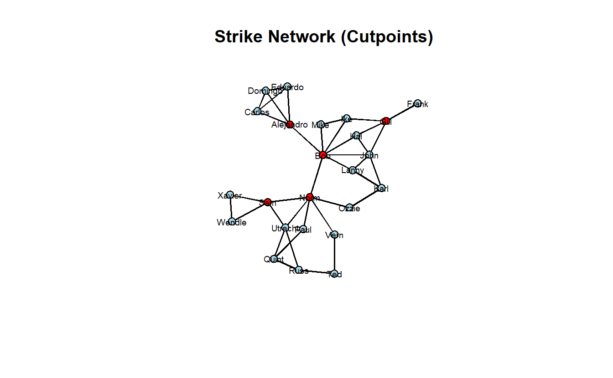

# Centrality and Brokerage in **statnet**


## Setup

Find and open your RStudio Project associated with this class. Begin by opening a new script. It's generally a good idea to place a header at the top of your scripts that tell you what the script does, its name, etc. 


```r
#################################################
# What: Centrality and Brokerage in statnet
# Created: 02.28.14
# Revised: 01.31.22
#################################################
```

If you have not set up your RStudio Project to clear the workspace on exit, your environment may contain the objects and functions from your prior session. To clear these before beginning use the following command.


```r
rm(list = ls())
```

Proceed to place the data required for this lab (`SouthFront_EL.csv`, `SouthFront_NL.csv`, `Strike.net`, and `Strikegroups.csv`) also inside your R Project folder. We have placed it in a sub folder titled `data` for organizational purposes; however, this is not necessary.

In this lab we will consider a handful of actor-level measures. Specifically, we will walk through the concepts of centrality and brokerage on two different networks.  

Centrality is one of SNA’s oldest concepts. When working with undirected data, a central actor can be someone who has numerous ties to other actors (degree), someone who is closer (in terms of path distance) to all other actors (closeness), someone who lies on the shortest path (geodesic) between any two actors (betweenness), or someone who has ties to other highly central actors (eigenvector). In some networks, the same actors will score high on all four measures. In others, they won’t. There are, of course, more than four measures of centrality.

For the centrality portion of this exercise, we'll look at a subset of South Front's YouTube network that we've collected using YouTube's open API. Specifically, we will examine subscription-based ties among accounts (note the names are a string of what appears to be random combinations of letters and numbers) within South Front's ego network (excluding South Front), which leaves us with a network of 310 subscriptions among 236 accounts. We will consider this network undirected for the "Centrality and Power" section, but directed for the "Centrality and Prestige" portion of this lab. 

Next, we will turn to measures that operationalize various aspects of brokerage. For that section, we will demonstrate the concept of brokerage by looking at a communication network of a wood-processing facility where workers rejected a new compensation package and eventually went on strike. Management then brought in an outside consultant to analyze the employee’s communication structure because it felt that information about the package was not being effectively communicated to all employees by the union negotiators. The outside consultant asked all employees to indicate, on a 5-point scale, the frequency that they discussed the strike with each of their colleagues, ranging from ‘almost never’ (less than once per week) to ‘very often’ (several times per day). The consultant used 3 as a cut-off value in order to identify a tie between two employees. If at least one of two persons indicated they discussed work with a frequency of three or more, a tie between them was included in the network. The data accompany the book, "Exploratory Social Network Analysis with Pajek," also published by Cambridge. Hence, we've shared the data with you as a Pajek file. 

## Libraries

Load the **statnet** library.


```r
library(statnet)
```

We will also be using other libraries in this exercise such as **DT**, **keyplayer**, **scales**, and **psych**. This might be the first time you use these, so you may need to install them.


```r
to_install <- c("DT","keyplayer", "psych", "scales")
install.packages(to_install)
```

If you have installed these, proceed to load **CINNA**, **keyplayer**, and **psych**. We will namespace functions from **DT**, and **scales** libraries (e.g., `scales::rescale()`) as these have functions that mask others from **statnet**.


```r
library(CINNA)
library(keyplayer)
library(psych)
```

## Load Data

We’ve stored South Front’s YouTube network as an edge list. Go ahead and import it with the `read.csv()` function, convert it to a `network` object, and visualize it. For now we will import it as an undirected network.


```r
# Read data
sf_el <- read.csv("data/SouthFront_EL.csv",
                  header = TRUE)

# Remove parallel edges
sf_el <- sf_el[!duplicated(cbind(pmin(sf_el$Source, sf_el$Target),
                                 pmax(sf_el$Source, sf_el$Target))), ]

# Create graph with edge list
sf_net <- as.network(sf_el,
                     directed = FALSE,
                     loops = FALSE,
                     multiple = FALSE,
                     matrix.type = "edgelist")

# Take a look at it
sf_net
```

```
 Network attributes:
  vertices = 236 
  directed = FALSE 
  hyper = FALSE 
  loops = FALSE 
  multiple = FALSE 
  bipartite = FALSE 
  total edges= 309 
    missing edges= 0 
    non-missing edges= 309 

 Vertex attribute names: 
    vertex.names 

 Edge attribute names: 
    Id Label timeset Type Weight 
```

Plot it.


```r
gplot(sf_net,
      gmode = "graph",
      mode = "kamadakawai",
      vertex.col = "lightblue",
      usearrows = FALSE,
      main = "South Front")
```


Next, load the `Stike.net` file and `Strikegroups.csv`, convert the relational data to an `network` object and add the node attributes to this graph. 


```r
# Read graph
strike_net <- as.network(
  x = read.paj(file = "data/Strike.net"),
  directed = FALSE
)

# Read attributes
strike_attrs <- read.csv("data/Strikegroups.csv",
                         col.names = c("Name", "Group"))

# Add vertex attributes
strike_net <- set.vertex.attribute(strike_net, 
                                 attrname = "Group",
                                 value = strike_attrs[["Group"]])

# Take a look at the graph object
strike_net
```

```
 Network attributes:
  vertices = 24 
  directed = TRUE 
  hyper = FALSE 
  loops = FALSE 
  multiple = FALSE 
  bipartite = FALSE 
  title = Strike 
  total edges= 76 
    missing edges= 0 
    non-missing edges= 76 

 Vertex attribute names: 
    Group vertex.names x y 

 Edge attribute names: 
    Strike 
```

Lastly, plot the new network.


```r
gplot(strike_net, 
      gmode = "graph", 
      mode = "kamadakawai",
      main = "Strike Network",
      label = network.vertex.names(strike_net),
      label.col = "black",
      label.cex = 0.6,
      label.pos = 5,
      vertex.col = strike_net %v% "Group")
```


## Centrality and Power (Undirected Networks)

### Degree, Closeness, Betweenness and Eigenvector Centrality

We will begin by calculating the four primary measures of centrality for undirected networks. Note that there are two closeness commands. The first is the standard measure of closeness (Freeman). Unfortunately, it doesn't handle infinite distances, so we show how to calculate an alternative (ARD) that does. Note that our use of both closeness scores is for demonstration purposes because our network is a connected graph with a single component. 


```r
# Add centrality metrics as vertex attributes
sf_net <- set.vertex.attribute(sf_net, attrname = "degree", 
                               value = degree(sf_net,
                                              gmode = "graph",
                                              ignore.eval = FALSE))
sf_net <- set.vertex.attribute(sf_net, attrname = "closeness", 
                               value = closeness(sf_net,
                                                 gmode = "graph"))
sf_net <- set.vertex.attribute(sf_net, attrname = "ard", 
                               value = closeness(sf_net,
                                                 gmode = "graph",
                                                 # the cmode="suminvundir" gives
                                                 # us ARD, which works with 
                                                 # disconnected networks. 
                                                 cmode = "suminvundir"))
sf_net <- set.vertex.attribute(sf_net, attrname = "betweenness", 
                               value = betweenness(sf_net,
                                                   gmode = "graph"))
sf_net <- set.vertex.attribute(sf_net, attrname = "eigenvector", 
                               value = evcent(sf_net,
                                              # use.eigen = TRUE is not always
                                              # necessary; we've included it
                                              # here to get more "robust"
                                              # results.
                                              use.eigen = FALSE))

# Take a look at the graph object
sf_net
```

```
 Network attributes:
  vertices = 236 
  directed = FALSE 
  hyper = FALSE 
  loops = FALSE 
  multiple = FALSE 
  bipartite = FALSE 
  total edges= 309 
    missing edges= 0 
    non-missing edges= 309 

 Vertex attribute names: 
    ard betweenness closeness degree eigenvector vertex.names 

 Edge attribute names: 
    Id Label timeset Type Weight 
```

### Correlations

Let's create a `data.frame` with vertex centralities. 


```r
centrality <- data.frame("Channel" = network.vertex.names(sf_net),
                         "Degree" = sf_net %v% "degree",
                         "Closeness (Freeman)" = sf_net %v% "closeness",
                         "Closeness (ARD)" = sf_net %v% "ard",
                         "Betweenness" = sf_net %v% "betweenness",
                         "Eigenvector" = sf_net %v% "eigenvector")

head(centrality, n = 5)
```

```
                   Channel Degree Closeness..Freeman. Closeness..ARD.
1 UCYE61Gy3RxiI2hSdCmAgP9w      1           0.2952261       0.3251773
2 UCFpuO2wt_3WSrk-QG7VjUhQ      1           0.2376138       0.2522695
3 UCqxZhJewxqhB4cNsxJFjIhg      1           0.2952261       0.3251773
4 UCWNbidLi4FXBd83ixoB1v-A      1           0.2952261       0.3251773
5 UCShSHheWVd42CdiVAYn-9xQ      1           0.2516060       0.2702837
  Betweenness Eigenvector
1           0 0.062031013
2           0 0.002549735
3           0 0.062031013
4           0 0.062031013
5           0 0.006221302
```

To run a correlation between variables, use the `cor()` function. Note our `data.frame` (i.e., `centrality`) has six columns, including the first column containing channel names, which means we want to correlate the columns containing centrality scores only (i.e., columns 2-6).


```r
cor(centrality[, 2:6])
```

```
                       Degree Closeness..Freeman. Closeness..ARD. Betweenness
Degree              1.0000000           0.4941497       0.5824820   0.9863708
Closeness..Freeman. 0.4941497           1.0000000       0.9908909   0.5346233
Closeness..ARD.     0.5824820           0.9908909       1.0000000   0.6192383
Betweenness         0.9863708           0.5346233       0.6192383   1.0000000
Eigenvector         0.7558708           0.8021207       0.8420753   0.7965928
                    Eigenvector
Degree                0.7558708
Closeness..Freeman.   0.8021207
Closeness..ARD.       0.8420753
Betweenness           0.7965928
Eigenvector           1.0000000
```


Note that, for the most part, the centrality measures correlate highly with degree, especially betweenness. The two closeness measures correlate very high with each other as well, which is a good sign that they're tapping into the same phenomenon. 

Here's a really nice correlation function (i.e., `pairs.panels()`) associated with the **psych** package, which you may need to install first.


```r
pairs.panels(centrality[, 2:6])
```


Let's plot the network where we vary node size by the centrality measures; note that we've rescaled them so that the nodes don't get overwhelmingly big or way too small. We've turned off the labels, which are YouTube Channel IDs (i.e., really long), so you can see the results clearly.


```r
par(mfrow = c(2, 3))

# Save the coordinates
coords <- gplot.layout.kamadakawai(sf_net,
                                   layout.par = NULL)

# Plot graph with rescaled nodes
gplot(sf_net,
      main = "South Front Degree",
      coord = coords,
      displaylabels = FALSE, 
      vertex.col = "lightblue",
      vertex.cex = scales::rescale(sf_net %v% "degree", to = c(1, 5)),
      usearrows = FALSE)

gplot(sf_net,
      main = "South Front Closeness",
      coord = coords,
      displaylabels = FALSE, 
      vertex.col = "lightblue",
      vertex.cex = scales::rescale(sf_net %v% "closeness", to = c(1, 5)),
      usearrows = FALSE)

gplot(sf_net,
      main = "South Front ARD",
      coord = coords,
      displaylabels = FALSE, 
      vertex.col = "lightblue",
      vertex.cex = scales::rescale(sf_net %v% "ard", to = c(1, 5)),
      usearrows = FALSE)

gplot(sf_net,
      main = "South Front Betweenness",
      coord = coords,
      displaylabels = FALSE, 
      vertex.col = "lightblue",
      vertex.cex = scales::rescale(sf_net %v% "betweenness", to = c(1, 5)),
      usearrows = FALSE)

gplot(sf_net,
      main = "South Front Eigenvector",
      coord = coords,
      displaylabels = FALSE, 
      vertex.col = "lightblue",
      vertex.cex = scales::rescale(sf_net %v% "eigenvector", to = c(1, 5)),
      usearrows = FALSE)
```


### Interactive Table 

The R package **DT** provides an R interface to the JavaScript library **DataTables**. R data objects (matrices or data frames) can be displayed as HTML table widgets. The interactive widgets provide filtering, pagination, sorting, and many other features for the tables. 

We will namespace the `datatable()` function from library and provide it the `centrality` node table we created for the `sf_net` graph.


```r
DT::datatable(centrality, rownames = FALSE)
```

```{=html}
<div id="htmlwidget-d88c596ea1f469bf68e6" style="width:100%;height:auto;" class="datatables html-widget"></div>
<script type="application/json" data-for="htmlwidget-d88c596ea1f469bf68e6">{"x":{"filter":"none","vertical":false,"data":[["UCYE61Gy3RxiI2hSdCmAgP9w","UCFpuO2wt_3WSrk-QG7VjUhQ","UCqxZhJewxqhB4cNsxJFjIhg","UCWNbidLi4FXBd83ixoB1v-A","UCShSHheWVd42CdiVAYn-9xQ","UCNMbegBD9OjH4Eza8vVjBMg","UC8zZkogm0hU7_zifdxSQa0Q","UCm5GjhNnQUcMNgcO1lC0vTQ","UCRVDpYNhA8zvVmBee_ium3g","UC4W-mNkE0HgQhRBVusdCpfw","UCWGhvr5OE7HbSKcAhmSnYNw","UCelqGXobAzn0rfSp5hpDPfQ","UCdgJ8gL9IigpRh8xl6ZZ0_w","UCZDOedq4gQwSnLA6QXlbHdw","UCthNYjMhjFNXmu-HbLudtvA","UCMihusTAHd_vAKy0YRdTLXw","UC3BeH4UKQPzncObGXSgJL5w","UCv2_N-dyQiiKfiPNVvbtBJA","UC5EnUTa6Q2IWCABp2xNi5UA","UCBJUyJgNfSkY0TCvcURcZag","UCZsP1tn03b-Av8hjiJJf32w","UCOgMksNH7ztex_Xby9qXy4w","UC897G2LUhbx2oSF9h9qR7Sg","UCtVIzeZ7tLf5jvF6OxHXEDQ","UCfNKAwjD99kAPEdbWDM8kLA","UC0E44au0qveSHeUoOGwlREA","UCuDQ9a-jJVe2b5gg1NsP0jQ","UCfBsQ_id6HelLXpWjfI4gFA","UCCDiY6EjVTrNiutQslK_7lw","UCa5zQvJmCrVJQ7TfrDexflQ","UC04E6SnS3YeaOaCJSnNNSOg","UCmThYr8XvjXSqwx5X-E2wWw","UCY_mLaf2Adyu-rwFijUihBQ","UCPpZ50cvt3KK7dMzp4cFDng","UCCfxRqU6rUDHnCsxy9FMUnw","UChqlS8Dkcv1HMUR1vL_NH0Q","UCnPfJ1MPsdCt-WRElEygC4Q","UCfk_OgQMBof-qng8JcrVKuw","UCGrPYdPCEF-Va2x3jaMB1Xw","UCPIS6r28G-7nI1sXqC7FNmw","UChG7qVia7efMjvXWZ55nmfw","UCNMUJJJmn89JHygdMd8zZTQ","UCqz55a-iS-t4wm-BCRFhIrg","UCgqYUzvsBr8_tU62_zI45mA","UCn57ddYcpJ-G_rGjGBBdKjw","UCNVgvt4-Ne_cnn1kSNKGR4A","UCCR07Xby6w8AC795hXFa1Dg","UCrlxZ06LJ4Jkfkj1D_vO5EA","UCiSwAwgtZtPyyZCYSQoIBdA","UC49xYTS6r9bDAyJy9T0UEeg","UCqlIbZ93QfuWbyhIuNwLQPA","UCOZoYc_6JH89xXzrfPdd-1A","UC5PSRs7JJqFMdy81LFS6JBw","UCeRASiVXda05jz0I05xt1Tw","UCQkF3sOfwOzPs0M5yLc0x5Q","UCHNfxhCa28QImlfvd1igvig","UC2Jdm9UcHeX60OYHvXEer-w","UC5t7RGgV32hQgnr-DnV2zNg","UCmLqckDbQbNi8ytgtlUi9uQ","UCJ29vixKPSlgjdJLVZDg_mA","UCyt6ZazPQCr1w7uuevOQJ1w","UCVqVpmi5TBN3FOwZJVSnmyg","UCNhvBEeOjL36aJ3-EAP1nWg","UCb226CJ6zTSEYyY_c30zhFg","UCG3_FK6sqAG4DHWkLTADXkg","UCNOvflWYdU0MJBykCiDxGbw","UCRtjzoYKEpgO0Ur3MHowPdA","UCM1ZNcsj2YQxJKZdslgFScA","UCAYcH2EZRVBPGcJCiE4nztA","UCqec0kOaROB007cEpbaLTYg","UCGm2ERwu1QgXWRW5HvYuERg","UCmgz5S434m6grjihzlSToPQ","UCEyPYJY7iL73Jqc7BTgc1Dg","UCZLbvNyB3_NKI9cGJUhC8Pg","UCifwWXePTd1r8gqCHgrcGJw","UCbdkc6x2PwmBI4GiJ2-quXw","UCi6yEmkSAUEELaOiWcsj-mw","UCoTzlJ27FbJbYtzkn_cVp9A","UCcYX9pvnAUeFQSkdAy9zZJA","UCAzR6r31ES1_5p1VHfMpKTw","UC-OxiYeRaESUK3cjtf35N5A","UC9ugTvrBt43LQkM2OolvcHg","UCUZobs9QZaKGmES6zODvo8A","UCXPF5AYb9FyDgrg2MOoEsvQ","UCLX_EOZN70MfRqO0g9GFwjg","UCIOkTPW1LIbUj-hrCE81AjA","UCjG5DURCFdfdpuGK_oER2UQ","UCVdBvGnmfgmRJlU1SQLlDMw","UCd7m1Kjp1YAvggXse8is_hw","UCK6fYayqlLHU5OXaoPaQrug","UC0edtCnSIOXT_HuP07cdivg","UCywaJYYCNS1ujGwdCQMRrpQ","UCTiK7y8nz_bx4ho5Cw7cfkQ","UC8cRXCK2QEkwBEMsCLAE7XQ","UCsHdwUKr4yLOs_TjI9vVIyw","UCDjOWxepDsatTJYHVpxHnUg","UC2LYsa3UvQwOfE_UaeR97IQ","UCUQ2W76VPtaPfSnZ77T2kFg","UCMUVFCauiapAD6hm4Dgq1CA","UCozuThWWWV3ssHwEI1pleNA","UCUX2LLWHkFZrBQ9gA4WmbZw","UCp1uJOsfg3fq4hNGqYAtBWA","UCH8V61RkrF99YrbIbx9pBKQ","UCOKUBJ50Wkv98LQmfXBGjEA","UCUV4w40IOZb-JZLIZ3pT0Zg","UCFhQtxFueClVufRtsFVBIsQ","UCYftZQanGxCv8KM0BO_2uxw","UCILrsx8bdSD34FvSIC_qoCA","UCaJeoI6oepFnyQkP0h2ngHg","UCJksBWCD1c2mLrLS2TXj14w","UCoYlSBiJ6EPXHCrOUJ5HTYw","UCvmve6qe2qpnho989Qw-4lg","UCGDVgNdHINX7X3ZaiL1p1yw","UCWoZ2xMeLQf2UMZOA7mpD8A","UCDA0kTKxTPI9KzfmxMpoRFA","UClYmz-lY7nCeAdorU9roAHQ","UCGtBFfGBnYgLqiLhbYiK8_Q","UC-7gjx7fVJHgxyzhhpo36gg","UCcJvUOWmkU_pt68SOQ-q1tg","UCkrU5Xl15ezatdnnvgtjj6A","UCNXPoa1y7S3UOBDJeGbb8nA","UCEV-6jQhYIJpnYEYmiDCw3w","UCIBS40e4HtU6TSqneQGac3g","UCxTSG0rzzGTIzQWGqCiaJgg","UCQhCYMG_lUmZbMJ8e8KtojA","UCXoPri-Nom-U13rgHoDX58A","UCIaH6pLZyUsBUXuYg0yWc1g","UCnVNxOYlfkyvmdHeSif9xog","UCtqytBKHsXj4WSyUiSBdY7Q","UCIaVBIAmXOXZjsR6cW9Fl7Q","UChENffr08FIKf-9ZFf2R2nQ","UCEnwq4vwiWuq_15kkEWgxVw","UCU4GLwSst3ADUwF3yxU9KLw","UCXA0B7hF3w1RtWWngbfXhKw","UCCr-efraf1a6kJYSfk4hEJw","UCkzVLpb-q9PSGuGS_JseSuQ","UCVMZcF6EYilk4OeiBc3pFkA","UC9t7Z-Nj2ivn4CLjNlql_Zg","UCIhG-nBmr2cY56zx5eYza_Q","UCM4kqt2ysXriXBuVXEyM8kA","UCKN-Sj-WC20GC_J9C2AVbBw","UC6ZyJck124zdQSbBG6Jvmvg","UCKA8QwWgIBFBmlQANI3GUMg","UCH8TETd1IZw6IG5iBjAv8Nw","UCPRAUoP6BJfaqmmFAGMVglw","UCHdyRyUrVQks3Y6pnMUwckw","UC_3IK1GuMKm1erzMzH-a9yA","UCMgSpFZHf5L23bEldDYKK4A","UCmFuO4UJudznYS4MlS5wl1A","UC-Hy-4BEUIX7hDeVaODcIfg","UCn4UDdcn3Gmbsusa5AyGFMA","UCiHpnJOdAYnIQSUwYDa2E1w","UCHtO2Iq7C1bZ7sdWcB0U2yg","UCV95IGa1LpyXG5zS-mgKD0Q","UCTjNGGhgDagrkWO4SXa5F5A","UCHxJfblqf3iyxTTd3GXtRXA","UCQleiDKZyZfsPZrArWDmI0A","UCBvxTye7EGlu3o3S58vIQeg","UCq2q83rsDc91CTBPMusuKWQ","UCySNnaJEsLYBlg4gqCAq8uw","UCavyAKZP-Wr5SSc3zmqVenw","UCCgx0sNaSSJ-jjYDG6RqkPA","UCYCDXs0Nc0HtTGeXKuc6l4g","UCAx27vcos1TkPty-FF0zVfQ","UC6p8X60vwIAohxAEHtlxH9g","UCp8wAqgF6VlvvMIWVI6xegg","UCCdxizrxUZ55AHZUGhdzkGg","UC4Ex8sqdisdLF-jj4d_Od4Q","UCaMyORedtLcmQJC6g_2OZzg","UCVcAb1Kml9b5GRB0Vho86-w","UCuRDFWQap-eSoC3v8zlIrkw","UC4mhsWgiD0PZ9DZiZv7HdMw","UCX-qFmU6tkSU7WS5nr2HrCA","UCai3CeohSSHbJwiG8yyFSyg","UCcH2YymKTzXQ6SQhucvZmMw","UC_KpnE0P8hSzRS24QAHcrMA","UCmpwokS_qioWGXJ22qYBaZg","UCOl1O_9KFjfl2zgQFt2aODg","UCKjFMX4pQBbx_Vh7q-jQR-A","UCNdJmFsqZ2SmTaFiMbgOQ9w","UCiRzcqN27rfcmeFdFvAG0Jw","UC2vjyLgENRY_ZQ1sI91VyyQ","UCPJu-iu1TQDhS3Tw8urydOA","UCv-T1WeKQxQ8zsSzl-gHGSw","UCjMvLtSvkpk5m4u6T-ye1rw","UC7subBl2gbz5H36m-zbp8LA","UCuDGSixG6umA4o49wixLkjQ","UCGnb7vX5hLroe5Jl61Dt0FA","UCqDZ5oAFZomuaDRnsqh1Q9w","UCc4VkAp7fPg-3QPudsn5XZA","UC1r_FsYOsPrU-kO_JHRpfdw","UCA--dcq7LnlhvWtYhffBoow","UCUl5yJaPdlqJ--c1gZK7RGg","UC9UV-zZuV_r45n0Twtj4DOg","UCp_UQ3x8-vFmacoERpZDsdQ","UC8wmpNa5g9f45o19hBQcFTQ","UCjocz5zz_0RIfifUlNt4ziA","UCSUBEu3CwiXUD2YByfSEJOQ","UC9eaJnY3wFRWF1GSphv05ZQ","UC_8dI_PPRY2HbDfYtAbEKaw","UCIMm99MI5FLycLIL9PY97Mg","UCNAUR9pArgDCA-Mm0MFCO6g","UCnWzRN18nWMDM1YRCKGbr3A","UCXsiSnw37krBovN_gQ2cMkw","UCPamPqyE5ik_Al8ig3lw--g","UClS4wJdCusfUyp2qnZx40AQ","UCpkZ7xO1ceEFEk3Bs7x4WhQ","UCPJiczyFyMBET_WLishFmNw","UCxRpmvyUAsaN1w465S39QnQ","UCf3ckYZL0z22TYs5ra6YvDQ","UCl1vPakchzspeKGvMtty-DA","UCrnjUlwFWJgzs0-2fJy7GwA","UC-foLXdvsD24GK3eVPQRc4A","UC66t52SmEJOi2ewDYMsM2Rw","UCmX9MLxlU2htc1gZcEyGBBA","UCLjzLVqoVZ5Wvfdqfmp19dA","UCWpx-5KIHwpXE7Y0z2rA_Sw","UCt23v8eAFgT1ARfCOyGRHsw","UCz3QHIofjkRZx4yyWSdO6_w","UClgA2GsO7o-_xh4HgUXGX-g","UClvD6c1VI75QZWJjA_yiWhg","UC2C_jShtL725hvbm1arSV9w","UCLoNQH9RCndfUGOb2f7E1Ew","UCFWjEwhX6cSAKBQ28pufG3w","UCK09g6gYGMvU-0x1VCF1hgA","UCwnKziETDbHJtx78nIkfYug","UCbWJBeGBPPealdWVLzbVU7g","UCfa492nu0Ir7zEmqR9hQ18Q","UCAVFHtGR7-MJMKWX_genw_Q","UCRds47MZ1Ng7KCLseg2TkWA","UCQGqX5Ndpm4snE0NTjyOJnA","UCD8bmW4A7eYzHrW7sXwsqwQ","UCagTsJE66BwJkBfwU9izyaA","UC7w6MNvnZJ0DKU41wa7yA8w","UCeNbszrEiBC5Nv53Cr5UViw","UCklesbq7pc_XIaCvpZvG4QQ"],[1,1,1,1,1,1,1,2,4,2,3,2,3,1,1,2,2,1,1,1,1,1,2,1,1,1,1,5,3,3,1,2,1,1,3,1,1,1,1,1,1,1,2,2,4,1,1,1,2,1,1,1,1,1,1,1,1,1,2,1,1,1,1,1,2,1,1,1,2,2,1,1,2,3,1,1,1,1,2,1,1,1,1,1,1,1,1,1,3,1,1,2,1,1,1,1,2,2,1,1,1,1,1,1,1,1,1,2,2,1,1,1,1,1,1,1,1,1,1,3,1,1,1,1,1,1,2,2,2,1,2,1,2,2,3,1,1,2,2,2,2,1,1,1,1,1,2,1,1,4,1,1,1,3,2,3,1,1,1,1,3,1,2,1,1,1,1,1,2,1,1,1,1,1,3,4,2,1,2,1,2,1,1,1,1,1,1,1,1,1,1,2,1,1,2,2,1,1,1,3,1,1,1,1,1,1,1,1,1,1,2,2,2,1,1,1,2,2,1,2,63,13,23,32,33,56,1,6,1,24,23,16,2,5,8,1],[0.295226130653266,0.237613751263903,0.295226130653266,0.295226130653266,0.251605995717345,0.263452914798206,0.251875669882101,0.335235378031384,0.298223350253807,0.258810572687225,0.287990196078431,0.301668806161746,0.315436241610738,0.280764635603345,0.251875669882101,0.269186712485682,0.30440414507772,0.248414376321353,0.251605995717345,0.251875669882101,0.263452914798206,0.295226130653266,0.294855708908407,0.237613751263903,0.295226130653266,0.280764635603345,0.280764635603345,0.314171122994652,0.353915662650602,0.312916111850865,0.295226130653266,0.274212368728121,0.251605995717345,0.237613751263903,0.335714285714286,0.241769547325103,0.295226130653266,0.263452914798206,0.280764635603345,0.280764635603345,0.241769547325103,0.295226130653266,0.318428184281843,0.30440414507772,0.326388888888889,0.263452914798206,0.263452914798206,0.280764635603345,0.30440414507772,0.280764635603345,0.295226130653266,0.280764635603345,0.295226130653266,0.251875669882101,0.251605995717345,0.295226130653266,0.251605995717345,0.295226130653266,0.258810572687225,0.251875669882101,0.248414376321353,0.280764635603345,0.239064089521872,0.280764635603345,0.335235378031384,0.239064089521872,0.248414376321353,0.251605995717345,0.3125,0.298602287166455,0.241769547325103,0.237613751263903,0.335235378031384,0.272305909617613,0.251875669882101,0.263452914798206,0.295226130653266,0.295226130653266,0.277122641509434,0.218808193668529,0.295226130653266,0.237613751263903,0.295226130653266,0.251875669882101,0.19453642384106,0.19453642384106,0.295226130653266,0.251875669882101,0.317997293640054,0.241769547325103,0.280764635603345,0.274212368728121,0.251605995717345,0.241769547325103,0.251605995717345,0.263452914798206,0.273892773892774,0.303225806451613,0.218808193668529,0.295226130653266,0.19453642384106,0.280764635603345,0.280764635603345,0.280764635603345,0.193574958813839,0.280764635603345,0.251605995717345,0.258810572687225,0.30440414507772,0.251605995717345,0.263452914798206,0.295226130653266,0.251605995717345,0.251875669882101,0.248414376321353,0.251875669882101,0.280764635603345,0.241769547325103,0.239064089521872,0.313751668891856,0.241769547325103,0.280764635603345,0.280764635603345,0.280764635603345,0.295226130653266,0.280764635603345,0.286236297198538,0.277777777777778,0.249734325185972,0.280764635603345,0.277122641509434,0.251875669882101,0.303225806451613,0.318860244233379,0.317997293640054,0.280764635603345,0.295226130653266,0.258810572687225,0.258810572687225,0.271990740740741,0.3125,0.239064089521872,0.239064089521872,0.295226130653266,0.241769547325103,0.248414376321353,0.289052890528905,0.295226130653266,0.263452914798206,0.34711964549483,0.239064089521872,0.251875669882101,0.251875669882101,0.3125,0.279097387173397,0.325484764542936,0.295226130653266,0.295226130653266,0.280764635603345,0.237613751263903,0.337159253945481,0.295226130653266,0.277122641509434,0.241769547325103,0.239064089521872,0.295226130653266,0.280764635603345,0.280764635603345,0.286236297198538,0.223596574690771,0.280764635603345,0.251875669882101,0.241769547325103,0.295226130653266,0.325484764542936,0.326388888888889,0.318428184281843,0.295226130653266,0.277122641509434,0.263452914798206,0.335235378031384,0.241769547325103,0.251875669882101,0.251875669882101,0.295226130653266,0.237613751263903,0.251605995717345,0.295226130653266,0.280764635603345,0.295226130653266,0.295226130653266,0.318860244233379,0.295226130653266,0.280764635603345,0.250533049040512,0.27614571092832,0.251875669882101,0.248414376321353,0.295226130653266,0.325034578146611,0.251875669882101,0.280764635603345,0.218808193668529,0.295226130653266,0.263452914798206,0.295226130653266,0.251605995717345,0.218808193668529,0.251605995717345,0.239064089521872,0.29559748427673,0.335235378031384,0.318428184281843,0.280764635603345,0.239064089521872,0.263452914798206,0.335235378031384,0.318860244233379,0.295226130653266,0.311671087533156,0.418149466192171,0.311258278145695,0.335714285714286,0.357142857142857,0.336194563662375,0.38971807628524,0.229941291585127,0.287637698898409,0.229941291585127,0.318428184281843,0.313751668891856,0.330056179775281,0.239795918367347,0.241273100616016,0.279761904761905,0.238336713995943],[0.325177304964539,0.252269503546099,0.325177304964539,0.325177304964539,0.270283687943262,0.284326241134752,0.277730496453901,0.377659574468085,0.334751773049645,0.289148936170213,0.326595744680851,0.340992907801418,0.361347517730496,0.311276595744681,0.277730496453901,0.292695035460993,0.345390070921986,0.263617021276596,0.270283687943262,0.277730496453901,0.284326241134752,0.325177304964539,0.330496453900709,0.252269503546099,0.325177304964539,0.311276595744681,0.311276595744681,0.357801418439716,0.393617021276596,0.341347517730496,0.325177304964539,0.309503546099291,0.270283687943262,0.252269503546099,0.379787234042553,0.264468085106383,0.325177304964539,0.284326241134752,0.311276595744681,0.311276595744681,0.264468085106383,0.325177304964539,0.357801418439716,0.334893617021277,0.370921985815603,0.284326241134752,0.284326241134752,0.311276595744681,0.345390070921986,0.311276595744681,0.325177304964539,0.311276595744681,0.325177304964539,0.277730496453901,0.270283687943262,0.325177304964539,0.270283687943262,0.325177304964539,0.289148936170213,0.277730496453901,0.263617021276596,0.311276595744681,0.261347517730496,0.311276595744681,0.377659574468085,0.261347517730496,0.263617021276596,0.270283687943262,0.350354609929078,0.337234042553192,0.264468085106383,0.252269503546099,0.377659574468085,0.306666666666667,0.277730496453901,0.284326241134752,0.325177304964539,0.325177304964539,0.308297872340426,0.234184397163121,0.325177304964539,0.252269503546099,0.325177304964539,0.277730496453901,0.20822695035461,0.20822695035461,0.325177304964539,0.277730496453901,0.364539007092199,0.264468085106383,0.311276595744681,0.301205673758865,0.270283687943262,0.264468085106383,0.270283687943262,0.284326241134752,0.298652482269504,0.343617021276596,0.234184397163121,0.325177304964539,0.20822695035461,0.311276595744681,0.311276595744681,0.311276595744681,0.205035460992908,0.311276595744681,0.270283687943262,0.289148936170213,0.345390070921986,0.270283687943262,0.284326241134752,0.325177304964539,0.270283687943262,0.277730496453901,0.263617021276596,0.277730496453901,0.311276595744681,0.264468085106383,0.261347517730496,0.355390070921986,0.264468085106383,0.311276595744681,0.311276595744681,0.311276595744681,0.325177304964539,0.311276595744681,0.320354609929078,0.310567375886525,0.26886524822695,0.311276595744681,0.304468085106383,0.277730496453901,0.343617021276596,0.358510638297872,0.360709219858156,0.311276595744681,0.325177304964539,0.289148936170213,0.289148936170213,0.295957446808511,0.350354609929078,0.261347517730496,0.261347517730496,0.325177304964539,0.264468085106383,0.263617021276596,0.323404255319149,0.325177304964539,0.284326241134752,0.393971631205674,0.261347517730496,0.277730496453901,0.277730496453901,0.352127659574468,0.310992907801418,0.373758865248227,0.325177304964539,0.325177304964539,0.311276595744681,0.252269503546099,0.381560283687943,0.325177304964539,0.304468085106383,0.264468085106383,0.261347517730496,0.325177304964539,0.311276595744681,0.311276595744681,0.320354609929078,0.237872340425532,0.311276595744681,0.277730496453901,0.264468085106383,0.325177304964539,0.373758865248227,0.370921985815603,0.357801418439716,0.325177304964539,0.308297872340426,0.284326241134752,0.377659574468085,0.264468085106383,0.277730496453901,0.277730496453901,0.325177304964539,0.252269503546099,0.270283687943262,0.325177304964539,0.311276595744681,0.325177304964539,0.325177304964539,0.358510638297872,0.325177304964539,0.311276595744681,0.269645390070922,0.306241134751773,0.277730496453901,0.263617021276596,0.325177304964539,0.367730496453901,0.277730496453901,0.311276595744681,0.234184397163121,0.325177304964539,0.284326241134752,0.325177304964539,0.270283687943262,0.234184397163121,0.270283687943262,0.261347517730496,0.335390070921986,0.377659574468085,0.357801418439716,0.311276595744681,0.261347517730496,0.284326241134752,0.377659574468085,0.358510638297872,0.325177304964539,0.349290780141844,0.524113475177305,0.348723404255319,0.38936170212766,0.422198581560284,0.412765957446808,0.492765957446809,0.245957446808511,0.318510638297872,0.245957446808511,0.381347517730496,0.374893617021277,0.371063829787234,0.26063829787234,0.269148936170213,0.314113475177305,0.255673758865248],[0,0,0,0,0,0,0,258.946787596057,508.097630856029,42.8243691276016,336.691434340287,657.680821821194,976.080976323753,0,0,254.044167091502,232.177851269856,0,0,0,0,0,202.417152927054,0,0,0,0,1843.03593011449,648.946787596057,449.99400597126,0,425.114918471593,0,0,326.946787596057,0,0,0,0,0,0,0,287.637571250545,0,795.802291412632,0,0,0,232.177851269856,0,0,0,0,0,0,0,0,0,42.8243691276016,0,0,0,0,0,258.946787596057,0,0,0,547.069599127819,290.645658189127,0,0,258.946787596057,325.121470571955,0,0,0,0,126.77535980135,0,0,0,0,0,0,0,0,0,562.196162124917,0,0,178.075736014696,0,0,0,0,286.040728217852,159.079841993336,0,0,0,0,0,0,0,0,0,42.8243691276016,232.177851269856,0,0,0,0,0,0,0,0,0,0,655.065520327074,0,0,0,0,0,0,197.781752671279,356.542463791432,62.4093549816107,0,128.020801659717,0,159.079841993336,398.622549284689,489.517796580107,0,0,42.8243691276016,42.8243691276016,162.002709210892,547.069599127819,0,0,0,0,0,413.870591858719,0,0,1892.56810082244,0,0,0,537.41925879639,167.091705411335,589.039445934471,0,0,0,0,448.132028572143,0,128.020801659717,0,0,0,0,0,197.781752671279,0,0,0,0,0,589.039445934471,795.802291412632,287.637571250545,0,126.77535980135,0,258.946787596057,0,0,0,0,0,0,0,0,0,0,398.622549284689,0,0,129.369410318924,330.873115898999,0,0,0,1015.89371447302,0,0,0,0,0,0,0,0,0,0,276.340960330231,258.946787596057,287.637571250545,0,0,0,258.946787596057,398.622549284689,0,305.518228568035,12057.1719871239,2039.88809245687,3747.00791280639,4969.13955032422,5087.36793029522,9305.12716414518,0,437.570076676723,0,3440.98253082117,3065.21727815334,2412.24733709047,234,731.601563477173,1071.67857662936,0],[0.062031013074595,0.00254973547729508,0.062031013074595,0.062031013074595,0.00622130232675435,0.01613690789932,0.0141877391384262,0.108562545519056,0.0698562236125978,0.0182329753498747,0.0343698832491947,0.055342335776102,0.0621750067894499,0.0465315324444614,0.0141877391384262,0.00877103780404942,0.0607192715828877,0.00509787889184786,0.00622130232675435,0.0141877391384262,0.01613690789932,0.062031013074595,0.0516294113363093,0.00254973547729508,0.062031013074595,0.0465315324444614,0.0465315324444614,0.0752455378671876,0.112028291136314,0.0297766172396953,0.062031013074595,0.0204090414651806,0.00622130232675435,0.00254973547729508,0.115543689742527,0.00881080333164053,0.062031013074595,0.01613690789932,0.0465315324444614,0.0465315324444614,0.00881080333164053,0.062031013074595,0.078167920973915,0.0599798376409654,0.0861965165411398,0.01613690789932,0.01613690789932,0.0465315324444614,0.0607192715828877,0.0465315324444614,0.062031013074595,0.0465315324444614,0.062031013074595,0.0141877391384262,0.00622130232675435,0.062031013074595,0.00622130232675435,0.062031013074595,0.0182329753498747,0.0141877391384262,0.00509787889184786,0.0465315324444614,0.00942217201823415,0.0465315324444614,0.108562545519056,0.00942217201823415,0.00509787889184786,0.00622130232675435,0.0682523154013493,0.0527528347712158,0.00881080333164053,0.00254973547729508,0.108562545519056,0.0188955362488066,0.0141877391384262,0.01613690789932,0.062031013074595,0.062031013074595,0.0255590799175541,0.0021580616330853,0.062031013074595,0.00254973547729508,0.062031013074595,0.0141877391384262,0.00115076885181061,0.00115076885181061,0.062031013074595,0.0141877391384262,0.0720906123620156,0.00881080333164053,0.0465315324444614,0.0186866433766151,0.00622130232675435,0.00881080333164053,0.00622130232675435,0.01613690789932,0.0139086822234884,0.0626684403437814,0.0021580616330853,0.062031013074595,0.00115076885181061,0.0465315324444614,0.0465315324444614,0.0465315324444614,0.00103334893226401,0.0465315324444614,0.00622130232675435,0.0182329753498747,0.0607192715828877,0.00622130232675435,0.01613690789932,0.062031013074595,0.00622130232675435,0.0141877391384262,0.00509787889184786,0.0141877391384262,0.0465315324444614,0.00881080333164053,0.00942217201823415,0.0578507136630636,0.00881080333164053,0.0465315324444614,0.0465315324444614,0.0465315324444614,0.062031013074595,0.0465315324444614,0.0303246470377462,0.0223582102260743,0.00470779711038038,0.0465315324444614,0.0212347867911679,0.0141877391384262,0.0626684403437814,0.0762187522130212,0.0677663192356293,0.0465315324444614,0.062031013074595,0.0182329753498747,0.0182329753498747,0.0113191812186022,0.0682523154013493,0.00942217201823415,0.00942217201823415,0.062031013074595,0.00881080333164053,0.00509787889184786,0.0486895940775467,0.062031013074595,0.01613690789932,0.0895284597828506,0.00942217201823415,0.0141877391384262,0.0141877391384262,0.0718146889169249,0.0249477112309605,0.0768561794822077,0.062031013074595,0.062031013074595,0.0465315324444614,0.00254973547729508,0.114495073635727,0.062031013074595,0.0212347867911679,0.00881080333164053,0.00942217201823415,0.062031013074595,0.0465315324444614,0.0465315324444614,0.0303246470377462,0.00593252811667015,0.0465315324444614,0.0141877391384262,0.00881080333164053,0.062031013074595,0.0768561794822077,0.0861965165411398,0.078167920973915,0.062031013074595,0.0255590799175541,0.01613690789932,0.108562545519056,0.00881080333164053,0.0141877391384262,0.0141877391384262,0.062031013074595,0.00254973547729508,0.00622130232675435,0.062031013074595,0.0465315324444614,0.062031013074595,0.062031013074595,0.0762187522130212,0.062031013074595,0.0465315324444614,0.00624864774365847,0.0192856180302741,0.0141877391384262,0.00509787889184786,0.062031013074595,0.0783768138461065,0.0141877391384262,0.0465315324444614,0.0021580616330853,0.062031013074595,0.01613690789932,0.062031013074595,0.00622130232675435,0.0021580616330853,0.00622130232675435,0.00942217201823415,0.0559537044626956,0.108562545519056,0.078167920973915,0.0465315324444614,0.00942217201823415,0.01613690789932,0.108562545519056,0.0762187522130212,0.062031013074595,0.0714531850928291,0.532951329238317,0.0219065406875318,0.053451510466993,0.138643334816929,0.121896678095237,0.399784572885839,0.00813067175819739,0.0509704515340129,0.00813067175819739,0.0756997043013136,0.0809523954637344,0.0437994028638043,0.00887821526234294,0.00988705098982315,0.018541399840527,0.00835862050371823]],"container":"<table class=\"display\">\n  <thead>\n    <tr>\n      <th>Channel<\/th>\n      <th>Degree<\/th>\n      <th>Closeness..Freeman.<\/th>\n      <th>Closeness..ARD.<\/th>\n      <th>Betweenness<\/th>\n      <th>Eigenvector<\/th>\n    <\/tr>\n  <\/thead>\n<\/table>","options":{"columnDefs":[{"className":"dt-right","targets":[1,2,3,4,5]}],"order":[],"autoWidth":false,"orderClasses":false}},"evals":[],"jsHooks":[]}</script>
```

Modify the numeric variables, rounding them to 3 decimal places.


```r
centrality <- as.data.frame(
  sapply(names(centrality), function(s) {
    centrality[[s]] <- ifelse(is.numeric(centrality[[s]]),
                              yes = round(centrality[s], digits = 3),
                              no = centrality[s])
    })
  )
```

Take a look at the table:


```r
DT::datatable(centrality, rownames = FALSE)
```

```{=html}
<div id="htmlwidget-196e2c0f77c0a71ab104" style="width:100%;height:auto;" class="datatables html-widget"></div>
<script type="application/json" data-for="htmlwidget-196e2c0f77c0a71ab104">{"x":{"filter":"none","vertical":false,"data":[["UCYE61Gy3RxiI2hSdCmAgP9w","UCFpuO2wt_3WSrk-QG7VjUhQ","UCqxZhJewxqhB4cNsxJFjIhg","UCWNbidLi4FXBd83ixoB1v-A","UCShSHheWVd42CdiVAYn-9xQ","UCNMbegBD9OjH4Eza8vVjBMg","UC8zZkogm0hU7_zifdxSQa0Q","UCm5GjhNnQUcMNgcO1lC0vTQ","UCRVDpYNhA8zvVmBee_ium3g","UC4W-mNkE0HgQhRBVusdCpfw","UCWGhvr5OE7HbSKcAhmSnYNw","UCelqGXobAzn0rfSp5hpDPfQ","UCdgJ8gL9IigpRh8xl6ZZ0_w","UCZDOedq4gQwSnLA6QXlbHdw","UCthNYjMhjFNXmu-HbLudtvA","UCMihusTAHd_vAKy0YRdTLXw","UC3BeH4UKQPzncObGXSgJL5w","UCv2_N-dyQiiKfiPNVvbtBJA","UC5EnUTa6Q2IWCABp2xNi5UA","UCBJUyJgNfSkY0TCvcURcZag","UCZsP1tn03b-Av8hjiJJf32w","UCOgMksNH7ztex_Xby9qXy4w","UC897G2LUhbx2oSF9h9qR7Sg","UCtVIzeZ7tLf5jvF6OxHXEDQ","UCfNKAwjD99kAPEdbWDM8kLA","UC0E44au0qveSHeUoOGwlREA","UCuDQ9a-jJVe2b5gg1NsP0jQ","UCfBsQ_id6HelLXpWjfI4gFA","UCCDiY6EjVTrNiutQslK_7lw","UCa5zQvJmCrVJQ7TfrDexflQ","UC04E6SnS3YeaOaCJSnNNSOg","UCmThYr8XvjXSqwx5X-E2wWw","UCY_mLaf2Adyu-rwFijUihBQ","UCPpZ50cvt3KK7dMzp4cFDng","UCCfxRqU6rUDHnCsxy9FMUnw","UChqlS8Dkcv1HMUR1vL_NH0Q","UCnPfJ1MPsdCt-WRElEygC4Q","UCfk_OgQMBof-qng8JcrVKuw","UCGrPYdPCEF-Va2x3jaMB1Xw","UCPIS6r28G-7nI1sXqC7FNmw","UChG7qVia7efMjvXWZ55nmfw","UCNMUJJJmn89JHygdMd8zZTQ","UCqz55a-iS-t4wm-BCRFhIrg","UCgqYUzvsBr8_tU62_zI45mA","UCn57ddYcpJ-G_rGjGBBdKjw","UCNVgvt4-Ne_cnn1kSNKGR4A","UCCR07Xby6w8AC795hXFa1Dg","UCrlxZ06LJ4Jkfkj1D_vO5EA","UCiSwAwgtZtPyyZCYSQoIBdA","UC49xYTS6r9bDAyJy9T0UEeg","UCqlIbZ93QfuWbyhIuNwLQPA","UCOZoYc_6JH89xXzrfPdd-1A","UC5PSRs7JJqFMdy81LFS6JBw","UCeRASiVXda05jz0I05xt1Tw","UCQkF3sOfwOzPs0M5yLc0x5Q","UCHNfxhCa28QImlfvd1igvig","UC2Jdm9UcHeX60OYHvXEer-w","UC5t7RGgV32hQgnr-DnV2zNg","UCmLqckDbQbNi8ytgtlUi9uQ","UCJ29vixKPSlgjdJLVZDg_mA","UCyt6ZazPQCr1w7uuevOQJ1w","UCVqVpmi5TBN3FOwZJVSnmyg","UCNhvBEeOjL36aJ3-EAP1nWg","UCb226CJ6zTSEYyY_c30zhFg","UCG3_FK6sqAG4DHWkLTADXkg","UCNOvflWYdU0MJBykCiDxGbw","UCRtjzoYKEpgO0Ur3MHowPdA","UCM1ZNcsj2YQxJKZdslgFScA","UCAYcH2EZRVBPGcJCiE4nztA","UCqec0kOaROB007cEpbaLTYg","UCGm2ERwu1QgXWRW5HvYuERg","UCmgz5S434m6grjihzlSToPQ","UCEyPYJY7iL73Jqc7BTgc1Dg","UCZLbvNyB3_NKI9cGJUhC8Pg","UCifwWXePTd1r8gqCHgrcGJw","UCbdkc6x2PwmBI4GiJ2-quXw","UCi6yEmkSAUEELaOiWcsj-mw","UCoTzlJ27FbJbYtzkn_cVp9A","UCcYX9pvnAUeFQSkdAy9zZJA","UCAzR6r31ES1_5p1VHfMpKTw","UC-OxiYeRaESUK3cjtf35N5A","UC9ugTvrBt43LQkM2OolvcHg","UCUZobs9QZaKGmES6zODvo8A","UCXPF5AYb9FyDgrg2MOoEsvQ","UCLX_EOZN70MfRqO0g9GFwjg","UCIOkTPW1LIbUj-hrCE81AjA","UCjG5DURCFdfdpuGK_oER2UQ","UCVdBvGnmfgmRJlU1SQLlDMw","UCd7m1Kjp1YAvggXse8is_hw","UCK6fYayqlLHU5OXaoPaQrug","UC0edtCnSIOXT_HuP07cdivg","UCywaJYYCNS1ujGwdCQMRrpQ","UCTiK7y8nz_bx4ho5Cw7cfkQ","UC8cRXCK2QEkwBEMsCLAE7XQ","UCsHdwUKr4yLOs_TjI9vVIyw","UCDjOWxepDsatTJYHVpxHnUg","UC2LYsa3UvQwOfE_UaeR97IQ","UCUQ2W76VPtaPfSnZ77T2kFg","UCMUVFCauiapAD6hm4Dgq1CA","UCozuThWWWV3ssHwEI1pleNA","UCUX2LLWHkFZrBQ9gA4WmbZw","UCp1uJOsfg3fq4hNGqYAtBWA","UCH8V61RkrF99YrbIbx9pBKQ","UCOKUBJ50Wkv98LQmfXBGjEA","UCUV4w40IOZb-JZLIZ3pT0Zg","UCFhQtxFueClVufRtsFVBIsQ","UCYftZQanGxCv8KM0BO_2uxw","UCILrsx8bdSD34FvSIC_qoCA","UCaJeoI6oepFnyQkP0h2ngHg","UCJksBWCD1c2mLrLS2TXj14w","UCoYlSBiJ6EPXHCrOUJ5HTYw","UCvmve6qe2qpnho989Qw-4lg","UCGDVgNdHINX7X3ZaiL1p1yw","UCWoZ2xMeLQf2UMZOA7mpD8A","UCDA0kTKxTPI9KzfmxMpoRFA","UClYmz-lY7nCeAdorU9roAHQ","UCGtBFfGBnYgLqiLhbYiK8_Q","UC-7gjx7fVJHgxyzhhpo36gg","UCcJvUOWmkU_pt68SOQ-q1tg","UCkrU5Xl15ezatdnnvgtjj6A","UCNXPoa1y7S3UOBDJeGbb8nA","UCEV-6jQhYIJpnYEYmiDCw3w","UCIBS40e4HtU6TSqneQGac3g","UCxTSG0rzzGTIzQWGqCiaJgg","UCQhCYMG_lUmZbMJ8e8KtojA","UCXoPri-Nom-U13rgHoDX58A","UCIaH6pLZyUsBUXuYg0yWc1g","UCnVNxOYlfkyvmdHeSif9xog","UCtqytBKHsXj4WSyUiSBdY7Q","UCIaVBIAmXOXZjsR6cW9Fl7Q","UChENffr08FIKf-9ZFf2R2nQ","UCEnwq4vwiWuq_15kkEWgxVw","UCU4GLwSst3ADUwF3yxU9KLw","UCXA0B7hF3w1RtWWngbfXhKw","UCCr-efraf1a6kJYSfk4hEJw","UCkzVLpb-q9PSGuGS_JseSuQ","UCVMZcF6EYilk4OeiBc3pFkA","UC9t7Z-Nj2ivn4CLjNlql_Zg","UCIhG-nBmr2cY56zx5eYza_Q","UCM4kqt2ysXriXBuVXEyM8kA","UCKN-Sj-WC20GC_J9C2AVbBw","UC6ZyJck124zdQSbBG6Jvmvg","UCKA8QwWgIBFBmlQANI3GUMg","UCH8TETd1IZw6IG5iBjAv8Nw","UCPRAUoP6BJfaqmmFAGMVglw","UCHdyRyUrVQks3Y6pnMUwckw","UC_3IK1GuMKm1erzMzH-a9yA","UCMgSpFZHf5L23bEldDYKK4A","UCmFuO4UJudznYS4MlS5wl1A","UC-Hy-4BEUIX7hDeVaODcIfg","UCn4UDdcn3Gmbsusa5AyGFMA","UCiHpnJOdAYnIQSUwYDa2E1w","UCHtO2Iq7C1bZ7sdWcB0U2yg","UCV95IGa1LpyXG5zS-mgKD0Q","UCTjNGGhgDagrkWO4SXa5F5A","UCHxJfblqf3iyxTTd3GXtRXA","UCQleiDKZyZfsPZrArWDmI0A","UCBvxTye7EGlu3o3S58vIQeg","UCq2q83rsDc91CTBPMusuKWQ","UCySNnaJEsLYBlg4gqCAq8uw","UCavyAKZP-Wr5SSc3zmqVenw","UCCgx0sNaSSJ-jjYDG6RqkPA","UCYCDXs0Nc0HtTGeXKuc6l4g","UCAx27vcos1TkPty-FF0zVfQ","UC6p8X60vwIAohxAEHtlxH9g","UCp8wAqgF6VlvvMIWVI6xegg","UCCdxizrxUZ55AHZUGhdzkGg","UC4Ex8sqdisdLF-jj4d_Od4Q","UCaMyORedtLcmQJC6g_2OZzg","UCVcAb1Kml9b5GRB0Vho86-w","UCuRDFWQap-eSoC3v8zlIrkw","UC4mhsWgiD0PZ9DZiZv7HdMw","UCX-qFmU6tkSU7WS5nr2HrCA","UCai3CeohSSHbJwiG8yyFSyg","UCcH2YymKTzXQ6SQhucvZmMw","UC_KpnE0P8hSzRS24QAHcrMA","UCmpwokS_qioWGXJ22qYBaZg","UCOl1O_9KFjfl2zgQFt2aODg","UCKjFMX4pQBbx_Vh7q-jQR-A","UCNdJmFsqZ2SmTaFiMbgOQ9w","UCiRzcqN27rfcmeFdFvAG0Jw","UC2vjyLgENRY_ZQ1sI91VyyQ","UCPJu-iu1TQDhS3Tw8urydOA","UCv-T1WeKQxQ8zsSzl-gHGSw","UCjMvLtSvkpk5m4u6T-ye1rw","UC7subBl2gbz5H36m-zbp8LA","UCuDGSixG6umA4o49wixLkjQ","UCGnb7vX5hLroe5Jl61Dt0FA","UCqDZ5oAFZomuaDRnsqh1Q9w","UCc4VkAp7fPg-3QPudsn5XZA","UC1r_FsYOsPrU-kO_JHRpfdw","UCA--dcq7LnlhvWtYhffBoow","UCUl5yJaPdlqJ--c1gZK7RGg","UC9UV-zZuV_r45n0Twtj4DOg","UCp_UQ3x8-vFmacoERpZDsdQ","UC8wmpNa5g9f45o19hBQcFTQ","UCjocz5zz_0RIfifUlNt4ziA","UCSUBEu3CwiXUD2YByfSEJOQ","UC9eaJnY3wFRWF1GSphv05ZQ","UC_8dI_PPRY2HbDfYtAbEKaw","UCIMm99MI5FLycLIL9PY97Mg","UCNAUR9pArgDCA-Mm0MFCO6g","UCnWzRN18nWMDM1YRCKGbr3A","UCXsiSnw37krBovN_gQ2cMkw","UCPamPqyE5ik_Al8ig3lw--g","UClS4wJdCusfUyp2qnZx40AQ","UCpkZ7xO1ceEFEk3Bs7x4WhQ","UCPJiczyFyMBET_WLishFmNw","UCxRpmvyUAsaN1w465S39QnQ","UCf3ckYZL0z22TYs5ra6YvDQ","UCl1vPakchzspeKGvMtty-DA","UCrnjUlwFWJgzs0-2fJy7GwA","UC-foLXdvsD24GK3eVPQRc4A","UC66t52SmEJOi2ewDYMsM2Rw","UCmX9MLxlU2htc1gZcEyGBBA","UCLjzLVqoVZ5Wvfdqfmp19dA","UCWpx-5KIHwpXE7Y0z2rA_Sw","UCt23v8eAFgT1ARfCOyGRHsw","UCz3QHIofjkRZx4yyWSdO6_w","UClgA2GsO7o-_xh4HgUXGX-g","UClvD6c1VI75QZWJjA_yiWhg","UC2C_jShtL725hvbm1arSV9w","UCLoNQH9RCndfUGOb2f7E1Ew","UCFWjEwhX6cSAKBQ28pufG3w","UCK09g6gYGMvU-0x1VCF1hgA","UCwnKziETDbHJtx78nIkfYug","UCbWJBeGBPPealdWVLzbVU7g","UCfa492nu0Ir7zEmqR9hQ18Q","UCAVFHtGR7-MJMKWX_genw_Q","UCRds47MZ1Ng7KCLseg2TkWA","UCQGqX5Ndpm4snE0NTjyOJnA","UCD8bmW4A7eYzHrW7sXwsqwQ","UCagTsJE66BwJkBfwU9izyaA","UC7w6MNvnZJ0DKU41wa7yA8w","UCeNbszrEiBC5Nv53Cr5UViw","UCklesbq7pc_XIaCvpZvG4QQ"],[1,1,1,1,1,1,1,2,4,2,3,2,3,1,1,2,2,1,1,1,1,1,2,1,1,1,1,5,3,3,1,2,1,1,3,1,1,1,1,1,1,1,2,2,4,1,1,1,2,1,1,1,1,1,1,1,1,1,2,1,1,1,1,1,2,1,1,1,2,2,1,1,2,3,1,1,1,1,2,1,1,1,1,1,1,1,1,1,3,1,1,2,1,1,1,1,2,2,1,1,1,1,1,1,1,1,1,2,2,1,1,1,1,1,1,1,1,1,1,3,1,1,1,1,1,1,2,2,2,1,2,1,2,2,3,1,1,2,2,2,2,1,1,1,1,1,2,1,1,4,1,1,1,3,2,3,1,1,1,1,3,1,2,1,1,1,1,1,2,1,1,1,1,1,3,4,2,1,2,1,2,1,1,1,1,1,1,1,1,1,1,2,1,1,2,2,1,1,1,3,1,1,1,1,1,1,1,1,1,1,2,2,2,1,1,1,2,2,1,2,63,13,23,32,33,56,1,6,1,24,23,16,2,5,8,1],[0.295,0.238,0.295,0.295,0.252,0.263,0.252,0.335,0.298,0.259,0.288,0.302,0.315,0.281,0.252,0.269,0.304,0.248,0.252,0.252,0.263,0.295,0.295,0.238,0.295,0.281,0.281,0.314,0.354,0.313,0.295,0.274,0.252,0.238,0.336,0.242,0.295,0.263,0.281,0.281,0.242,0.295,0.318,0.304,0.326,0.263,0.263,0.281,0.304,0.281,0.295,0.281,0.295,0.252,0.252,0.295,0.252,0.295,0.259,0.252,0.248,0.281,0.239,0.281,0.335,0.239,0.248,0.252,0.312,0.299,0.242,0.238,0.335,0.272,0.252,0.263,0.295,0.295,0.277,0.219,0.295,0.238,0.295,0.252,0.195,0.195,0.295,0.252,0.318,0.242,0.281,0.274,0.252,0.242,0.252,0.263,0.274,0.303,0.219,0.295,0.195,0.281,0.281,0.281,0.194,0.281,0.252,0.259,0.304,0.252,0.263,0.295,0.252,0.252,0.248,0.252,0.281,0.242,0.239,0.314,0.242,0.281,0.281,0.281,0.295,0.281,0.286,0.278,0.25,0.281,0.277,0.252,0.303,0.319,0.318,0.281,0.295,0.259,0.259,0.272,0.312,0.239,0.239,0.295,0.242,0.248,0.289,0.295,0.263,0.347,0.239,0.252,0.252,0.312,0.279,0.325,0.295,0.295,0.281,0.238,0.337,0.295,0.277,0.242,0.239,0.295,0.281,0.281,0.286,0.224,0.281,0.252,0.242,0.295,0.325,0.326,0.318,0.295,0.277,0.263,0.335,0.242,0.252,0.252,0.295,0.238,0.252,0.295,0.281,0.295,0.295,0.319,0.295,0.281,0.251,0.276,0.252,0.248,0.295,0.325,0.252,0.281,0.219,0.295,0.263,0.295,0.252,0.219,0.252,0.239,0.296,0.335,0.318,0.281,0.239,0.263,0.335,0.319,0.295,0.312,0.418,0.311,0.336,0.357,0.336,0.39,0.23,0.288,0.23,0.318,0.314,0.33,0.24,0.241,0.28,0.238],[0.325,0.252,0.325,0.325,0.27,0.284,0.278,0.378,0.335,0.289,0.327,0.341,0.361,0.311,0.278,0.293,0.345,0.264,0.27,0.278,0.284,0.325,0.33,0.252,0.325,0.311,0.311,0.358,0.394,0.341,0.325,0.31,0.27,0.252,0.38,0.264,0.325,0.284,0.311,0.311,0.264,0.325,0.358,0.335,0.371,0.284,0.284,0.311,0.345,0.311,0.325,0.311,0.325,0.278,0.27,0.325,0.27,0.325,0.289,0.278,0.264,0.311,0.261,0.311,0.378,0.261,0.264,0.27,0.35,0.337,0.264,0.252,0.378,0.307,0.278,0.284,0.325,0.325,0.308,0.234,0.325,0.252,0.325,0.278,0.208,0.208,0.325,0.278,0.365,0.264,0.311,0.301,0.27,0.264,0.27,0.284,0.299,0.344,0.234,0.325,0.208,0.311,0.311,0.311,0.205,0.311,0.27,0.289,0.345,0.27,0.284,0.325,0.27,0.278,0.264,0.278,0.311,0.264,0.261,0.355,0.264,0.311,0.311,0.311,0.325,0.311,0.32,0.311,0.269,0.311,0.304,0.278,0.344,0.359,0.361,0.311,0.325,0.289,0.289,0.296,0.35,0.261,0.261,0.325,0.264,0.264,0.323,0.325,0.284,0.394,0.261,0.278,0.278,0.352,0.311,0.374,0.325,0.325,0.311,0.252,0.382,0.325,0.304,0.264,0.261,0.325,0.311,0.311,0.32,0.238,0.311,0.278,0.264,0.325,0.374,0.371,0.358,0.325,0.308,0.284,0.378,0.264,0.278,0.278,0.325,0.252,0.27,0.325,0.311,0.325,0.325,0.359,0.325,0.311,0.27,0.306,0.278,0.264,0.325,0.368,0.278,0.311,0.234,0.325,0.284,0.325,0.27,0.234,0.27,0.261,0.335,0.378,0.358,0.311,0.261,0.284,0.378,0.359,0.325,0.349,0.524,0.349,0.389,0.422,0.413,0.493,0.246,0.319,0.246,0.381,0.375,0.371,0.261,0.269,0.314,0.256],[0,0,0,0,0,0,0,258.947,508.098,42.824,336.691,657.681,976.081,0,0,254.044,232.178,0,0,0,0,0,202.417,0,0,0,0,1843.036,648.947,449.994,0,425.115,0,0,326.947,0,0,0,0,0,0,0,287.638,0,795.802,0,0,0,232.178,0,0,0,0,0,0,0,0,0,42.824,0,0,0,0,0,258.947,0,0,0,547.07,290.646,0,0,258.947,325.121,0,0,0,0,126.775,0,0,0,0,0,0,0,0,0,562.196,0,0,178.076,0,0,0,0,286.041,159.08,0,0,0,0,0,0,0,0,0,42.824,232.178,0,0,0,0,0,0,0,0,0,0,655.066,0,0,0,0,0,0,197.782,356.542,62.409,0,128.021,0,159.08,398.623,489.518,0,0,42.824,42.824,162.003,547.07,0,0,0,0,0,413.871,0,0,1892.568,0,0,0,537.419,167.092,589.039,0,0,0,0,448.132,0,128.021,0,0,0,0,0,197.782,0,0,0,0,0,589.039,795.802,287.638,0,126.775,0,258.947,0,0,0,0,0,0,0,0,0,0,398.623,0,0,129.369,330.873,0,0,0,1015.894,0,0,0,0,0,0,0,0,0,0,276.341,258.947,287.638,0,0,0,258.947,398.623,0,305.518,12057.172,2039.888,3747.008,4969.14,5087.368,9305.127,0,437.57,0,3440.983,3065.217,2412.247,234,731.602,1071.679,0],[0.062,0.003,0.062,0.062,0.006,0.016,0.014,0.109,0.07,0.018,0.034,0.055,0.062,0.047,0.014,0.009,0.061,0.005,0.006,0.014,0.016,0.062,0.052,0.003,0.062,0.047,0.047,0.075,0.112,0.03,0.062,0.02,0.006,0.003,0.116,0.009,0.062,0.016,0.047,0.047,0.009,0.062,0.078,0.06,0.086,0.016,0.016,0.047,0.061,0.047,0.062,0.047,0.062,0.014,0.006,0.062,0.006,0.062,0.018,0.014,0.005,0.047,0.009,0.047,0.109,0.009,0.005,0.006,0.068,0.053,0.009,0.003,0.109,0.019,0.014,0.016,0.062,0.062,0.026,0.002,0.062,0.003,0.062,0.014,0.001,0.001,0.062,0.014,0.072,0.009,0.047,0.019,0.006,0.009,0.006,0.016,0.014,0.063,0.002,0.062,0.001,0.047,0.047,0.047,0.001,0.047,0.006,0.018,0.061,0.006,0.016,0.062,0.006,0.014,0.005,0.014,0.047,0.009,0.009,0.058,0.009,0.047,0.047,0.047,0.062,0.047,0.03,0.022,0.005,0.047,0.021,0.014,0.063,0.076,0.068,0.047,0.062,0.018,0.018,0.011,0.068,0.009,0.009,0.062,0.009,0.005,0.049,0.062,0.016,0.09,0.009,0.014,0.014,0.072,0.025,0.077,0.062,0.062,0.047,0.003,0.114,0.062,0.021,0.009,0.009,0.062,0.047,0.047,0.03,0.006,0.047,0.014,0.009,0.062,0.077,0.086,0.078,0.062,0.026,0.016,0.109,0.009,0.014,0.014,0.062,0.003,0.006,0.062,0.047,0.062,0.062,0.076,0.062,0.047,0.006,0.019,0.014,0.005,0.062,0.078,0.014,0.047,0.002,0.062,0.016,0.062,0.006,0.002,0.006,0.009,0.056,0.109,0.078,0.047,0.009,0.016,0.109,0.076,0.062,0.071,0.533,0.022,0.053,0.139,0.122,0.4,0.008,0.051,0.008,0.076,0.081,0.044,0.009,0.01,0.019,0.008]],"container":"<table class=\"display\">\n  <thead>\n    <tr>\n      <th>Channel<\/th>\n      <th>Degree<\/th>\n      <th>Closeness..Freeman.<\/th>\n      <th>Closeness..ARD.<\/th>\n      <th>Betweenness<\/th>\n      <th>Eigenvector<\/th>\n    <\/tr>\n  <\/thead>\n<\/table>","options":{"columnDefs":[{"className":"dt-right","targets":[1,2,3,4,5]}],"order":[],"autoWidth":false,"orderClasses":false}},"evals":[],"jsHooks":[]}</script>
```
You may want to "clean up" this table. Begin by looking at the `datatable` arguments by reading the documentation `?DT::datatable`. Here we clean it the data in base R, then modify the HTML widget parameters.


```r
# Order the data.frame by decreasing degree value
centrality <- centrality[order(centrality$Degree, decreasing = TRUE), ]
# Change column names for the data.frame
colnames(centrality) <- c("Channel", "Degree", "Closeness", "ARD", 
                          "Betweenness", "Eigenvector")
# Create and HTML widget table
DT::datatable(centrality,
  # The table caption
  caption = "Table 1: South Front - Centrality and Power", 
  # Select the CSS class: https://datatables.net/manual/styling/classes
  class = 'cell-border stripe',
  # Show rownames?
  rownames = FALSE,
  # Whether/where to use/put column filters
  filter = "top",
  # The row/column selection mode
  selection = "multiple",
  # Pass along a list of initialization options
  # Details here: https://datatables.net/reference/option/
  options = list(
    # Is the x-axis (horizontal) scrollable?
    scrollX = TRUE,
    # How many rows returned in a page?
    pageLength = 10,
    # Where in the DOM you want the table to inject various controls?
    # Details here: https://legacy.datatables.net/ref#sDom
    sDom = '<"top">lrt<"bottom">ip')
)
```

```{=html}
<div id="htmlwidget-a283c08a679efc9590c3" style="width:100%;height:auto;" class="datatables html-widget"></div>
<script type="application/json" data-for="htmlwidget-a283c08a679efc9590c3">{"x":{"filter":"top","vertical":false,"filterHTML":"<tr>\n  <td data-type=\"character\" style=\"vertical-align: top;\">\n    <div class=\"form-group has-feedback\" style=\"margin-bottom: auto;\">\n      <input type=\"search\" placeholder=\"All\" class=\"form-control\" style=\"width: 100%;\"/>\n      <span class=\"glyphicon glyphicon-remove-circle form-control-feedback\"><\/span>\n    <\/div>\n  <\/td>\n  <td data-type=\"number\" style=\"vertical-align: top;\">\n    <div class=\"form-group has-feedback\" style=\"margin-bottom: auto;\">\n      <input type=\"search\" placeholder=\"All\" class=\"form-control\" style=\"width: 100%;\"/>\n      <span class=\"glyphicon glyphicon-remove-circle form-control-feedback\"><\/span>\n    <\/div>\n    <div style=\"display: none;position: absolute;width: 200px;opacity: 1\">\n      <div data-min=\"1\" data-max=\"63\"><\/div>\n      <span style=\"float: left;\"><\/span>\n      <span style=\"float: right;\"><\/span>\n    <\/div>\n  <\/td>\n  <td data-type=\"number\" style=\"vertical-align: top;\">\n    <div class=\"form-group has-feedback\" style=\"margin-bottom: auto;\">\n      <input type=\"search\" placeholder=\"All\" class=\"form-control\" style=\"width: 100%;\"/>\n      <span class=\"glyphicon glyphicon-remove-circle form-control-feedback\"><\/span>\n    <\/div>\n    <div style=\"display: none;position: absolute;width: 200px;opacity: 1\">\n      <div data-min=\"0.194\" data-max=\"0.418\" data-scale=\"3\"><\/div>\n      <span style=\"float: left;\"><\/span>\n      <span style=\"float: right;\"><\/span>\n    <\/div>\n  <\/td>\n  <td data-type=\"number\" style=\"vertical-align: top;\">\n    <div class=\"form-group has-feedback\" style=\"margin-bottom: auto;\">\n      <input type=\"search\" placeholder=\"All\" class=\"form-control\" style=\"width: 100%;\"/>\n      <span class=\"glyphicon glyphicon-remove-circle form-control-feedback\"><\/span>\n    <\/div>\n    <div style=\"display: none;position: absolute;width: 200px;opacity: 1\">\n      <div data-min=\"0.205\" data-max=\"0.524\" data-scale=\"3\"><\/div>\n      <span style=\"float: left;\"><\/span>\n      <span style=\"float: right;\"><\/span>\n    <\/div>\n  <\/td>\n  <td data-type=\"number\" style=\"vertical-align: top;\">\n    <div class=\"form-group has-feedback\" style=\"margin-bottom: auto;\">\n      <input type=\"search\" placeholder=\"All\" class=\"form-control\" style=\"width: 100%;\"/>\n      <span class=\"glyphicon glyphicon-remove-circle form-control-feedback\"><\/span>\n    <\/div>\n    <div style=\"display: none;position: absolute;width: 200px;opacity: 1\">\n      <div data-min=\"0\" data-max=\"12057.172\" data-scale=\"3\"><\/div>\n      <span style=\"float: left;\"><\/span>\n      <span style=\"float: right;\"><\/span>\n    <\/div>\n  <\/td>\n  <td data-type=\"number\" style=\"vertical-align: top;\">\n    <div class=\"form-group has-feedback\" style=\"margin-bottom: auto;\">\n      <input type=\"search\" placeholder=\"All\" class=\"form-control\" style=\"width: 100%;\"/>\n      <span class=\"glyphicon glyphicon-remove-circle form-control-feedback\"><\/span>\n    <\/div>\n    <div style=\"display: none;position: absolute;width: 200px;opacity: 1\">\n      <div data-min=\"0.001\" data-max=\"0.533\" data-scale=\"3\"><\/div>\n      <span style=\"float: left;\"><\/span>\n      <span style=\"float: right;\"><\/span>\n    <\/div>\n  <\/td>\n<\/tr>","caption":"<caption>Table 1: South Front - Centrality and Power<\/caption>","data":[["UClvD6c1VI75QZWJjA_yiWhg","UCwnKziETDbHJtx78nIkfYug","UCK09g6gYGMvU-0x1VCF1hgA","UCFWjEwhX6cSAKBQ28pufG3w","UCRds47MZ1Ng7KCLseg2TkWA","UCLoNQH9RCndfUGOb2f7E1Ew","UCQGqX5Ndpm4snE0NTjyOJnA","UCD8bmW4A7eYzHrW7sXwsqwQ","UC2C_jShtL725hvbm1arSV9w","UCeNbszrEiBC5Nv53Cr5UViw","UCfa492nu0Ir7zEmqR9hQ18Q","UCfBsQ_id6HelLXpWjfI4gFA","UC7w6MNvnZJ0DKU41wa7yA8w","UCRVDpYNhA8zvVmBee_ium3g","UCn57ddYcpJ-G_rGjGBBdKjw","UC-Hy-4BEUIX7hDeVaODcIfg","UC_KpnE0P8hSzRS24QAHcrMA","UCWGhvr5OE7HbSKcAhmSnYNw","UCdgJ8gL9IigpRh8xl6ZZ0_w","UCCDiY6EjVTrNiutQslK_7lw","UCa5zQvJmCrVJQ7TfrDexflQ","UCCfxRqU6rUDHnCsxy9FMUnw","UCZLbvNyB3_NKI9cGJUhC8Pg","UCd7m1Kjp1YAvggXse8is_hw","UCkrU5Xl15ezatdnnvgtjj6A","UCCr-efraf1a6kJYSfk4hEJw","UCV95IGa1LpyXG5zS-mgKD0Q","UCHxJfblqf3iyxTTd3GXtRXA","UCavyAKZP-Wr5SSc3zmqVenw","UCcH2YymKTzXQ6SQhucvZmMw","UC_8dI_PPRY2HbDfYtAbEKaw","UCm5GjhNnQUcMNgcO1lC0vTQ","UC4W-mNkE0HgQhRBVusdCpfw","UCelqGXobAzn0rfSp5hpDPfQ","UCMihusTAHd_vAKy0YRdTLXw","UC3BeH4UKQPzncObGXSgJL5w","UC897G2LUhbx2oSF9h9qR7Sg","UCmThYr8XvjXSqwx5X-E2wWw","UCqz55a-iS-t4wm-BCRFhIrg","UCgqYUzvsBr8_tU62_zI45mA","UCiSwAwgtZtPyyZCYSQoIBdA","UCmLqckDbQbNi8ytgtlUi9uQ","UCG3_FK6sqAG4DHWkLTADXkg","UCAYcH2EZRVBPGcJCiE4nztA","UCqec0kOaROB007cEpbaLTYg","UCEyPYJY7iL73Jqc7BTgc1Dg","UCcYX9pvnAUeFQSkdAy9zZJA","UCywaJYYCNS1ujGwdCQMRrpQ","UC2LYsa3UvQwOfE_UaeR97IQ","UCUQ2W76VPtaPfSnZ77T2kFg","UCILrsx8bdSD34FvSIC_qoCA","UCaJeoI6oepFnyQkP0h2ngHg","UCIaH6pLZyUsBUXuYg0yWc1g","UCnVNxOYlfkyvmdHeSif9xog","UCtqytBKHsXj4WSyUiSBdY7Q","UChENffr08FIKf-9ZFf2R2nQ","UCU4GLwSst3ADUwF3yxU9KLw","UCXA0B7hF3w1RtWWngbfXhKw","UC9t7Z-Nj2ivn4CLjNlql_Zg","UCIhG-nBmr2cY56zx5eYza_Q","UCM4kqt2ysXriXBuVXEyM8kA","UCKN-Sj-WC20GC_J9C2AVbBw","UC_3IK1GuMKm1erzMzH-a9yA","UCTjNGGhgDagrkWO4SXa5F5A","UCYCDXs0Nc0HtTGeXKuc6l4g","UCaMyORedtLcmQJC6g_2OZzg","UCmpwokS_qioWGXJ22qYBaZg","UCKjFMX4pQBbx_Vh7q-jQR-A","UCiRzcqN27rfcmeFdFvAG0Jw","UCA--dcq7LnlhvWtYhffBoow","UCp_UQ3x8-vFmacoERpZDsdQ","UC8wmpNa5g9f45o19hBQcFTQ","UCl1vPakchzspeKGvMtty-DA","UCrnjUlwFWJgzs0-2fJy7GwA","UC-foLXdvsD24GK3eVPQRc4A","UCWpx-5KIHwpXE7Y0z2rA_Sw","UCt23v8eAFgT1ARfCOyGRHsw","UClgA2GsO7o-_xh4HgUXGX-g","UCagTsJE66BwJkBfwU9izyaA","UCYE61Gy3RxiI2hSdCmAgP9w","UCFpuO2wt_3WSrk-QG7VjUhQ","UCqxZhJewxqhB4cNsxJFjIhg","UCWNbidLi4FXBd83ixoB1v-A","UCShSHheWVd42CdiVAYn-9xQ","UCNMbegBD9OjH4Eza8vVjBMg","UC8zZkogm0hU7_zifdxSQa0Q","UCZDOedq4gQwSnLA6QXlbHdw","UCthNYjMhjFNXmu-HbLudtvA","UCv2_N-dyQiiKfiPNVvbtBJA","UC5EnUTa6Q2IWCABp2xNi5UA","UCBJUyJgNfSkY0TCvcURcZag","UCZsP1tn03b-Av8hjiJJf32w","UCOgMksNH7ztex_Xby9qXy4w","UCtVIzeZ7tLf5jvF6OxHXEDQ","UCfNKAwjD99kAPEdbWDM8kLA","UC0E44au0qveSHeUoOGwlREA","UCuDQ9a-jJVe2b5gg1NsP0jQ","UC04E6SnS3YeaOaCJSnNNSOg","UCY_mLaf2Adyu-rwFijUihBQ","UCPpZ50cvt3KK7dMzp4cFDng","UChqlS8Dkcv1HMUR1vL_NH0Q","UCnPfJ1MPsdCt-WRElEygC4Q","UCfk_OgQMBof-qng8JcrVKuw","UCGrPYdPCEF-Va2x3jaMB1Xw","UCPIS6r28G-7nI1sXqC7FNmw","UChG7qVia7efMjvXWZ55nmfw","UCNMUJJJmn89JHygdMd8zZTQ","UCNVgvt4-Ne_cnn1kSNKGR4A","UCCR07Xby6w8AC795hXFa1Dg","UCrlxZ06LJ4Jkfkj1D_vO5EA","UC49xYTS6r9bDAyJy9T0UEeg","UCqlIbZ93QfuWbyhIuNwLQPA","UCOZoYc_6JH89xXzrfPdd-1A","UC5PSRs7JJqFMdy81LFS6JBw","UCeRASiVXda05jz0I05xt1Tw","UCQkF3sOfwOzPs0M5yLc0x5Q","UCHNfxhCa28QImlfvd1igvig","UC2Jdm9UcHeX60OYHvXEer-w","UC5t7RGgV32hQgnr-DnV2zNg","UCJ29vixKPSlgjdJLVZDg_mA","UCyt6ZazPQCr1w7uuevOQJ1w","UCVqVpmi5TBN3FOwZJVSnmyg","UCNhvBEeOjL36aJ3-EAP1nWg","UCb226CJ6zTSEYyY_c30zhFg","UCNOvflWYdU0MJBykCiDxGbw","UCRtjzoYKEpgO0Ur3MHowPdA","UCM1ZNcsj2YQxJKZdslgFScA","UCGm2ERwu1QgXWRW5HvYuERg","UCmgz5S434m6grjihzlSToPQ","UCifwWXePTd1r8gqCHgrcGJw","UCbdkc6x2PwmBI4GiJ2-quXw","UCi6yEmkSAUEELaOiWcsj-mw","UCoTzlJ27FbJbYtzkn_cVp9A","UCAzR6r31ES1_5p1VHfMpKTw","UC-OxiYeRaESUK3cjtf35N5A","UC9ugTvrBt43LQkM2OolvcHg","UCUZobs9QZaKGmES6zODvo8A","UCXPF5AYb9FyDgrg2MOoEsvQ","UCLX_EOZN70MfRqO0g9GFwjg","UCIOkTPW1LIbUj-hrCE81AjA","UCjG5DURCFdfdpuGK_oER2UQ","UCVdBvGnmfgmRJlU1SQLlDMw","UCK6fYayqlLHU5OXaoPaQrug","UC0edtCnSIOXT_HuP07cdivg","UCTiK7y8nz_bx4ho5Cw7cfkQ","UC8cRXCK2QEkwBEMsCLAE7XQ","UCsHdwUKr4yLOs_TjI9vVIyw","UCDjOWxepDsatTJYHVpxHnUg","UCMUVFCauiapAD6hm4Dgq1CA","UCozuThWWWV3ssHwEI1pleNA","UCUX2LLWHkFZrBQ9gA4WmbZw","UCp1uJOsfg3fq4hNGqYAtBWA","UCH8V61RkrF99YrbIbx9pBKQ","UCOKUBJ50Wkv98LQmfXBGjEA","UCUV4w40IOZb-JZLIZ3pT0Zg","UCFhQtxFueClVufRtsFVBIsQ","UCYftZQanGxCv8KM0BO_2uxw","UCJksBWCD1c2mLrLS2TXj14w","UCoYlSBiJ6EPXHCrOUJ5HTYw","UCvmve6qe2qpnho989Qw-4lg","UCGDVgNdHINX7X3ZaiL1p1yw","UCWoZ2xMeLQf2UMZOA7mpD8A","UCDA0kTKxTPI9KzfmxMpoRFA","UClYmz-lY7nCeAdorU9roAHQ","UCGtBFfGBnYgLqiLhbYiK8_Q","UC-7gjx7fVJHgxyzhhpo36gg","UCcJvUOWmkU_pt68SOQ-q1tg","UCNXPoa1y7S3UOBDJeGbb8nA","UCEV-6jQhYIJpnYEYmiDCw3w","UCIBS40e4HtU6TSqneQGac3g","UCxTSG0rzzGTIzQWGqCiaJgg","UCQhCYMG_lUmZbMJ8e8KtojA","UCXoPri-Nom-U13rgHoDX58A","UCIaVBIAmXOXZjsR6cW9Fl7Q","UCEnwq4vwiWuq_15kkEWgxVw","UCkzVLpb-q9PSGuGS_JseSuQ","UCVMZcF6EYilk4OeiBc3pFkA","UC6ZyJck124zdQSbBG6Jvmvg","UCKA8QwWgIBFBmlQANI3GUMg","UCH8TETd1IZw6IG5iBjAv8Nw","UCPRAUoP6BJfaqmmFAGMVglw","UCHdyRyUrVQks3Y6pnMUwckw","UCMgSpFZHf5L23bEldDYKK4A","UCmFuO4UJudznYS4MlS5wl1A","UCn4UDdcn3Gmbsusa5AyGFMA","UCiHpnJOdAYnIQSUwYDa2E1w","UCHtO2Iq7C1bZ7sdWcB0U2yg","UCQleiDKZyZfsPZrArWDmI0A","UCBvxTye7EGlu3o3S58vIQeg","UCq2q83rsDc91CTBPMusuKWQ","UCySNnaJEsLYBlg4gqCAq8uw","UCCgx0sNaSSJ-jjYDG6RqkPA","UCAx27vcos1TkPty-FF0zVfQ","UC6p8X60vwIAohxAEHtlxH9g","UCp8wAqgF6VlvvMIWVI6xegg","UCCdxizrxUZ55AHZUGhdzkGg","UC4Ex8sqdisdLF-jj4d_Od4Q","UCVcAb1Kml9b5GRB0Vho86-w","UCuRDFWQap-eSoC3v8zlIrkw","UC4mhsWgiD0PZ9DZiZv7HdMw","UCX-qFmU6tkSU7WS5nr2HrCA","UCai3CeohSSHbJwiG8yyFSyg","UCOl1O_9KFjfl2zgQFt2aODg","UCNdJmFsqZ2SmTaFiMbgOQ9w","UC2vjyLgENRY_ZQ1sI91VyyQ","UCPJu-iu1TQDhS3Tw8urydOA","UCv-T1WeKQxQ8zsSzl-gHGSw","UCjMvLtSvkpk5m4u6T-ye1rw","UC7subBl2gbz5H36m-zbp8LA","UCuDGSixG6umA4o49wixLkjQ","UCGnb7vX5hLroe5Jl61Dt0FA","UCqDZ5oAFZomuaDRnsqh1Q9w","UCc4VkAp7fPg-3QPudsn5XZA","UC1r_FsYOsPrU-kO_JHRpfdw","UCUl5yJaPdlqJ--c1gZK7RGg","UC9UV-zZuV_r45n0Twtj4DOg","UCjocz5zz_0RIfifUlNt4ziA","UCSUBEu3CwiXUD2YByfSEJOQ","UC9eaJnY3wFRWF1GSphv05ZQ","UCIMm99MI5FLycLIL9PY97Mg","UCNAUR9pArgDCA-Mm0MFCO6g","UCnWzRN18nWMDM1YRCKGbr3A","UCXsiSnw37krBovN_gQ2cMkw","UCPamPqyE5ik_Al8ig3lw--g","UClS4wJdCusfUyp2qnZx40AQ","UCpkZ7xO1ceEFEk3Bs7x4WhQ","UCPJiczyFyMBET_WLishFmNw","UCxRpmvyUAsaN1w465S39QnQ","UCf3ckYZL0z22TYs5ra6YvDQ","UC66t52SmEJOi2ewDYMsM2Rw","UCmX9MLxlU2htc1gZcEyGBBA","UCLjzLVqoVZ5Wvfdqfmp19dA","UCz3QHIofjkRZx4yyWSdO6_w","UCbWJBeGBPPealdWVLzbVU7g","UCAVFHtGR7-MJMKWX_genw_Q","UCklesbq7pc_XIaCvpZvG4QQ"],[63,56,33,32,24,23,23,16,13,8,6,5,5,4,4,4,4,3,3,3,3,3,3,3,3,3,3,3,3,3,3,2,2,2,2,2,2,2,2,2,2,2,2,2,2,2,2,2,2,2,2,2,2,2,2,2,2,2,2,2,2,2,2,2,2,2,2,2,2,2,2,2,2,2,2,2,2,2,2,1,1,1,1,1,1,1,1,1,1,1,1,1,1,1,1,1,1,1,1,1,1,1,1,1,1,1,1,1,1,1,1,1,1,1,1,1,1,1,1,1,1,1,1,1,1,1,1,1,1,1,1,1,1,1,1,1,1,1,1,1,1,1,1,1,1,1,1,1,1,1,1,1,1,1,1,1,1,1,1,1,1,1,1,1,1,1,1,1,1,1,1,1,1,1,1,1,1,1,1,1,1,1,1,1,1,1,1,1,1,1,1,1,1,1,1,1,1,1,1,1,1,1,1,1,1,1,1,1,1,1,1,1,1,1,1,1,1,1,1,1,1,1,1,1,1,1,1,1,1,1,1,1,1,1,1,1],[0.418,0.39,0.336,0.357,0.318,0.336,0.314,0.33,0.311,0.28,0.288,0.314,0.241,0.298,0.326,0.347,0.326,0.288,0.315,0.354,0.313,0.336,0.272,0.318,0.314,0.318,0.312,0.325,0.337,0.325,0.325,0.335,0.259,0.302,0.269,0.304,0.295,0.274,0.318,0.304,0.304,0.259,0.335,0.312,0.299,0.335,0.277,0.274,0.274,0.303,0.259,0.304,0.286,0.278,0.25,0.277,0.303,0.319,0.259,0.259,0.272,0.312,0.289,0.279,0.277,0.286,0.318,0.277,0.335,0.319,0.251,0.276,0.296,0.335,0.318,0.335,0.319,0.312,0.24,0.295,0.238,0.295,0.295,0.252,0.263,0.252,0.281,0.252,0.248,0.252,0.252,0.263,0.295,0.238,0.295,0.281,0.281,0.295,0.252,0.238,0.242,0.295,0.263,0.281,0.281,0.242,0.295,0.263,0.263,0.281,0.281,0.295,0.281,0.295,0.252,0.252,0.295,0.252,0.295,0.252,0.248,0.281,0.239,0.281,0.239,0.248,0.252,0.242,0.238,0.252,0.263,0.295,0.295,0.219,0.295,0.238,0.295,0.252,0.195,0.195,0.295,0.252,0.242,0.281,0.252,0.242,0.252,0.263,0.219,0.295,0.195,0.281,0.281,0.281,0.194,0.281,0.252,0.252,0.263,0.295,0.252,0.252,0.248,0.252,0.281,0.242,0.239,0.242,0.281,0.281,0.281,0.295,0.281,0.281,0.252,0.281,0.295,0.239,0.239,0.295,0.242,0.248,0.295,0.263,0.239,0.252,0.252,0.295,0.295,0.281,0.238,0.295,0.242,0.239,0.295,0.281,0.281,0.224,0.281,0.252,0.242,0.295,0.295,0.263,0.242,0.252,0.252,0.295,0.238,0.252,0.295,0.281,0.295,0.295,0.295,0.281,0.252,0.248,0.295,0.252,0.281,0.219,0.295,0.263,0.295,0.252,0.219,0.252,0.239,0.281,0.239,0.263,0.295,0.23,0.23,0.238],[0.524,0.493,0.413,0.422,0.381,0.389,0.375,0.371,0.349,0.314,0.319,0.358,0.269,0.335,0.371,0.394,0.371,0.327,0.361,0.394,0.341,0.38,0.307,0.365,0.355,0.361,0.352,0.374,0.382,0.374,0.368,0.378,0.289,0.341,0.293,0.345,0.33,0.31,0.358,0.335,0.345,0.289,0.378,0.35,0.337,0.378,0.308,0.301,0.299,0.344,0.289,0.345,0.32,0.311,0.269,0.304,0.344,0.359,0.289,0.289,0.296,0.35,0.323,0.311,0.304,0.32,0.358,0.308,0.378,0.359,0.27,0.306,0.335,0.378,0.358,0.378,0.359,0.349,0.261,0.325,0.252,0.325,0.325,0.27,0.284,0.278,0.311,0.278,0.264,0.27,0.278,0.284,0.325,0.252,0.325,0.311,0.311,0.325,0.27,0.252,0.264,0.325,0.284,0.311,0.311,0.264,0.325,0.284,0.284,0.311,0.311,0.325,0.311,0.325,0.278,0.27,0.325,0.27,0.325,0.278,0.264,0.311,0.261,0.311,0.261,0.264,0.27,0.264,0.252,0.278,0.284,0.325,0.325,0.234,0.325,0.252,0.325,0.278,0.208,0.208,0.325,0.278,0.264,0.311,0.27,0.264,0.27,0.284,0.234,0.325,0.208,0.311,0.311,0.311,0.205,0.311,0.27,0.27,0.284,0.325,0.27,0.278,0.264,0.278,0.311,0.264,0.261,0.264,0.311,0.311,0.311,0.325,0.311,0.311,0.278,0.311,0.325,0.261,0.261,0.325,0.264,0.264,0.325,0.284,0.261,0.278,0.278,0.325,0.325,0.311,0.252,0.325,0.264,0.261,0.325,0.311,0.311,0.238,0.311,0.278,0.264,0.325,0.325,0.284,0.264,0.278,0.278,0.325,0.252,0.27,0.325,0.311,0.325,0.325,0.325,0.311,0.278,0.264,0.325,0.278,0.311,0.234,0.325,0.284,0.325,0.27,0.234,0.27,0.261,0.311,0.261,0.284,0.325,0.246,0.246,0.256],[12057.172,9305.127,5087.368,4969.14,3440.983,3747.008,3065.217,2412.247,2039.888,1071.679,437.57,1843.036,731.602,508.098,795.802,1892.568,795.802,336.691,976.081,648.947,449.994,326.947,325.121,562.196,655.066,489.518,537.419,589.039,448.132,589.039,1015.894,258.947,42.824,657.681,254.044,232.178,202.417,425.115,287.638,0,232.178,42.824,258.947,547.07,290.646,258.947,126.775,178.076,286.041,159.08,42.824,232.178,197.782,356.542,62.409,128.021,159.08,398.623,42.824,42.824,162.003,547.07,413.871,167.092,128.021,197.782,287.638,126.775,258.947,398.623,129.369,330.873,276.341,258.947,287.638,258.947,398.623,305.518,234,0,0,0,0,0,0,0,0,0,0,0,0,0,0,0,0,0,0,0,0,0,0,0,0,0,0,0,0,0,0,0,0,0,0,0,0,0,0,0,0,0,0,0,0,0,0,0,0,0,0,0,0,0,0,0,0,0,0,0,0,0,0,0,0,0,0,0,0,0,0,0,0,0,0,0,0,0,0,0,0,0,0,0,0,0,0,0,0,0,0,0,0,0,0,0,0,0,0,0,0,0,0,0,0,0,0,0,0,0,0,0,0,0,0,0,0,0,0,0,0,0,0,0,0,0,0,0,0,0,0,0,0,0,0,0,0,0,0,0,0,0,0,0,0,0,0,0,0,0,0,0,0,0,0,0,0,0],[0.533,0.4,0.122,0.139,0.076,0.053,0.081,0.044,0.022,0.019,0.051,0.075,0.01,0.07,0.086,0.09,0.086,0.034,0.062,0.112,0.03,0.116,0.019,0.072,0.058,0.068,0.072,0.077,0.114,0.077,0.078,0.109,0.018,0.055,0.009,0.061,0.052,0.02,0.078,0.06,0.061,0.018,0.109,0.068,0.053,0.109,0.026,0.019,0.014,0.063,0.018,0.061,0.03,0.022,0.005,0.021,0.063,0.076,0.018,0.018,0.011,0.068,0.049,0.025,0.021,0.03,0.078,0.026,0.109,0.076,0.006,0.019,0.056,0.109,0.078,0.109,0.076,0.071,0.009,0.062,0.003,0.062,0.062,0.006,0.016,0.014,0.047,0.014,0.005,0.006,0.014,0.016,0.062,0.003,0.062,0.047,0.047,0.062,0.006,0.003,0.009,0.062,0.016,0.047,0.047,0.009,0.062,0.016,0.016,0.047,0.047,0.062,0.047,0.062,0.014,0.006,0.062,0.006,0.062,0.014,0.005,0.047,0.009,0.047,0.009,0.005,0.006,0.009,0.003,0.014,0.016,0.062,0.062,0.002,0.062,0.003,0.062,0.014,0.001,0.001,0.062,0.014,0.009,0.047,0.006,0.009,0.006,0.016,0.002,0.062,0.001,0.047,0.047,0.047,0.001,0.047,0.006,0.006,0.016,0.062,0.006,0.014,0.005,0.014,0.047,0.009,0.009,0.009,0.047,0.047,0.047,0.062,0.047,0.047,0.014,0.047,0.062,0.009,0.009,0.062,0.009,0.005,0.062,0.016,0.009,0.014,0.014,0.062,0.062,0.047,0.003,0.062,0.009,0.009,0.062,0.047,0.047,0.006,0.047,0.014,0.009,0.062,0.062,0.016,0.009,0.014,0.014,0.062,0.003,0.006,0.062,0.047,0.062,0.062,0.062,0.047,0.014,0.005,0.062,0.014,0.047,0.002,0.062,0.016,0.062,0.006,0.002,0.006,0.009,0.047,0.009,0.016,0.062,0.008,0.008,0.008]],"container":"<table class=\"cell-border stripe\">\n  <thead>\n    <tr>\n      <th>Channel<\/th>\n      <th>Degree<\/th>\n      <th>Closeness<\/th>\n      <th>ARD<\/th>\n      <th>Betweenness<\/th>\n      <th>Eigenvector<\/th>\n    <\/tr>\n  <\/thead>\n<\/table>","options":{"scrollX":true,"pageLength":10,"sDom":"<\"top\">lrt<\"bottom\">ip","columnDefs":[{"className":"dt-right","targets":[1,2,3,4,5]}],"order":[],"autoWidth":false,"orderClasses":false,"orderCellsTop":true}},"evals":[],"jsHooks":[]}</script>
```

## Centrality and Prestige (Directed Networks)

We will re-import the South Front data set one more time but consider it a directed network this time to look at the concepts of centrality and prestige. Specifically, make sure you use the `directed = TRUE` parameter within the `as.network()` function.


```r
sf_net_d <- as.network(sf_el, 
                       directed = TRUE, 
                       loops = FALSE, 
                       matrix.type = "edgelist")
```

Take a look at the new `network` object.


```r
sf_net_d
```

```
 Network attributes:
  vertices = 236 
  directed = TRUE 
  hyper = FALSE 
  loops = FALSE 
  multiple = FALSE 
  bipartite = FALSE 
  total edges= 309 
    missing edges= 0 
    non-missing edges= 309 

 Vertex attribute names: 
    vertex.names 

 Edge attribute names: 
    Id Label timeset Type Weight 
```

### In-N-Out Degree, Input Domain, and Proximity Prestige

Let's first calculate in-degree and out-degree for the network. Note that **statnet** also has a "prestige" function, which allows you to access a variety of prestige measures (including in and out-degree). We will focus on the former for this exercise.


```r
sf_net_d <- set.vertex.attribute(sf_net_d, attrname = "indeg",
                                 value = degree(sf_net_d,
                                                gmode = "digraph",
                                                cmode = "indegree"))
sf_net_d <- set.vertex.attribute(sf_net_d, attrname = "outdeg",
                                 value = degree(sf_net_d,
                                                gmode = "digraph",
                                                cmode = "outdegree"))

sf_net_d
```

```
 Network attributes:
  vertices = 236 
  directed = TRUE 
  hyper = FALSE 
  loops = FALSE 
  multiple = FALSE 
  bipartite = FALSE 
  total edges= 309 
    missing edges= 0 
    non-missing edges= 309 

 Vertex attribute names: 
    indeg outdeg vertex.names 

 Edge attribute names: 
    Id Label timeset Type Weight 
```

Now, let's vary node size of plots by in-degree and out-degree. Again, we will hide the labels so you can see patterns more clearly.


```r
par(mfrow = c(1, 2))

# Save the coordinates
coords <- gplot.layout.kamadakawai(sf_net_d, layout.par = NULL)

# Plot graph with rescaled nodes
gplot(sf_net_d,
      main = "South Front In-Degree",
      coord = coords,
      displaylabels = FALSE, 
      vertex.col = "lightblue",
      vertex.cex = scales::rescale(sf_net_d %v% "indeg", to = c(1, 5)),
      usearrows = TRUE)

gplot(sf_net_d,
      main = "South Front Out-Degree",
      coord = coords,
      displaylabels = FALSE, 
      vertex.col = "lightblue",
      vertex.cex = scales::rescale(sf_net_d %v% "outdeg", to = c(1, 5)),
      usearrows = TRUE)
```


We can correlate the two measures if we want. The negative correlation makes sense when we look at the in-degree and out-degree plots.


```r
cor(sf_net_d %v% "indeg", sf_net_d %v% "outdeg")
```

```
[1] -0.31852
```

The `prestige()` function, which we will now use, can estimate more than in- and out-degree, such as eigenvector, input domain, and proximity prestige. We will stick with the latter two for now.


```r
# Input Domain
sf_net_d <- set.vertex.attribute(sf_net_d, attrname = "domain",
                                 value = prestige(sf_net_d, cmode = "domain"))
# Proximity Prestige
sf_net_d <- set.vertex.attribute(sf_net_d, attrname = "domain.proximity",
                                 value = prestige(sf_net_d,
                                                  cmode = "domain.proximity"))
```

Take a look at the count of values in each vector:


```r
table(sf_net_d %v% "domain")
```

```

  0   1   2   5   6   8  13  16  23  24  32  33  57  64 
218   5   1   1   1   1   1   1   2   1   1   1   1   1 
```

```r
table(sf_net_d %v% "domain.proximity")
```

```

  0 
236 
```

As we can see, however, the proximity command returns almost all 0s for input domain, and all 0s for proximity prestige.

### Correlations

Create a data frame to display the prestige scores South Front's YouTube network (we'll add authorities once we move to **igraph**).


```r
centrality_d <- data.frame("Channel" = network.vertex.names(sf_net_d),
                           "Indegree" = sf_net_d %v% "indeg",
                           "Outdegree" = sf_net_d %v% "outdeg",
                           "Input Domain" = sf_net_d %v% "domain",
                           "Proximity Prestige" = sf_net_d %v% "domain.proximity")
head(centrality_d)
```

```
                   Channel Indegree Outdegree Input.Domain Proximity.Prestige
1 UCYE61Gy3RxiI2hSdCmAgP9w        0         1            0                  0
2 UCFpuO2wt_3WSrk-QG7VjUhQ        0         1            0                  0
3 UCqxZhJewxqhB4cNsxJFjIhg        0         1            0                  0
4 UCWNbidLi4FXBd83ixoB1v-A        0         1            0                  0
5 UCShSHheWVd42CdiVAYn-9xQ        0         1            0                  0
6 UCNMbegBD9OjH4Eza8vVjBMg        0         1            0                  0
```
Take a look at the `pairs.panels()` output.


```r
pairs.panels(centrality_d[, 2:5])
```


### Interactive Table

Let's create another interactive table for our prestige-based centrality measures. Again, let's extract the nodes `data.frame` from the graph and then recode numeric variables to clean up the table.


```r
# Round up numeric values
centrality_d <- as.data.frame(
  sapply(names(centrality_d), function(s) {
    centrality_d[[s]] <- ifelse(is.numeric(centrality_d[[s]]),
                                yes = round(centrality_d[s], digits = 3),
                                no = centrality_d[s])
    })
  )
```

Use `datatable` and some base R to clean up the `data.frame` and create a good looking widget.


```r
centrality_d <- centrality_d[order(centrality_d$Indegree, decreasing = TRUE), ]
DT::datatable(centrality_d,
  caption = "Table 2: South Front - Centrality and Prestige", 
  class = 'cell-border stripe',
  rownames = FALSE,
  filter = "top",
  selection = "multiple",
  options = list(
    scrollX = TRUE,
    pageLength = 10,
    sDom = '<"top">lrt<"bottom">ip')
)
```

```{=html}
<div id="htmlwidget-bb51238b429975eb7b4f" style="width:100%;height:auto;" class="datatables html-widget"></div>
<script type="application/json" data-for="htmlwidget-bb51238b429975eb7b4f">{"x":{"filter":"top","vertical":false,"filterHTML":"<tr>\n  <td data-type=\"character\" style=\"vertical-align: top;\">\n    <div class=\"form-group has-feedback\" style=\"margin-bottom: auto;\">\n      <input type=\"search\" placeholder=\"All\" class=\"form-control\" style=\"width: 100%;\"/>\n      <span class=\"glyphicon glyphicon-remove-circle form-control-feedback\"><\/span>\n    <\/div>\n  <\/td>\n  <td data-type=\"number\" style=\"vertical-align: top;\">\n    <div class=\"form-group has-feedback\" style=\"margin-bottom: auto;\">\n      <input type=\"search\" placeholder=\"All\" class=\"form-control\" style=\"width: 100%;\"/>\n      <span class=\"glyphicon glyphicon-remove-circle form-control-feedback\"><\/span>\n    <\/div>\n    <div style=\"display: none;position: absolute;width: 200px;opacity: 1\">\n      <div data-min=\"0\" data-max=\"63\"><\/div>\n      <span style=\"float: left;\"><\/span>\n      <span style=\"float: right;\"><\/span>\n    <\/div>\n  <\/td>\n  <td data-type=\"number\" style=\"vertical-align: top;\">\n    <div class=\"form-group has-feedback\" style=\"margin-bottom: auto;\">\n      <input type=\"search\" placeholder=\"All\" class=\"form-control\" style=\"width: 100%;\"/>\n      <span class=\"glyphicon glyphicon-remove-circle form-control-feedback\"><\/span>\n    <\/div>\n    <div style=\"display: none;position: absolute;width: 200px;opacity: 1\">\n      <div data-min=\"0\" data-max=\"5\"><\/div>\n      <span style=\"float: left;\"><\/span>\n      <span style=\"float: right;\"><\/span>\n    <\/div>\n  <\/td>\n  <td data-type=\"number\" style=\"vertical-align: top;\">\n    <div class=\"form-group has-feedback\" style=\"margin-bottom: auto;\">\n      <input type=\"search\" placeholder=\"All\" class=\"form-control\" style=\"width: 100%;\"/>\n      <span class=\"glyphicon glyphicon-remove-circle form-control-feedback\"><\/span>\n    <\/div>\n    <div style=\"display: none;position: absolute;width: 200px;opacity: 1\">\n      <div data-min=\"0\" data-max=\"64\"><\/div>\n      <span style=\"float: left;\"><\/span>\n      <span style=\"float: right;\"><\/span>\n    <\/div>\n  <\/td>\n  <td data-type=\"disabled\" style=\"vertical-align: top;\">\n    <div class=\"form-group has-feedback\" style=\"margin-bottom: auto;\">\n      <input type=\"search\" placeholder=\"All\" class=\"form-control\" style=\"width: 100%;\"/>\n      <span class=\"glyphicon glyphicon-remove-circle form-control-feedback\"><\/span>\n    <\/div>\n  <\/td>\n<\/tr>","caption":"<caption>Table 2: South Front - Centrality and Prestige<\/caption>","data":[["UClvD6c1VI75QZWJjA_yiWhg","UCwnKziETDbHJtx78nIkfYug","UCK09g6gYGMvU-0x1VCF1hgA","UCFWjEwhX6cSAKBQ28pufG3w","UCRds47MZ1Ng7KCLseg2TkWA","UCLoNQH9RCndfUGOb2f7E1Ew","UCQGqX5Ndpm4snE0NTjyOJnA","UCD8bmW4A7eYzHrW7sXwsqwQ","UC2C_jShtL725hvbm1arSV9w","UCeNbszrEiBC5Nv53Cr5UViw","UCfa492nu0Ir7zEmqR9hQ18Q","UC7w6MNvnZJ0DKU41wa7yA8w","UCagTsJE66BwJkBfwU9izyaA","UCCDiY6EjVTrNiutQslK_7lw","UCgqYUzvsBr8_tU62_zI45mA","UCbWJBeGBPPealdWVLzbVU7g","UCAVFHtGR7-MJMKWX_genw_Q","UCklesbq7pc_XIaCvpZvG4QQ","UCYE61Gy3RxiI2hSdCmAgP9w","UCFpuO2wt_3WSrk-QG7VjUhQ","UCqxZhJewxqhB4cNsxJFjIhg","UCWNbidLi4FXBd83ixoB1v-A","UCShSHheWVd42CdiVAYn-9xQ","UCNMbegBD9OjH4Eza8vVjBMg","UC8zZkogm0hU7_zifdxSQa0Q","UCm5GjhNnQUcMNgcO1lC0vTQ","UCRVDpYNhA8zvVmBee_ium3g","UC4W-mNkE0HgQhRBVusdCpfw","UCWGhvr5OE7HbSKcAhmSnYNw","UCelqGXobAzn0rfSp5hpDPfQ","UCdgJ8gL9IigpRh8xl6ZZ0_w","UCZDOedq4gQwSnLA6QXlbHdw","UCthNYjMhjFNXmu-HbLudtvA","UCMihusTAHd_vAKy0YRdTLXw","UC3BeH4UKQPzncObGXSgJL5w","UCv2_N-dyQiiKfiPNVvbtBJA","UC5EnUTa6Q2IWCABp2xNi5UA","UCBJUyJgNfSkY0TCvcURcZag","UCZsP1tn03b-Av8hjiJJf32w","UCOgMksNH7ztex_Xby9qXy4w","UC897G2LUhbx2oSF9h9qR7Sg","UCtVIzeZ7tLf5jvF6OxHXEDQ","UCfNKAwjD99kAPEdbWDM8kLA","UC0E44au0qveSHeUoOGwlREA","UCuDQ9a-jJVe2b5gg1NsP0jQ","UCfBsQ_id6HelLXpWjfI4gFA","UCa5zQvJmCrVJQ7TfrDexflQ","UC04E6SnS3YeaOaCJSnNNSOg","UCmThYr8XvjXSqwx5X-E2wWw","UCY_mLaf2Adyu-rwFijUihBQ","UCPpZ50cvt3KK7dMzp4cFDng","UCCfxRqU6rUDHnCsxy9FMUnw","UChqlS8Dkcv1HMUR1vL_NH0Q","UCnPfJ1MPsdCt-WRElEygC4Q","UCfk_OgQMBof-qng8JcrVKuw","UCGrPYdPCEF-Va2x3jaMB1Xw","UCPIS6r28G-7nI1sXqC7FNmw","UChG7qVia7efMjvXWZ55nmfw","UCNMUJJJmn89JHygdMd8zZTQ","UCqz55a-iS-t4wm-BCRFhIrg","UCn57ddYcpJ-G_rGjGBBdKjw","UCNVgvt4-Ne_cnn1kSNKGR4A","UCCR07Xby6w8AC795hXFa1Dg","UCrlxZ06LJ4Jkfkj1D_vO5EA","UCiSwAwgtZtPyyZCYSQoIBdA","UC49xYTS6r9bDAyJy9T0UEeg","UCqlIbZ93QfuWbyhIuNwLQPA","UCOZoYc_6JH89xXzrfPdd-1A","UC5PSRs7JJqFMdy81LFS6JBw","UCeRASiVXda05jz0I05xt1Tw","UCQkF3sOfwOzPs0M5yLc0x5Q","UCHNfxhCa28QImlfvd1igvig","UC2Jdm9UcHeX60OYHvXEer-w","UC5t7RGgV32hQgnr-DnV2zNg","UCmLqckDbQbNi8ytgtlUi9uQ","UCJ29vixKPSlgjdJLVZDg_mA","UCyt6ZazPQCr1w7uuevOQJ1w","UCVqVpmi5TBN3FOwZJVSnmyg","UCNhvBEeOjL36aJ3-EAP1nWg","UCb226CJ6zTSEYyY_c30zhFg","UCG3_FK6sqAG4DHWkLTADXkg","UCNOvflWYdU0MJBykCiDxGbw","UCRtjzoYKEpgO0Ur3MHowPdA","UCM1ZNcsj2YQxJKZdslgFScA","UCAYcH2EZRVBPGcJCiE4nztA","UCqec0kOaROB007cEpbaLTYg","UCGm2ERwu1QgXWRW5HvYuERg","UCmgz5S434m6grjihzlSToPQ","UCEyPYJY7iL73Jqc7BTgc1Dg","UCZLbvNyB3_NKI9cGJUhC8Pg","UCifwWXePTd1r8gqCHgrcGJw","UCbdkc6x2PwmBI4GiJ2-quXw","UCi6yEmkSAUEELaOiWcsj-mw","UCoTzlJ27FbJbYtzkn_cVp9A","UCcYX9pvnAUeFQSkdAy9zZJA","UCAzR6r31ES1_5p1VHfMpKTw","UC-OxiYeRaESUK3cjtf35N5A","UC9ugTvrBt43LQkM2OolvcHg","UCUZobs9QZaKGmES6zODvo8A","UCXPF5AYb9FyDgrg2MOoEsvQ","UCLX_EOZN70MfRqO0g9GFwjg","UCIOkTPW1LIbUj-hrCE81AjA","UCjG5DURCFdfdpuGK_oER2UQ","UCVdBvGnmfgmRJlU1SQLlDMw","UCd7m1Kjp1YAvggXse8is_hw","UCK6fYayqlLHU5OXaoPaQrug","UC0edtCnSIOXT_HuP07cdivg","UCywaJYYCNS1ujGwdCQMRrpQ","UCTiK7y8nz_bx4ho5Cw7cfkQ","UC8cRXCK2QEkwBEMsCLAE7XQ","UCsHdwUKr4yLOs_TjI9vVIyw","UCDjOWxepDsatTJYHVpxHnUg","UC2LYsa3UvQwOfE_UaeR97IQ","UCUQ2W76VPtaPfSnZ77T2kFg","UCMUVFCauiapAD6hm4Dgq1CA","UCozuThWWWV3ssHwEI1pleNA","UCUX2LLWHkFZrBQ9gA4WmbZw","UCp1uJOsfg3fq4hNGqYAtBWA","UCH8V61RkrF99YrbIbx9pBKQ","UCOKUBJ50Wkv98LQmfXBGjEA","UCUV4w40IOZb-JZLIZ3pT0Zg","UCFhQtxFueClVufRtsFVBIsQ","UCYftZQanGxCv8KM0BO_2uxw","UCILrsx8bdSD34FvSIC_qoCA","UCaJeoI6oepFnyQkP0h2ngHg","UCJksBWCD1c2mLrLS2TXj14w","UCoYlSBiJ6EPXHCrOUJ5HTYw","UCvmve6qe2qpnho989Qw-4lg","UCGDVgNdHINX7X3ZaiL1p1yw","UCWoZ2xMeLQf2UMZOA7mpD8A","UCDA0kTKxTPI9KzfmxMpoRFA","UClYmz-lY7nCeAdorU9roAHQ","UCGtBFfGBnYgLqiLhbYiK8_Q","UC-7gjx7fVJHgxyzhhpo36gg","UCcJvUOWmkU_pt68SOQ-q1tg","UCkrU5Xl15ezatdnnvgtjj6A","UCNXPoa1y7S3UOBDJeGbb8nA","UCEV-6jQhYIJpnYEYmiDCw3w","UCIBS40e4HtU6TSqneQGac3g","UCxTSG0rzzGTIzQWGqCiaJgg","UCQhCYMG_lUmZbMJ8e8KtojA","UCXoPri-Nom-U13rgHoDX58A","UCIaH6pLZyUsBUXuYg0yWc1g","UCnVNxOYlfkyvmdHeSif9xog","UCtqytBKHsXj4WSyUiSBdY7Q","UCIaVBIAmXOXZjsR6cW9Fl7Q","UChENffr08FIKf-9ZFf2R2nQ","UCEnwq4vwiWuq_15kkEWgxVw","UCU4GLwSst3ADUwF3yxU9KLw","UCXA0B7hF3w1RtWWngbfXhKw","UCCr-efraf1a6kJYSfk4hEJw","UCkzVLpb-q9PSGuGS_JseSuQ","UCVMZcF6EYilk4OeiBc3pFkA","UC9t7Z-Nj2ivn4CLjNlql_Zg","UCIhG-nBmr2cY56zx5eYza_Q","UCM4kqt2ysXriXBuVXEyM8kA","UCKN-Sj-WC20GC_J9C2AVbBw","UC6ZyJck124zdQSbBG6Jvmvg","UCKA8QwWgIBFBmlQANI3GUMg","UCH8TETd1IZw6IG5iBjAv8Nw","UCPRAUoP6BJfaqmmFAGMVglw","UCHdyRyUrVQks3Y6pnMUwckw","UC_3IK1GuMKm1erzMzH-a9yA","UCMgSpFZHf5L23bEldDYKK4A","UCmFuO4UJudznYS4MlS5wl1A","UC-Hy-4BEUIX7hDeVaODcIfg","UCn4UDdcn3Gmbsusa5AyGFMA","UCiHpnJOdAYnIQSUwYDa2E1w","UCHtO2Iq7C1bZ7sdWcB0U2yg","UCV95IGa1LpyXG5zS-mgKD0Q","UCTjNGGhgDagrkWO4SXa5F5A","UCHxJfblqf3iyxTTd3GXtRXA","UCQleiDKZyZfsPZrArWDmI0A","UCBvxTye7EGlu3o3S58vIQeg","UCq2q83rsDc91CTBPMusuKWQ","UCySNnaJEsLYBlg4gqCAq8uw","UCavyAKZP-Wr5SSc3zmqVenw","UCCgx0sNaSSJ-jjYDG6RqkPA","UCYCDXs0Nc0HtTGeXKuc6l4g","UCAx27vcos1TkPty-FF0zVfQ","UC6p8X60vwIAohxAEHtlxH9g","UCp8wAqgF6VlvvMIWVI6xegg","UCCdxizrxUZ55AHZUGhdzkGg","UC4Ex8sqdisdLF-jj4d_Od4Q","UCaMyORedtLcmQJC6g_2OZzg","UCVcAb1Kml9b5GRB0Vho86-w","UCuRDFWQap-eSoC3v8zlIrkw","UC4mhsWgiD0PZ9DZiZv7HdMw","UCX-qFmU6tkSU7WS5nr2HrCA","UCai3CeohSSHbJwiG8yyFSyg","UCcH2YymKTzXQ6SQhucvZmMw","UC_KpnE0P8hSzRS24QAHcrMA","UCmpwokS_qioWGXJ22qYBaZg","UCOl1O_9KFjfl2zgQFt2aODg","UCKjFMX4pQBbx_Vh7q-jQR-A","UCNdJmFsqZ2SmTaFiMbgOQ9w","UCiRzcqN27rfcmeFdFvAG0Jw","UC2vjyLgENRY_ZQ1sI91VyyQ","UCPJu-iu1TQDhS3Tw8urydOA","UCv-T1WeKQxQ8zsSzl-gHGSw","UCjMvLtSvkpk5m4u6T-ye1rw","UC7subBl2gbz5H36m-zbp8LA","UCuDGSixG6umA4o49wixLkjQ","UCGnb7vX5hLroe5Jl61Dt0FA","UCqDZ5oAFZomuaDRnsqh1Q9w","UCc4VkAp7fPg-3QPudsn5XZA","UC1r_FsYOsPrU-kO_JHRpfdw","UCA--dcq7LnlhvWtYhffBoow","UCUl5yJaPdlqJ--c1gZK7RGg","UC9UV-zZuV_r45n0Twtj4DOg","UCp_UQ3x8-vFmacoERpZDsdQ","UC8wmpNa5g9f45o19hBQcFTQ","UCjocz5zz_0RIfifUlNt4ziA","UCSUBEu3CwiXUD2YByfSEJOQ","UC9eaJnY3wFRWF1GSphv05ZQ","UC_8dI_PPRY2HbDfYtAbEKaw","UCIMm99MI5FLycLIL9PY97Mg","UCNAUR9pArgDCA-Mm0MFCO6g","UCnWzRN18nWMDM1YRCKGbr3A","UCXsiSnw37krBovN_gQ2cMkw","UCPamPqyE5ik_Al8ig3lw--g","UClS4wJdCusfUyp2qnZx40AQ","UCpkZ7xO1ceEFEk3Bs7x4WhQ","UCPJiczyFyMBET_WLishFmNw","UCxRpmvyUAsaN1w465S39QnQ","UCf3ckYZL0z22TYs5ra6YvDQ","UCl1vPakchzspeKGvMtty-DA","UCrnjUlwFWJgzs0-2fJy7GwA","UC-foLXdvsD24GK3eVPQRc4A","UC66t52SmEJOi2ewDYMsM2Rw","UCmX9MLxlU2htc1gZcEyGBBA","UCLjzLVqoVZ5Wvfdqfmp19dA","UCWpx-5KIHwpXE7Y0z2rA_Sw","UCt23v8eAFgT1ARfCOyGRHsw","UCz3QHIofjkRZx4yyWSdO6_w","UClgA2GsO7o-_xh4HgUXGX-g"],[63,56,33,32,24,23,23,16,13,8,6,5,2,1,1,1,1,1,0,0,0,0,0,0,0,0,0,0,0,0,0,0,0,0,0,0,0,0,0,0,0,0,0,0,0,0,0,0,0,0,0,0,0,0,0,0,0,0,0,0,0,0,0,0,0,0,0,0,0,0,0,0,0,0,0,0,0,0,0,0,0,0,0,0,0,0,0,0,0,0,0,0,0,0,0,0,0,0,0,0,0,0,0,0,0,0,0,0,0,0,0,0,0,0,0,0,0,0,0,0,0,0,0,0,0,0,0,0,0,0,0,0,0,0,0,0,0,0,0,0,0,0,0,0,0,0,0,0,0,0,0,0,0,0,0,0,0,0,0,0,0,0,0,0,0,0,0,0,0,0,0,0,0,0,0,0,0,0,0,0,0,0,0,0,0,0,0,0,0,0,0,0,0,0,0,0,0,0,0,0,0,0,0,0,0,0,0,0,0,0,0,0,0,0,0,0,0,0,0,0,0,0,0,0,0,0,0,0,0,0,0,0,0,0,0,0],[0,0,0,0,0,0,0,0,0,0,0,0,0,2,1,0,0,0,1,1,1,1,1,1,1,2,4,2,3,2,3,1,1,2,2,1,1,1,1,1,2,1,1,1,1,5,3,1,2,1,1,3,1,1,1,1,1,1,1,2,4,1,1,1,2,1,1,1,1,1,1,1,1,1,2,1,1,1,1,1,2,1,1,1,2,2,1,1,2,3,1,1,1,1,2,1,1,1,1,1,1,1,1,1,3,1,1,2,1,1,1,1,2,2,1,1,1,1,1,1,1,1,1,2,2,1,1,1,1,1,1,1,1,1,1,3,1,1,1,1,1,1,2,2,2,1,2,1,2,2,3,1,1,2,2,2,2,1,1,1,1,1,2,1,1,4,1,1,1,3,2,3,1,1,1,1,3,1,2,1,1,1,1,1,2,1,1,1,1,1,3,4,2,1,2,1,2,1,1,1,1,1,1,1,1,1,1,2,1,1,2,2,1,1,1,3,1,1,1,1,1,1,1,1,1,1,2,2,2,1,1,1,2,2,1,2],[64,57,33,32,24,23,23,16,13,8,6,5,2,1,1,1,1,1,0,0,0,0,0,0,0,0,0,0,0,0,0,0,0,0,0,0,0,0,0,0,0,0,0,0,0,0,0,0,0,0,0,0,0,0,0,0,0,0,0,0,0,0,0,0,0,0,0,0,0,0,0,0,0,0,0,0,0,0,0,0,0,0,0,0,0,0,0,0,0,0,0,0,0,0,0,0,0,0,0,0,0,0,0,0,0,0,0,0,0,0,0,0,0,0,0,0,0,0,0,0,0,0,0,0,0,0,0,0,0,0,0,0,0,0,0,0,0,0,0,0,0,0,0,0,0,0,0,0,0,0,0,0,0,0,0,0,0,0,0,0,0,0,0,0,0,0,0,0,0,0,0,0,0,0,0,0,0,0,0,0,0,0,0,0,0,0,0,0,0,0,0,0,0,0,0,0,0,0,0,0,0,0,0,0,0,0,0,0,0,0,0,0,0,0,0,0,0,0,0,0,0,0,0,0,0,0,0,0,0,0,0,0,0,0,0,0],[0,0,0,0,0,0,0,0,0,0,0,0,0,0,0,0,0,0,0,0,0,0,0,0,0,0,0,0,0,0,0,0,0,0,0,0,0,0,0,0,0,0,0,0,0,0,0,0,0,0,0,0,0,0,0,0,0,0,0,0,0,0,0,0,0,0,0,0,0,0,0,0,0,0,0,0,0,0,0,0,0,0,0,0,0,0,0,0,0,0,0,0,0,0,0,0,0,0,0,0,0,0,0,0,0,0,0,0,0,0,0,0,0,0,0,0,0,0,0,0,0,0,0,0,0,0,0,0,0,0,0,0,0,0,0,0,0,0,0,0,0,0,0,0,0,0,0,0,0,0,0,0,0,0,0,0,0,0,0,0,0,0,0,0,0,0,0,0,0,0,0,0,0,0,0,0,0,0,0,0,0,0,0,0,0,0,0,0,0,0,0,0,0,0,0,0,0,0,0,0,0,0,0,0,0,0,0,0,0,0,0,0,0,0,0,0,0,0,0,0,0,0,0,0,0,0,0,0,0,0,0,0,0,0,0,0]],"container":"<table class=\"cell-border stripe\">\n  <thead>\n    <tr>\n      <th>Channel<\/th>\n      <th>Indegree<\/th>\n      <th>Outdegree<\/th>\n      <th>Input.Domain<\/th>\n      <th>Proximity.Prestige<\/th>\n    <\/tr>\n  <\/thead>\n<\/table>","options":{"scrollX":true,"pageLength":10,"sDom":"<\"top\">lrt<\"bottom\">ip","columnDefs":[{"className":"dt-right","targets":[1,2,3,4]}],"order":[],"autoWidth":false,"orderClasses":false,"orderCellsTop":true}},"evals":[],"jsHooks":[]}</script>
```

## Brokerage 

For this section, we will use the `strike_net` object. Begin by plotting the network side-by-side. The initial plot is without group membership but the second highlights the groups.


```r
par(mfrow = c(1, 2))

# Save coordinates
coords <- gplot.layout.kamadakawai(strike_net, layout.par = NULL)

# Plot them
gplot(strike_net, 
      gmode = "graph", 
      coord = coords,
      main = "Strike Network",
      label = network.vertex.names(strike_net),
      label.col = "black",
      label.cex = 0.6,
      label.pos = 5)
gplot(strike_net, 
      main = "Strike Network (Groups)",
      gmode = "graph", 
      coord = coords,
      label = network.vertex.names(strike_net),
      label.col = "black",
      label.cex = 0.6,
      label.pos = 5,
      vertex.col = strike_net %v% "Group")
```


### Cutpoints

Next, identify cutpoints and the plot the graph with the cutpoints given a different color. The `cutpoints()` function identifies the cutpoints in a graph; however, keep in mind that these may vary based on the `mode` as either directed (`digraph`) or undirected (`graph`). The output is a `logical` vector indicating cutpoint status if `return.indicator = TRUE` for each vertex (`TRUE` if cutpoint and `FALSE` otherwise). Like before, we can assing this output vector to the graph vertices as an attribute.


```r
strike_net <- set.vertex.attribute(strike_net, attrname = "cutpoint",
                                   value = cutpoints(strike_net,
                                                     mode = "graph",
                                                     return.indicator = TRUE))
strike_net
```

```
 Network attributes:
  vertices = 24 
  directed = TRUE 
  hyper = FALSE 
  loops = FALSE 
  multiple = FALSE 
  bipartite = FALSE 
  title = Strike 
  total edges= 76 
    missing edges= 0 
    non-missing edges= 76 

 Vertex attribute names: 
    cutpoint Group vertex.names x y 

 Edge attribute names: 
    Strike 
```

Now plot it.


```r
gplot(strike_net, 
      main = "Strike Network (Cutpoints)",
      gmode = "graph", 
      coord = coords,
      label = network.vertex.names(strike_net),
      label.col = "black",
      label.cex = 0.6,
      label.pos = 5,
      vertex.col = strike_net %v% "cutpoint")
```


Let's change-up the color a bit using an `ifelse()` evaluation. If the vertex is a cutpoint, we will make it `"red"`; otherwise, `"lightblue"`.


```r
gplot(strike_net, 
      main = "Strike Network (Cutpoints)",
      gmode = "graph", 
      coord = coords,
      label = network.vertex.names(strike_net),
      label.col = "black",
      label.cex = 0.6,
      label.pos = 5,
      vertex.col = ifelse(strike_net %v% "cutpoint", yes = "red", no = "lightblue"))
```



If we vary node size by betweenness centrality, we can see that a correlation exists between cutpoints and betweenness. It isn't perfect, however.


```r
gplot(strike_net, 
      main = "Strike Network (Cutpoints + Betweenness)",
      gmode = "graph", 
      coord = coords,
      label = network.vertex.names(strike_net),
      label.col = "black",
      label.cex = 0.6,
      label.pos = 5,
      vertex.col = ifelse(strike_net %v% "cutpoint", yes = "red", no = "lightblue"),
      vertex.cex = scales::rescale(betweenness(strike_net), to = c(0.5, 3)))
```


In order to locate the graph bicomponents, we can use the `bicomponent.dist()` function, which returns a named list containing multiple elements. After we identify bicomponents, we can use the `names()` function to see the items the function generates.


```r
strike_bc <- bicomponent.dist(strike_net)
names(strike_bc)
```

```
[1] "members"    "membership" "csize"      "cdist"     
```

The command only identifies bicomponents of size 3 or greater, which you can see by typing, `strike_bc$csize`. Typing `strike_bc$membership` produces the group membership. You'll also note that when a node belongs to more than one bicomponent, the command randomly assigns it to one of the bicomponents.


```r
strike_bc$csize
```

```
 1  2  3  4 
10  8  4  3 
```

```r
strike_bc$membership
```

```
 [1]  4  2 NA  3  2  1  2  1  1  2  4  1  1  2  4  2  1  1  1  3  3  2  3  1
```

You can use the `$membership` element to color nodes in the graph.


```r
gplot(strike_net, 
      main = "Strike Network (Bicomponents Membership)",
      gmode = "graph", 
      coord = coords,
      label = network.vertex.names(strike_net),
      label.col = "black",
      label.cex = 0.6,
      label.pos = 5,
      vertex.col = strike_bc$membership,
      vertex.cex = scales::rescale(betweenness(strike_net), to = c(0.5, 3)))
```


### Cutsets (Key Player)

Here we will use the **keyplayer** package to identify a cutset of three because the strike network is such a small one. If you run this repeatedly, you'll notice that it will return different solutions. That's because there are multiple solutions.

As seen in the **igraph** version of this lab, the **influenceR** package works well with `igraph` objects. However, it does not work well with `network` objects, which means we'd have to convert our data first using `intergraph`. We'll skip that step here and use the `keyplayer` package only.  

In any case, the **keyplayer** package offers more flexibility than the **influenceR** package in the sense that you can choose what centrality measure you want to use. Here we'll use fragmentation centrality, which is what Steve Borgatti uses in the standalone program, **keyplayer**. We didn't discuss fragmentation centrality above, but it measures the extent to which an individual node fragments the network if it's removed.

To identify the key player set in **keyplayer** use the `kpset()` function, which identifies the most central group of players in a social network based on a specified centrality measure and a target group size. The output of this function, like with many other functions, is a named list with two entries. The first, `keyplayers`, provides the indices of the nodes identified as key players, which is the relevant output here.

First, take a look at the vector of indices.


```r
strike.adj <- as.matrix.network(strike_net)

keyplayer::kpset(strike.adj, 
                 3, 
                 type = "fragment")$keyplayers
```

```
[1]  5  9 17
```

The output tells us which actors make up the cutset. For example, an output vector with "5, 9, 17" would indicate that actors 5, 9, and 17 make up our cutset. To access the node names, you can use the `get.vertex.attitute()` function paired with the `[` accessor and the appropriate index.


```r
get.vertex.attribute(strike_net, "vertex.names")[5]
```

```
[1] "Norm"
```

This can be further expanded to include multiple indexes at once through the `c()` function.


```r
my_cutset <- get.vertex.attribute(strike_net, "vertex.names")[c(5, 9, 17)]
my_cutset
```

```
[1] "Norm" "Bob"  "Gill"
```

Using the indexes one could create a logical vertex attribute for the cutset.


```r
strike_net %v% "cutset" <- ifelse(get.vertex.attribute(strike_net,
                                                       "vertex.names") %in% my_cutset,
                                  TRUE, FALSE)
# Take a look a new vertex attribute
strike_net
```

```
 Network attributes:
  vertices = 24 
  directed = TRUE 
  hyper = FALSE 
  loops = FALSE 
  multiple = FALSE 
  bipartite = FALSE 
  title = Strike 
  total edges= 76 
    missing edges= 0 
    non-missing edges= 76 

 Vertex attribute names: 
    cutpoint cutset Group vertex.names x y 

 Edge attribute names: 
    Strike 
```

```r
get.vertex.attribute(strike_net, "cutset")
```

```
 [1] FALSE FALSE FALSE FALSE  TRUE FALSE FALSE FALSE  TRUE FALSE FALSE FALSE
[13] FALSE FALSE FALSE FALSE  TRUE FALSE FALSE FALSE FALSE FALSE FALSE FALSE
```

Once we've done that, we can plot the strike network with cutsets.


```r
gplot(strike_net,
     mode = "kamadakawai",
     displaylabels = TRUE,
     label.cex = 0.7,
     label.pos = 5,
     label.col = "black",
     vertex.col = get.vertex.attribute(strike_net, "cutset"),
     usearrows = FALSE,
     main = "Strike Network (Cutset = 3)")
```


You could always recode the colors based on this logical vertex attribute.


```r
gplot(strike_net,
     mode = "kamadakawai",
     displaylabels = TRUE,
     label.cex = 0.7,
     label.pos = 5,
     label.col = "black",
     vertex.col = ifelse(get.vertex.attribute(strike_net, "cutset"),
                         "red", "lightblue"),
     usearrows = FALSE,
     main = "Strike Network (Cutset = 3)")
```


Let's calculate the increase in fragmentation after the cutset's removal.


```r
strike2_net <- get.inducedSubgraph(strike_net,
                                   v = which(
                                     strike_net %v% "cutset" == FALSE))

frag_before <- 1 - connectedness(strike_net)
frag_before
```

```
[1] 0
```

```r
frag_after <- 1 - connectedness(strike2_net)
frag_after
```

```
[1] 0.747619
```

```r
frag_after - frag_before
```

```
[1] 0.747619
```

Finally plot the fragmented network.


```r
gplot(strike2_net,
     mode = "kamadakawai",
     displaylabels = TRUE,
     label.cex = 0.7,
     label.pos = 5,
     label.col = "black",
     vertex.col = "lightblue",
     usearrows = FALSE,
     main = "Fragmented Strike Network")
```


### Gould and Fernandez

For the Gould and Fernandez algorithm, we need the strike group's membership data, which we've provided you as an attribute file (`Strikegroups.csv`) and previously imported. The `brokerage()` function calculates the brokerage analysis of Gould and Fernandez on an input graph given a partition (e.g.,  membership) vector. Because the output is a named list, we will store it in a separate object.


```r
strike_gf <- brokerage(strike_net,
                       # Pass the Group vector
                       strike_attrs[["Group"]])
```

Take a look at the output elements.


```r
ls(strike_gf)
```

```
 [1] "cl"      "clid"    "exp.gli" "exp.grp" "exp.nli" "n"       "N"      
 [8] "raw.gli" "raw.nli" "sd.gli"  "sd.grp"  "sd.nli"  "z.gli"   "z.nli"  
```

For a more detailed description of these elements, take a look at the documentation `??brokerage`. The relevant element in this list is `raw.nli`, which includes a matrix of observed brokerage scores by vertex. Access it with the `$` accessor and examine the matrix.


```r
strike_gf$raw.nli
```

```
          w_I w_O b_IO b_OI b_O  t
Xavier      0   0    0    0   0  0
Utrecht     8   0    0    0   0  8
Frank       0   0    0    0   0  0
Domingo     0   0    0    0   0  0
Norm       18   0    5    5   0 28
Hal         2   0    0    0   0  2
Russ        4   0    0    0   0  4
Karl        0   0    2    2   0  4
Bob        14   0   10   10   2 36
Quint       4   0    0    0   0  4
Wendle      0   0    0    0   0  0
Ozzie       0   0    1    1   0  2
Ike         4   0    0    0   0  4
Ted         2   0    0    0   0  2
Sam         8   0    0    0   0  8
Vern        2   0    0    0   0  2
Gill       10   0    0    0   0 10
Lanny       2   0    0    0   0  2
Mike        0   0    0    0   0  0
Carlos      0   0    0    0   0  0
Alejandro   0   0    3    3   0  6
Paul        2   0    0    0   0  2
Eduardo     0   0    0    0   0  0
John       12   0    0    0   0 12
```


The types of brokerage roles are defined (and codified above) in terms of group membership as follows:

  - `w_I`: Coordinator role
  - `w_O`: Itinerant broker role
  - `b_IO`: Gatekeeper role
  - `b_OI`: Representative role
  - `b_O`: Liason role
  - `t`: Total (cumulative) role occupancy
  

```r
strike_gf$raw.nli
```

```
          w_I w_O b_IO b_OI b_O  t
Xavier      0   0    0    0   0  0
Utrecht     8   0    0    0   0  8
Frank       0   0    0    0   0  0
Domingo     0   0    0    0   0  0
Norm       18   0    5    5   0 28
Hal         2   0    0    0   0  2
Russ        4   0    0    0   0  4
Karl        0   0    2    2   0  4
Bob        14   0   10   10   2 36
Quint       4   0    0    0   0  4
Wendle      0   0    0    0   0  0
Ozzie       0   0    1    1   0  2
Ike         4   0    0    0   0  4
Ted         2   0    0    0   0  2
Sam         8   0    0    0   0  8
Vern        2   0    0    0   0  2
Gill       10   0    0    0   0 10
Lanny       2   0    0    0   0  2
Mike        0   0    0    0   0  0
Carlos      0   0    0    0   0  0
Alejandro   0   0    3    3   0  6
Paul        2   0    0    0   0  2
Eduardo     0   0    0    0   0  0
John       12   0    0    0   0 12
```

Next, we will get the total brokerage score but only count representative/gatekeeper once since it is undirected network (the total score is in the 6th column, while the gatekeeper score is in the fourth).


```r
strike_gf$raw.nli[, 6] - strike_gf$raw.nli[, 4]
```

```
   Xavier   Utrecht     Frank   Domingo      Norm       Hal      Russ      Karl 
        0         8         0         0        23         2         4         2 
      Bob     Quint    Wendle     Ozzie       Ike       Ted       Sam      Vern 
       26         4         0         1         4         2         8         2 
     Gill     Lanny      Mike    Carlos Alejandro      Paul   Eduardo      John 
       10         2         0         0         3         2         0        12 
```

Now, visualize the network sizing the nodes by total brokerage score.


```r
gplot(strike_net,
      gmode = "graph",
      label = network.vertex.names(strike_net),
      coord = coords,
      label.col = "black",
      label.cex = 0.6,
      vertex.col = strike_attrs[["Group"]],
      label.pos = 5,
      vertex.cex = scales::rescale(strike_gf$raw.nli[, 6] - strike_gf$raw.nli[, 4],
                                   to = c(1, 5)), 
      main = "Gould & Fernandez (Total Brokerage)")
```


We will hold off for now on creating an interactive table for brokerage but feel free to give it a shot on your own.

That's all for **statnet** for now.
