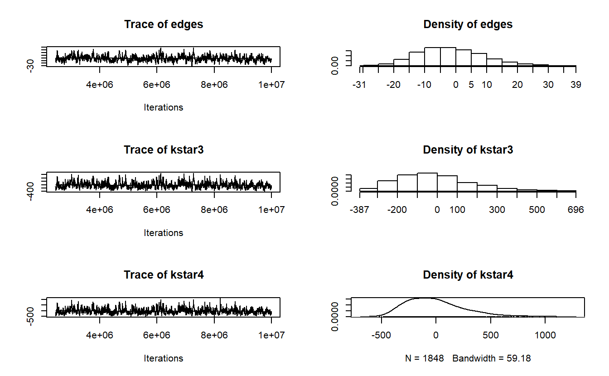
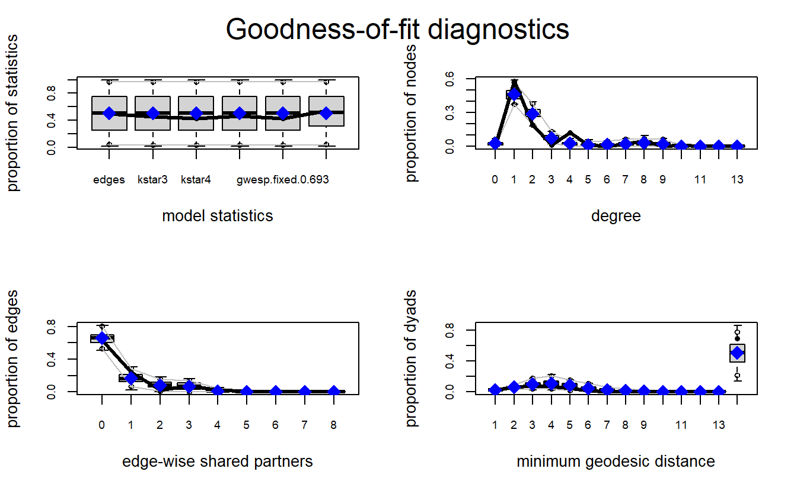
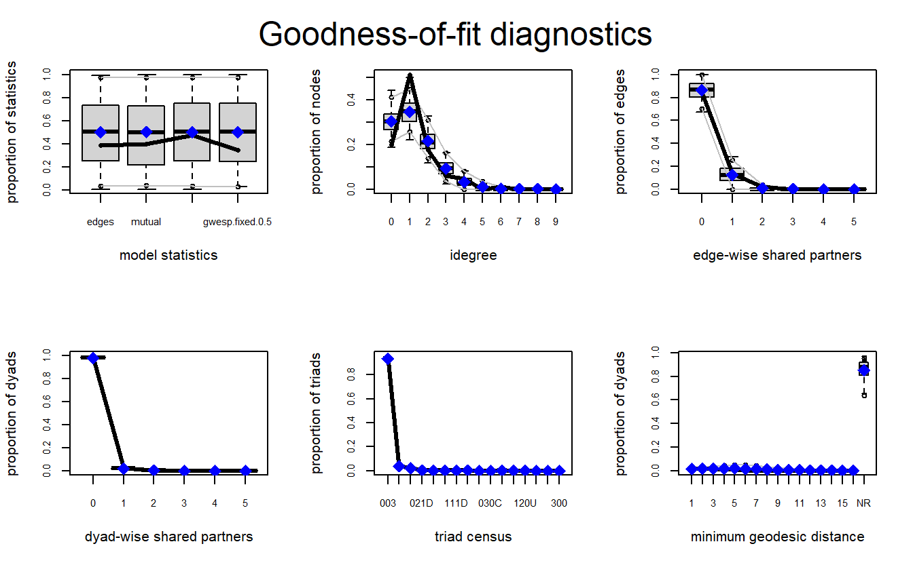
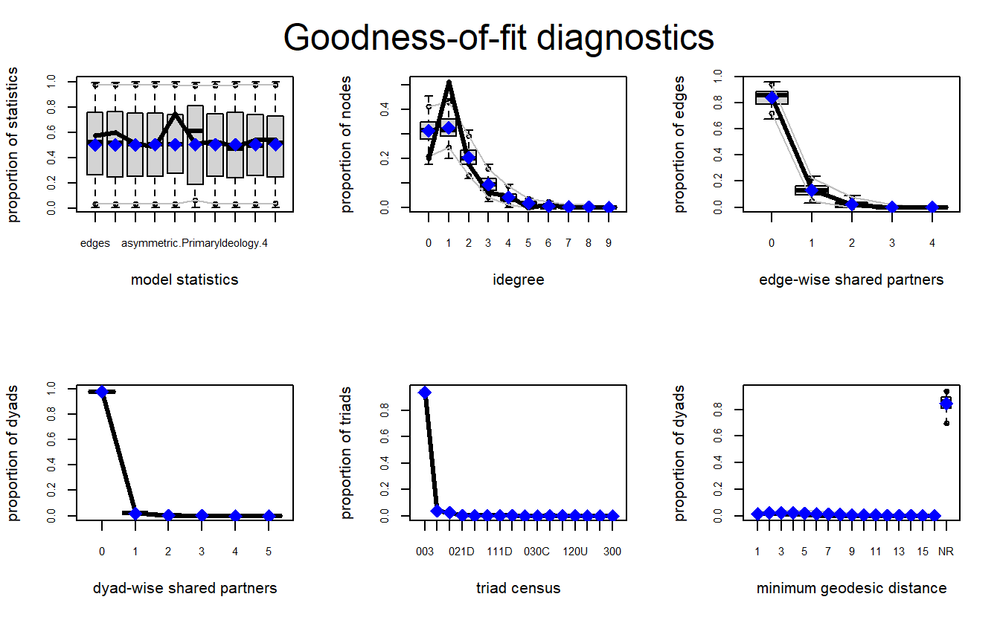
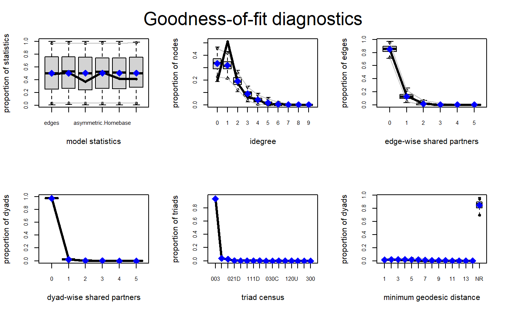

# (PART) Lab 7 {-}

# Exponential Random Graph Models (ERGMs)


## Introduction

Place a header at the top of your script that tells you what you called it, what it accomplishes, etc.


```r
#################################################
# What: ERGMs (statnet)
# Created: 02.28.19
# Revised: 01.25.22
#################################################
```

Exponential random graph models (ERGMs) are popular statistical methods for social networks that allow researchers to examine and test theories regarding a range of effects that may lead to tie formation in a given network.  The idea is that social networks are built upon local structures, such as reciprocal pairs and close triads, that can be modeled as network “configurations,” which ultimately serve as independent variables in a model. This class of models allows researchers to test theories about which *endogenous* (i.e., structural) and *exogenous* (e.g., actor attributes, spatial factors, and other networks) factors facilitate the growth of relations among actors in a given network. For instance, a researcher may have a theory (perhaps through data visualization, observation, or research) that preferential attachment is a major social process (i.e., the ways by which actors form ties) within a network. While preferential attachment might be of main theoretical interest, the researcher also may see evidence and hypothesize that social exchange, homophily (e.g., gender-based homophily), and multiplexity contribute to tie formation and maintenance in the observed network. ERGMs allow researchers to test such theories. The power of ERGMs is that they allow the researcher to test these theories *simultaneously* and *at multiple network levels* (e.g., individual, dyad, triad, and subgroup). 

Underlying this approach are several theoretical assumptions about social networks [@Lusheretal2013]. First, social networks emerge from local processes.  This assumption suggests that such processes take place and produce macro-structures and patterns. Second, network ties are self-organizing in that there are complex dependencies in which the presence of one tie may affect the presence of another. As indicated above, actor attributes and other exogenous factors (e.g., other networks, the spatial distance between actors) can affect tie formation as well. Third, the presence of patterns (e.g., more reciprocity than we would expect by chance) is evidence that there is some sort of underlying process. Finally, no single process is likely to explain tie formation in any given empirical network, which means multiple processes can occur simultaneously, and lead to macro-structures. For instance, reciprocity, triadic closure, homophily, and multiplexity may be at play in an observed network. Thus, an important point is to build a model that takes into account several processes, including both endogenous and exogenous, because it is not always clear what processes are at play.

The process for developing and estimating an ERGM can be simplified into a few important steps [@Lusheretal2013: 10]. The first thing for a researcher to do is to specify an ERGM based on their theoretical interests or empirically established patterns.  For example, a researcher interested in a mutual exchange of information and/or resources can operationalize this process using a configuration for reciprocity, which serves as an independent variable. The key is to find a set of configurations built around theory and incorporate appropriate control variables.  The researcher can then apply this model to their observed network, which will lead to the estimation of parameters (and a standard error) for each configuration.  After selecting the appropriate parameters, the focus shifts to getting the model to converge, which is often very difficult to do (especially for "large" networks). Once a model has converged, the parameters allow researchers to make inferences about the network patterns in the data, which in turn permits him or her to make inferences about the types of social processes that are important to the network.  For researchers using MPNet and PNet (open-source software not available in R) and examining several models, one can compare them by looking at the Mahalanobis distance produced in a goodness of fit (GOF) report. Similarly, those using **statnet** can compare models by evaluating the Akaike's Information Criteria (AIC) and Bayesian Information Criteria (BIC) scores (the lower, the better) for each model before moving onto GOF analyses. 

Finally, one needs to examine how well a model fits the observed data by examining the “goodness of fit” (GOF) model diagnostic. The basic idea of GOF is to assess how well a model captures features of the data that you did *not* explicitly model.  Lusher et al. [-@Lusheretal2013] explain that this approach allows us to see if what we modeled is enough to explain the observed network and accounts for general processes observed in many networks. The GOF procedure, given we have a converged model, begins with simulations to generate a distribution of graphs. If the fitted model sufficiently explains a feature of the data, then we can expect that the summary for the corresponding feature in the data is not extreme in the distribution of graphs. 

:::{.infobox}
**General Procedures in R (__statnet__)**

The following is an outline of the general procedure for running ERGMs in R with **statnet**:

1. Import network (and attribute data if necessary)
2. Prepare data
    - Simplify relationships (e.g., dichotomize, remove multiple relationships, remove self-loops, etc.).
    - Set attributes to vertices.
3. Explore your data
    - Visualize to develop hypotheses (if you don’t have any already).
    - Calculate descriptive statistics (e.g., centrality), produce histograms for distributions of stats of interest, correlations among attributes, etc. 
4. Decide on the type of model and estimate model(s)
    - "Standard" model, social selection, social influence, etc.  
    - Obtain converged model(s) (e.g., mcmc diagnostics)
    - Compare models by evaluating the AIC and BIC scores
5. Run goodness of fit diagnostics
6. Interpret and report results
:::

## ERGMs With Undirected Data

### Data and Setup

Load **statnet**.


```r
library(statnet)
```

Our undirected data are from active Provisional Irish Republican Army (PIRA) members between 1970 and 1998. These data are drawn from longitudinal and cross-sectional information collected by the International Center for the Study of Terrorism at Pennsylvania State University. The PIRA network comprises the following four types of relationships: (1) involvement in a PIRA activity together, (2) friends before joining the PIRA movement, (3) blood relatives, and (4) related through marriage. Each relation is treated as a tie and coded whether a tie exists between two members or not. Thus, the networks have, conceptually and technically, binary and symmetric relations between members [@Gilletal2014]. In all, network data were collected for six different periods.

Here, we will use the final two periods. Period six will serve as our dependent variable. In addition, ties between individuals in period five still active in period six will serve as one of the independent variables.


Let's load the data from the two periods.


```r
load("data/pira.RData")
```

Next, let's visualize the networks.


```r
par(mfrow = c(1, 2))
gplot(pira5.net,
      usearrows = FALSE, 
      main = "PIRA - Period 5")

gplot(pira6.net,
      usearrows = FALSE, 
      main = "PIRA - Period 6")
```


### PIRA ERGMs

We will start with a simple model and slowly build upon it. While we recommend starting with theory when using ERGMs, in this section we will focus on code and mechanics to get you started. Then, in the following section of this exercise (ERGMs with Directed Data), we will leverage exploratory analysis to develop models more systematically.

Estimating ERGMs in **statnet** is accomplished by using the `ergm()` function, which is used to fit models. To do so, the analyst must provide a formula (through the aptly named argument `formula`) of the given network (`y`) as a function of the terms that represent the network configurations we hypothesize may occur more or less likely than expected by chance [@ergmpaper]. This expression then would take the following form: `y ~ <model term 1> + <model term 2> + ...`. Later on in this document, we will explore the possible configuration terms. For now, you may want to keep in mind that you can get a list of the available terms by typing `?'ergm-terms'`. As the documentation for these terms is extensive, you may prefer to narrow down the scope by searching for specific terms:


```r
search.ergmTerms(keyword = "activity")
```

We will begin estimating our model using the `edges` term, which represents the most basic configuration (the number of edges in the network) and controls for the tendency for individuals to form ties. While this term may give some information about such a tendency, it is similar to a constant (a.k.a., intercept) term and is often not interpreted on its own.


```r
pira6.01 <- ergm(pira6.net ~ edges)
```

The output is an object of `ergm` class consisting of multiple elements. Calling the output object (`pira6.01`) produces a minimal printout with information on the formula used to estimate the ERGM and a score of the coefficients for the model parameters. The `summary()` function formats the output to present the formula, coefficients, and the values of AIC and BIC scores in an easier to interpret format. 


```r
pira6.01

Call:
ergm(formula = pira6.net ~ edges)

Maximum Likelihood Coefficients:
 edges  
-3.583  
summary(pira6.01)
Call:
ergm(formula = pira6.net ~ edges)

Maximum Likelihood Results:

      Estimate Std. Error MCMC % z value Pr(>|z|)    
edges  -3.5832     0.1057      0  -33.91   <1e-04 ***
---
Signif. codes:  0 '***' 0.001 '**' 0.01 '*' 0.05 '.' 0.1 ' ' 1

     Null Deviance: 4717.6  on 3403  degrees of freedom
 Residual Deviance:  845.8  on 3402  degrees of freedom
 
AIC: 847.8  BIC: 854  (Smaller is better. MC Std. Err. = 0)
```


<!--
TODO: Turn this to the table? Variable, definition, function, arguments
-->

Now, let's add some additional terms. In addition to `edges`, our model should include variables to account for triadic processes (e.g., open or closed triads) and degree distributions.  To that end, we've included the terms `kstar` (i.e., the tendency for actors to form n ties), `gwdegree` (i.e., centralization based on high-degree nodes), `gwesp` (i.e., propensity for higher-order closure whereby nodes with multiple shared contacts form a tie), and `dyadcov`(i.e., the effect of one type of edge on the dependent network) to account for the desired predictor configurations. Notice that each term is a function with corresponding attributes, which enable the analyst to tune the behavior of each. For example, the `kstar` term includes an argument (`k`) that adds one network statistic to the model for each element of the distinct integer vector provided. In the example below, we have specified that the ERGM should include counts of the number of 3 and 4-stars in the network. Once again, a fuller description of these terms can be accessed via the `?'ergm-terms'` command.


```r
pira6.02 <- ergm(pira6.net ~ edges + 
                   kstar(k = 3:4) + 
                   gwdegree(decay = 0.693, fixed = TRUE) + 
                   gwesp(decay = 0.693, fixed = TRUE) + 
                   dyadcov(x = pira5.net))
summary(pira6.02)   
```


```
Call:
ergm(formula = pira6.net ~ edges + kstar(k = 3:4) + gwdegree(decay = 0.693, 
    fixed = TRUE) + gwesp(decay = 0.693, fixed = TRUE) + dyadcov(x = pira5.net))

Monte Carlo Maximum Likelihood Results:

                   Estimate Std. Error MCMC % z value Pr(>|z|)    
edges             -11.00185    1.15019      0  -9.565  < 1e-04 ***
kstar3              0.63786    0.12021      0   5.306  < 1e-04 ***
kstar4             -0.24910    0.05669      0  -4.394  < 1e-04 ***
gwdeg.fixed.0.693   5.41450    1.07962      0   5.015  < 1e-04 ***
gwesp.fixed.0.693   0.48519    0.18422      0   2.634  0.00844 ** 
dyadcov.pira5.net   5.48141    0.37414      0  14.651  < 1e-04 ***
---
Signif. codes:  0 '***' 0.001 '**' 0.01 '*' 0.05 '.' 0.1 ' ' 1

     Null Deviance: 4718  on 3403  degrees of freedom
 Residual Deviance:  442  on 3397  degrees of freedom
 
AIC: 454  BIC: 490.8  (Smaller is better. MC Std. Err. = 0.2355)
```


With our model in hand, let's now turn our attention to assessing model convergence. We want to make sure we develop a model that is a solid representation of our observed data. As such, use the `mcmc.diagnostics()` function to help us assess if our simulated networks differ from our observed network. In other words, we want to see if our model can reproduce the observed network. If not, we run into the issue of "model degeneracy" and need to make changes. 

The `mcmc.diagnostics()` function takes an `ergm` object to produce diagnostics on model fit. The extensive output should include a printout of diagnostic information and diagnostic plot for MCMC sampled statistics produced from the fit [@ergm]. Here, we will focus on interpreting the plots for demonstration purposes. If the model has converged, these graphs should vary stochastically around the mean of 0, where 0 represents the value for each term in the observed data [@Harris2013]. Simply, the "trace plots" on the left should show a relatively tight "fuzzy caterpillar" and the distribution of the sample statistics on the right should have a nice bell curve that is centered on zero (or at least close).


```r
mcmc.diagnostics(pira6.02) 
```

```
Sample statistics summary:

Iterations = 2445312:10010624
Thinning interval = 4096 
Number of chains = 1 
Sample size per chain = 1848 

1. Empirical mean and standard deviation for each variable,
   plus standard error of the mean:

                      Mean      SD Naive SE Time-series SE
edges              -1.0498  10.636  0.24740         0.6560
kstar3            -14.5005 184.166  4.28409        10.6227
kstar4            -17.6981 255.503  5.94354        13.9889
gwdeg.fixed.0.693  -0.3946   4.032  0.09379         0.1724
gwesp.fixed.0.693  -1.1028  14.381  0.33453         0.9174
dyadcov.pira5.net  -0.3139   4.022  0.09356         0.2117

2. Quantiles for each variable:

                      2.5%      25%      50%     75%  97.5%
edges              -19.000   -9.000  -2.0000   6.000  21.00
kstar3            -306.000 -152.000 -36.0000  90.250 405.30
kstar4            -398.650 -208.500 -51.0000 128.250 576.48
gwdeg.fixed.0.693   -8.486   -3.085  -0.4639   2.403   7.41
gwesp.fixed.0.693  -26.392  -11.436  -2.3438   7.437  31.64
dyadcov.pira5.net   -8.000   -3.000   0.0000   2.000   7.00


Are sample statistics significantly different from observed?
                edges      kstar3      kstar4 gwdeg.fixed.0.693
diff.      -1.0497835 -14.5005411 -17.6980519        -0.3946490
test stat. -1.6003375  -1.3650488  -1.2651470        -2.2894470
P-val.      0.1095237   0.1722377   0.2058186         0.0220534
           gwesp.fixed.0.693 dyadcov.pira5.net Overall (Chi^2)
diff.             -1.1028421        -0.3138528              NA
test stat.        -1.2021793        -1.4827732      10.0808114
P-val.             0.2292941         0.1381347       0.1242034

Sample statistics cross-correlations:
                      edges    kstar3    kstar4 gwdeg.fixed.0.693
edges             1.0000000 0.9329188 0.8919462         0.8291020
kstar3            0.9329188 1.0000000 0.9905262         0.6177002
kstar4            0.8919462 0.9905262 1.0000000         0.5767340
gwdeg.fixed.0.693 0.8291020 0.6177002 0.5767340         1.0000000
gwesp.fixed.0.693 0.9005596 0.8986172 0.8647306         0.6335978
dyadcov.pira5.net 0.7039098 0.5915828 0.5472817         0.6324009
                  gwesp.fixed.0.693 dyadcov.pira5.net
edges                     0.9005596         0.7039098
kstar3                    0.8986172         0.5915828
kstar4                    0.8647306         0.5472817
gwdeg.fixed.0.693         0.6335978         0.6324009
gwesp.fixed.0.693         1.0000000         0.6632554
dyadcov.pira5.net         0.6632554         1.0000000

Sample statistics auto-correlation:
Chain 1 
              edges    kstar3    kstar4 gwdeg.fixed.0.693 gwesp.fixed.0.693
Lag 0     1.0000000 1.0000000 1.0000000        1.00000000         1.0000000
Lag 4096  0.6393878 0.6075981 0.5463356        0.34813655         0.6652378
Lag 8192  0.5055016 0.4804466 0.4272812        0.23861430         0.5377435
Lag 12288 0.4025102 0.3754633 0.3259815        0.14869759         0.4282905
Lag 16384 0.3218468 0.2962404 0.2563440        0.15001733         0.3386914
Lag 20480 0.2397688 0.2358050 0.2098159        0.09474202         0.2580701
          dyadcov.pira5.net
Lag 0             1.0000000
Lag 4096          0.6015808
Lag 8192          0.4142869
Lag 12288         0.3020510
Lag 16384         0.2132892
Lag 20480         0.1549427

Sample statistics burn-in diagnostic (Geweke):
Chain 1 

Fraction in 1st window = 0.1
Fraction in 2nd window = 0.5 

            edges            kstar3            kstar4 gwdeg.fixed.0.693 
           0.4154            0.1812            0.1011            1.3998 
gwesp.fixed.0.693 dyadcov.pira5.net 
           0.5352            0.5221 

Individual P-values (lower = worse):
            edges            kstar3            kstar4 gwdeg.fixed.0.693 
        0.6778385         0.8561816         0.9194937         0.1615861 
gwesp.fixed.0.693 dyadcov.pira5.net 
        0.5925253         0.6016216 
Joint P-value (lower = worse):  0.2363757 .
```

```

MCMC diagnostics shown here are from the last round of simulation, prior to computation of final parameter estimates. Because the final estimates are refinements of those used for this simulation run, these diagnostics may understate model performance. To directly assess the performance of the final model on in-model statistics, please use the GOF command: gof(ergmFitObject, GOF=~model).
```



Let's try a slightly different model here swapping out `gwdegree` with `altkstar`, which is closer to the model estimated using MPNet (see the slides from class). In theory, `gwdegree` and `altkstar` should produce the same results, but in practice, the statistic produced by these terms is affected by the `lambda` and `decay` parameters that we set.


```r
pira6.03 <- ergm(pira6.net ~ edges + 
                   kstar(k = 3:4) + 
                   altkstar(lambda = 2, fixed = TRUE) + 
                   gwesp(decay = 0.693, fixed = TRUE) + 
                   dyadcov(x = pira5.net))
summary(pira6.03)
```

```
Call:
ergm(formula = pira6.net ~ edges + kstar(k = 3:4) + altkstar(lambda = 2, 
    fixed = TRUE) + gwesp(decay = 0.693, fixed = TRUE) + dyadcov(x = pira5.net))

Monte Carlo Maximum Likelihood Results:

                  Estimate Std. Error MCMC % z value Pr(>|z|)    
edges             -0.13152    1.13644      0  -0.116   0.9079    
kstar3             0.63889    0.11701      0   5.460   <1e-04 ***
kstar4            -0.24884    0.05573      0  -4.465   <1e-04 ***
altkstar.2        -2.72635    0.52887      0  -5.155   <1e-04 ***
gwesp.fixed.0.693  0.47794    0.18737      0   2.551   0.0107 *  
dyadcov.pira5.net  5.49734    0.36595      0  15.022   <1e-04 ***
---
Signif. codes:  0 '***' 0.001 '**' 0.01 '*' 0.05 '.' 0.1 ' ' 1

     Null Deviance: 4717.6  on 3403  degrees of freedom
 Residual Deviance:  441.9  on 3397  degrees of freedom
 
AIC: 453.9  BIC: 490.7  (Smaller is better. MC Std. Err. = 0.2431)
```


Compare these results to those estimated by MPNet:

<!--
We don't have isolates?
-->

<table class="table" style="margin-left: auto; margin-right: auto;">
<caption>(\#tab:unnamed-chunk-13)MPNet Estimates.</caption>
 <thead>
  <tr>
   <th style="text-align:left;"> Statistic </th>
   <th style="text-align:left;"> MPNet Estimate </th>
  </tr>
 </thead>
<tbody>
  <tr>
   <td style="text-align:left;"> Edge </td>
   <td style="text-align:left;"> N/A </td>
  </tr>
  <tr>
   <td style="text-align:left;"> Star3A </td>
   <td style="text-align:left;"> 0.6262 </td>
  </tr>
  <tr>
   <td style="text-align:left;"> Star4A </td>
   <td style="text-align:left;"> -0.2424 </td>
  </tr>
  <tr>
   <td style="text-align:left;"> Isolated Edges </td>
   <td style="text-align:left;"> 0.2347 </td>
  </tr>
  <tr>
   <td style="text-align:left;"> Alternating Star </td>
   <td style="text-align:left;"> -2.6902 </td>
  </tr>
  <tr>
   <td style="text-align:left;"> Alternating Triangle </td>
   <td style="text-align:left;"> 0.4525 </td>
  </tr>
  <tr>
   <td style="text-align:left;"> Prior Period Ties </td>
   <td style="text-align:left;"> 5.4827 </td>
  </tr>
</tbody>
</table>


Once again, run the model convergence diagnostics using the `mcmc.diagnostics()` function. Does our model represent our data well enough?


```r
mcmc.diagnostics(pira6.03)  
```

Now, let's do a goodness of fit test and plot the results. Again, GOF allows us to assess whether a model represents important graph features. The function used to calculate GOF is `gof()`, which calculates p-values for geodesic distance, degree, and reachability summaries to diagnose the goodness-of-fit for a given model.


```r
pira6.03.gof <- gof(pira6.03)
pira6.03.gof
```

```

Goodness-of-fit for degree 

         obs min  mean max MC p-value
degree0    0   0  2.43   6       0.12
degree1   48  28 38.42  50       0.06
degree2   16  14 23.49  33       0.06
degree3    1   2  6.47  12       0.00
degree4   10   0  2.28   5       0.00
degree5    1   0  1.29   4       1.00
degree6    0   0  1.44   5       0.44
degree7    2   0  1.95   6       1.00
degree8    4   0  2.97   8       0.66
degree9    0   0  2.01   8       0.20
degree10   1   0  0.25   2       0.48

Goodness-of-fit for edgewise shared partner 

     obs min  mean max MC p-value
esp0  58  49 60.84  73       0.68
esp1  22   2 15.99  30       0.32
esp2   2   0  8.43  25       0.12
esp3   7   0  6.39  15       0.96
esp4   2   0  1.59   9       0.74
esp5   1   0  0.27   4       0.42

Goodness-of-fit for minimum geodesic distance 

     obs min    mean  max MC p-value
1     92  66   93.51  122       0.92
2    209  80  219.12  369       0.88
3    278  67  358.46  631       0.52
4    247  46  403.69  727       0.32
5    164  22  305.33  581       0.28
6     59   1  181.71  370       0.16
7     18   0   96.63  260       0.20
8      0   0   48.12  194       0.06
9      0   0   22.91  130       0.26
10     0   0   11.67  114       0.66
11     0   0    5.71   83       1.00
12     0   0    2.85   66       1.00
13     0   0    1.52   52       1.00
14     0   0    0.74   33       1.00
15     0   0    0.30   20       1.00
16     0   0    0.12    9       1.00
17     0   0    0.08    6       1.00
18     0   0    0.05    4       1.00
19     0   0    0.02    2       1.00
20     0   0    0.01    1       1.00
Inf 2336 398 1650.45 3044       0.28

Goodness-of-fit for model statistics 

                        obs      min      mean        max MC p-value
edges              92.00000 66.00000  93.51000  122.00000       0.92
kstar3            465.00000 75.00000 490.70000 1003.00000       0.88
kstar4            575.00000 76.00000 612.24000 1350.00000       0.90
altkstar.2        151.25391 61.89062 156.27027  254.01562       0.84
gwesp.fixed.0.693  42.93568  6.00000  43.31993   82.99617       0.92
dyadcov.pira5.net  52.00000 43.00000  52.56000   61.00000       0.90
```

For simplicity, we will only interpret the last output of the printout (the Goodness-of-fit for model statistics table, see printout below). The model simulations built into the `gof()` function can compare the network characteristics for simulated networks and the observed network; then, the observed frequencies for each statistic can be compared against those simulated [@Harris2013]. The model statistics comparison table includes five columns of information; as an aside, these variables and their interpretation can also be used in comparing the degree, edgewise shared partner, and minimum geodesic distance tables. The first column contains the name for each statistic. The second, *obs* includes the number of nodes in the observed network with the listed statistic. Notice that the edges statistic should correspond to the number of edges in the network (you can always check using `network.edgecount(pira6.net)`). The third, fourth, and fifth columns (*min*, *mean*, and *max*) represent the minimum, maximum and average number for a given statistic across the simulated networks. Finally, and perhaps most importantly, the *MC p-value* column includes the proportion of the simulated values for a given term that are at least as extreme as the observed value. Here, large p-values indicate that the simulated networks are not significantly different from the observed network; on the other hand, small p-values (less than 0.05) would be interpreted as demonstrating a significant difference between the simulated and observed statistic [@Harris2013]. In our output, the p-values are close to one, so our model did well at predicting the terms in our model, which we expected. Determining how well a model fits require evaluating the other tables. Generally speaking, the fewer p-values of less than 0.5 the better.


```
                        obs      min      mean        max MC p-value
edges              92.00000 66.00000  93.51000  122.00000       0.92
kstar3            465.00000 75.00000 490.70000 1003.00000       0.88
kstar4            575.00000 76.00000 612.24000 1350.00000       0.90
altkstar.2        151.25391 61.89062 156.27027  254.01562       0.84
gwesp.fixed.0.693  42.93568  6.00000  43.31993   82.99617       0.92
dyadcov.pira5.net  52.00000 43.00000  52.56000   61.00000       0.90
```

To aid the process of determining model fit, we can also plot the output of our GOF evaluation using the `plot()` function. Note that each plot represents each GOF test. The x-axis on each plot represents a given statistic, while the y-axis represents the proportion of nodes in the observed network with the proportion of nodes in the simulated network with the same characteristics [@Harris2013]. The thick black line in each graph represents the value for the observed network, while the grey box shows the 95% confidence interval for the simulated networks. When the observed values fall within the confidence interval, the simulated networks are capturing the configurations in the observed network and we assume the model fits well.


```r
par(mfrow = c(2, 2))
plot(pira6.03.gof)
```




### Compare to QAP logistic regression

In order to estimate the regression, use the `netlogit()` function from the **sna** package. Luckily, the **sna** package is loaded with **statnet**. 

Note that the `pira5.net` coefficients for logistic regression are quite similar to the one for the two ERGMs that were estimated. 


```r
nlog <- netlogit(y = pira6.net, x = list(pira5.net),
                 mode = "graph")
print(nlog)
```

```

Network Logit Model

Coefficients:
            Estimate  Exp(b)       Pr(<=b) Pr(>=b) Pr(>=|b|)
(intercept) -4.410371   0.01215067 0.166   0.834   0.166    
x1           5.417176 225.24210526 1.000   0.000   0.000    

Goodness of Fit Statistics:

Null deviance: 4717.56 on 3403 degrees of freedom
Residual deviance: 515.7963 on 3401 degrees of freedom
Chi-Squared test of fit improvement:
	 4201.763 on 2 degrees of freedom, p-value 0 
AIC: 519.7963 	BIC: 532.0611 
Pseudo-R^2 Measures:
	(Dn-Dr)/(Dn-Dr+dfn): 0.5525173 
	(Dn-Dr)/Dn: 0.8906646 
```


## ERGMs With Directed Data

### Data and Setup

This analysis relies on data from the Armed Conflict Location and Event Dataset (ACLED), which provides a comprehensive list of political events in Africa by country from 1997 to 2014 [@ACLED; @RaleighDowd2015]. The dataset contains several types of violent events among rebel groups, political militias, protesters, and civilians, among others. ACLED contains temporal data, including the dates on which events occurred, along with spatial data at various levels of analysis, such as at country, provincial, and municipality levels. The relational data consists of directed, negative or violent relations among “rebel groups” contained in the ACLED dataset. This analysis derived these relations from two-mode networks connecting various groups via direct conflict on one another. 

We supplement the ACLED dataset with open-source information about six important attributes or characteristics of 86 rebel organizations. The first is each organization’s primary ideology, which captures systems of beliefs that serve as its primary motivation for conflicts, such as whether they adhere to separatist or religious goals (we placed each into a numeric category). The second attribute is each group’s home base, which is the primary country from which the group operates or functions. Each group’s size (i.e., the most recent estimate of its number of combatants) and founding date (i.e., the year in which the group came into being) are treated as attributes as well. We based some of the group size estimates on conflicting or limited information, which is a well-known challenge when analyzing violent groups. The authors of the original dataset split the difference between min and max estimates in cases where the best estimates for a group’s size are ranges [@Cunningham2017]. For example, we would have coded a group estimated to comprise 10,000 to 15,000 members as 12,500 members. To collect and structure these data, the authors relied mainly on the Big Allied and Dangerous Dataset Version 2 [@AsalRethmeyer2016], and the Terrorism Research and Analysis Consortium [@TRAC].

Finally, we define each group’s “turf” as the location of each rebel organization’s ethnic group. Specifically, each group’s turf is defined by the geospatial polygon(s) associated with their ethnic group. The original authors did this by using the Ethnicity Felix 2001, a spatial data file consisting of 1,927 polygons, which are based on the “People’s Atlas of Africa” by Marc Felix and Charles Meur [-@FelixMeur2001] and depict the dominant ethnicities and languages for Africa. In this analysis, two rebel groups are considered to share the same turf if their ethnic group was located in the same polygon. In other words, for them to share the same turf they do not have to belong to the same ethnic group. All that matters is whether their respective ethnic groups share the same location. Similarly, two rebel groups were considered to share adjacent turfs if their respective ethnic groups are located in adjacent polygons.

Let's import the data, which we've stored as a matrix. Here we will work with directed data, so be sure to use the `directed = TRUE` argument within the `as.network()` function to indicate that our data are directed.


```r
teo_mat <- as.matrix(
  read.csv("data/TEO_Matrix.csv",
           row.names = 1,
           check.names = FALSE)
  )

teos_net <- as.network(teo_mat,
                       directed = TRUE,
                       ignore.eval = TRUE, 
                       loops = FALSE,
                       matrix.type = "adjacency")
```

Now take a look at your imported `network` object.


```r
teos_net
```

```
 Network attributes:
  vertices = 86 
  directed = TRUE 
  hyper = FALSE 
  loops = FALSE 
  multiple = FALSE 
  bipartite = FALSE 
  total edges= 111 
    missing edges= 0 
    non-missing edges= 111 

 Vertex attribute names: 
    vertex.names 

No edge attributes
```

Let's import the attributes and take a look at them using the `head()` function. 


```r
teo_attrs <- read.csv("data/TEO Attributes.csv")
head(teo_attrs)
```

```
   Node.ID Primary.Ideology Homebase Founding.Year Strength
1     ADFL                1        6          1996      750
2 ADF-NALU                4       20          1996     1000
3 AFRC - 1                1       16          1997      500
4 AFRC - 2                1       16          1998      100
5 AFRC - 3                1       16          1998      100
6     AIAI                4       17          1982     2000
```

Now, let's set the node attributes based on the `teo_attrs` object. 


```r
set.vertex.attribute(teos_net, "PrimaryIdeology", teo_attrs[, "Primary.Ideology"])
set.vertex.attribute(teos_net, "Homebase",  teo_attrs[, "Homebase"])
set.vertex.attribute(teos_net, "FoundingYear",  teo_attrs[, "Founding.Year"])
set.vertex.attribute(teos_net, "Strength",  teo_attrs[, "Strength"])

list.vertex.attributes(teos_net)
```

```
[1] "FoundingYear"    "Homebase"        "na"              "PrimaryIdeology"
[5] "Strength"        "vertex.names"   
```

We need to import the dyadic covariates for "turf" as well, which are stored as two matrix files in text format. Ultimately, we want them in network format.


```r
#Read in dyadic covariates (here I will only do ethnicity as turf):
eth_adj_turf <- as.network(
  data.matrix(
    read.table("data/TEO Turf (Ethnicity - Adjacent).txt")
    )
  )

eth_same_turf <- as.network(
  data.matrix(
    read.table("data/TEO Turf (Ethnicity - Same).txt")
    )
  )
```

Go ahead and plot the network to see what it looks like. We will save the coordinates as well.


```r
coords <- network.layout.fruchtermanreingold(teos_net, layout.par = NULL)

gplot(teos_net,
      coord = coords,
      main = "TEOs Network")
```


### Explore Data

As you may recall, one way to develop hypotheses is to look for visual patterns and leverage descriptive stats. What we have below are some useful ways to explore your data in the future before estimating ERGMs. Starting with visuals. Do you see any patterns (e.g, clustering based on attributes)?


```r
par(mfrow = c(2, 2))

gplot(teos_net,
      edge.col = "gray",
      main = "TEO Network - Ideology", 
      vertex.col = get.vertex.attribute(teos_net, "PrimaryIdeology"), 
      coord = coords)

gplot(teos_net,
      edge.col = "gray",
      main = "TEO Network - Homebase", 
      vertex.col = get.vertex.attribute(teos_net, "Homebase"), 
      coord = coords)

gplot(teos_net,
      edge.col = "gray",
      main = "TEO Network - Founding Year", 
      vertex.col = get.vertex.attribute(teos_net, "Founding.Year"), 
      coord = coords)

gplot(teos_net,
      edge.col = "gray",
      main = "TEO Network - Strength", 
      vertex.cex = scales::rescale(get.vertex.attribute(teos_net, "Strength"),
                                   to = c(0.5, 4)), 
      coord = coords)
```


One way of exploring your data is using the `mixingmatrix()` function to see relations among the various types of categories of actors. For instance, you can see that the ideology coded as "1" sends 6 ties (i.e., attacks) to organizations coded as adhering to ideology "2". Do any patterns emerge from inspecting this table?


```r
mixingmatrix(teos_net, "PrimaryIdeology")
```

```
     To
From    1   2   3   4   5   6 Sum
  1    25   6   2   1   0   1  35
  2     7  16   2   5   3   0  33
  3     1   0   2   0   1   0   4
  4     5   3   0  14   3   0  25
  5     1   3   1   4   3   0  12
  6     0   2   0   0   0   0   2
  Sum  39  30   7  24  10   1 111
```

You can calculate reciprocity and transitivity to inform your model, too. 


```r
data.frame("Measure" = c("Dyadic reciprocity", "Edgewise reciprocity", 
                         "Transitivity", "Average degree"),
           "Score" = round(c(grecip(teos_net),
                             grecip(teos_net, measure = "edgewise"),
                             gtrans(teos_net), mean(degree(teos_net))),
                           digits = 4)
           )
```

```
               Measure  Score
1   Dyadic reciprocity 0.9866
2 Edgewise reciprocity 0.5586
3         Transitivity 0.1187
4       Average degree 2.5814
```

Another useful set of descriptive measures with directed data is "triad census." When we use the `triad.census()` function, we can get an idea about social processes involving triads. We can compare the output with the image below.


```r
triad.census(teos_net)
```

```
       003  012  102 021D 021U 021C 111D 111U 030T 030C 201 120D 120U 120C 210
[1,] 95787 3906 2491   24    8   29   28   38    4    0  18    0    0    3   4
     300
[1,]   0
```

### TEO ERGMs 

The analysis below consists of three models examining violent tie formation among African TEOs. The micro-configurations selected in the models were based upon Cunningham, Everton, and Tsolis’s [-@Cunningham2017] original paper, and then the selection of them was further modified based on the presentation by Callaghan, Cunningham, and Everton [-@Callaghanetal2017] at the 1st North American Social Networks Conference (NASNC) in August 2017. The purpose of this section is to demonstrate how to implement ERGMs.  

Note you can use `help('ergm-terms')` to see what type of "terms" or "configurations" are available to include in your model. Alternatively, `vignette('ergm-term-crossRef')`, provides you with a cross-referenced HTML version that might be more helpful. 

It can take a while to become acquainted with these terms. One useful approach is to start with theoretically relevant "endogenous effects" (i.e., structural) and then add "exogenous effects". The first model contains only the former. To be specific, we use the previously noted `edges` term, which controls for the tendency for individuals to form ties. Additionally, we use the `mutual` (i.e., the number of pairs of actors {I, J} for which IJ and JI ties both exist), `gwodegree` (i.e., the geometrically weighted out-degree distribution captures the levels of activity for nodes sending ties), and `gwesp` (i.e., propensity for higher-order closure whereby nodes with multiple shared contacts form a tie) terms to generate our first model.


```r
model_1 <- ergm(teos_net ~ edges +
                  mutual + 
                  gwodegree(0.5, fixed = TRUE) + 
                  gwesp(0.5, fixed = TRUE),
              #Here we up the number of max iterations to get convergence.)
              control = control.ergm(MCMLE.maxit = 40)) 
```

Observe the results.


```r
summary(model_1)
```

```
Call:
ergm(formula = teos_net ~ edges + mutual + gwodegree(0.5, fixed = TRUE) + 
    gwesp(0.5, fixed = TRUE), control = control.ergm(MCMLE.maxit = 40))

Monte Carlo Maximum Likelihood Results:

                 Estimate Std. Error MCMC % z value Pr(>|z|)    
edges             -5.1176     0.2361      0 -21.672   <1e-04 ***
mutual             5.0517     0.3522      0  14.345   <1e-04 ***
gwodeg.fixed.0.5   0.1338     0.3836      0   0.349    0.727    
gwesp.fixed.0.5    0.6500     0.1425      0   4.561   <1e-04 ***
---
Signif. codes:  0 '***' 0.001 '**' 0.01 '*' 0.05 '.' 0.1 ' ' 1

     Null Deviance: 10133.8  on 7310  degrees of freedom
 Residual Deviance:   930.7  on 7306  degrees of freedom
 
AIC: 938.7  BIC: 966.3  (Smaller is better. MC Std. Err. = 0.7859)
```

Check for model degeneracy.


```r
mcmc.diagnostics(model_1)
```

We can use the `gof()` function to examine our models. For directed networks, it is a good idea to examine GOF for degree distributions (i.e., `idegree`), geodesic distributions (i.e., `distance`), shared partners and edges (i.e., `espartners` and `dspartners`), and triad census (i.e., `triadcensus`), among others [@Lusheretal2013]. To do so, we can pass a formula to the `GOF` argument specifying the terms that should be used to diagnose the GOF of the model.


```r
ERGM_1_gof <- gof(model_1, GOF = ~ distance + 
                    idegree + 
                    espartners + 
                    dspartners + 
                    triadcensus)
```

Let's plot the results. We can see the model does a fairly good job with most of the configurations.


```r
par(mfrow = c(2, 3))
plot(ERGM_1_gof)
```



Now, let's run the second model, which includes actor attributes and dyadic covariates. Once again, we add new terms with relevant attributes to declare the specific configurations desired. In this second model, we use the following terms:
  
  - `nodeifactor` with `PrimaryIdeology`: which captures the number of times a node with an attribute appears as the terminal node on a directed tie [@ergm]. Here, we identify the first level (`levels = 1`), which represents TEOs with "Christian" primary ideology, as the categorical attribute of interest. Taken together, this term examines whether nodes associated with Christianity have a higher or lower likelihood of receiving links.
  - `asymmetric` with `PrimaryIdeology`: this term accounts for the number of pairs of actors {I, J} for which exactly one link, IJ or JI, exists. Here the focus is on nodes with "Islamic" as the primary ideology. The argument `diff = TRUE` tells the model to look at pairs with different `PrimaryIdeology` values. Taken together, this term examines the potential asymmetry between Islamic TEOs and those of different ideologies.
  - `nodematch` with `Homebase`: this is a homophily term. Here, we are specifying the attribute (`Homebase`) we want to examine whether nodes with the same home base have a likelihood to form edges between them.
  - `asymmetric` with `Homebase`: much like the prior `asymmetric` term, this configuration is paired with a node attribute (`Homebase`). The aim here is to identify whether nodes with the same home bases are more or less likely to initiate edges with geographically proximal nodes.
  - `edgecov` with `eth_adj_turt` and `eth_same_turf`: this term is used to include covariates; here, networks in which TEOs are connected if they share a turf as defined by ethnic group (`eth_same_turf`) or adjacent turfs (`eth_adj_turf`). 


```r
model_2 <- ergm(teos_net ~ edges +  
                  mutual + 
                  gwodegree (decay = 0.5, fixed = TRUE)+ 
                  gwesp(0.5, fixed = TRUE) + 
                  nodeifactor("PrimaryIdeology", levels = 1) + 
                  asymmetric("PrimaryIdeology", diff = TRUE, levels = 4) + 
                  nodematch("Homebase", diff = FALSE) + 
                  asymmetric("Homebase", diff = FALSE) + 
                  edgecov(eth_adj_turf) + 
                  edgecov(eth_same_turf),
              control = control.ergm(MCMLE.maxit = 40))
```

Examine your model.


```r
summary(model_2)
```

```
Call:
ergm(formula = teos_net ~ edges + mutual + gwodegree(decay = 0.5, 
    fixed = TRUE) + gwesp(0.5, fixed = TRUE) + nodeifactor("PrimaryIdeology", 
    levels = 1) + asymmetric("PrimaryIdeology", diff = TRUE, 
    levels = 4) + nodematch("Homebase", diff = FALSE) + asymmetric("Homebase", 
    diff = FALSE) + edgecov(eth_adj_turf) + edgecov(eth_same_turf), 
    control = control.ergm(MCMLE.maxit = 40))

Monte Carlo Maximum Likelihood Results:

                              Estimate Std. Error MCMC % z value Pr(>|z|)    
edges                         -6.52243    0.34706      0 -18.793   <1e-04 ***
mutual                         6.26134    0.61058      0  10.255   <1e-04 ***
gwodeg.fixed.0.5               0.51201    0.41423      0   1.236   0.2164    
gwesp.fixed.0.5                0.03979    0.17029      0   0.234   0.8153    
nodeifactor.PrimaryIdeology.1 -0.29553    0.20630      0  -1.433   0.1520    
asymmetric.PrimaryIdeology.4   0.50450    0.57254      0   0.881   0.3782    
nodematch.Homebase             1.02950    0.23057      0   4.465   <1e-04 ***
asymmetric.Homebase            1.94452    0.35685      0   5.449   <1e-04 ***
edgecov.eth_adj_turf           0.40838    0.20042      0   2.038   0.0416 *  
edgecov.eth_same_turf          1.31433    0.20995      0   6.260   <1e-04 ***
---
Signif. codes:  0 '***' 0.001 '**' 0.01 '*' 0.05 '.' 0.1 ' ' 1

     Null Deviance: 10133.8  on 7310  degrees of freedom
 Residual Deviance:   679.3  on 7300  degrees of freedom
 
AIC: 699.3  BIC: 768.3  (Smaller is better. MC Std. Err. = 0.5851)
```

Check for model degeneracy.


```r
mcmc.diagnostics(model_2) 
```

Now let's use the `gof()` function to examine our second model. 


```r
ERGM_2_gof <- gof(model_2, GOF = ~distance + 
                    idegree + 
                    espartners + 
                    dspartners + 
                    triadcensus)
```

Let's plot the results. We can see the model does a fairly good job with most of the configurations.


```r
par(mfrow = c(2, 3))
plot(ERGM_2_gof)
```



Finally, let's look at the model comprising only significant configurations. 


```r
model_3 <- ergm(teos_net ~ edges + 
                  mutual + 
                  nodematch("Homebase", diff = FALSE) + 
                  asymmetric("Homebase", diff = FALSE) + 
                  edgecov(eth_adj_turf) + 
                  edgecov(eth_same_turf),
                control = control.ergm(MCMLE.maxit = 40))
summary(model_3)
```


```
Call:
ergm(formula = teos_net ~ edges + mutual + nodematch("Homebase", 
    diff = FALSE) + asymmetric("Homebase", diff = FALSE) + edgecov(eth_adj_turf) + 
    edgecov(eth_same_turf), control = control.ergm(MCMLE.maxit = 40))

Monte Carlo Maximum Likelihood Results:

                      Estimate Std. Error MCMC % z value Pr(>|z|)    
edges                  -6.3156     0.2737      0 -23.079   <1e-04 ***
mutual                  6.2503     0.6284      0   9.947   <1e-04 ***
nodematch.Homebase      0.9415     0.2232      0   4.218   <1e-04 ***
asymmetric.Homebase     1.9787     0.3703      0   5.343   <1e-04 ***
edgecov.eth_adj_turf    0.3817     0.1937      0   1.971   0.0488 *  
edgecov.eth_same_turf   1.3031     0.2175      0   5.990   <1e-04 ***
---
Signif. codes:  0 '***' 0.001 '**' 0.01 '*' 0.05 '.' 0.1 ' ' 1

     Null Deviance: 10133.8  on 7310  degrees of freedom
 Residual Deviance:   684.3  on 7304  degrees of freedom
 
AIC: 696.3  BIC: 737.7  (Smaller is better. MC Std. Err. = 0.5309)
```


Check for model degeneracy. We will show the full output here because we will discuss the results shortly. 


```r
mcmc.diagnostics(model_3) 
```

Now let's use the `gof()` function to examine our third model. 


```r
par(mfrow = c(2, 3))
ERGM_3_gof <- gof(model_3, GOF = ~ distance + 
                    idegree + 
                    espartners + 
                    dspartners + 
                    triadcensus)
```

Let's plot the results. As with the first two, we can see the model does a fairly good job with most of the configurations.


```r
par(mfrow = c(2, 3))
plot(ERGM_3_gof)
```



This examination of inter-TEO violence in Africa suggests several interesting findings.  We will focus, however, on interpreting Models 2 and 3 because the AIC and BIC measures are smaller for these models. 

To help with interpretation, we can convert the results to odds ratios. We will do this for Model 3 only. Note that your odds ratios might be slightly different than what you see below because they are based on the estimates.   


```r
ORs <- data.frame("Terms" = names(model_3$coefficients),
                  "Odds"  = format(exp(model_3$coefficients),
                                   scientific = FALSE, 
                                   digits = 2),
                  row.names = NULL)
ORs
```

```
                  Terms     Odds
1                 edges   0.0018
2                mutual 518.1699
3    nodematch.Homebase   2.5638
4   asymmetric.Homebase   7.2330
5  edgecov.eth_adj_turf   1.4648
6 edgecov.eth_same_turf   3.6807
```

The structural parameters for `edges` and `mutual` (i.e., reciprocity) ties are statistically significant in both models. Again, we do not need to interpret the `edges` coefficient.  The `mutual` variable represents a propensity for reciprocal violence among groups, which indicates that a group will respond violently against another group that has attacked it at some point. When holding other variables constant, the odds ratio indicates that a victim group is over 500 times more likely to reciprocate violence against its attacker than a group that would attack another without a prior connection.   The `gwesp` and `gwodegree` configurations are *not* statistically significant in Model 2 and are excluded from Model 3. 

In terms of exogenous effects, both the `nodeifactor` for Christian ideology (`nodeifactor.PrimaryIdeology.1`) and the `asymmetric` for Islamist ideology (`asymmetric.PrimaryIdeology.4`) are *not* significant in our ERGM results and are excluded from Model 3. Yet, the `nodematch` (`nodematch.Homebase`) and `asymmetric` for home base (`asymmetric.Homebase `) actor covariates are positive and statistically significant in both models. When holding all other variables constant, the odds ratios for these processes indicate that groups from the same location are approximately 2-3 times more likely to engage in violence with one another than those who are from different locations. Moreover, they are about 7 times more likely to *initiate* violence against a geographically proximate group than attack groups from other locations. 

Both dyadic covariates are also positive and statistically significant.  These latter results suggest that both adjacent turf and shared turf, based on ethnicity as well as what we saw with "human-made" political boundaries, such as states, leads to violence among African TEOs. Specifically, groups with the same ethnicity are approximately 1.5 times more likely to engage in violence with one another than those with different ethnicity, as well as 3-4 times more likely when they share political boundaries. 

### Appendix: ERGM Package and PNet Comparison

We provide this appendix to demonstrate some important differences between PNet and the **ergm** package. Note estimates in bold indicate statistically significant effects and parentheses negative estimates. 

The differences may be due to several factors.  Specifically, the programs differ in how they operationalize configurations as well as what options they make available. For instance, **ergm** calls what PNet calls "Alternating Out Stars" as `gwodegree`. For your reference, here is a table comparing the variables used in this exercise.

<table class="table" style="margin-left: auto; margin-right: auto;">
<caption>(\#tab:unnamed-chunk-46)Comparison of Model Variables.</caption>
 <thead>
  <tr>
   <th style="text-align:left;"> PNet </th>
   <th style="text-align:left;"> ergm </th>
  </tr>
 </thead>
<tbody>
  <tr>
   <td style="text-align:left;"> Reciprocity </td>
   <td style="text-align:left;"> Mutual </td>
  </tr>
  <tr>
   <td style="text-align:left;"> Alternating Out Star </td>
   <td style="text-align:left;"> Gwodegree </td>
  </tr>
  <tr>
   <td style="text-align:left;"> Alternating Triangle - T </td>
   <td style="text-align:left;"> GWESP </td>
  </tr>
  <tr>
   <td style="text-align:left;"> Alternating Triangle - U </td>
   <td style="text-align:left;"> Unknown </td>
  </tr>
  <tr>
   <td style="text-align:left;"> Christian Receiver </td>
   <td style="text-align:left;"> Nodeifactor.PrimaryIdeology.1 </td>
  </tr>
  <tr>
   <td style="text-align:left;"> Islamic Interaction </td>
   <td style="text-align:left;"> Asymmetric.PrimaryIdeology.4 </td>
  </tr>
  <tr>
   <td style="text-align:left;"> Homebase Mismatch </td>
   <td style="text-align:left;"> Nodematch.Homebase - Implemented as the opposite of mismatch </td>
  </tr>
  <tr>
   <td style="text-align:left;"> Homebase Mismatch Reciprocity </td>
   <td style="text-align:left;"> Asymmetric.Homebase </td>
  </tr>
  <tr>
   <td style="text-align:left;"> Adjacent Turf </td>
   <td style="text-align:left;"> Edgecov.eth_adj_turf </td>
  </tr>
  <tr>
   <td style="text-align:left;"> Shared Turf </td>
   <td style="text-align:left;"> Edgecov.eth_same_turf </td>
  </tr>
</tbody>
</table>


<!-- To save time in knitting the document, the models are save and reloaded. -->

<!-- ```{r} -->
<!-- save(pira6.01, pira6.02, pira6.03, nlog, model_1, model_2, model_3, file = "data/models.rda") -->
<!-- ``` -->
