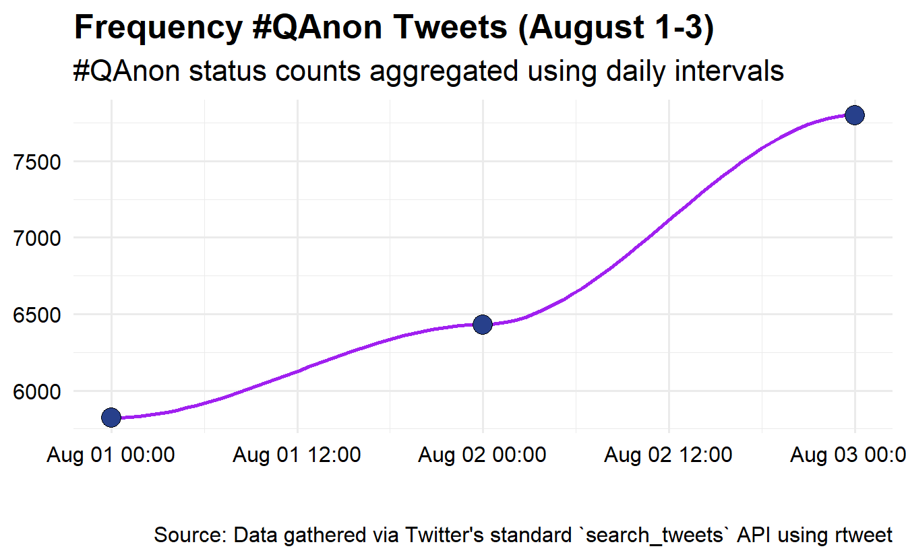
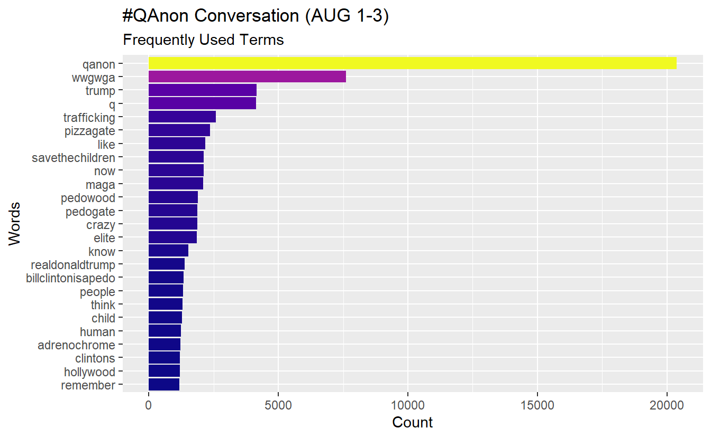
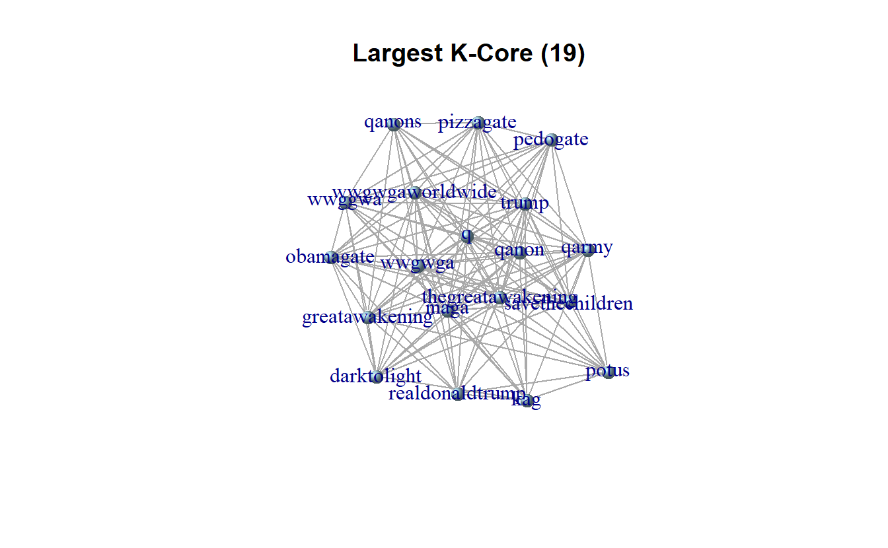

# (PART) Lab 9 {-}

# Text Mining and Semantic Network Analysis

Place a header at the top of your script that tells you what you called it, what it accomplishes, etc.


```r
#################################################
# What: Text Mining and Analysis
# Created: 
# Revised: 
#################################################
```

We will use a handful of packages for this exercise. You will need to install these first if you haven't done so already (`install.packages()`). 


```r
library(igraph)
library(RColorBrewer)
library(rtweet)
library(stopwords)
library(tidytext)
library(tidyverse) # We work mostly with dplyr, ggplot, stringr,and tidytext.
library(wordcloud2)
```

Set your global options so that strings are NOT considered as factors. If you are not familiar with factors, these are ordered vectors used to store categorical data [@Wickham2019]. By default, functions in R will coerce strings as factors, so we will turn off this behavior before we begin working with text data.


```r
options(stringsAsFactors = FALSE)
```

In this exercise, we will demonstrate basic text mining and analysis by exploring a subset of a hashtag-based, Twitter data set pulled using Twitter's REST API. Specifically, we used **rtweet**'s `search_tweets()` function to search for tweets containing #QAnon from April to November 2020.  This lab's data set consists of relevant tweets from August 1-3, during which there were ~20,000 tweets. 

Note much of this is adapted from the excellent reference, *Text Mining with R: A Tidy Approach* [-@Silge2017], which is freely available online: https://www.tidytextmining.com/. 

Go ahead and import the data. **This step may take some time, so please be patient.**


```r
load("data/AUGSAMPQ_df.RData")
```

::: {.infobox data-latex=""}
Since this exercise is adapted from a tutorial using the **tidyverse** keep in mind that the syntax may look a bit different. The **tidyverse** often utilizes "piping" (`%>%`) to execute chained actions.

You can think of the `%>%` as saying "and then" followed by a function
or action. The use of this operator is not required, but we will use it
here. 

In base R we would read and summarize the following way:


```r
df <- read.csv("PATH/TO/MY/DATA")
summary(df)
```

However, in the **tidyverse** the `%>%` operator is used to chain objects by passing either the raw data or the resulting data from a function to another for additional processing.


```r
read.csv("PATH/TO/MY/DATA") %>%
  summary()
```

Both function calls achieve the same goal.
:::

## Data Exploration

Let's get acquainted with the data set. You'll see that it contains 20,053 unique statuses/tweets and 91 variables.


```r
AUGSAMPQ_df %>%
  dim_desc()
```

```
[1] "[20,053 x 91]"
```

In this data set, each row corresponds to a user's tweet/status and the subsequent columns are comprised of attributes describing the tweet.  Go ahead and check out the column names/variables using the `colnames()` function. 


```r
colnames(AUGSAMPQ_df)
```

Feel free to use the `head(AUGSAMPQ_df)` or `View(AUGSAMPQ_df)` functions to check out the data set; however, the results may appear slowly. We will be particularly interested in the `text` column, which is the fifth column and includes the tweet content.

It is useful to explore some other details about the data set, such as tweet frequency over time, the most active users, and the most used hashtags contained in tweets using #QAnon. We're using code from https://github.com/mkearney/rstudioconf_tweets.  First, let's look at the number of tweets using #QAnon during the August 1-3 time frame.


```r
AUGSAMPQ_df %>%
  # ts_plot creates a ggplot of tweet frequencies over time.
  rtweet::ts_plot(by = "day", color = "transparent") + 
  # The following functions are exported from the ggplot2 package.
  geom_smooth(se = FALSE, color = "purple") +
  geom_point(size = 5, shape = 21, fill = "royalblue4") +
  theme_minimal(base_size = 15) +
  theme(axis.text = element_text(colour = "black"),
        plot.title = element_text(size = rel(1.25), face = "bold"),
        plot.subtitle = element_text(size = rel(1.1)),
        plot.caption = element_text(colour = "black")) +
  labs(title = "Frequency #QAnon Tweets (August 1-3)",
       subtitle = "#QAnon status counts aggregated using daily intervals",
       caption = "\n\nSource: Data gathered via Twitter's standard `search_tweets` API using rtweet",
       x = NULL, y = NULL)
```



Next, let's adjust the code a little bit to check out the most active Twitter accounts (top 25 accounts) using #QAnon during the time frame. The process below can be broken down into two steps. First the data is wrangled into the appropriate format by counting the `screen_name` variable, reordering the resulting data by descending number (`n`) of appearances, and then selecting for the top 25 observations. Second, the data is used to create a graph object, which is fine tuned using functions from the **ggplot2** library.


```r
AUGSAMPQ_df %>%
  # data wrangling
  count(screen_name) %>%
  mutate(screen_name = fct_reorder(screen_name, n)) %>%
  top_n(25) %>%
  # Data plotring 
  ggplot(aes(x = screen_name, y = n, fill = n)) +
  geom_col(show.legend = F) +
  xlab(NULL) +
  coord_flip() +
  viridis::scale_fill_viridis(option = "plasma") +
  labs(y = "Tweet Count",
       x = "Twitter Accounts",
       title = "#QAnon Conversation (AUG 1-7)",
       subtitle = "Most Active Accounts")
```


Let's create and save account count data as a `data.frame` so we can use it later. 


```r
active_accounts <- AUGSAMPQ_df %>%
  count(screen_name, sort = TRUE)
```

Check out the most frequently used hashtags in our data.  In this example, we expect #QAnon to appear the most often, but this approach could be useful to guide further collection because one of the biggest challenges is deciding on which hashtags by which to collect our data. For the sake of brevity, we have included notes on each step as a comment.


```r
AUGSAMPQ_df %>%
  # Select the variable of interest, which is a list column
  select(hashtags) %>%
  # Unnest the list column
  unnest(hashtags) %>%
  # Filter out missing data (NAs)
  filter(!is.na(hashtags)) %>% 
  # Standardize your text characters by transforming them to upper case
  mutate(hashtags = str_to_upper(hashtags)) %>% 
  # Count how many times a give string (hashtag) appears in the variable
  count(hashtags) %>%
  # Modify the hashtags by adding a "#" at the start and then order the factors
  mutate(hashtags = str_c("#", hashtags) %>%
           fct_reorder(., n)) %>%
  # Arrange by n
  arrange(n) %>% 
  # Pull the top 25 entries
  top_n(25) %>% 
  # Graph your data
  ggplot(aes(x = hashtags, y = n, fill = n)) + 
  geom_col(show.legend = FALSE) +
  coord_flip() +
  viridis::scale_fill_viridis(option = "plasma") +
  labs(y = "Hashtag Count",
       x = "Hashtag",
       title = "#QAnon Conversation (AUG 1-3)",
       subtitle = "Most Frequent Hashtags")
```


Let's follow one of the hashtags over time. Here we will look at "#pizzagate" over the three days. Here we'll use the `str_detect()` function in conjunction with `filter()` to identify and extract tweets that contain the hashtag. 


```r
AUGSAMPQ_df %>% 
  # Use str_detect() function to search for patterns in text
  filter(str_detect(string = text, pattern = "#pizzagate")) %>%
  # Plot the activity using the ts_plot() function and other ggplot2 functions
  ts_plot("day", color = "transparent") +
  geom_smooth(se = FALSE, colour = "purple") +
  geom_point(size = 5,
             shape = 21, fill = "royalblue4") +
  theme_minimal(base_size = 15) +
  theme(axis.text = element_text(colour = "black"),
        plot.title = element_text(size = rel(1.25), face = "bold"),
        plot.subtitle = element_text(size = rel(1.1)),
        plot.caption = element_text(colour = "black")) +
  labs(title = "Pizzagate Usage (August 1-3)",
       subtitle = "#Pizzagate based on daily intervals",
       caption = "\n\nSource: Data gathered via Twitter's standard `search_tweets` API using rtweet",
       x = NULL, y = NULL)
```


Now let's check out which accounts used this hashtag the most frequently during our time frame of interest. 


```r
AUGSAMPQ_df %>% 
  # Use str_detect() function to search for patterns in text
  filter(str_detect(string = text, pattern = "#pizzagate")) %>%
  # Here we will aggregate our data by screen_name and then sort
  count(screen_name) %>%
  arrange(desc(n)) %>%
  # We have several tied with 6
  top_n(26) %>%  
  mutate(screen_name = fct_reorder(screen_name, n)) %>%
  # Graph
  ggplot(aes(x = screen_name, y = n, fill = n)) +
  geom_col(show.legend = F) +
  coord_flip() +
  viridis::scale_fill_viridis(option = "plasma") +
  labs(y = "#Pizzagate Usage Count",
       x = "Twitter Accounts",
       title = "#Pizzagate Usage in #QAnon Conversation (AUG 1-3)",
       subtitle = "Most Active Accounts")
```


We can explore the most shared URLs as well. While there are several URL-based columns, we will check out the `urls_t.co` column for demonstration purposes.  Notice we haven't pre-processed our data yet, so the links are intact.  


```r
AUGSAMPQ_df %>%
  # Prepocess your data, first select and rename the variable of interest
  select(urls = urls_t.co) %>%
  # Unnest the list column
  unnest() %>%
  # Filter out missing data
  filter(!is.na(urls)) %>% 
  # Count and select the top 
  count(urls) %>%
  mutate(urls = fct_reorder(urls, n)) %>%
  top_n(25) %>%
  arrange(desc(n)) %>%
  # Graph
  ggplot(aes(x = urls, y = n, fill = n)) +
  geom_col(show.legend = F) +
  coord_flip() +
  viridis::scale_fill_viridis(option = "plasma") +
  labs(y = "URL Count",
       x = "URLs",
       title = "#QAnon Conversation (AUG 1-3)",
       subtitle = "Shared URLs")
```


We'll build a data frame so we can search for links on the web (you don't have to do this).


```r
count_urls_df <- AUGSAMPQ_df %>%
  select(link = urls_t.co) %>%
  unnest(link) %>%
  count(link, sort = TRUE) %>%
  filter(!is.na(link))

head(count_urls_df)
```

```
# A tibble: 6 x 2
  link                        n
  <chr>                   <int>
1 https://t.co/8ADgmjM3hH   110
2 https://t.co/91DwYgx0JO    95
3 https://t.co/64dRKrmk8B    94
4 https://t.co/yq7k7feywg    92
5 https://t.co/IyAY7UcW36    79
6 https://t.co/6FfK8vtJyB    45
```

### Data Formatting and Preprocessing Text

We need to preprocess our data before doing any more text analysis (well, at least what we cover in class). Specifically, we will do the following (we will not cover stemming or lemmatization in this lab):

1. Use `select()` function to simplify our data set.
2. Use `mutate()` to modify the content of the text.
3. Utilize `unnest_tokens()` to pull out all words from the tweets.
4. Apply extant and custom stop word list(s) to remove common stop words (e.g., "and", "of")

**We did not do these steps before looking for active accounts, frequently used hashtags in the conversations, commonly shared links, etc. because pre-processing may affect some of those items.**

Also keep in mind that you will often find yourself going through some of these steps multiple times in your analyses. For instance, it is common to see unwanted characters (such as those produced by emojis) in the analysis of social media-based data, which you may not pick up at first. 

Once you've run the code below, you should see words associated with accounts. 


```r
words_df <- AUGSAMPQ_df %>%
  # Select variables of interst
  select(screen_name, text) %>%
  # Remove digits and punctuation with str_remove_all 
  mutate(text = str_remove_all(text, pattern = "\\d|[:punct:]")) %>%
  # Remove additional junk from the text: https
  mutate(text = str_remove_all(text, pattern = "https|t.co")) %>%
  # Standardize your words by transforming them to upper case
  mutate(text = str_to_upper(text)) %>%
  # Unnest/extract words
  unnest_tokens(word, text)

head(words_df)
```

```
  screen_name    word
1    S223S223   qanon
2    S223S223      to
3    S223S223 reverse
4    S223S223     the
5    S223S223  spells
6    S223S223   qanon
```

You'll notice that we need to remove some commonly used words, such as "the" and "to", that do not contribute to our analysis in a meaningful way.  Such words are called, stop words. We can delete stop words by leveraging existing stop word lists. One package is the **stopwords** package. 


```r
sw_list_en <- stopwords::stopwords(language = "en", source = "snowball")
```

Take a peek at what words are included in the `sw_list_1` vector:


```r
sw_list_en[1:5]
```

```
[1] "i"      "me"     "my"     "myself" "we"    
```

Now filter your data to remove these unwanted words. While we are at it, remove any `NA` from your data.


```r
words_df <- words_df %>%
  filter(!word %in% sw_list_en) %>%  
  filter(!is.na(word))

head(words_df)
```

```
  screen_name              word
1    S223S223             qanon
2    S223S223           reverse
3    S223S223            spells
4    S223S223             qanon
5    S223S223 thegreatawakening
6   Shaddilay               wow
```
Not all stop words lists are the same, even those for the same language.  Thus, you can leverage multiple stop lists to refine your data further. You can check out the `stopwords` github site (https://github.com/quanteda/stopwords) to explore additional options. Here we'll apply two additional stop word lists to our data set; one in English and another in Japanese (we have many tweets in Japanese). 


```r
sw_list_en2 <- stopwords::stopwords(language = "en", source = "marimo")
sw_list_ja <- stopwords::stopwords(language = "ja", source = "marimo")
```

Now continue filtering your data to remove redundant words. Notice the dimensions of the data frame contains fewer observations.


```r
words_df <- words_df%>%
  filter(!word %in% sw_list_en2) %>%
  filter(!word %in% sw_list_ja)
```

You may create your own list of stop words, too.  To create one, generate a character vector using the `c()` function and then filter your data like before. 


```r
sw_list_extras <- c("tcofztfwqi", "amp", "sa", "submitted", "submission",
                    "submit")

words_df <- words_df %>%
  filter(!word %in% sw_list_extras) 
```

At this point, our data should be sufficiently "clean". That is, free of stop words (e.g., determiners, coordinating conjunctions, prepositions, etc.) and in the correct format to execute some analysis.

## Analysis

### Frequencies 

Like with hashtags and URLs, we may want to "mine" the tweets to identify "important terms." A basic approach is observing term frequencies. Once you've counted the number of times that each term appears, you can visualize the results several ways. 

First, we have to count how many times a word appears.  


```r
word_counts <- words_df %>%
  count(word) %>%
  rename(freq = n) %>%
  arrange(desc(freq))

head(word_counts)
```

```
         word  freq
1       qanon 20375
2      wwgwga  7608
3       trump  4154
4           q  4128
5 trafficking  2577
6   pizzagate  2365
```

Let's plot our most frequent words(n = 25) using a basic bar plot. Notice "qanon" appears 20,053 times, which is how many tweets we started out with based on our search parameters using Twitter's API.


```r
word_counts %>%
  top_n(25) %>%
  mutate(word = fct_reorder(word, freq)) %>%
  ggplot(aes(x = word, y = freq, fill = freq)) +
  geom_col(show.legend = F) +
  xlab(NULL) +
  coord_flip() +
  viridis::scale_fill_viridis(option = "plasma") +
      labs(y = "Count",
      x = "Words",
      title = "#QAnon Conversation (AUG 1-3)",
      subtitle = "Frequently Used Terms")
```



Word clouds have their critics and are not necessarily considered analysis; however, they can be useful in limited occasions. To build one, we will leverage the **wordcloud2** package. Here will plot only words that appear at least 150 times in the text.


```r
set.seed(142) # We set this so you can get similar results. 

word_counts %>% 
  # Filter out words to a minimum frequency of 150
  filter(freq >=150) %>%
  wordcloud2(size = 1.6, color = 'random-light', backgroundColor = "white")
```


```{=html}
<div id="htmlwidget-2cf3b0be8728cae9cda9" style="width:50%;height:415.296px;" class="wordcloud2 html-widget"></div>
<script type="application/json" data-for="htmlwidget-2cf3b0be8728cae9cda9">{"x":{"word":["qanon","wwgwga","trump","q","trafficking","pizzagate","like","savethechildren","now","maga","pedowood","pedogate","crazy","elite","know","realdonaldtrump","billclintonisapedo","people","think","child","human","adrenochrome","clintons","hollywood","remember","billgates","connected","just","tried","pizzagateisreal","epsteinfiles","clintoncrimefamily","powerful","huh","networks","conspiracy","covid","tcodrovnipcj","keep","children","patriots","great","thegreatawakening","new","us","secret","truth","sounds","today","potus","see","news","kag","world","wouldnt","slavery","criminal","vast","billionaires","berlin","wealth","figure","generating","revelations","consortium","holocaustlevel","industrialized","spilling","good","greatawakening","can","turn","childlivesmatter","knows","の","epsteindidntkillhimself","humantraffickingawareness","killary","wwgwgaworldwide","de","tcotzdqkbsij","everything","big","spread","epstein","qanons","thread","die","movement","deepstate","day","proof","plan","america","take","dont","germany","cnn","already","make","didnt","qarmy","thank","gop","also","fight","real","go","twitter","evil","video","please","million","follow","freedom","save","wakeupamerica","clinton","president","put","fake","friend","anything","get","heres","building","factsmatter","lets","first","way","media","pandemic","signs","back","life","peace","unitednotdivided","cases","watch","frazzledrip","und","digitalsoldier","state","going","obamagate","right","wake","la","win","around","saveamerica","shouting","stormed","tcohtakbyveb","wearethenewsnow","に","bill","every","final","addsubtract","input","qanonanyone","tcotppxdsjggo","jeffreyepstein","time","deal","demonstrate","weinerslaptop","immediate","termination","youtube","etc","even","fakenews","qanonfrance","が","god","msm","filsdepangolin","lies","à","deep","は","government","pedoisland","won","fear","im","satanic","retweet","away","either","を","le","without","dead","forced","mask","wow","far","research","nwo","welcome","corona","anyone","declass","wwggwa","show","en","come","banned","nobody","witnessing","b","china","coming","hcq","obama","stage","legitimate","coronavirus","theyre","something","exposed","cat","posts","give","americas","socialists","bounce","cant","end","must","billions","globe","photo","study","annons","relax","tcoupahkm","election","done","wakes","doctors","comms","everyone","stop","leaders","wide","israel","change","got","hands","lie","become","facebook","nyt","days","alert","look","carolynga","donaldtrump","original","で","qui","chloroquine","dwarf","frontline","tcorywhqx","st","feeling","group","u","left","help","reminder","congress","france","believe","biden","plz","sweatshops","craziness","support","fraudulent","cheer","killing","never","purpose","tcobwjznbguv","dr","nothing","publicly","case","completely","qanonworldwide","available","discredited","flawed","𝐇𝐂𝐐","boots","deliberately","halfway","propelling","tcolbfqjv","years","check","another","e","force","marketing","need","shows","island","physical","positions","storm","って","party","sex","der","long","related","て","hi","mobilizing","production","border","steinbart","still","volunteer","nonprofit","control","creative","publishing","seen","tcolegnlnvvj","tcoosvtauv","wrong","made","happen","tiktok","hashtag","panic","drop","love","humantrafficking","republican","american","prince","sont","grab","mine","found","business","much","theres","women","whistleblower","barackobama","wuhan","entire","knee","posted","que","tcoaeevbpsp","wont","ladygaga","ask","important","let","order","realized","redpill","yet","country","gone","lost","night","op","yesterday","clasped","dealing","mouth","sell","yeah","dem","global","understanding","youve","darktolight","rt","simple","tape","anons","propaganda","want","wwgwwga","heart","together","death","pedovores","tcowvhranaog","start","stimulus","し","evidence","horrible","ops","satanicelite","via","based","live","un","honor","response"],"freq":[20375,7608,4154,4128,2577,2365,2174,2125,2118,2088,1882,1874,1870,1854,1514,1375,1346,1324,1301,1271,1242,1218,1197,1192,1174,1138,1113,1102,1091,1083,1072,1064,1062,1057,1052,1048,1042,1039,996,959,907,894,891,885,879,870,865,861,853,852,847,834,827,825,814,806,805,802,798,795,795,794,791,791,789,789,789,789,757,736,719,682,679,679,673,670,668,668,666,655,651,647,641,641,615,612,605,596,595,574,563,553,542,537,536,520,508,503,495,485,484,482,482,479,478,477,476,468,463,444,433,428,421,417,414,413,410,407,403,403,402,396,394,386,384,383,383,381,377,377,375,375,370,369,369,369,368,366,366,365,365,364,364,361,361,360,358,356,353,350,348,348,348,348,343,340,340,338,338,337,337,337,337,336,327,324,316,316,315,315,313,312,312,312,311,310,308,307,306,306,305,305,304,304,304,304,303,302,300,299,298,295,294,294,292,291,291,291,291,290,290,286,285,284,281,279,279,275,274,273,266,265,265,261,261,261,261,261,261,259,257,257,254,253,252,252,251,249,249,248,248,248,248,247,247,247,247,246,246,246,244,243,241,240,237,237,236,232,232,231,230,230,229,229,228,227,227,226,225,225,223,223,223,222,222,220,220,220,220,218,217,217,217,216,215,215,213,213,212,211,211,210,209,209,208,206,206,206,206,206,205,205,205,204,204,204,203,203,203,202,202,202,202,202,202,202,200,198,198,197,196,194,194,193,193,193,193,192,192,192,191,191,191,190,190,190,190,189,189,189,189,188,187,187,187,187,187,187,187,186,184,184,181,181,179,179,176,175,174,174,174,173,173,172,171,171,171,171,170,169,168,167,167,167,167,167,167,166,165,165,164,164,164,163,163,162,162,162,162,162,162,161,161,161,161,161,160,160,160,160,159,159,159,159,158,158,158,158,157,157,156,156,155,154,154,153,153,152,152,152,152,151,151,151,150,150],"fontFamily":"Segoe UI","fontWeight":"bold","color":"random-light","minSize":0,"weightFactor":0.0141349693251534,"backgroundColor":"white","gridSize":0,"minRotation":-0.785398163397448,"maxRotation":0.785398163397448,"shuffle":true,"rotateRatio":0.4,"shape":"circle","ellipticity":0.65,"figBase64":null,"hover":null},"evals":[],"jsHooks":{"render":[{"code":"function(el,x){\n                        console.log(123);\n                        if(!iii){\n                          window.location.reload();\n                          iii = False;\n\n                        }\n  }","data":null}]}}</script>
```

### Term Frequency - Inverse Document Frequency (TF-IDF)

This statistic is intended to help us measure how important a word is to a document in a collection (or corpus) of documents [@Silge2017]. For example, we can see how important words are to top active users across the entire collection of tweets. You can think of this statistic as a logical next step from basic term frequencies because it accounts for the distribution of each term throughout an entire corpus. With this statistic, we can ask ourselves, are users using similar terms or language? What distinguishes an account in a data set from the others?

The first step is to produce a word per Twitter user count using the code below. For example, the first user’s tweets contain the term “trump” 102 times in the data set.


```r
words_df %>%
  group_by(screen_name, word) %>%
  summarise(word_freq_by_user = n()) %>%
  arrange(desc(word_freq_by_user)) %>%
  head(10)
```

```
# A tibble: 10 x 3
# Groups:   screen_name [6]
   screen_name     word  word_freq_by_user
   <chr>           <chr>             <int>
 1 IngaKaybor      trump               102
 2 GMiller06698349 trump               100
 3 realmikes0017   trump                96
 4 xenadog         trump                96
 5 SomeGuyOnABoat  trump                92
 6 GMiller06698349 qanon                71
 7 IngaKaybor      qanon                70
 8 xenadog         qanon                62
 9 MccollumTylan   trump                61
10 realmikes0017   qanon                60
```

Next, look at the total words per user account. 


```r
words_df %>%
  group_by(screen_name, word) %>%
  summarise(word_freq_by_user = n()) %>%
  ungroup() %>%
  group_by(screen_name) %>%
  mutate(total_words_by_user = sum(word_freq_by_user)) %>%
  arrange(desc(word_freq_by_user)) %>%
  head(10)
```

```
# A tibble: 10 x 4
# Groups:   screen_name [6]
   screen_name     word  word_freq_by_user total_words_by_user
   <chr>           <chr>             <int>               <int>
 1 IngaKaybor      trump               102                1826
 2 GMiller06698349 trump               100                1830
 3 realmikes0017   trump                96                1548
 4 xenadog         trump                96                1600
 5 SomeGuyOnABoat  trump                92                1452
 6 GMiller06698349 qanon                71                1830
 7 IngaKaybor      qanon                70                1826
 8 xenadog         qanon                62                1600
 9 MccollumTylan   trump                61                1016
10 realmikes0017   qanon                60                1548
```

Now that we have built code to arrive at the necessary information, let's go ahead and calculate TF-IDF using `bind_tf_idf()` and passing this into an object for future use. Terms with a `tf_idf` score of 0 are extremely common words throughout the entire set of videos. In other words, words with higher scores are relatively unique to an account in comparison to the total distribution of words.


```r
tf_idf_user <- words_df %>%
  group_by(screen_name, word) %>%
  summarise(word_freq_by_user = n()) %>%
  ungroup() %>%
  group_by(screen_name) %>%
  mutate(total_words_by_user = sum(word_freq_by_user)) %>%
  arrange(desc(word_freq_by_user)) %>%
  tidytext::bind_tf_idf(word, screen_name, word_freq_by_user) %>%
  mutate_if(.predicate = is.double, ~ round(.x, digits = 3))

tf_idf_user
```

```
# A tibble: 256,227 x 7
# Groups:   screen_name [10,155]
   screen_name     word  word_freq_by_user total_words_by_us~    tf   idf tf_idf
   <chr>           <chr>             <int>              <int> <dbl> <dbl>  <dbl>
 1 IngaKaybor      trump               102               1826 0.056 2.06   0.115
 2 GMiller06698349 trump               100               1830 0.055 2.06   0.113
 3 realmikes0017   trump                96               1548 0.062 2.06   0.128
 4 xenadog         trump                96               1600 0.06  2.06   0.124
 5 SomeGuyOnABoat  trump                92               1452 0.063 2.06   0.131
 6 GMiller06698349 qanon                71               1830 0.039 0.037  0.001
 7 IngaKaybor      qanon                70               1826 0.038 0.037  0.001
 8 xenadog         qanon                62               1600 0.039 0.037  0.001
 9 MccollumTylan   trump                61               1016 0.06  2.06   0.124
10 realmikes0017   qanon                60               1548 0.039 0.037  0.001
# ... with 256,217 more rows
```

Now we want to plot the most "important" words, as measured by TF-IDF, per user. However, we cannot plot the results in a meaningful way at this point because we have thousands of Twitter accounts in our data set. Instead, let's plot the TF-IDF scores for the most active accounts (remember, we saved that info in the "active_accounts" data frame), let say, those with more than 40 tweets during the August 1-3 time frame. Doing this by centrality might be misleading unless we consider only retweets; for example, President Trump has a high in-degree centrality score but did not tweet anything with #QAnon.  

We will do the following steps to build some plots:

1. Filter/extract out the most active accounts (>40 tweets).
2. Use `left_join()` to merge these active accounts with their TF-IDF scores (i.e, "tf_idf_user" data frame).
3. Visualize the most active accounts' scores.

First, let's use `dplyr` to extract videos that users have quoted, replied to, or retweeted more than 40 times (i.e. top 6 accounts). We will call this `top_accounts` and then rename n to reflect their number of tweets.


```r
top_accounts <- active_accounts %>%
  filter(n > 40) %>%
  rename(No_Tweets = n)

head(top_accounts)
```

```
      screen_name No_Tweets
1 GMiller06698349        71
2      IngaKaybor        70
3         xenadog        62
4   realmikes0017        60
5  SomeGuyOnABoat        56
6 AustinSteinbart        41
```

Use `left_join()` function to match and join rows from our `tf_idf_user` data set that match a "screen_name" in our "top_accounts" data frame. Once we select a few key columns of interest, the result gives us TF-IDF scores of the most active accounts. 


```r
top_tf_idf_user <- top_accounts %>%
  left_join(tf_idf_user, by = "screen_name")

head(top_tf_idf_user)
```

```
      screen_name No_Tweets    word word_freq_by_user total_words_by_user    tf
1 GMiller06698349        71   trump               100                1830 0.055
2 GMiller06698349        71   qanon                71                1830 0.039
3 GMiller06698349        71   hands                14                1830 0.008
4 GMiller06698349        71 leaders                12                1830 0.007
5 GMiller06698349        71     new                12                1830 0.007
6 GMiller06698349        71   photo                12                1830 0.007
    idf tf_idf
1 2.062  0.113
2 0.037  0.001
3 5.218  0.040
4 4.869  0.032
5 2.949  0.019
6 4.856  0.032
```

Now, using **ggplot2**, let's create a few plots to depict the results for the most active accounts.


```r
top_tf_idf_user %>%
  arrange(desc(tf_idf)) %>%
  mutate(word = factor(word, levels = rev(unique(word)))) %>%
  group_by(screen_name) %>% 
  top_n(10) %>% 
  ggplot(aes(word, tf_idf, fill = screen_name)) +
  geom_col(show.legend = FALSE) +
  labs(x = NULL, y = "tf-idf") +
  facet_wrap(~screen_name, ncol = 3, scales = "free") +
  coord_flip()
```


### Bigrams

A useful approach to gain context about how words are used is to look at pairs of co-occurring words.  As you can guess, many ways exist to define exactly what "co-occurrence" means (e.g, bi-gram, sentence, and paragraph). Here we will look at "bigrams", or pairs of words, to set ourselves for semantic network analysis. One can imagine how this might be helpful. For instance, "America" might be a frequently used term and indicate our country's prominence in a particular subject; however, our interpretation may change slightly if "America" appears frequently with negative terms, such as "defeat" or "imperialist". 

As we did before, let's leverage the `unnest_tokens()` function to identify bigrams and subsequently place them into their own column. Once we do that, we'll have to preprocess our data again but can do so in the same chunk of code. 


```r
bigrams_df <- AUGSAMPQ_df %>%
  # Select and clean the relevant variables as needed:
  select(screen_name, text) %>%
  mutate(text = stringr::str_remove_all(text, pattern = "\\d|[:punct:]")) %>%
  mutate(text = stringr::str_remove_all(text, pattern = "https|t.co")) %>%
  # Unnest your tokens into bigraphs (two-word pairings)
  tidytext::unnest_tokens(bigram, text, token ="ngrams", n =2) %>%
  # Split your bigram into two columns (Source and Target) 
  tidyr::separate(bigram, c("Source", "Target"), sep = " ") %>%
  # Filter out your stopwords
  filter(!Source %in% sw_list_en) %>%  
  filter(!Target %in% sw_list_en) %>% 
  filter(!Source %in% sw_list_en2) %>%
  filter(!Target %in% sw_list_en2) %>%
  filter(!Source %in% sw_list_ja) %>%
  filter(!Target %in% sw_list_ja) %>%
  # Remove NAs from your data
  filter(!is.na(Source) | !is.na(Target))
```

Let's look at the most frequent bigrams in our data set. It's unsurprising we see `"qanon"` and `"wwg1wga"` together frequently. 


```r
bigram_el <- bigrams_df %>% 
  count(Source, Target, sort = TRUE)

head(bigram_el)
```

```
              Source          Target    n
1              qanon          wwgwga 4052
2              human     trafficking 1211
3              child     trafficking 1114
4           pedogate        pedowood 1082
5 billclintonisapedo        remember 1044
6 clintoncrimefamily savethechildren 1044
```

### Semantic Networks

Numerous approaches exist for analyzing the network structure of texts. Here we draw on
semantic network analysis where nodes are terms, themes, and concepts, and the ties between them
indicate some sort of shared commonality, such as being adjacent, in the same sentence, tweet, song, or saying [@Diesneretal2008, @Diesner2013, @Carley1994].  It has been used to examine Jane Austen novels [@Silge2017], State of the Union addresses [@Ruleetal2015], Sudanese culture [@Diesneretal2012], and the Arab Spring [@Pfeffer2012]. Here will continue to use our bigrams from the previous section to build a network data set. 

Use the following code to create an `igraph` object from our bigram date frame. For now we will treat it as non-directed.


```r
twitter_ig <- graph_from_data_frame(bigram_el,
                                    directed = FALSE)
twitter_ig
```

```
IGRAPH 7a0df7f UN-- 18892 36918 -- 
+ attr: name (v/c), n (e/n)
+ edges from 7a0df7f (vertex names):
 [1] qanon             --wwgwga          human             --trafficking    
 [3] child             --trafficking     pedogate          --pedowood       
 [5] billclintonisapedo--remember        clintoncrimefamily--savethechildren
 [7] crazy             --now             child             --elite          
 [9] pedogate          --epsteinfiles    now               --huh            
[11] pedowood          --pizzagateisreal pizzagate         --tried          
[13] qanon             --pizzagateisreal elite             --powerful       
[15] epsteinfiles      --savethechildren trafficking       --networks       
+ ... omitted several edges
```

As you can see, this is a very large network that we should avoid plotting in **igraph**. So, you can either write it to a CSV file Gephi (you do not need to import it for this lab) or you can use subgroup analysis to pull out selected terms and then visualize it in **igraph** (e.g., k-cores). In any case, remember that we based our ties on bigrams, so degree and frequency should essentially tell us the same results.


```r
write.csv(bigram_el, file = "Semantic_Net.csv")
```

We can demonstrate the second option using k-cores. 


```r
table(coreness(twitter_ig))
```

```

   1    2    3    4    5    6    7    8    9   10   11   12   13   14   15   16 
8227 7176 1282  767  422  310  183  137  109   77  134   23    2    5    6    5 
  17   19 
   8   19 
```

We will use the largest k-core for demonstration purposes, which is the 19-core containing 19 nodes. First, we need to assign k-core values as attributes. 


```r
largest_core <- twitter_ig %>%
  set_vertex_attr(name = "core", value = coreness(.)) %>%
  induced_subgraph(V(.)$core == 19)
```

Simplify and plot plot the k-cores of interest. 


```r
largest_core <- igraph::simplify(largest_core,
                                 remove.multiple = TRUE)

plot(largest_core,
     vertex.size = 10, 
     edge.arrow.size = 0.1, 
     vertex.shape = "sphere",
     layout = layout_with_fr, 
     vertex.color = "lightblue", 
     main = "Largest K-Core (19)")
```



That's all for now.
