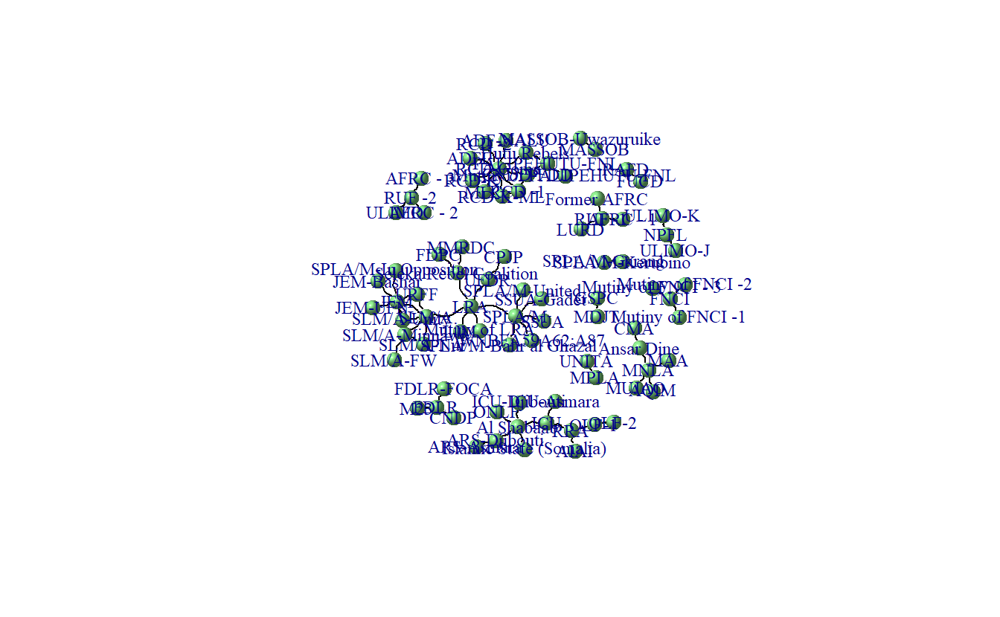
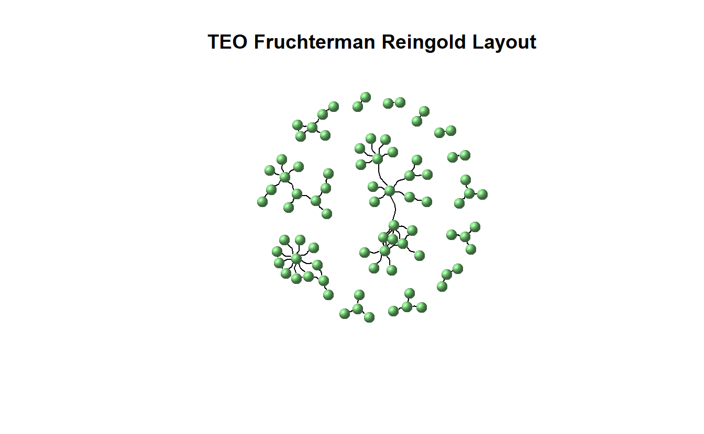
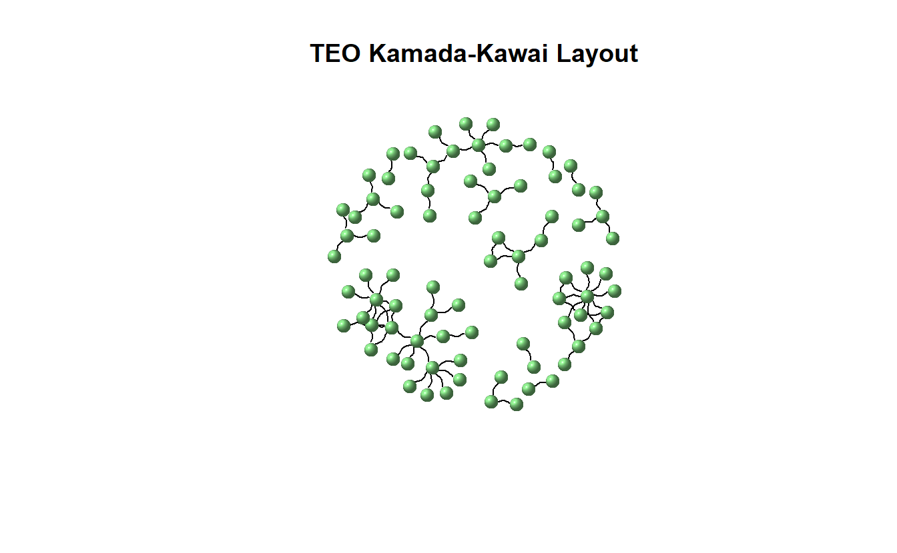
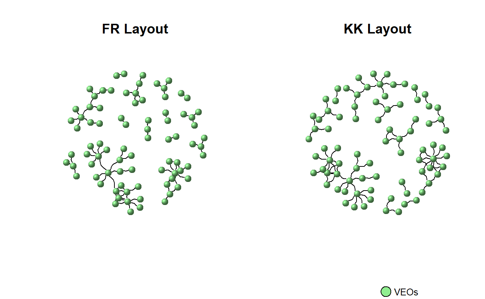
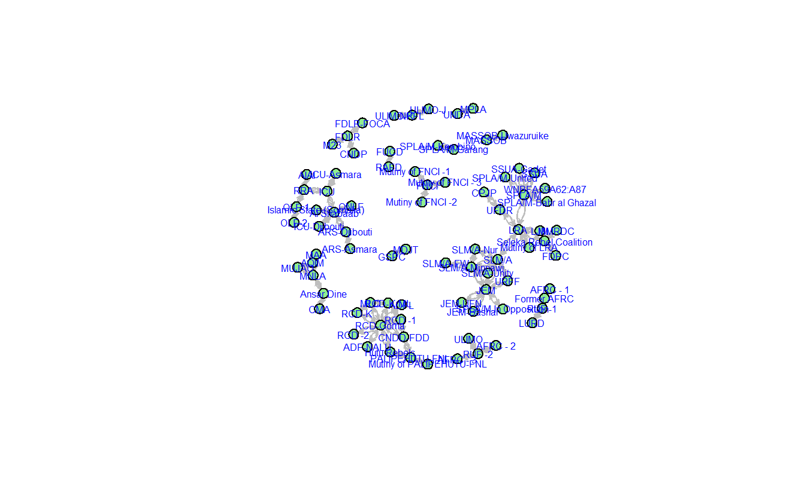

# Key SNA Functions and Visualization Cheat Sheet

This document's purpose is to serve as a simple reference guide comparing a handful of basic, visualization-related functions in **igraph** and **statnet**. It designed to help you begin to understand some basic differences between the two packages as you learn R, but this is far from an exhaustive list of functions in the two programs.

We will use the same data set for both - **igraph** and **statnet** - sections, which is a  network comprised of violent interactions among African Violent Extremist Organizations (VEOs). Since you are likely to work with edge lists and matrices, we have included code for importing both.


```r
# Read edge list
teo_el <- read.csv("data/TEO_EL.csv")
# Read matrix
teo_mat <- as.matrix(
  read.csv("data/TEO_Matrix.csv",
           header = TRUE, 
           row.names = 1,
           check.names = FALSE)
  )
```

Take a look at the class for each object:


```r
class(teo_el)
```

```
[1] "data.frame"
```

```r
class(teo_mat)
```

```
[1] "matrix" "array" 
```


## **igraph**

Assuming you have installed it already, we will load **igraph** first.


```r
library(igraph)
```

### Creating a graph object in **igraph**

Importing either object requires functions designed to work with the object class. For importing `data.frame`'s you can use the aptly named `graph_from_data_frame()` function. Transforming a `matrix` into a graph object in **igraph** requires the `graph_from_adjacency_matrix()` function.

First, import the edge list:


```r
g_from_el <- graph_from_data_frame(d = teo_el,
                                   # Is your data directed?
                                   directed = FALSE,
                                   # Will you include a data.frame with node 
                                   # attributes?
                                   vertices = NULL)
```

Now, import the matrix:


```r
g_from_mat <- graph_from_adjacency_matrix(adjmatrix = teo_mat,
                                          # How should the matrix be interpreted?
                                          mode = "undirected", 
                                          # Create a weighted graph?
                                          weighted = NULL,
                                          # Should the diagonal be zeroed out?
                                          diag = FALSE)
```

Inspect the newly created objects for their class:


```r
class(g_from_el)
```

```
[1] "igraph"
```

```r
class(g_from_mat)
```

```
[1] "igraph"
```

As you can see, there are no differences between the two graphs, though they originated from differing data formats.


```r
difference(g_from_el, g_from_mat)
```

```
IGRAPH 185d982 UN-- 83 0 -- 
+ attr: name (v/c)
+ edges from 185d982 (vertex names):
```


### Visualization Parameters and Layouts in **igraph**

The `plot` function permits you to see the network data visually by recognizing the `igraph` class. 


```r
teo_ig <- graph_from_data_frame(d = teo_el,
                                directed = FALSE,
                                vertices = NULL)
plot(teo_ig)
```


This could be greatly improved!

Now let's consider making some adjustments. *Table 1* provides a summary of commonly used plotting parameters in **igraph**. See **igraph's** manual, Katya Ognyanova's excellent tutorial on SNA in **igraph** (https://kateto.net/networks-r-igraph), and **igraph's** website (https://igraph.org/r/) for a more comprehensive list of options. 

<center>
| **Parameter** |  **Short Description** |                            
|------------------|---------------------------------------------|
| `vertex.color`| Adjusts node color.|
| `vertex.size`| Parameter for node size. Default is 15.  |
| `vertex.shape`| Parameter for node shape (e.g., "sphere", "circle", "square"). Default is circle.  |
| `vertex.label`| Parameter for adjusting and setting node labels. Use NA to omit.  |
| `vertex.label.font`| Parameter for node font. Font: 1=plain, 2=bold, 3=italic, 4=bold italic, 5=symbol  |
| `vertex.label.family`| Adjusts font family. Default is 'serif'.  |
| `vertex.label.cex`| Parameter for changing font size.  |
| `vertex.label.color`| Parameter for adjusting node label colors. Default is black.|
| `edge.color`| Parameter for setting edge color.  |
| `edge.width`| Sets edge width (default = 1).  |
| `arrow.mode`| Sets arrow aesthetics: 0=no arrow, 1=back, 2=forward, 3=both.  |
| `edge.arrow.size`| Sets edge arrow size (default = 1).  |
| `edge.curved`| Edge curvature (ranges from 0-1).  |

Table: *Table 1: Summary of Selected* **igraph** *Plotting Parameters*

</center>


```r
plot(teo_ig, 
     # Modify vertices
     vertex.color = "lightgreen", 
     vertex.size = 10, 
     vertex.shape = "sphere", 
     vertex.label.font = 0.25, 
     label.family = "Courier", 
     vertex.label.cex = .75,
     vertex.label.color = "darkblue", 
     # Modify edges
     edge.color = "black",  
     edgewidth = 3, 
     arrow.mode = 3,
     edge.arrow.size = 0.25, 
     edge.curved = 0.5)
```




The graph layout can vary. **igraph** provides multiple layout algorithms (e.g., Kamada-Kawai, circle, etc.), which can be usually located by typing the prefix `layout_` or `layout_with_` (e.g., `layout_with_kk`, `layout_in_circle()`, etc.). 

Note you can store a layout as an object (e.g., `coords <- layout_with_dh(teo_g)`) and subsequently pass it to the `plot()` function as a parameter for the `layout` argument (e.g., `plot(teog_g, layout = coords))`, which we will do below. 


```r
coords <- layout_with_kk(teo_ig)
```


Some of the commonly used layout options are outlined below, which you can find in **igraph**'s help section. 

<center>
| **Parameter** |  **Short Description** |                            
|--------------------|-------------------------------------------|
| `layout_with_dh`| Places vertices of a graph on the plane, according to the simulated annealing algorithm by Davidson and Harel.|
| `layout_in_circle`| Places vertices on a circle, in the order of their vertex ids..  |
| `layout_nicely`| This function tries to choose an appropriate graph layout algorithm for the graph, automatically, based on a simple algorithm.  |
| `layout_with_fr`| Places vertices on the plane using the force-directed layout algorithm by Fruchterman and Reingold.  |
| `layout_on_sphere`| Places vertices on a sphere, approximately uniformly, in the order of their vertex ids.  |
| `layout_with_gem`| Places vertices on the plane using the GEM force-directed layout algorithm. |
| `layout_with_graphopt`| A force-directed layout algorithm, that scales relatively well to large graphs.  |
| `layout_with_kk`| Places the vertices on the plane, or in the 3d space, based on a physical model of springs.|
| `layout_with_lgl`| A layout generator for larger graphs.  |
| `layout_with_mds`| Multidimensional scaling of some distance matrix defined on the vertices of a graph. |

Table: *Table 2: Summary of Selected* **igraph** *Layout Parameters*

</center>

For instance, the visual below depicts the network using Fruchterman Reingold. Note we've turned off the labels so you can see the structure more clearly.


```r
plot(teo_ig, 
     main = "TEO Fruchterman Reingold Layout",
     layout = layout_with_fr, 
     vertex.color = "lightgreen", 
     vertex.size = 10, 
     vertex.shape = "sphere", 
     vertex.label = NA, 
     edge.color = "black", 
     edgewidth = 3, 
     arrow.mode = 3,
     edge.arrow.size = 0.25, 
     edge.curved = 0.5)
```



Now, plot the network using Kamada-Kawai. 


```r
plot(teo_ig, 
     main = "TEO Kamada-Kawai Layout", 
     layout = layout_with_kk, 
     vertex.color = "lightgreen", 
     vertex.size = 10, 
     vertex.shape = "sphere", 
     vertex.label = NA, 
     edge.color = "black", 
     edgewidth = 3, 
     arrow.mode = 3,
     edge.arrow.size = 0.25, 
     edge.curved = 0.5)
```



We can look at these side-by-side using `par(mfrow = c(1, 2))`, which tells **igraph** to create multiple plots along a single row with two columns. 


```r
par(mfrow = c(1,2))

plot(teo_ig, 
     layout = layout_with_fr, 
     vertex.color = "lightgreen", 
     vertex.size = 10, 
     vertex.shape = "sphere", 
     vertex.label = NA, 
     edge.color = "black", 
     edgewidth = 3, 
     arrow.mode = 3,
     edge.arrow.size = 0.25, 
     edge.curved = 0.5, 
     main = "FR Layout")

plot(teo_ig, 
     # Use the stored coordinates
     layout = coords,
     vertex.color = "lightgreen", 
     vertex.size = 10, 
     vertex.shape = "sphere", 
     vertex.label = NA, 
     edge.color = "black", 
     edgewidth = 3, 
     arrow.mode = 3,
     edge.arrow.size = .25, 
     edge.curved = .5, 
     main = "KK Layout")

# Add a legend to plot, for information use ?legend
legend(x = 0, 
       y = -2, 
       legend = "VEOs", 
       pch = 21,
       pt.bg = "lightgreen", 
       pt.cex = 2, 
       cex = 0.8, 
       bty = "n", 
       ncol = 1)
```



We will detach **igraph** before moving onto **statnet**. 


```r
detach("package:igraph", unload = TRUE)
```

## **statnet**

Assuming you have installed it already, we will load **statnet** first.


```r
library(statnet)
```

### Creating a graph object in **statnet**

For importing `data.frame`'s you can use the aptly named `as.network()` function setting the argument `matrix.type` to `"edgelist"`. Transforming a `matrix` into a graph object in **network** requires the `as.network()` function, but the argument must be set to `matrix.type = "adjacency"`.

First, import the edge list:


```r
g_from_el <- as.network(teo_el,
                        matrix.type = "edgelist",
                        directed = FALSE)
```

Now, import the matrix:


```r
g_from_mat <- as.network(teo_el,
                        matrix.type = "adjacency",
                        directed = FALSE)
```

Inspect the newly created objects for their class:


```r
class(g_from_el)
```

```
[1] "network"
```

```r
class(g_from_mat)
```

```
[1] "network"
```

### Visualization Parameters and Layouts in **statnet**

The `gplot()` function permits you to see the network data visually by recognizing the `network` class. 


```r
teo_net <- as.network(teo_el,
                      matrix.type = "edgelist",
                      directed = FALSE)
  
gplot(teo_net)
```


This could be greatly improved!

*Table 3* provides a summary of commonly used plotting parameters in **statnet**.  See the **sna** package's manual for an exhaustive list. 

<center>

| **Parameter** |  **Short Description** |                            
|--------------------|----------------------------------------------|
| `vertex.col`| Adjusts node color. Red is default. |
| `vertex.cex`| Parameter for node size.   |
| `displaylabels`| Parameter to turn on or turn off node labels (True or False).  |
| `boxed.labels`| Indicate if you want labels to be enclosed in boxes.  |
| `label.bg`| Background color for label boxes. |
| `label.pos`| Parameter for positioning labels. See manual for specifics.  |
| `label.cex`| Parameter for changing font size. Default is 1.  |
| `label.col`| Parameter for adjusting node label colors. Default is black.|
| `edge.col`| Parameter for setting edge color.  |
| `edge.lwd`| Sets edge width.  |
| `usearrows`| Parameter to turn on or turn off edge arrows (True or False).  |
| `displayisolates`| Parameter to show or hide arrows (True or False).  |
| `usecurve`| Edge curvature on or off.   |

Table: *Table 2: Summary of Selected* **sna** *Plotting Parameters*

</center>

Now, plot the graph with some changes to the parameters. 


```r
gplot(teo_net, 
      # Modify vertex parameters
      vertex.col = "lightgreen", 
      vertex.cex = 1.5, 
      displaylabels = TRUE, 
      label.pos = 5, 
      label.cex = 0.5, 
      label.col = "Blue",
      # Modify edge parameters
      edge.col = "Gray", 
      displayisolates = FALSE, 
      usecurve = TRUE)
```



You can change the layout in **statnet* as well. Here we will use `mode` to adjust our network layouts. 

<center>

| **Parameter** |  **Short Description** |                            
|------------------|-----------------------------------------------|
| `mode = "spring"`| Places vertices of a graph on the plane, according to the simulated annealing algorithm by Davidson and Harel.|
| `mode = "springrepulse"`| Places vertices on a circle, in the order of their vertex ids..  |
| ` mode = "kamadakawai"`| This function tries to choose an appropriate graph layout algorithm for the graph, automatically, based on a simple algorithm.  |
| `mode = "fruchtermanreingold"`| Places vertices on the plane using the force-directed layout algorithm by Fruchterman and Reingold..  |
| `mode = "mds"`| Multidimensional scaling of some distance matrix defined on the vertices of a graph.  |

Table: *Table 2: Summary of Selected* **sna** *Layout Parameters*

</center>

For instance, the visual below depicts the network using Fruchterman Reingold. Note we've turned off the labels so you can see the structure more clearly.


```r
gplot(teo_net, 
      vertex.col = "lightgreen", 
      vertex.cex = 1.5, 
      displaylabels = TRUE, 
      label.pos = 5, 
      label.cex = .5, 
      label.col = "Blue", 
      edge.col = "Gray", 
      displayisolates = FALSE, 
      usecurve = TRUE,
      mode = "fruchtermanreingold")
```


Now, with Kamada-Kawai. 


```r
gplot(teo_net, 
      vertex.col = "lightgreen", 
      vertex.cex = 1.5, 
      displaylabels = TRUE, 
      label.pos = 5, 
      label.cex = .5, 
      label.col = "Blue", 
      edge.col = "Gray", 
      displayisolates = FALSE, 
      usecurve = TRUE, 
      mode = "kamadakawai")
```


Keep in mind that you can use the `gplot.layout.*` functions to store coordinates and use them later.


```r
fr <- gplot.layout.fruchtermanreingold(teo_net, layout.par = NULL)
kk <- gplot.layout.kamadakawai(teo_net, layout.par = NULL)

par(mfrow = c(1, 2), mar = c(0, 0, 0, 0))

gplot(teo_net, 
      vertex.col = "lightgreen", 
      vertex.cex = 1.5, 
      displaylabels = FALSE, 
      edge.col = "Gray", 
      displayisolates = FALSE, 
      usecurve = TRUE, 
      # Pass along the layout
      coord = fr)

gplot(teo_net, 
      vertex.col = "lightgreen", 
      vertex.cex = 1.5, 
      displaylabels = FALSE, 
      edge.col = "Gray", 
      displayisolates = FALSE, 
      usecurve = TRUE, 
      # Pass along the layout
      coord = kk)
```


